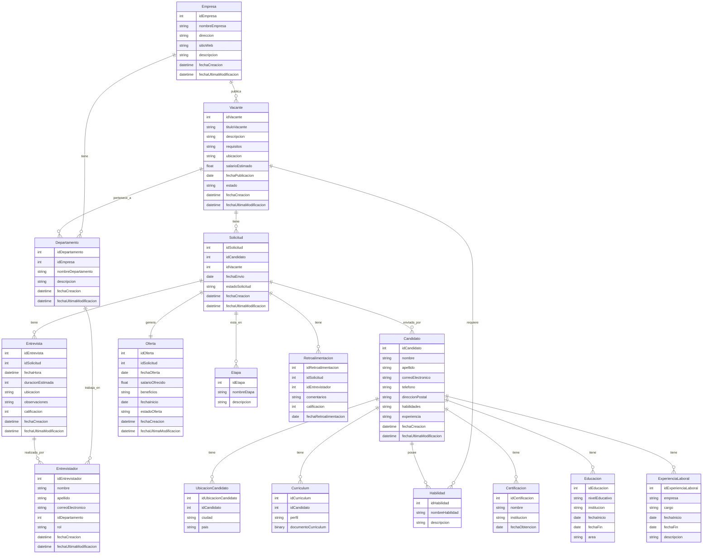

# Promtps usados para el Diseño de un sistema de gestión de candidatos
## Etapa de análisis de mercado. Asistente: Claude Sonnet
#### Eres un experto en producto, con experiencia en sistemas ATS (Applicant-Tracking System). ¿Qué funcionalidades básicas tiene un sistema ATS? Descríbemelas en un listado, ordenado de mayor a menor prioridad.

Un sistema ATS (Applicant-Tracking System) es una herramienta de software diseñada para ayudar a las empresas a gestionar de manera eficiente el proceso de reclutamiento y contratación de personal. Las funcionalidades básicas de un sistema ATS, ordenadas de mayor a menor prioridad, son las siguientes:

1. **Gestión de candidatos**: Permite recopilar, almacenar y organizar información sobre los candidatos, incluyendo currículums, cartas de presentación, datos de contacto y otra información relevante.

2. **Publicación y distribución de vacantes**: Permite publicar anuncios de empleo en diferentes canales, como el sitio web de la empresa, portales de empleo y redes sociales.

3. **Seguimiento del proceso de reclutamiento**: Permite realizar un seguimiento del estado de cada candidato en el proceso de reclutamiento, desde la recepción de la solicitud hasta la contratación o rechazo.

4. **Filtrado y búsqueda de candidatos**: Permite filtrar y buscar candidatos en función de criterios específicos, como habilidades, experiencia, educación, ubicación, etc.

5. **Programación de entrevistas**: Permite programar entrevistas con los candidatos y coordinar la disponibilidad de los entrevistadores.

6. **Integración con otras herramientas**: Permite la integración con otras herramientas de recursos humanos, como sistemas de gestión de nómina, portales de empleados, etc.

7. **Reportes y análisis**: Proporciona informes y análisis sobre el proceso de reclutamiento, como el tiempo promedio de contratación, el costo por contratación, el origen de los candidatos, etc.

8. **Comunicación con candidatos**: Permite enviar comunicaciones automatizadas a los candidatos, como confirmaciones de recepción de solicitudes, actualizaciones sobre el estado del proceso, ofertas de empleo, etc.

9. **Gestión de requisitos de empleo**: Permite definir y administrar los requisitos y descripciones de los puestos de trabajo.

10. **Cumplimiento normativo**: Ayuda a garantizar el cumplimiento de las regulaciones y leyes laborales aplicables durante el proceso de reclutamiento.

Es importante tener en cuenta que las funcionalidades específicas y su prioridad pueden variar dependiendo de las necesidades y requisitos de cada organización.

#### ¿Qué beneficios obtiene el cliente de un sistema ATS para considerar su uso?
Utilizar un sistema ATS (Applicant-Tracking System) puede ofrecer varios beneficios importantes para las empresas que buscan optimizar y agilizar su proceso de reclutamiento y contratación de personal. Algunos de los principales beneficios son:

1. **Eficiencia y ahorro de tiempo**: Los sistemas ATS automatizan gran parte del proceso de reclutamiento, lo que reduce significativamente el tiempo y los recursos necesarios para gestionar las solicitudes de empleo, evaluar a los candidatos y programar entrevistas.

2. **Mejor organización y seguimiento**: Con un ATS, toda la información de los candidatos y el estado del proceso de reclutamiento se mantiene organizada y centralizada, lo que facilita el seguimiento y la toma de decisiones.

3. **Mayor alcance y visibilidad de las vacantes**: Los sistemas ATS permiten publicar y distribuir las ofertas de empleo en múltiples canales, lo que aumenta la visibilidad y el alcance de las vacantes, atrayendo a un mayor número de candidatos calificados.

4. **Mejora en la calidad de los candidatos**: Las herramientas de filtrado y búsqueda avanzadas de los ATS permiten identificar y seleccionar a los candidatos más calificados y mejor alineados con los requisitos del puesto.

5. **Cumplimiento normativo**: Los ATS ayudan a garantizar el cumplimiento de las regulaciones y leyes laborales aplicables durante el proceso de reclutamiento, reduciendo el riesgo de problemas legales.

6. **Análisis y reportes**: Los sistemas ATS proporcionan análisis y reportes detallados sobre el proceso de reclutamiento, lo que permite identificar áreas de mejora y tomar decisiones basadas en datos.

7. **Experiencia de candidato mejorada**: Al automatizar y optimizar el proceso de reclutamiento, los ATS pueden mejorar la experiencia de los candidatos, lo que puede aumentar la satisfacción y la percepción positiva de la marca empleadora.

8. **Reducción de costos**: Al aumentar la eficiencia y reducir el tiempo y los recursos necesarios para el reclutamiento, los sistemas ATS pueden ayudar a reducir los costos asociados con el proceso de contratación.

En resumen, los sistemas ATS pueden ofrecer beneficios significativos en términos de eficiencia, organización, calidad de los candidatos, cumplimiento normativo, análisis de datos y reducción de costos, lo que los convierte en una herramienta valiosa para las empresas que buscan optimizar su proceso de reclutamiento y contratación.

#### ¿Qué alternativas tiene a usar un sistema ATS y cuando pueden ser relevantes?
Aunque los sistemas ATS (Applicant-Tracking System) son una herramienta popular y eficiente para la gestión del reclutamiento, existen algunas alternativas que pueden ser relevantes en ciertas circunstancias:

1. **Hojas de cálculo y bases de datos**: Para empresas pequeñas o con un volumen de contratación relativamente bajo, el uso de hojas de cálculo o bases de datos simples puede ser una opción más asequible y fácil de implementar que un sistema ATS completo.

2. **Redes sociales y portales de empleo**: Las redes sociales profesionales como LinkedIn y los portales de empleo como Indeed o Monster pueden ser útiles para publicar vacantes y recibir solicitudes de empleo de manera gratuita o a un costo reducido.

3. **Software de gestión de recursos humanos (HRIS)**: Algunas empresas optan por utilizar un sistema de gestión de recursos humanos (HRIS) que incluya funcionalidades de reclutamiento y contratación, en lugar de un sistema ATS independiente.

4. **Agencias de reclutamiento externas**: Para ciertas posiciones o en momentos de alta demanda, las empresas pueden optar por contratar los servicios de agencias de reclutamiento externas que se encarguen del proceso de búsqueda y selección de candidatos.

5. **Reclutamiento interno y recomendaciones de empleados**: En algunas organizaciones, el reclutamiento interno y las recomendaciones de los empleados actuales pueden ser una fuente valiosa de candidatos, reduciendo la necesidad de un sistema ATS exhaustivo.

Estas alternativas pueden ser relevantes en las siguientes situaciones:

- Empresas pequeñas o startups con recursos limitados y un volumen de contratación bajo.
- Empresas que buscan contratar para posiciones específicas o altamente especializadas.
- Empresas que prefieren una solución más personalizada o con menos funcionalidades que un sistema ATS completo.
- Empresas que ya tienen un sistema de gestión de recursos humanos (HRIS) integrado y no necesitan un sistema ATS separado.

Sin embargo, a medida que una empresa crece y el volumen de contratación aumenta, un sistema ATS dedicado puede convertirse en una opción más eficiente y escalable para gestionar el proceso de reclutamiento de manera efectiva.

### ¿Cómo es el customer journey normal de un cliente que usa un sistema ATS? Descríbeme paso a paso todas las interacciones
El customer journey, o recorrido del cliente, en el contexto de un sistema ATS (Applicant-Tracking System) implica varias etapas e interacciones desde el momento en que una empresa identifica la necesidad de contratar hasta la implementación y uso continuo del sistema. A continuación, se describe paso a paso el customer journey normal de un cliente que utiliza un sistema ATS:

1. **Reconocimiento de la necesidad**: La empresa reconoce la necesidad de optimizar y agilizar su proceso de reclutamiento y contratación de personal, ya sea debido al crecimiento de la organización, la alta rotación de personal o la ineficiencia de los métodos actuales.

2. **Investigación y evaluación de opciones**: La empresa investiga y evalúa diferentes soluciones de software ATS disponibles en el mercado, comparando características, precios, integraciones y reputación de los proveedores.

3. **Solicitud de demostraciones y presupuestos**: La empresa solicita demostraciones y presupuestos a los proveedores de ATS que mejor se ajusten a sus necesidades y requisitos.

4. **Toma de decisión y adquisición**: Después de evaluar las opciones, la empresa toma la decisión de adquirir un sistema ATS específico y negocia los términos del contrato y la implementación.

5. **Implementación y configuración**: El proveedor del ATS trabaja en estrecha colaboración con el equipo de la empresa para implementar y configurar el sistema según sus necesidades y flujos de trabajo específicos.

6. **Capacitación y soporte**: El proveedor del ATS proporciona capacitación y soporte al equipo de la empresa para garantizar un uso efectivo del sistema y resolver cualquier duda o problema que pueda surgir.

7. **Uso y adopción**: Los reclutadores y otros miembros del equipo de recursos humanos comienzan a utilizar el sistema ATS en su flujo de trabajo diario, publicando vacantes, rastreando candidatos, programando entrevistas y gestionando el proceso de contratación.

8. **Retroalimentación y ajustes**: La empresa proporciona retroalimentación al proveedor del ATS sobre su experiencia de uso, lo que permite realizar ajustes y mejoras en el sistema para adaptarlo mejor a sus necesidades.

9. **Soporte continuo y actualizaciones**: El proveedor del ATS ofrece soporte continuo y lanza actualizaciones periódicas para mejorar las funcionalidades y corregir cualquier problema o error que pueda surgir.

10. **Renovación o cambio de proveedor**: Dependiendo de la satisfacción y los resultados obtenidos, la empresa puede optar por renovar su contrato con el mismo proveedor de ATS o explorar otras opciones en el mercado.

Este customer journey puede variar ligeramente dependiendo del tamaño de la empresa, la complejidad de sus requisitos y el proveedor de ATS seleccionado, pero en general, sigue un flujo similar que implica investigación, evaluación, implementación, uso y soporte continuo.

#### ¿Qué sistemas ATS open source son más conocidos? Genera una lista Top cinco incluyendo para cada una: Descripción, Ventajas, Desventajas y dirección de enlace a su sitio web.

A continuación, se presenta una lista de los cinco sistemas ATS (Applicant-Tracking System) de código abierto (open source) más conocidos, junto con una breve descripción, ventajas, desventajas y el enlace a su sitio web:

1. **OrangeHRM**
Descripción: OrangeHRM es un sistema de gestión de recursos humanos integral que incluye un módulo de reclutamiento y un sistema ATS.
Ventajas: Interfaz intuitiva, fácil de configurar, amplia gama de funcionalidades de RR.HH., comunidad activa.
Desventajas: Algunas funciones de reclutamiento son básicas, soporte limitado.
Sitio web: https://www.orangehrm.com/

2. **Jobberbase**
Descripción: Jobberbase es un sistema ATS de código abierto diseñado específicamente para el reclutamiento y la gestión de candidatos.
Ventajas: Interfaz limpia y fácil de usar, buena gestión de currículums, publicación de vacantes en múltiples canales.
Desventajas: Funcionalidades limitadas en comparación con sistemas ATS comerciales, soporte comunitario.
Sitio web: https://jobberbase.com/

3. **Recruitee**
Descripción: Recruitee es un sistema ATS de código abierto basado en la nube, enfocado en la gestión de candidatos y el reclutamiento colaborativo.
Ventajas: Interfaz moderna y atractiva, buena integración con servicios de terceros, escalable.
Desventajas: Algunas funciones avanzadas requieren planes de pago, soporte limitado.
Sitio web: https://recruitee.com/

4. **SmartRecruiters**
Descripción: SmartRecruiters es un sistema ATS de código abierto basado en la nube, con un enfoque en la inteligencia artificial y el aprendizaje automático.
Ventajas: Funciones de IA para la clasificación y recomendación de candidatos, interfaz intuitiva, amplia gama de integraciones.
Desventajas: Curva de aprendizaje empinada, soporte limitado para la versión de código abierto.
Sitio web: https://www.smartrecruiters.com/

5. **Appoint.ly**
Descripción: Appoint.ly es un sistema ATS de código abierto diseñado para pequeñas y medianas empresas, con un enfoque en la programación de entrevistas.
Ventajas: Fácil de configurar y usar, buena gestión de calendarios y entrevistas, de bajo costo.
Desventajas: Funcionalidades de reclutamiento limitadas, soporte comunitario.
Sitio web: https://appoint.ly/

Es importante tener en cuenta que los sistemas ATS de código abierto pueden requerir más esfuerzo de configuración y personalización que las soluciones comerciales, y el soporte técnico puede ser limitado. Sin embargo, ofrecen una alternativa de bajo costo para empresas con recursos limitados o requisitos específicos.

#### ¿Qué sistemas ATS comerciales son más conocidos? Compáralos en función de popularidad, costos y experiencia de usuario, y valora cuál sería mejor opción. Genera la lista top cinco y para cada uno agrega: Descripción, ventaja, desventaja y dirección de enlace a su sitio web.

A continuación, se presenta una lista de los cinco sistemas ATS (Applicant-Tracking System) comerciales más conocidos, junto con una breve descripción, ventajas, desventajas y el enlace a su sitio web. Además, se incluye una comparación en función de su popularidad, costos y experiencia de usuario, y se valora cuál podría ser la mejor opción.

1. **Workday**
Descripción: Workday es un sistema de gestión de recursos humanos en la nube, que incluye un módulo de reclutamiento y un sistema ATS.
Ventaja: Solución integral y escalable, excelente experiencia de usuario, amplia gama de funcionalidades.
Desventaja: Costos elevados, curva de aprendizaje empinada.
Sitio web: https://www.workday.com/

2. **iCIMS**
Descripción: iCIMS es un sistema ATS líder en el mercado, enfocado en la gestión de candidatos y el reclutamiento.
Ventaja: Interfaz intuitiva, amplia gama de funciones de reclutamiento, buena integración con otras herramientas.
Desventaja: Costos elevados, algunas funciones avanzadas requieren complementos adicionales.
Sitio web: https://www.icims.com/

3. **Greenhouse**
Descripción: Greenhouse es un sistema ATS basado en la nube, diseñado para empresas de rápido crecimiento.
Ventaja: Excelente experiencia de usuario, buena gestión de flujos de trabajo, integración con herramientas populares.
Desventaja: Costos elevados para empresas pequeñas, algunas funciones avanzadas requieren complementos.
Sitio web: https://www.greenhouse.io/

4. **Lever**
Descripción: Lever es un sistema ATS moderno y fácil de usar, enfocado en la experiencia del candidato.
Ventaja: Interfaz atractiva y fácil de usar, buena gestión de la experiencia del candidato, escalable.
Desventaja: Funcionalidades más limitadas que otros sistemas ATS, costos elevados para empresas pequeñas.
Sitio web: https://www.lever.co/

5. **Jobvite**
Descripción: Jobvite es un sistema ATS completo, con un enfoque en el reclutamiento en redes sociales y el marketing de empleador.
Ventaja: Excelente reclutamiento en redes sociales, buena gestión de marca de empleador, amplia gama de funciones.
Desventaja: Costos elevados, curva de aprendizaje empinada.
Sitio web: https://www.jobvite.com/

Comparación y mejor opción:

En cuanto a popularidad, Workday e iCIMS son los sistemas ATS más populares y ampliamente utilizados, especialmente en empresas grandes y corporaciones. Sin embargo, Greenhouse y Lever han ganado una gran aceptación entre las empresas de rápido crecimiento y startups debido a su excelente experiencia de usuario y enfoque en la experiencia del candidato.

En términos de costos, todos estos sistemas ATS comerciales tienen precios elevados, especialmente para empresas pequeñas y medianas. Los costos pueden variar según el tamaño de la empresa, el número de usuarios y las funcionalidades requeridas.

En cuanto a la experiencia de usuario, Greenhouse y Lever destacan por su interfaz moderna, atractiva y fácil de usar. Workday también se destaca por su excelente experiencia de usuario, pero puede tener una curva de aprendizaje más empinada.

Teniendo en cuenta estos factores, la mejor opción dependerá de las necesidades y recursos de cada empresa. Para empresas grandes y corporaciones con presupuestos más amplios, Workday o iCIMS podrían ser las mejores opciones debido a su amplia gama de funcionalidades y popularidad. Para empresas de rápido crecimiento y startups que valoran la experiencia de usuario y la facilidad de uso, Greenhouse y Lever podrían ser las mejores opciones. Greenhouse destaca por su excelente gestión de flujos de trabajo y su integración con herramientas populares, mientras que Lever se enfoca en brindar una excelente experiencia al candidato.

Si el reclutamiento en redes sociales y el marketing de empleador son prioridades clave, Jobvite podría ser una buena opción, ya que se destaca en estas áreas. Sin embargo, su curva de aprendizaje empinada y los costos elevados podrían ser desventajas para algunas empresas.

En resumen, si el presupuesto no es una limitante significativa, Workday o iCIMS podrían ser las mejores opciones para empresas grandes y corporaciones, mientras que Greenhouse o Lever podrían ser las mejores opciones para empresas de rápido crecimiento y startups que buscan una excelente experiencia de usuario y facilidad de uso. Jobvite podría ser una buena opción si el reclutamiento en redes sociales y el marketing de empleador son prioridades clave.

Es importante tener en cuenta que la elección final dependerá de los requisitos específicos, el tamaño de la empresa, el presupuesto y las prioridades de reclutamiento de cada organización. Se recomienda realizar una evaluación exhaustiva de las diferentes opciones y, si es posible, solicitar demostraciones y pruebas gratuitas antes de tomar una decisión.

## Etapa de Diseño básico del producto. Asistente: Claude Sonnet
#### Eres un analista de software experto. Estoy construyendo un sistema ATS (Applicant-Tracking System). Enumera y describe brevemente los casos de uso más importantes a implementar para lograr una funcionalidad básica

Claro, aquí están algunos de los casos de uso más importantes a implementar para un sistema ATS (Applicant-Tracking System) con funcionalidad básica:

1. **Gestión de vacantes**: Permitir a los reclutadores crear, editar y eliminar vacantes de empleo, incluyendo detalles como el título del puesto, descripción, requisitos, ubicación, etc.

2. **Publicación de vacantes**: Permitir publicar las vacantes en el sitio web de la empresa, portales de empleo externos y redes sociales para atraer candidatos.

3. **Recepción de solicitudes**: Permitir a los candidatos enviar sus currículums y otra información relevante para postularse a las vacantes publicadas.

4. **Revisión de solicitudes**: Permitir a los reclutadores revisar y evaluar las solicitudes recibidas, incluyendo funciones para filtrar, clasificar y realizar búsquedas en base a criterios específicos.

5. **Seguimiento de candidatos**: Permitir a los reclutadores realizar un seguimiento del estado de cada candidato en el proceso de contratación, como "Nuevo", "En revisión", "Entrevistado", "Rechazado", "Contratado", etc.

6. **Programación de entrevistas**: Permitir programar entrevistas con los candidatos seleccionados, incluyendo la gestión de calendarios y envío de notificaciones.

7. **Evaluación de candidatos**: Permitir a los reclutadores y entrevistadores calificar y dejar comentarios sobre los candidatos después de las entrevistas.

8. **Ofertas de empleo**: Permitir generar y enviar ofertas de empleo a los candidatos seleccionados, incluyendo detalles como el salario, beneficios, etc.

9. **Reportes y análisis**: Generar informes y análisis sobre el proceso de contratación, como métricas de rendimiento, fuentes de candidatos más efectivas, tiempos de contratación, etc.

10. **Integración con otros sistemas**: Permitir la integración con sistemas de nómina, recursos humanos y otros sistemas relevantes para una gestión integral del proceso de contratación.

Estos son algunos de los casos de uso más importantes, pero dependiendo de los requisitos específicos de tu organización, puede ser necesario agregar o ajustar funcionalidades adicionales.

#### Representa estos casos de uso en el tipo de diagrama más adecuado usando el formato plantUML. Identifica claramente los diferentes actores, diferencia entre usuarios visitantes y usuarios autenticados. Acorde a la sintaxis y buenas prácticas UML, define y describe lo que sea necesario.

Claro, a continuación represento los casos de uso mencionados en un diagrama utilizando la sintaxis PlantUML. He identificado los diferentes actores, distinguiendo entre usuarios visitantes y usuarios autenticados. Además, he definido y descrito los elementos necesarios de acuerdo con la sintaxis y las buenas prácticas de UML.


Este diagrama de casos de uso muestra los actores principales: "Candidato", "Reclutador" y "Administrador". Los casos de uso están agrupados dentro del rectángulo "Sistema ATS". He utilizado las relaciones de extensión (`<<extend>>`) para representar los flujos alternativos y las dependencias entre los casos de uso.

Además, he incluido notas explicativas para cada actor y caso de uso, describiendo sus responsabilidades y funcionalidades.

Algunas consideraciones adicionales:

- El actor "Candidato" es un usuario visitante que puede enviar solicitudes de empleo (UC3), pero no tiene acceso a otras funcionalidades del sistema.
- El actor "Reclutador" es un usuario autenticado que puede gestionar la mayor parte del proceso de contratación, desde la gestión de vacantes hasta la generación de ofertas de empleo y la revisión de informes.
- El actor "Administrador" es un usuario autenticado con privilegios adicionales para configurar y mantener el sistema, como la integración con otros sistemas (UC10).

Este diagrama proporciona una vista general de los casos de uso más importantes para un sistema ATS básico, resaltando las interacciones entre los diferentes actores y las funcionalidades clave del sistema. Puede ser utilizado como punto de partida para el análisis y diseño detallado del sistema, y puede ser ampliado o modificado según las necesidades específicas del proyecto.

#### Eres un brillante arquitecto de software. Eres capaz de diseñar, explicar y diagramar los diferentes aspectos de un sistema de software. Estoy construyendo el sistema ATS. He aceptado las entidades que propones, con sus campos y relaciones. Se necesita agregar las siguientes funcionalidades para ser competitivos y que deben ser tomadas en cuenta en el modelo Entidad Relación:
1. El candidato podrá tener varias ubicaciones registradas para indicar su disponibilidad geográfica.
2. El candidato puede tener varios currículos de diferentes perfiles profesionales.
3. Las vacantes deben poseer fecha de publicación.
4. Todas las entidades deben tener fecha de creación del registro y fecha de última modificación.

¿Qué otras entidades del modelo de datos son importantes en un sistema ATS? Dame los campos más importantes de cada una y cómo se relacionan entre entidades.

El formato del diagrama  debe ser Mermaid

Entendido, me enfocaré en el sistema ATS (Applicant Tracking System) y las entidades adicionales relevantes para este tipo de sistema.

Además de las entidades que ya mencioné anteriormente, otras entidades importantes en un sistema ATS podrían ser:

1. **Habilidad**
   - Campos importantes: idHabilidad, nombreHabilidad, descripcion
   - Relación: Una habilidad puede estar asociada a múltiples candidatos y vacantes.

2. **Certificación**
   - Campos importantes: idCertificacion, nombre, institucion, fechaObtencion
   - Relación: Una certificación puede estar asociada a múltiples candidatos.

3. **Educación**
   - Campos importantes: idEducacion, nivelEducativo, institucion, fechaInicio, fechaFin, area
   - Relación: Una educación puede estar asociada a múltiples candidatos.

4. **ExperienciaLaboral**
   - Campos importantes: idExperienciaLaboral, empresa, cargo, fechaInicio, fechaFin, descripcion
   - Relación: Una experiencia laboral puede estar asociada a múltiples candidatos.

5. **Etapa**
   - Campos importantes: idEtapa, nombreEtapa, descripcion
   - Relación: Una etapa puede estar asociada a múltiples solicitudes y representa las diferentes fases del proceso de contratación.

6. **Retroalimentación**
   - Campos importantes: idRetroalimentacion, comentarios, calificacion, fechaRetroalimentacion
   - Relación: Una retroalimentación puede estar asociada a una solicitud y un entrevistador específicos.

Aquí está el diagrama actualizado en formato Mermaid, incluyendo las nuevas entidades:


En este diagrama, he incluido las nuevas entidades y sus relaciones con las entidades existentes. Por ejemplo, un candidato puede tener múltiples habilidades, certificaciones, educaciones y experiencias laborales. Una solicitud puede estar asociada a múltiples etapas del proceso de contratación y tener retroalimentaciones de los entrevistadores.

Además, he agregado la relación entre `Vacante` y `Habilidad`, ya que una vacante puede requerir ciertas habilidades específicas.

Es importante tener en cuenta que este modelo es una propuesta y puede requerir ajustes adicionales según los requisitos específicos del proyecto. Algunas consideraciones adicionales:

1. **Seguridad y autenticación**: Puede ser necesario agregar entidades relacionadas con usuarios, roles y permisos para gestionar el acceso y la autenticación en el sistema.

2. **Registros de auditoría**: Dependiendo de los requisitos de cumplimiento y auditoría, puede ser útil agregar una entidad para registrar los cambios y acciones realizadas en el sistema.

3. **Configuraciones y ajustes**: Puede ser necesario agregar entidades para almacenar configuraciones y ajustes del sistema, como plantillas de correo electrónico, preferencias de notificaciones, etc.

4. **Integración con otros sistemas**: Si el sistema ATS necesita integrarse con otros sistemas, como sistemas de recursos humanos, nómina o gestión de empleados, puede ser necesario agregar entidades o relaciones adicionales para facilitar la integración.

5. **Requisitos específicos del negocio**: Dependiendo de los requisitos específicos de la organización o industria, puede ser necesario agregar entidades adicionales para cubrir aspectos específicos del proceso de contratación.

El modelo entidad-relación es una representación conceptual de la base de datos y puede evolucionar a medida que se refinan los requisitos y se identifican nuevas necesidades durante el desarrollo del sistema ATS.

#### consolida todas las entidades propuestas en un único Diagrama ER en formato Mermaid.

Claro, aquí está el diagrama entidad-relación consolidado para el sistema ATS, incluyendo todas las entidades propuestas, en formato Mermaid:



Este diagrama consolidado incluye todas las entidades propuestas para el sistema ATS, junto con sus atributos y relaciones correspondientes.

Algunas consideraciones adicionales:

- Se han agregado las claves foráneas necesarias para mantener la integridad referencial entre las entidades relacionadas.
- Se han ajustado algunas relaciones y cardinalidades según las mejores prácticas de diseño de bases de datos.
- Se han incluido los campos `fechaCreacion` y `fechaUltimaModificacion` en todas las entidades para registrar las fechas de creación y última modificación de cada registro.
- La entidad `Retroalimentacion` ahora tiene claves foráneas para relacionarse con `Solicitud` y `Entrevistador`, lo que permite asociar cada retroalimentación con una solicitud y un entrevistador específicos.

Este diagrama entidad-relación consolidado representa una base sólida para el diseño de la base de datos del sistema ATS. Sin embargo, es importante tener en cuenta que este modelo puede requerir ajustes adicionales según los requisitos específicos del proyecto y las necesidades de la organización.

## Visión del producto

#### a este nuevo sistema ATS lo llamaremos LTI, dame un descripción de este competitivo producto, el cual está orientado a:
1. Brindar la mejor experiencia a sus usuarios, dado que el sistema contará  con  asistente IA que les ayuda intuitivamente a alcanzar sus objetivos fácilmente.
2. El servicio será en la nube.
3. Se podrá interconectar fácilmente con otras aplicaciones.

Agrega y resalta cualquier otro aspecto que  maximice  el valor añadido de este nuevo producto y sus ventajas competitivas.

LTI (Leading Talent Insights) es un innovador sistema ATS (Applicant Tracking System) diseñado para brindar una experiencia de contratación excepcional tanto para los reclutadores como para los candidatos. Este producto de vanguardia se destaca por su enfoque centrado en el usuario, su arquitectura en la nube y su capacidad de integración con otras aplicaciones, lo que lo convierte en una solución líder en el mercado.

1. **Experiencia de usuario mejorada con asistencia de IA**:
   - LTI cuenta con un asistente virtual impulsado por Inteligencia Artificial que guía intuitivamente a los usuarios a través del proceso de contratación.
   - El asistente IA proporciona recomendaciones personalizadas, responde preguntas y facilita la navegación, brindando una experiencia fluida y sin fricciones.
   - Tanto los reclutadores como los candidatos pueden interactuar de manera natural con el asistente IA, ahorrando tiempo y esfuerzo.

2. **Solución en la nube escalable y segura**:
   - LTI se ofrece como un servicio en la nube, lo que significa que no hay necesidad de instalar ni mantener software en las instalaciones del cliente.
   - La arquitectura en la nube garantiza una escalabilidad sin problemas, permitiendo a las empresas adaptarse fácilmente a las fluctuaciones en la demanda.
   - Se implementan medidas de seguridad de última generación, como cifrado de datos, autenticación de dos factores y controles de acceso estrictos, para proteger la información confidencial de los candidatos y las empresas.

3. **Integración sin problemas con otras aplicaciones**:
   - LTI cuenta con una arquitectura de microservicios modular y una API robusta, lo que facilita la integración con otros sistemas empresariales, como sistemas de gestión de recursos humanos, plataformas de reclutamiento y herramientas de análisis de datos.
   - Esta capacidad de integración sin problemas permite a las empresas aprovechar al máximo su ecosistema de aplicaciones existente y optimizar los flujos de trabajo de contratación.

4. **Análisis avanzados e informes personalizados**:
   - LTI ofrece potentes capacidades de análisis e informes, brindando a los reclutadores y gerentes insights valiosos sobre el proceso de contratación.
   - Los informes personalizados y los paneles de control interactivos permiten a los usuarios monitorear métricas clave, como tiempos de contratación, fuentes de candidatos más efectivas y tasas de éxito.
   - Estos análisis profundos permiten tomar decisiones informadas y optimizar continuamente el proceso de contratación.

5. **Cumplimiento normativo y accesibilidad**:
   - LTI cumple con los más altos estándares de cumplimiento normativo, incluyendo regulaciones de privacidad de datos y accesibilidad para personas con discapacidad.
   - El sistema está diseñado para garantizar la igualdad de oportunidades y evitar sesgos en el proceso de contratación, promoviendo una cultura de diversidad e inclusión.

LTI se posiciona como una solución líder en el mercado de sistemas ATS, ofreciendo una combinación única de experiencia de usuario mejorada, arquitectura en la nube escalable, capacidad de integración, análisis avanzados y cumplimiento normativo. Con su enfoque innovador y sus características de vanguardia, LTI está listo para revolucionar el mundo del reclutamiento y la contratación de talento.

#### Genera un diagrama Lean Canvas para entender el modelo de negocio con esta nuevo producto LTI

Claro, aquí está el Lean Canvas para el nuevo producto LTI (Leading Talent Insights) en formato Mermaid:

```mermaid
canvasCanvas
    canvasTitle Lean Canvas - LTI (Leading Talent Insights)

    problemBox Problemas
        1. Procesos de contratación ineficientes y engorrosos
        2. Dificultad para encontrar y atraer el mejor talento
        3. Falta de visibilidad y análisis en el proceso de contratación
        4. Integración limitada con otros sistemas empresariales
    endProblemBox

    customerBox Segmento de Clientes
        1. Empresas de todos los tamaños en diversos sectores
        2. Departamentos de recursos humanos y reclutamiento
        3. Agencias de contratación y consultoría
    endCustomerBox

    valuePropositionBox Propuesta de Valor Única
        1. Experiencia de usuario mejorada con asistente IA intuitivo
        2. Solución en la nube escalable y segura
        3. Integración sin problemas con otras aplicaciones
        4. Análisis avanzados e informes personalizados
        5. Cumplimiento normativo y accesibilidad
    endValuePropositionBox

    alternativesBox Alternativas
        1. Sistemas ATS tradicionales
        2. Soluciones de software local
        3. Procesos manuales y hojas de cálculo
    endAlternativesBox

    metricsBox Métricas Clave
        1. Tasa de éxito en la contratación
        2. Tiempo promedio de contratación
        3. Costo por contratación
        4. Satisfacción del usuario (reclutadores y candidatos)
        5. Adopción y uso del sistema
    endMetricsBox

    costStructureBox Estructura de Costos
        1. Desarrollo y mantenimiento del software
        2. Infraestructura en la nube y hosting
        3. Soporte técnico y atención al cliente
        4. Comercialización y ventas
        5. Integración con otros sistemas
    endCostStructureBox

    channelsBox Canales
        1. Sitio web y marketing digital
        2. Equipo de ventas directas
        3. Socios y canales de reventa
        4. Eventos y conferencias del sector
    endChannelsBox

    revenueStreamBox Fuentes de Ingresos
        1. Suscripciones anuales o mensuales
        2. Planes de precios basados en características y tamaño de la empresa
        3. Servicios profesionales y soporte premium
        4. Ingresos por integración y personalización
    endRevenueStreamBox

    advantageBox Ventaja Especial
        1. Tecnología de IA para una experiencia de usuario superior
        2. Arquitectura en la nube escalable y segura
        3. Capacidad de integración sin problemas
        4. Análisis avanzados y visibilidad del proceso de contratación
        5. Cumplimiento normativo y accesibilidad
    endAdvantageBox
```

Este Lean Canvas proporciona una visión general del modelo de negocio para el producto LTI, abordando los siguientes aspectos clave:

1. **Problemas**: Identifica los principales desafíos que enfrentan las empresas en el proceso de contratación.
2. **Segmento de Clientes**: Define los grupos objetivo a los que se dirige el producto.
3. **Propuesta de Valor Única**: Destaca las características y beneficios clave que diferencian a LTI de la competencia.
4. **Alternativas**: Enumera las soluciones existentes que los clientes podrían considerar en lugar de LTI.
5. **Métricas Clave**: Establece los indicadores clave de rendimiento para medir el éxito del producto.
6. **Estructura de Costos**: Identifica los principales componentes de costos asociados con el desarrollo y operación de LT

#### Se necesita el Diseño del sistema LTI a alto nivel, tanto explicado como diagrama en formato Mermaid
Claro, a continuación, te presento una explicación del diseño del sistema LTI a alto nivel, junto con un diagrama en formato Mermaid.

**Explicación del diseño del sistema LTI a alto nivel:**

El sistema LTI (Leading Talent Insights) está diseñado siguiendo una arquitectura de microservicios y una implementación en la nube. Esto permite una escalabilidad eficiente, una fácil integración con otros sistemas y una alta disponibilidad.

El sistema consta de los siguientes componentes principales:

1. **Frontend Web**: Es la interfaz de usuario principal donde los reclutadores y candidatos interactúan con el sistema. Está desarrollado utilizando tecnologías modernas como React o Angular, y se comunica con los servicios backend a través de APIs.

2. **Asistente de IA**: Es un componente clave que proporciona una experiencia de usuario mejorada mediante un asistente virtual impulsado por inteligencia artificial. Utiliza tecnologías de procesamiento de lenguaje natural y aprendizaje automático para comprender y responder a las consultas de los usuarios.

3. **Servicios Backend**: Son microservicios independientes que manejan diferentes funcionalidades del sistema, como la gestión de vacantes, el seguimiento de candidatos, la programación de entrevistas, etc. Estos servicios se comunican entre sí a través de un bus de mensajería y exponen APIs para interactuar con el frontend y otros sistemas.

4. **Base de Datos**: Es la capa de almacenamiento que utiliza una base de datos relacional o no relacional (dependiendo de los requisitos) para almacenar y gestionar los datos del sistema, como información de candidatos, vacantes, entrevistas, etc.

5. **Sistema de Análisis e Informes**: Es un componente que recopila y procesa datos del sistema para generar informes y análisis avanzados sobre el proceso de contratación. Puede utilizar tecnologías de big data y visualización de datos.

6. **Componente de Integración**: Es responsable de facilitar la integración con otros sistemas empresariales, como sistemas de recursos humanos, nómina, plataformas de reclutamiento, etc. Utiliza APIs y protocolos estándar para intercambiar datos de manera segura.

7. **Capa de Seguridad y Autenticación**: Es una capa transversal que garantiza la seguridad y la autenticación de los usuarios en todo el sistema. Puede incluir medidas como autenticación de dos factores, cifrado de datos, control de acceso basado en roles, etc.

8. **Capa de Monitoreo y Registro**: Es una capa transversal que monitorea el rendimiento y la salud del sistema, además de registrar eventos y errores para fines de depuración y auditoría.

Aquí está el diagrama en formato Mermaid que representa el diseño del sistema LTI a alto nivel:


En este diagrama, se muestran los diferentes componentes del sistema LTI y cómo interactúan entre sí:

- El **Frontend Web** interactúa con el **API Gateway** para enviar solicitudes y recibir respuestas.
- El **Asistente de IA** también interactúa con el **API Gateway** para proporcionar asistencia basada en inteligencia artificial.
- El **API Gateway** enruta las solicitudes a los **Servicios Backend** correspondientes.
- Los **Servicios Backend** se comunican entre sí a través de un **Bus de Mensajería** y acceden a la **Base de Datos** para leer y escribir datos.
- El **Sistema de Análisis e Informes** consume datos de la **Base de Datos** para generar informes y análisis.
- El **Componente de Integración** facilita el intercambio de datos con **Sistemas Externos** a través del **API Gateway**.
- La **Capa de Seguridad y Autenticación** es una capa transversal que protege el acceso y las operaciones en todo el sistema.
- La **Capa de Monitoreo y Registro** también es una capa transversal que monitorea el rendimiento y registra eventos en todo el sistema.

Este diseño de alto nivel sigue los principios de la arquitectura de microservicios, lo que permite una mayor escalabilidad, flexibilidad y facilidad de mantenimiento. Además, la implementación en la nube brinda beneficios como alta disponibilidad, escalabilidad elástica y reducción de costos operativos.

Es importante tener en cuenta que este diagrama representa una visión general del diseño del sistema LTI y que cada componente puede tener su propia arquitectura interna y detalles de implementación más específicos.

El siguiente paso sería profundizar en el diseño detallado de cada componente, definir las interfaces y protocolos de comunicación, seleccionar las tecnologías y herramientas específicas, y abordar aspectos como la seguridad, el monitoreo, la gestión de configuraciones y la implementación en la nube.

#### Genera el Diagrama C4 del Sistema LTI hasta el nivel 1, El Contexto, en formato Mermaid

Claro, aquí está el Diagrama C4 del Sistema LTI hasta el nivel 1 (Contexto) en formato Mermaid:


Este diagrama representa el nivel 1 (Contexto) del Diagrama C4 para el Sistema LTI. En este nivel, se muestra una vista general del sistema y cómo interactúa con los actores principales (Reclutador y Candidato) y los sistemas externos.

Dentro del límite del sistema LTI, se pueden ver los diferentes contenedores (componentes principales) que conforman el sistema, como el Frontend Web, el API Gateway, la Base de Datos, los Servicios Backend, el Asistente de IA, el Sistema de Análisis e Informes y el Componente de Integración.

También se muestran las relaciones entre estos contenedores y cómo se comunican entre sí. Por ejemplo, el Frontend Web interactúa con el API Gateway, el cual enruta las solicitudes a los Servicios Backend. Los Servicios Backend interactúan con la Base de Datos para leer y escribir datos. El Componente de Integración facilita el intercambio de datos con los Sistemas Externos a través de APIs.

Este diagrama de contexto proporciona una visión general de alto nivel del sistema LTI y sus componentes principales, sin entrar en detalles específicos de implementación. Es el punto de partida para comprender la arquitectura del sistema y cómo se relaciona con los actores y sistemas externos.

#### Se tiene como objetivo generar los cuatro niveles  del Diagrama C4 para el componente "API Gategate" del sistema LTI, para ello se requiere en formato Mermaid los cuatro diagramas:
- Nivel 1 Contexto.
- Nivel 2 Contenedores.
- Nivel 3 Componentes.
- Nivel 4 Código.

Claro, a continuación se presentan los cuatro niveles del Diagrama C4 para el componente "API Gateway" del sistema LTI en formato Mermaid:

**Nivel 1: Contexto**


**Nivel 2: Contenedores**

```mermaid
C4Container
    title "Componente API Gateway del Sistema LTI"
    ContainerBoundary(api_gateway, "API Gateway") {
        Component(enrutamiento, "Enrutamiento", "Nginx/Kong")
        Component(autenticacion, "Autenticación", "OAuth2/JWT")
        Component(balanceo_carga, "Balanceo de Carga", "Nginx/HAProxy")
        Component(cache, "Caché", "Redis/Memcached")
        Component(monitoreo, "Monitoreo", "Prometheus/Grafana")
        Component(registro, "Registro", "Elasticsearch/Kibana")

        Rel(enrutamiento, autenticacion, "Valida credenciales")
        Rel(autenticacion, balanceo_carga, "Enruta solicitudes autenticadas")
        Rel(balanceo_carga, cache, "Consulta caché")
        BiRel(balanceo_carga, servicios_backend, "Enruta solicitudes", "gRPC/HTTP")
        Rel(monitoreo, enrutamiento, "Monitorea")
        Rel(monitoreo, autenticacion, "Monitorea")
        Rel(monitoreo, balanceo_carga, "Monitorea")
        Rel(monitoreo, cache, "Monitorea")
        Rel(registro, enrutamiento, "Registra")
        Rel(registro, autenticacion, "Registra")
        Rel(registro, balanceo_carga, "Registra")
        Rel(registro, cache, "Registra")
    }
```

**Nivel 3: Componentes**

```mermaid
C4Component
    title "Componente Enrutamiento del API Gateway"
    ContainerBoundary(enrutamiento, "Enrutamiento") {
        Component(configuracion, "Configuración", "YAML/JSON")
        Component(proxy_reverso, "Proxy Reverso", "Nginx")
        Component(enrutador, "Enrutador", "Kong")

        Rel(configuracion, proxy_reverso, "Configura")
        Rel(configuracion, enrutador, "Configura")
        Rel(proxy_reverso, enrutador, "Recibe solicitudes")
        BiRel(enrutador, servicios_backend, "Enruta solicitudes", "gRPC/HTTP")
    }
```

**Nivel 4: Código**

```mermaid
C4Deployment
    title "Despliegue del Componente Enrutamiento"
    ContainerBoundary(enrutamiento, "Enrutamiento") {
        Container(nginx, "Nginx", "Proxy Reverso", "Docker") {
            Files(nginx_conf, "nginx.conf", "Configuración de Nginx")
            Files(nginx_logs, "logs/", "Logs de Nginx")
        }

        Container(kong, "Kong", "Enrutador", "Docker") {
            Files(kong_conf, "kong.yml", "Configuración de Kong")
            Files(kong_logs, "logs/", "Logs de Kong")

            Component(enrutador, "Enrutador", "Lua", "Maneja enrutamiento de solicitudes")
            Rel(kong_conf, enrutador, "Configura")
            Rel(enrutador, nginx, "Envía solicitudes")
        }

        Rel(nginx_conf, nginx, "Configura")
        Rel(nginx, kong, "Envía solicitudes")
    }
```

En estos diagramas, se muestran los cuatro niveles del Diagrama C4 para el componente "API Gateway" del sistema LTI:

1. **Nivel 1: Contexto**: Muestra el sistema LTI y sus componentes principales, incluyendo el "API Gateway", así como las interacciones con los actores (Reclutador y Candidato).

2. **Nivel 2: Contenedores**: Profundiza en el componente "API Gateway" y muestra sus subcomponentes internos, como el Enrutamiento, la Autenticación, el Balanceo de Carga, la Caché, el Monitoreo y el Registro.

3. **Nivel 3: Componentes**: Se enfoca en el subcomponente "Enrutamiento" del "API Gateway" y muestra sus componentes internos, como la Configuración, el Proxy Reverso y el Enrutador.

4. **Nivel 4: Código**: Representa el despliegue del subcomponente "Enrutamiento" y muestra los contenedores Docker utilizados para el Proxy Reverso (Nginx) y el Enrutador (Kong), así como los archivos de configuración y logs asociados.

Estos diagramas brindan una visión detallada de la arquitectura del componente "API Gateway", desde el contexto general del sistema hasta los detalles de implementación y despliegue. Esto facilita la comprensión de cómo se estructura y se implementa este componente clave del sistema LTI.


#### ¿en el sistema LTI cuáles son los componentes del contenedor "API Gateway"?

En el sistema LTI, los componentes principales del contenedor "API Gateway" son los siguientes:

1. **Enrutamiento**: Este componente es responsable de enrutar las solicitudes entrantes a los servicios backend correspondientes. Normalmente, se implementa utilizando una herramienta de proxy reverso como Nginx o Kong.

2. **Autenticación**: Este componente se encarga de autenticar y autorizar las solicitudes entrantes. Puede utilizar mecanismos de autenticación como OAuth2, JWT (JSON Web Tokens), o integración con proveedores de identidad externos.

3. **Balanceo de Carga**: Este componente distribuye las solicitudes entrantes entre múltiples instancias de los servicios backend para mejorar el rendimiento y la disponibilidad. Puede utilizar herramientas como Nginx, HAProxy o un balanceador de carga de nube.

4. **Caché**: Este componente almacena en caché las respuestas frecuentes o costosas para reducir la carga en los servicios backend y mejorar el rendimiento. Puede utilizar herramientas de caché como Redis o Memcached.

5. **Monitoreo**: Este componente monitorea el rendimiento, la salud y las métricas del API Gateway y sus subcomponentes. Puede utilizar herramientas de monitoreo como Prometheus, Grafana o herramientas de monitoreo de nube.

6. **Registro**: Este componente registra las solicitudes, respuestas y eventos del API Gateway para fines de depuración, auditoría y análisis. Puede utilizar herramientas de registro como Elasticsearch, Logstash y Kibana (ELK stack) o servicios de registro de nube.

7. **Transformación de datos**: Este componente puede ser necesario para transformar los datos entrantes y salientes en formatos específicos requeridos por los servicios backend o los clientes.

8. **Gestión de API**: Este componente puede ser utilizado para administrar y publicar las APIs expuestas por el API Gateway, incluyendo la gestión de versiones, documentación y control de acceso.

9. **Cortafuegos (Firewall)**: Este componente puede ser necesario para implementar reglas de seguridad y protección contra amenazas como inyección de código, ataques de denegación de servicio (DoS), etc.

10. **Límites de velocidad (Rate Limiting)**: Este componente puede ser utilizado para limitar el número de solicitudes por segundo o minuto, evitando así el abuso o el uso excesivo de los recursos.

Estos componentes pueden variar dependiendo de los requisitos específicos del sistema LTI y las herramientas y tecnologías seleccionadas para implementar el API Gateway. Además, algunos componentes pueden estar integrados en una sola herramienta o pueden ser implementados como componentes separados.

#### genera un diagrama de los componentes de "Api Gateway" en formato Mermaid

Claro, aquí está un diagrama que muestra los componentes del contenedor "API Gateway" en el sistema LTI, representado en formato Mermaid:

```mermaid
C4Container
    title "Componente API Gateway del Sistema LTI"
    ContainerBoundary(api_gateway, "API Gateway") {
        Component(enrutamiento, "Enrutamiento", "Nginx/Kong", "Enruta las solicitudes a los servicios correspondientes")
        Component(autenticacion, "Autenticación", "OAuth2/JWT", "Autentica y autoriza las solicitudes")
        Component(balanceo_carga, "Balanceo de Carga", "Nginx/HAProxy", "Distribuye la carga entre las instancias de los servicios")
        Component(cache, "Caché", "Redis/Memcached", "Almacena en caché respuestas frecuentes")
        Component(monitoreo, "Monitoreo", "Prometheus/Grafana", "Monitorea el rendimiento y la salud del componente")
        Component(registro, "Registro", "Elasticsearch/Kibana", "Registra solicitudes y respuestas para auditoría y depuración")
        Component(transformacion, "Transformación de Datos", "Apache Camel/Mulesoft", "Transforma los datos entrantes y salientes")
        Component(gestion_api, "Gestión de API", "Kong/Tyk", "Administra y publica las APIs expuestas")
        Component(cortafuegos, "Cortafuegos", "Nginx/ModSecurity", "Implementa reglas de seguridad y protección contra amenazas")
        Component(limite_velocidad, "Límite de Velocidad", "Nginx/Redis", "Limita el número de solicitudes por segundo o minuto")

        Rel(enrutamiento, autenticacion, "Valida credenciales")
        Rel(autenticacion, balanceo_carga, "Enruta solicitudes autenticadas")
        Rel(balanceo_carga, cache, "Consulta caché")
        BiRel(balanceo_carga, servicios_backend, "Enruta solicitudes", "gRPC/HTTP")
        Rel(monitoreo, enrutamiento, "Monitorea")
        Rel(monitoreo, autenticacion, "Monitorea")
        Rel(monitoreo, balanceo_carga, "Monitorea")
        Rel(monitoreo, cache, "Monitorea")
        Rel(registro, enrutamiento, "Registra")
        Rel(registro, autenticacion, "Registra")
        Rel(registro, balanceo_carga, "Registra")
        Rel(registro, cache, "Registra")
        Rel(transformacion, balanceo_carga, "Transforma datos")
        Rel(gestion_api, enrutamiento, "Administra APIs")
        Rel(cortafuegos, enrutamiento, "Aplica reglas de seguridad")
        Rel(limite_velocidad, enrutamiento, "Limita velocidad de solicitudes")
    }
```

En este diagrama, se muestran los siguientes componentes dentro del contenedor "API Gateway":

1. **Enrutamiento**: Componente responsable de enrutar las solicitudes entrantes a los servicios backend correspondientes.
2. **Autenticación**: Componente encargado de autenticar y autorizar las solicitudes entrantes.
3. **Balanceo de Carga**: Componente que distribuye las solicitudes entrantes entre múltiples instancias de los servicios backend.
4. **Caché**: Componente que almacena en caché las respuestas frecuentes o costosas.
5. **Monitoreo**: Componente que monitorea el rendimiento, la salud y las métricas del API Gateway y sus subcomponentes.
6. **Registro**: Componente que registra las solicitudes, respuestas y eventos del API Gateway.
7. **Transformación de Datos**: Componente que transforma los datos entrantes y salientes en formatos específicos requeridos.
8. **Gestión de API**: Componente que administra y publica las APIs expuestas por el API Gateway.
9. **Cortafuegos (Firewall)**: Componente que implementa reglas de seguridad y protección contra amenazas.
10. **Límite de Velocidad**: Componente que limita el número de solicitudes por segundo o minuto.

Además, se muestran las relaciones y flujos de datos entre estos componentes, como:

- El componente de **Enrutamiento** valida las credenciales con el componente de **Autenticación**.
- El componente de **Autenticación** enruta las solicitudes autenticadas al componente de **Balanceo de Carga**.
- El componente de **Balanceo de Carga** consulta la **Caché** y enruta las solicitudes a los **Servicios Backend**.
- Los componentes de **Monitoreo** y **Registro** monitorizan y registran las actividades de los demás componentes.
- El componente de **Transformación de Datos** transforma los datos antes de enrutarlos al **Balanceo de Carga**.
- El componente de **Gestión de API** administra las APIs expuestas por el componente de **Enrutamiento**.
- El componente de **Cortafuegos** aplica reglas de seguridad al componente de **Enrutamiento**.
- El componente de **Límite de Velocidad** limita la velocidad de solicitudes entrantes al componente de **Enrutamiento**.

Este diagrama proporciona una visión detallada de los componentes internos del "API Gateway" y cómo interactúan entre sí para manejar las solicitudes entrantes, aplicar políticas de seguridad, transformar datos, monitorear el rendimiento y registrar eventos.

#### genera un diagrama de bloques de los componentes de "Api Gateway" en formato Mermaid

Claro, aquí está el diagrama de bloques que muestra los componentes del contenedor "API Gateway" en el sistema LTI, representado en formato Mermaid:


En este diagrama de bloques, se muestran los siguientes componentes dentro del contenedor "API Gateway":

1. **Enrutamiento**
2. **Autenticación**
3. **Balanceo de Carga**
4. **Caché**
5. **Monitoreo**
6. **Registro**
7. **Transformación de Datos**
8. **Gestión de API**
9. **Cortafuegos**
10. **Límite de Velocidad**

Además, se muestra el flujo de datos entre estos componentes mediante flechas que indican la dirección del flujo.

El componente de **Enrutamiento** envía las solicitudes al componente de **Autenticación**, que a su vez las envía al componente de **Balanceo de Carga**. El componente de **Balanceo de Carga** puede consultar la **Caché** y enrutar las solicitudes a los **Servicios Backend**.

Los componentes de **Monitoreo** y **Registro** monitorizan y registran las actividades de los demás componentes, indicado por las flechas que apuntan hacia ellos.

El componente de **Transformación de Datos** transforma los datos antes de enviarlos al componente de **Balanceo de Carga**.

El componente de **Gestión de API** administra las APIs expuestas por el componente de **Enrutamiento**, mientras que el componente de **Cortafuegos** aplica reglas de seguridad y el componente de **Límite de Velocidad** limita la velocidad de solicitudes entrantes al componente de **Enrutamiento**.

Este diagrama de bloques proporciona una visión simplificada del flujo de datos y las interacciones entre los componentes del "API Gateway", lo que facilita la comprensión de su funcionamiento general.

#### Genera un diagrama de bloques para el código del componente "Enrutamiento" del contenedor "Api Gateway"
Claro, aquí está el diagrama de bloques que representa el código del componente "Enrutamiento" dentro del contenedor "API Gateway" en formato Mermaid:


En este diagrama de bloques, se muestra el código del componente "Enrutamiento" dividido en dos secciones principales:

1. **Enrutamiento**:
   - **Configuración**: Representa los archivos de configuración (YAML, JSON, etc.) que definen las reglas de enrutamiento.
   - **Proxy Reverso**: Componente que recibe las solicitudes entrantes y las envía al enrutador.
   - **Enrutador**: Componente principal que maneja el enrutamiento de las solicitudes a los servicios backend correspondientes.

2. **Despliegue**:
   - **Nginx**:
     - **nginx.conf**: Archivo de configuración de Nginx.
     - **logs/**: Directorio que contiene los archivos de registro de Nginx.
     - **Nginx Container**: Contenedor Docker que ejecuta Nginx como proxy reverso.
   - **Kong**:
     - **kong.yml**: Archivo de configuración de Kong.
     - **logs/**: Directorio que contiene los archivos de registro de Kong.
     - **Kong Container**: Contenedor Docker que ejecuta Kong como enrutador.
     - **Enrutador**: Componente de enrutamiento implementado en Kong.

En este diagrama, se muestra el flujo de datos y las interacciones entre los diferentes componentes:

1. La **Configuración** configura tanto el **Proxy Reverso** (Nginx) como el **Enrutador** (Kong).
2. El **Proxy Reverso** (Nginx Container) recibe las solicitudes entrantes y las envía al **Enrutador** (Kong Container).
3. El **Enrutador** (Enrutador Component) maneja el enrutamiento de las solicitudes a los **Servicios Backend**.
4. El **Enrutador** (Enrutador Component) está implementado dentro del **Kong Container**.
5. Tanto Nginx como Kong generan archivos de registro en sus respectivos directorios `logs/`.

Este diagrama de bloques proporciona una visión detallada del código y la estructura de implementación del componente "Enrutamiento" dentro del contenedor "API Gateway". Muestra cómo se divide en diferentes componentes y cómo se despliega utilizando contenedores Docker para Nginx y Kong.


#### Actuando como un excelente analizador y redactor de documentos, se requiere agregar una introducción y una conclusión al documento adjunto. Toma en cuenta los principios de escritura clara y concisa definidos por William Zinsser en 'Sobre escribir bien'. Mi objetivo es la simplicidad, la brevedad y un toque humano. Se requiere redacción en tercera persona.

Aquí está una posible introducción y conclusión para el documento, siguiendo los principios de escritura clara y concisa de William Zinsser:

Introducción:

En un mercado laboral cada vez más competitivo, contratar y retener el mejor talento es crucial para el éxito de cualquier organización. Sin embargo, los procesos de reclutamiento tradicionales a menudo son engorrosos, ineficientes y carecen de una experiencia centrada en el usuario. LTI (Leading Talent Insights) aborda estos desafíos con un enfoque innovador y centrado en el candidato. Este sistema ATS (Applicant Tracking System) de vanguardia combina la potencia de la inteligencia artificial, la escalabilidad de la nube y la capacidad de integración para ofrecer una solución líder en el reclutamiento de talento.

Conclusión:

LTI representa un avance significativo en la gestión de candidatos, simplificando y optimizando el proceso de contratación. Con su arquitectura de microservicios, implementación en la nube, asistente virtual de IA, análisis avanzados e integración transparente, LTI brinda una experiencia excepcional tanto para reclutadores como candidatos. Al adoptar esta solución, las organizaciones pueden esperar una mayor eficiencia, una ventaja competitiva en la adquisición de talento y, en última instancia, un impacto positivo en su desempeño general. El diseño técnico detallado en este documento sienta las bases para una implementación exitosa de LTI, guiando a los equipos de ingeniería y partes interesadas a través de sus capacidades y componentes clave. En un mundo donde el talento es el activo más valioso, LTI emerge como una herramienta poderosa para ayudar a las empresas a prosperar.

