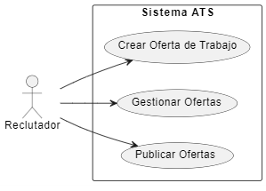
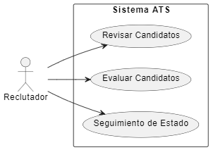
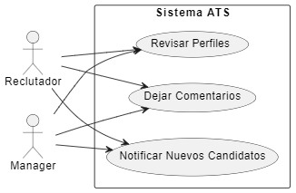
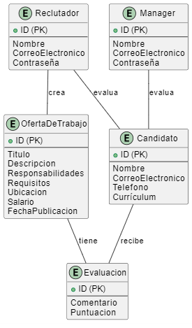
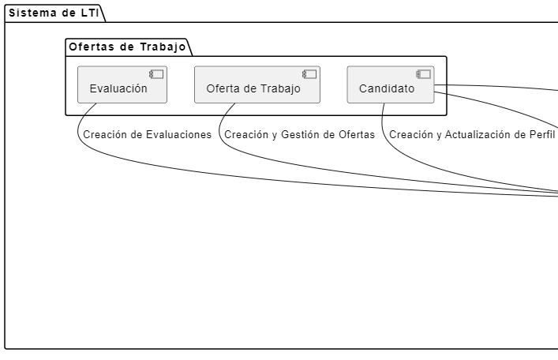
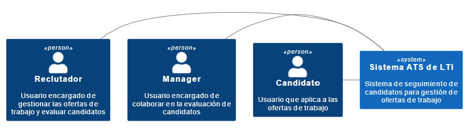
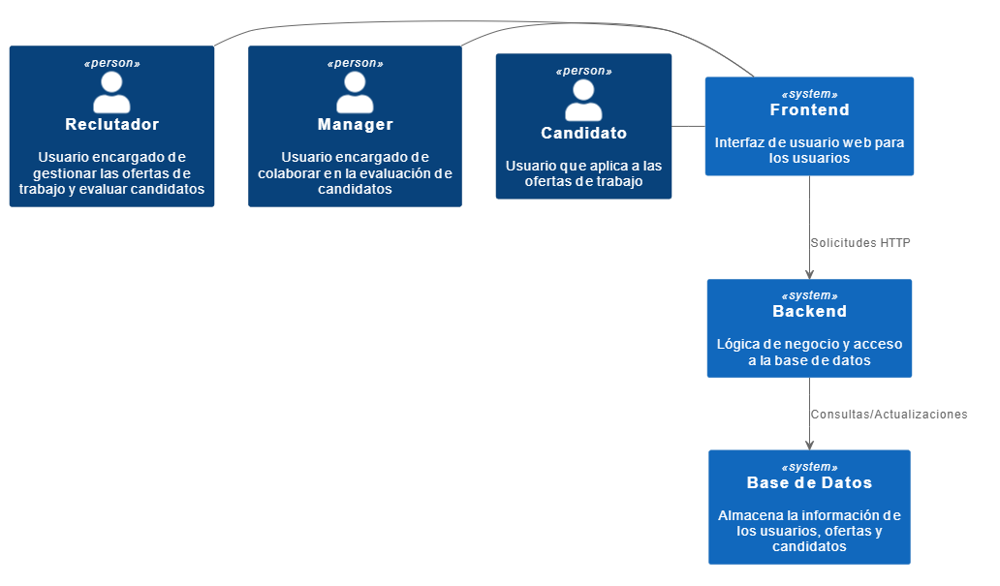
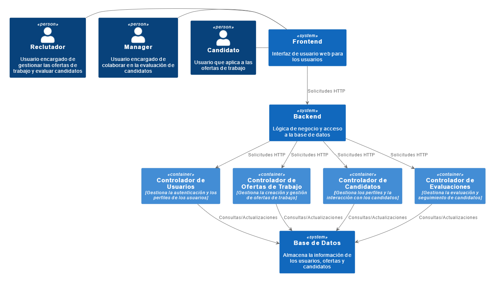

# Diseño Sistema de Seguimiento de Candidatos

### Descripción

1. **Interfaz intuitiva y fácil de usar**: El sistema debe contar con una interfaz de usuario amigable que permita a los usuarios navegar fácilmente por todas las funciones del ATS. Debe ser intuitivo para que los reclutadores y managers puedan utilizarlo sin necesidad de una formación extensa.

2. **Gestión completa del proceso de contratación**: El software debe permitir a los reclutadores gestionar todo el ciclo de vida del proceso de contratación, desde la publicación de ofertas de trabajo hasta la selección final del candidato. Esto incluye la gestión de currículums, entrevistas, pruebas de habilidades, referencias, entre otros.

3. **Búsqueda avanzada de candidatos**: Debería incluir herramientas de búsqueda avanzada que permitan a los reclutadores encontrar rápidamente candidatos con las habilidades y la experiencia necesarias para los puestos vacantes. Esto podría incluir filtros por habilidades, experiencia laboral, ubicación, entre otros.

4. **Colaboración en tiempo real**: El sistema debe facilitar la colaboración en tiempo real entre los reclutadores y managers. Esto podría lograrse a través de funciones como la posibilidad de dejar comentarios en los perfiles de los candidatos, compartir notas de entrevistas, asignar tareas, y enviar notificaciones instantáneas.

5. **Automatización de tareas repetitivas**: Debería incluir capacidades de automatización para tareas repetitivas como el envío de correos electrónicos de seguimiento, la programación de entrevistas, la creación de informes, entre otros. Esto ayudará a aumentar la eficiencia del departamento de RRHH al reducir la carga de trabajo manual.

6. **Análisis y reporting**: Debería ofrecer funciones de análisis y generación de informes para que los reclutadores y managers puedan evaluar el rendimiento del proceso de contratación, identificar áreas de mejora y tomar decisiones informadas.

7. **Seguridad y cumplimiento normativo**: Es crucial garantizar la seguridad de los datos de los candidatos y cumplir con las regulaciones de privacidad de datos, como GDPR. El sistema debe contar con medidas de seguridad robustas para proteger la información confidencial y cumplir con todas las normativas aplicables.

8. **Integraciones**: Debería ser capaz de integrarse con otros sistemas que la empresa utilice, como sistemas de gestión de recursos humanos (HRMS), plataformas de evaluación de candidatos, redes sociales profesionales, entre otros. Esto garantizará una experiencia fluida y una mayor eficiencia en la gestión de talento.

Al diseñar y desarrollar un sistema ATS con estas características, LTI podrá mejorar significativamente su proceso de contratación, aumentar la eficiencia de su departamento de RRHH y fomentar una mejor colaboración entre reclutadores y managers.

## Lean Canvas
<table>
  <tr>
    <td rowspan="2">
      <b>Problema</b>
      
Los procesos de contratación son ineficientes y carecen de colaboración en tiempo real entre reclutadores y managers.

    </td>
    <td>
      <b>Solución</b>
      
Desarrollo de un sistema ATS intuitivo y personalizable que facilite la gestión completa del proceso de contratación y promueva la colaboración en tiempo real.

    </td>
    <td rowspan="2" colspan="2">
      <b>Proposición de valor</b>
      
- Aumento de la eficiencia en los procesos de contratación.

      
- Mejora de la colaboración en tiempo real entre reclutadores y managers.

      
- Personalización y flexibilidad del sistema.

    </td>
    <td>
      <b>Ventaja Competitiva</b>
      
- Innovación tecnológica con IA y aprendizaje automático.

      
- Experiencia de usuario superior.

      
- Amplio ecosistema de integraciones.

    </td>
    <td rowspan="2">
      <b>Segmentos de Clientes</b>
      
- Empresas de diversos sectores.

      
- Departamentos de RRHH y reclutamiento.

    </td>
  </tr>
  <tr>
    <td>
      <b>Métricas Claves</b>
      
- Porcentaje de mejora en la eficiencia del proceso de contratación.

      
- Nivel de satisfacción del cliente.

    </td>
    <td>
      <b>Canales</b>
      
- Sitio web de LTI.

      
- Marketing digital (redes sociales, blogs, anuncios).

      
- Ferias y eventos de reclutamiento.

    </td>
  </tr>
  <tr>
    <td colspan="3">
      <b>Estructura de Costos</b>
      
- Desarrollo y mantenimiento del software.

      
- Costos de servidores y almacenamiento de datos.

      
- Gastos de personal (equipo de desarrollo, soporte técnico).

      
- Costos de marketing y ventas.

    </td>
    <td colspan="3">
      <b>Flujo de Ingresos</b>
      
- Suscripciones mensuales o anuales por el uso del software.

      
- Servicios de consultoría y personalización.

      
- Tarifas por integraciones con otros sistemas.

    </td>
  </tr>
</table>

## Casos de uso

1. **Publicación y Gestión de Ofertas de Trabajo**:
   - **Descripción**: Los reclutadores utilizan el sistema para crear y publicar ofertas de trabajo para las vacantes disponibles en la empresa.
   - **Pasos**:
     1. El reclutador inicia sesión en el sistema ATS de LTI.
     2. Selecciona la opción para crear una nueva oferta de trabajo.
     3. Completa los detalles de la oferta, como el título del puesto, las responsabilidades, los requisitos, la ubicación, y el salario.
     4. Configura los criterios de filtrado para la selección automática de candidatos.
     5. Publica la oferta en el sitio web de la empresa y en otros canales de reclutamiento.
   - **Beneficios**: Este caso de uso permite a los reclutadores crear y gestionar fácilmente las ofertas de trabajo, asegurándose de que estén bien definidas y se publiquen en los lugares adecuados para atraer a los candidatos calificados.
   

2. **Evaluación y Seguimiento de Candidatos**:
   - **Descripción**: Los reclutadores utilizan el sistema para revisar, evaluar y hacer un seguimiento de los candidatos que aplican para las vacantes.
   - **Pasos**:
     1. Los reclutadores reciben notificaciones cuando los candidatos aplican para una oferta.
     2. Acceden al sistema y revisan los currículums y perfiles de los candidatos.
     3. Realizan entrevistas, pruebas de habilidades y evaluaciones técnicas según sea necesario.
     4. Dejan comentarios y notas sobre cada candidato para facilitar la colaboración con los managers.
     5. Realizan un seguimiento del estado de cada candidato a lo largo del proceso de contratación.
   - **Beneficios**: Este caso de uso ayuda a los reclutadores a gestionar de manera eficiente el proceso de selección de candidatos, permitiéndoles evaluar y comparar fácilmente las habilidades y la idoneidad de cada candidato para el puesto.
   

3. **Colaboración en Tiempo Real con Managers**:
   - **Descripción**: Los reclutadores y managers utilizan el sistema para colaborar en tiempo real en la evaluación y selección de candidatos.
   - **Pasos**:
     1. Los managers reciben notificaciones cuando hay nuevos candidatos para revisar.
     2. Acceden al sistema y revisan los perfiles de los candidatos recomendados.
     3. Dejan comentarios y evaluaciones sobre los candidatos directamente en el sistema.
     4. Los reclutadores y managers pueden comunicarse a través de mensajes instantáneos integrados en el sistema.
     5. Toman decisiones de contratación basadas en la retroalimentación y evaluaciones recopiladas.
   - **Beneficios**: Este caso de uso promueve una colaboración más estrecha y eficiente entre los reclutadores y los managers, permitiéndoles trabajar juntos en tiempo real para identificar y seleccionar a los mejores candidatos para las vacantes disponibles.
   
`
## Modelo de datos

El modelo de datos incluye las siguientes entidades y sus atributos:

- **Reclutador**: Representa a los reclutadores que utilizan el sistema. Almacena información como su nombre, correo electrónico y contraseña.
- **Manager**: Representa a los managers que colaboran en el proceso de contratación. También almacena información similar a la del reclutador.
- **OfertaDeTrabajo**: Almacena información sobre las ofertas de trabajo creadas en el sistema, como título, descripción, responsabilidades, requisitos, ubicación, salario y fecha de publicación.
- **Candidato**: Representa a los candidatos que aplican a las ofertas de trabajo. Guarda información como nombre, correo electrónico, teléfono y currículum.
- **Evaluacion**: Registra las evaluaciones realizadas por los reclutadores y managers sobre los candidatos. Incluye comentarios y puntuaciones.

Las relaciones indican cómo estas entidades interactúan entre sí:
- Un reclutador puede crear muchas ofertas de trabajo.
- Un reclutador puede evaluar muchos candidatos.
- Un manager puede evaluar muchos candidatos.
- Cada candidato puede recibir muchas evaluaciones.
- Cada oferta de trabajo puede tener muchas evaluaciones.

   

## Diagrama del sistema

   

## Diagrama C4
### Sistema
   
### Contenedor
   
### Componente
   

