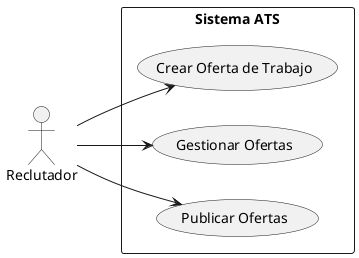
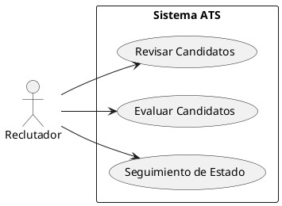
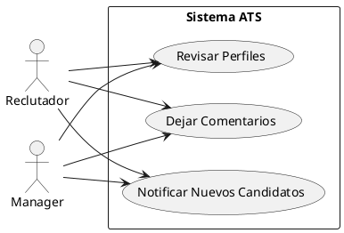
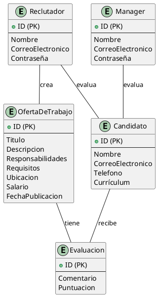
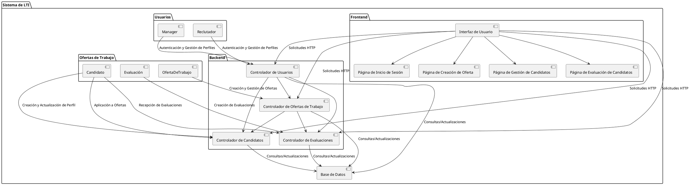
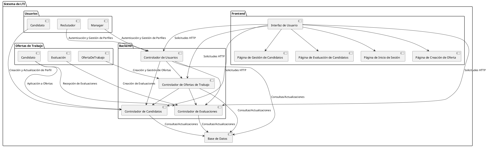
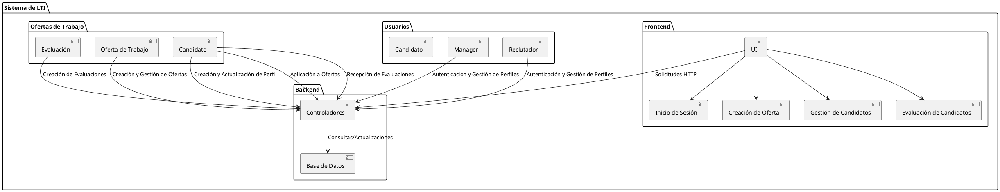

#### PROMPT:
Eres un arquitecto de software especializado en ATS (Applicant Tracking System). Como tal, vamos a diseñar un sistema ATS para una empresa llamada LTI. Los objetivos de LTI son: aumentar la eficiencia para los departamentos de HR, mejorar la colaboración en tiempo real entre reclutadores y managers. Para empezar, describe el software para LTI 
#### ChatGPT 3.5:
Para diseñar un sistema ATS (Applicant Tracking System) para LTI que cumpla con los objetivos de aumentar la eficiencia para los departamentos de RRHH y mejorar la colaboración en tiempo real entre reclutadores y managers, propondría un software con las siguientes características principales:

1. **Interfaz intuitiva y fácil de usar**: El sistema debe contar con una interfaz de usuario amigable que permita a los usuarios navegar fácilmente por todas las funciones del ATS. Debe ser intuitivo para que los reclutadores y managers puedan utilizarlo sin necesidad de una formación extensa.

2. **Gestión completa del proceso de contratación**: El software debe permitir a los reclutadores gestionar todo el ciclo de vida del proceso de contratación, desde la publicación de ofertas de trabajo hasta la selección final del candidato. Esto incluye la gestión de currículums, entrevistas, pruebas de habilidades, referencias, entre otros.

3. **Búsqueda avanzada de candidatos**: Debería incluir herramientas de búsqueda avanzada que permitan a los reclutadores encontrar rápidamente candidatos con las habilidades y la experiencia necesarias para los puestos vacantes. Esto podría incluir filtros por habilidades, experiencia laboral, ubicación, entre otros.

4. **Colaboración en tiempo real**: El sistema debe facilitar la colaboración en tiempo real entre los reclutadores y managers. Esto podría lograrse a través de funciones como la posibilidad de dejar comentarios en los perfiles de los candidatos, compartir notas de entrevistas, asignar tareas, y enviar notificaciones instantáneas.

5. **Automatización de tareas repetitivas**: Debería incluir capacidades de automatización para tareas repetitivas como el envío de correos electrónicos de seguimiento, la programación de entrevistas, la creación de informes, entre otros. Esto ayudará a aumentar la eficiencia del departamento de RRHH al reducir la carga de trabajo manual.

6. **Análisis y reporting**: Debería ofrecer funciones de análisis y generación de informes para que los reclutadores y managers puedan evaluar el rendimiento del proceso de contratación, identificar áreas de mejora y tomar decisiones informadas.

7. **Seguridad y cumplimiento normativo**: Es crucial garantizar la seguridad de los datos de los candidatos y cumplir con las regulaciones de privacidad de datos, como GDPR. El sistema debe contar con medidas de seguridad robustas para proteger la información confidencial y cumplir con todas las normativas aplicables.

8. **Integraciones**: Debería ser capaz de integrarse con otros sistemas que la empresa utilice, como sistemas de gestión de recursos humanos (HRMS), plataformas de evaluación de candidatos, redes sociales profesionales, entre otros. Esto garantizará una experiencia fluida y una mayor eficiencia en la gestión de talento.

Al diseñar y desarrollar un sistema ATS con estas características, LTI podrá mejorar significativamente su proceso de contratación, aumentar la eficiencia de su departamento de RRHH y fomentar una mejor colaboración entre reclutadores y managers.
- - -
#### PROMPT:
Cuál es el valor añadido y las ventajas competitivas de LTI?
#### ChatGPT 3.5:
El valor añadido y las ventajas competitivas de LTI (vamos a asumir que es una empresa ficticia) en el contexto de su sistema ATS pueden ser los siguientes:

1. **Personalización y Flexibilidad**: LTI puede ofrecer un ATS altamente personalizable que se adapte a las necesidades específicas de cada cliente. Esto significa que pueden ajustar el sistema según los requisitos particulares de cada empresa, brindando una solución más flexible y adaptada a las necesidades del cliente en comparación con soluciones genéricas en el mercado.

2. **Tecnología Innovadora**: Si LTI invierte en la investigación y el desarrollo de tecnologías innovadoras, como inteligencia artificial y aprendizaje automático, pueden ofrecer características avanzadas que mejoren la eficiencia del proceso de contratación, como la clasificación automática de currículums, recomendaciones de candidatos y análisis predictivo de rendimiento.

3. **Experiencia de Usuario Superior**: Al priorizar una interfaz de usuario intuitiva y amigable, LTI puede diferenciarse al proporcionar una experiencia de usuario superior tanto para reclutadores como para managers. Una interfaz fácil de usar aumentará la adopción del sistema y la satisfacción del usuario, lo que a su vez mejorará la eficiencia y la colaboración en el proceso de contratación.

4. **Soporte y Servicio al Cliente de Calidad**: LTI puede destacarse al ofrecer un excelente servicio de atención al cliente y soporte técnico. Brindar asistencia rápida y efectiva a los clientes garantizará una experiencia sin problemas y demostrará el compromiso de LTI con la satisfacción del cliente.

5. **Integraciones y Ecosistema Amplio**: Si LTI puede establecer asociaciones estratégicas con otros proveedores de tecnología y plataformas relevantes, pueden ofrecer un ecosistema amplio de integraciones con otros sistemas utilizados por las empresas, como sistemas de gestión de recursos humanos, plataformas de evaluación de candidatos, redes sociales profesionales, etc. Esto proporcionaría a los clientes una solución más completa y conectada para la gestión del talento.

6. **Enfoque en Seguridad y Cumplimiento Normativo**: Si LTI puede demostrar un fuerte enfoque en la seguridad de los datos y el cumplimiento normativo, como el cumplimiento de GDPR, ISO 27001, etc., pueden generar confianza entre los clientes preocupados por la protección de la información confidencial de los candidatos.

Al destacarse en estos aspectos, LTI puede posicionarse como un proveedor líder en el mercado de sistemas ATS, ofreciendo un valor añadido significativo y ventajas competitivas que atraigan a clientes potenciales y fidelicen a los existentes.
- - -
#### PROMPT:
crea el diagrama lean canvas para el software de LTI usando una tabla html como la siguiente plantilla
<table>
  <tr>
    <td rowspan="2">
      <b>Problema</b>
      <p></p>
    </td>
    <td>
      <b>Solución</b>
      <p></p>
    </td>
    <td rowspan="2" colspan="2">
      <b>Proposición de valor</b>
      <p></p>
    </td>
    <td>
      <b>Ventaja Competitiva</b>
      <p></p>
    </td>
    <td rowspan="2">
      <b>Segmentos de Clientes</b>
      <p><p>
    </td>
  </tr>
  <tr>
    <td>
      <b>Metricas Claves</b>
      <p></p>
    </td>
    <td>
      <b>Canales</b>
      <p></p>
    </td>
  </tr>
  <tr>
    <td colspan="3">
      <b>Estructura de Costos</b>
      <p></p>
    </td>
    <td colspan="3">
      <b>Flujo de Ingresos</b>
      <p></p>
    </td>
  </tr>
</table>

#### ChatGPT 3.5:
Aquí tienes el Lean Canvas para el software de LTI:

<table>
  <tr>
    <td rowspan="2">
      <b>Problema</b>
      <p>Los procesos de contratación son ineficientes y carecen de colaboración en tiempo real entre reclutadores y managers.</p>
    </td>
    <td>
      <b>Solución</b>
      <p>Desarrollo de un sistema ATS intuitivo y personalizable que facilite la gestión completa del proceso de contratación y promueva la colaboración en tiempo real.</p>
    </td>
    <td rowspan="2" colspan="2">
      <b>Proposición de valor</b>
      <p>- Aumento de la eficiencia en los procesos de contratación.</p>
      <p>- Mejora de la colaboración en tiempo real entre reclutadores y managers.</p>
      <p>- Personalización y flexibilidad del sistema.</p>
    </td>
    <td>
      <b>Ventaja Competitiva</b>
      <p>- Innovación tecnológica con IA y aprendizaje automático.</p>
      <p>- Experiencia de usuario superior.</p>
      <p>- Amplio ecosistema de integraciones.</p>
    </td>
    <td rowspan="2">
      <b>Segmentos de Clientes</b>
      <p>- Empresas de diversos sectores.</p>
      <p>- Departamentos de RRHH y reclutamiento.</p>
    </td>
  </tr>
  <tr>
    <td>
      <b>Métricas Claves</b>
      <p>- Porcentaje de mejora en la eficiencia del proceso de contratación.</p>
      <p>- Nivel de satisfacción del cliente.</p>
    </td>
    <td>
      <b>Canales</b>
      <p>- Sitio web de LTI.</p>
      <p>- Marketing digital (redes sociales, blogs, anuncios).</p>
      <p>- Ferias y eventos de reclutamiento.</p>
    </td>
  </tr>
  <tr>
    <td colspan="3">
      <b>Estructura de Costos</b>
      <p>- Desarrollo y mantenimiento del software.</p>
      <p>- Costos de servidores y almacenamiento de datos.</p>
      <p>- Gastos de personal (equipo de desarrollo, soporte técnico).</p>
      <p>- Costos de marketing y ventas.</p>
    </td>
    <td colspan="3">
      <b>Flujo de Ingresos</b>
      <p>- Suscripciones mensuales o anuales por el uso del software.</p>
      <p>- Servicios de consultoría y personalización.</p>
      <p>- Tarifas por integraciones con otros sistemas.</p>
    </td>
  </tr>
</table>

Este Lean Canvas proporciona una visión general de los principales aspectos del negocio del software de LTI, incluyendo los problemas que resuelve, la solución propuesta, la propuesta de valor, las ventajas competitivas, los segmentos de clientes, las métricas clave, los canales de distribución, la estructura de costos y el flujo de ingresos.
- - -
#### PROMPT:
Describe los 3 casos de uso principales

#### ChatGPT 3.5:
Aquí están los tres casos de uso principales para el sistema ATS de LTI:

1. **Publicación y Gestión de Ofertas de Trabajo**:
   - **Descripción**: Los reclutadores utilizan el sistema para crear y publicar ofertas de trabajo para las vacantes disponibles en la empresa.
   - **Pasos**:
     1. El reclutador inicia sesión en el sistema ATS de LTI.
     2. Selecciona la opción para crear una nueva oferta de trabajo.
     3. Completa los detalles de la oferta, como el título del puesto, las responsabilidades, los requisitos, la ubicación, y el salario.
     4. Configura los criterios de filtrado para la selección automática de candidatos.
     5. Publica la oferta en el sitio web de la empresa y en otros canales de reclutamiento.
   - **Beneficios**: Este caso de uso permite a los reclutadores crear y gestionar fácilmente las ofertas de trabajo, asegurándose de que estén bien definidas y se publiquen en los lugares adecuados para atraer a los candidatos calificados.

2. **Evaluación y Seguimiento de Candidatos**:
   - **Descripción**: Los reclutadores utilizan el sistema para revisar, evaluar y hacer un seguimiento de los candidatos que aplican para las vacantes.
   - **Pasos**:
     1. Los reclutadores reciben notificaciones cuando los candidatos aplican para una oferta.
     2. Acceden al sistema y revisan los currículums y perfiles de los candidatos.
     3. Realizan entrevistas, pruebas de habilidades y evaluaciones técnicas según sea necesario.
     4. Dejan comentarios y notas sobre cada candidato para facilitar la colaboración con los managers.
     5. Realizan un seguimiento del estado de cada candidato a lo largo del proceso de contratación.
   - **Beneficios**: Este caso de uso ayuda a los reclutadores a gestionar de manera eficiente el proceso de selección de candidatos, permitiéndoles evaluar y comparar fácilmente las habilidades y la idoneidad de cada candidato para el puesto.

3. **Colaboración en Tiempo Real con Managers**:
   - **Descripción**: Los reclutadores y managers utilizan el sistema para colaborar en tiempo real en la evaluación y selección de candidatos.
   - **Pasos**:
     1. Los managers reciben notificaciones cuando hay nuevos candidatos para revisar.
     2. Acceden al sistema y revisan los perfiles de los candidatos recomendados.
     3. Dejan comentarios y evaluaciones sobre los candidatos directamente en el sistema.
     4. Los reclutadores y managers pueden comunicarse a través de mensajes instantáneos integrados en el sistema.
     5. Toman decisiones de contratación basadas en la retroalimentación y evaluaciones recopiladas.
   - **Beneficios**: Este caso de uso promueve una colaboración más estrecha y eficiente entre los reclutadores y los managers, permitiéndoles trabajar juntos en tiempo real para identificar y seleccionar a los mejores candidatos para las vacantes disponibles.
- - -
#### PROMPT:
crea los diagramas para dichos casos de uso usando plantUML
#### ChatGPT 3.5:
Aquí tienes los diagramas de casos de uso para los tres casos de uso principales utilizando PlantUML:

### Diagrama de Casos de Uso: Publicación y Gestión de Ofertas de Trabajo



### Diagrama de Casos de Uso: Evaluación y Seguimiento de Candidatos



### Diagrama de Casos de Uso: Colaboración en Tiempo Real con Managers



Estos diagramas representan visualmente los casos de uso principales del sistema ATS de LTI, mostrando las interacciones entre los actores (reclutadores y managers) y el sistema.
- - -
#### PROMPT:
Crea el modelo de datos (entidades, atributos y relaciones) para satisfacer el sistema completo
#### ChatGPT 3.5:
Aquí tienes un modelo de datos básico para el sistema completo de ATS de LTI:



Este modelo de datos incluye las siguientes entidades y sus atributos:

- **Reclutador**: Representa a los reclutadores que utilizan el sistema. Almacena información como su nombre, correo electrónico y contraseña.
- **Manager**: Representa a los managers que colaboran en el proceso de contratación. También almacena información similar a la del reclutador.
- **OfertaDeTrabajo**: Almacena información sobre las ofertas de trabajo creadas en el sistema, como título, descripción, responsabilidades, requisitos, ubicación, salario y fecha de publicación.
- **Candidato**: Representa a los candidatos que aplican a las ofertas de trabajo. Guarda información como nombre, correo electrónico, teléfono y currículum.
- **Evaluacion**: Registra las evaluaciones realizadas por los reclutadores y managers sobre los candidatos. Incluye comentarios y puntuaciones.

Las relaciones indican cómo estas entidades interactúan entre sí:
- Un reclutador puede crear muchas ofertas de trabajo.
- Un reclutador puede evaluar muchos candidatos.
- Un manager puede evaluar muchos candidatos.
- Cada candidato puede recibir muchas evaluaciones.
- Cada oferta de trabajo puede tener muchas evaluaciones.
- - -
#### PROMPT:
Siendo un arquitecto de software, genera un diagrama que muestre los componentes del sistema de LTI. Ten en cuenta los diferentes tipos de usuarios que tendrá el sistema
#### ChatGPT 3.5:
Aquí tienes un diagrama de componentes para el sistema de LTI, considerando los diferentes tipos de usuarios:



En este diagrama de componentes, se representan los principales componentes del sistema de LTI:

- **Frontend**: Contiene la interfaz de usuario y las diferentes páginas que utilizarán los usuarios para interactuar con el sistema, como la página de inicio de sesión, la página de creación de ofertas, la página de gestión de candidatos y la página de evaluación de candidatos.
- **Backend**: Contiene los controladores que manejan las solicitudes HTTP recibidas desde el frontend y se comunican con la base de datos para realizar consultas y actualizaciones.
- **Base de Datos**: Almacena toda la información del sistema, incluyendo usuarios, ofertas de trabajo, candidatos y evaluaciones.
- **Usuarios**: Representa los diferentes tipos de usuarios del sistema, como reclutadores y managers.
- **Ofertas de Trabajo**: Contiene las entidades relacionadas con las ofertas de trabajo, como la propia oferta, los candidatos que aplican a ella y las evaluaciones realizadas sobre los candidatos.
- - -
#### PROMPT:
Falta incluir al usuario 'Candidato'
#### ChatGPT 3.5:
¡Cierto! Disculpa la omisión. Aquí tienes la actualización del diagrama incluyendo al usuario 'Candidato':



Ahora, el usuario 'Candidato' está representado correctamente y se muestra su interacción con el sistema a través de la interfaz de usuario y los controladores correspondientes.
- - -
#### PROMPT:
simplifca un poco cada componente
#### ChatGPT 3.5:
Por supuesto, aquí tienes una versión simplificada del diagrama de componentes:



En esta versión simplificada, he combinado los controladores en una sola entidad llamada "Controladores", ya que representan la lógica de procesamiento del sistema y no es necesario detallar cada uno por separado en este nivel de abstracción. Además, he eliminado las relaciones específicas entre cada controlador y la base de datos para mantener la simplicidad del diagrama.
- - -
#### PROMPT:
Vamos a generar diagramas para el sistema usando el modelo c4, para empezar, crea el diagrama de contexto
#### ChatGPT 3.5:
Perfecto, vamos a utilizar el modelo C4 para crear el diagrama de contexto. Aquí tienes el archivo PlantUML `C4_Context.puml` con el diagrama de contexto:

```plantuml
@startuml
!include https://raw.githubusercontent.com/RicardoNiepel/C4-PlantUML/release/1-2/C4_Context.puml

Person(personRecruiter, "Reclutador", "Usuario encargado de gestionar las ofertas de trabajo y evaluar candidatos")
Person(personManager, "Manager", "Usuario encargado de colaborar en la evaluación de candidatos")
Person(personCandidate, "Candidato", "Usuario que aplica a las ofertas de trabajo")

System(systemATS, "Sistema ATS de LTI", "Sistema de seguimiento de candidatos para gestión de ofertas de trabajo")

personRecruiter - [systemATS]
personManager - [systemATS]
personCandidate - [systemATS]

@enduml
```

Este diagrama de contexto muestra una vista de alto nivel del sistema, dividiéndolo en dos contenedores principales: Frontend y Backend. El frontend incluye la interfaz de usuario y los controladores asociados, mientras que el backend incluye la base de datos y los controladores correspondientes. Los diferentes tipos de usuarios (Reclutador, Manager y Candidato) interactúan con la interfaz de usuario para realizar acciones en el sistema.
- - -
#### PROMPT:
Genial, ahora el diagrama del contenedor  
#### ChatGPT 3.5:
Claro, el diagrama de contenedores describe los contenedores que componen el sistema y cómo se comunican entre sí. Aquí tienes el diagrama de contenedores para el sistema ATS de LTI:

```plantuml
@startuml
!include https://raw.githubusercontent.com/RicardoNiepel/C4-PlantUML/release/1-2/C4_Container.puml

Person(personRecruiter, "Reclutador", "Usuario encargado de gestionar las ofertas de trabajo y evaluar candidatos")
Person(personManager, "Manager", "Usuario encargado de colaborar en la evaluación de candidatos")
Person(personCandidate, "Candidato", "Usuario que aplica a las ofertas de trabajo")

System(systemFrontend, "Frontend", "Interfaz de usuario web para los usuarios")
System(systemBackend, "Backend", "Lógica de negocio y acceso a la base de datos")
System(systemDatabase, "Base de Datos", "Almacena la información de los usuarios, ofertas y candidatos")

personRecruiter - [systemFrontend]
personManager - [systemFrontend]
personCandidate - [systemFrontend]

[systemFrontend] --> [systemBackend] : Solicitudes HTTP
[systemBackend] --> [systemDatabase] : Consultas/Actualizaciones

@enduml
```

Este diagrama muestra tres contenedores principales:
- **Frontend**: La interfaz de usuario web a través de la cual los usuarios interactúan con el sistema.
- **Backend**: La lógica de negocio y el acceso a la base de datos.
- **Base de Datos**: Almacena la información de los usuarios, ofertas y candidatos.

Los usuarios (reclutadores, managers y candidatos) se comunican con el frontend, que a su vez envía solicitudes al backend para procesarlas y acceder a la base de datos según sea necesario.
- - -
#### PROMPT:
para el nivel 3, detalla el Backend
#### ChatGPT 3.5:
Perfecto, vamos a detallar el backend del sistema de LTI basándonos en el diagrama previo. Añadiré los componentes específicos del backend y cómo se comunican entre sí.

```plantuml
@startuml
!include https://raw.githubusercontent.com/RicardoNiepel/C4-PlantUML/release/1-2/C4_Container.puml

Person(personRecruiter, "Reclutador", "Usuario encargado de gestionar las ofertas de trabajo y evaluar candidatos")
Person(personManager, "Manager", "Usuario encargado de colaborar en la evaluación de candidatos")
Person(personCandidate, "Candidato", "Usuario que aplica a las ofertas de trabajo")

System(systemFrontend, "Frontend", "Interfaz de usuario web para los usuarios")
System(systemBackend, "Backend", "Lógica de negocio y acceso a la base de datos")
System(systemDatabase, "Base de Datos", "Almacena la información de los usuarios, ofertas y candidatos")
Container(containerUserController, "Controlador de Usuarios", "Gestiona la autenticación y los perfiles de los usuarios")
Container(containerJobController, "Controlador de Ofertas de Trabajo", "Gestiona la creación y gestión de ofertas de trabajo")
Container(containerCandidateController, "Controlador de Candidatos", "Gestiona los perfiles y la interacción con los candidatos")
Container(containerEvaluationController, "Controlador de Evaluaciones", "Gestiona la evaluación y seguimiento de candidatos")

personRecruiter - [systemFrontend]
personManager - [systemFrontend]
personCandidate - [systemFrontend]

[systemFrontend] --> [systemBackend] : Solicitudes HTTP
[systemBackend] --> [containerUserController] : Solicitudes HTTP
[systemBackend] --> [containerJobController] : Solicitudes HTTP
[systemBackend] --> [containerCandidateController] : Solicitudes HTTP
[systemBackend] --> [containerEvaluationController] : Solicitudes HTTP
[containerUserController] --> [systemDatabase] : Consultas/Actualizaciones
[containerJobController] --> [systemDatabase] : Consultas/Actualizaciones
[containerCandidateController] --> [systemDatabase] : Consultas/Actualizaciones
[containerEvaluationController] --> [systemDatabase] : Consultas/Actualizaciones

@enduml
```

Este diagrama de contenedores del nivel 3 detalla la estructura interna del backend del sistema de LTI. Se incluyen los siguientes componentes:

- **Controlador de Usuarios**: Gestiona la autenticación y los perfiles de los usuarios.
- **Controlador de Ofertas de Trabajo**: Gestiona la creación y gestión de ofertas de trabajo.
- **Controlador de Candidatos**: Gestiona los perfiles y la interacción con los candidatos.
- **Controlador de Evaluaciones**: Gestiona la evaluación y seguimiento de candidatos.

Estos controladores se comunican con la base de datos para realizar consultas y actualizaciones según sea necesario.
- - -