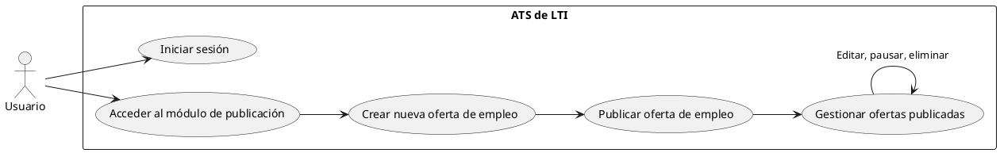
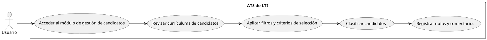
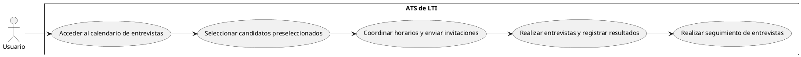
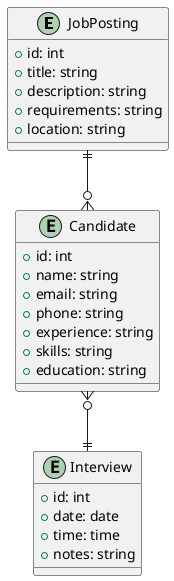
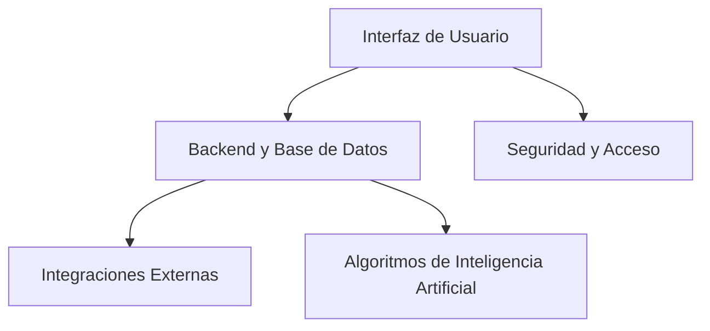
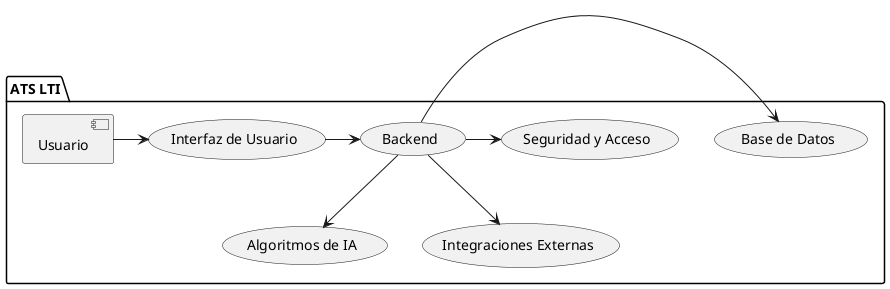
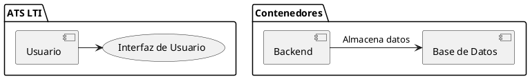
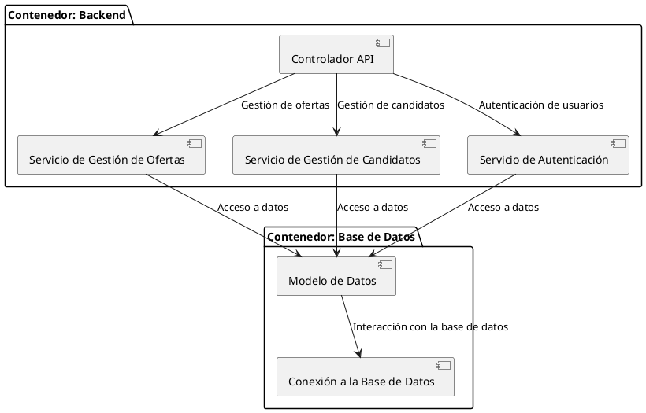
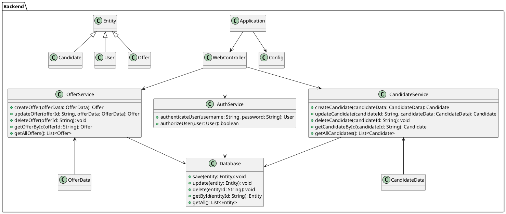

# Sistema de Gestión de Solicitantes (ATS) - Documento de Diseño
## Descripción del Software
El Sistema de Gestión de Solicitantes (Applicant-Tracking System, ATS) es una herramienta diseñada para facilitar y optimizar el proceso de contratación de personal en empresas de cualquier tamaño. El ATS de nuestra start-up, llamada LTI (por sus siglas en inglés, "Lead Talent Innovator"), se enfoca en ofrecer una solución completa y fácil de usar para la gestión de candidatos, desde la publicación de ofertas de empleo hasta la contratación final.

## Valor Añadido y Ventajas Competitivas
* Interfaz Intuitiva: LTI se distingue por su interfaz de usuario intuitiva y fácil de navegar, lo que permite a los reclutadores y gerentes de contratación acceder rápidamente a la información que necesitan y realizar sus tareas de manera eficiente.
* Automatización Inteligente: El ATS de LTI utiliza algoritmos avanzados de inteligencia artificial para automatizar tareas repetitivas como la criba curricular, el envío de correos electrónicos a candidatos y la programación de entrevistas, liberando así tiempo para actividades más estratégicas.
* Análisis de Datos: LTI ofrece herramientas robustas de análisis de datos que permiten a los usuarios obtener información valiosa sobre el rendimiento de sus procesos de contratación, identificar tendencias y tomar decisiones informadas para mejorar continuamente sus estrategias de reclutamiento.
* Personalización y Escalabilidad: Nuestro ATS está diseñado para adaptarse a las necesidades específicas de cada empresa, ofreciendo opciones de personalización para flujos de trabajo, informes y configuraciones de usuarios. Además, LTI es escalable y puede crecer junto con la empresa a medida que esta expande su equipo de reclutamiento.
* Soporte y Actualizaciones Continuas: LTI se compromete a brindar un soporte técnico de alta calidad a sus clientes, así como a ofrecer actualizaciones regulares del software para incorporar nuevas funcionalidades y mantenerlo siempre actualizado con las últimas tendencias del mercado de reclutamiento.

## Lean Canvas

```xml
<?xml version="1.0" encoding="UTF-8"?>
<mxfile host="app.diagrams.net" modified="2024-04-29T05:05:53.507Z" agent="Mozilla/5.0 (Macintosh; Intel Mac OS X 10_15_7) AppleWebKit/537.36 (KHTML, like Gecko) Chrome/124.0.0.0 Safari/537.36" version="24.3.1" etag="73NnlYZAqjXLWijjnk7b" type="device">
  <diagram id="KsK0L2idwev-dV4BAee5" name="Lean Canvas">
    <mxGraphModel dx="1593" dy="808" grid="1" gridSize="10" guides="1" tooltips="1" connect="1" arrows="1" fold="1" page="0" pageScale="1" pageWidth="827" pageHeight="1169" math="0" shadow="0">
      <root>
        <mxCell id="0" />
        <mxCell id="1" parent="0" />
        <mxCell id="2" value="" style="shape=partialRectangle;top=0;right=0;bottom=0;fillColor=#ffffff;" parent="1" vertex="1" connectable="0">
          <mxGeometry x="-90" y="130" width="940" height="500" as="geometry" />
        </mxCell>
        <mxCell id="3" value="Problem&lt;br&gt;&lt;span style=&quot;color: rgb(236, 236, 236); font-family: Söhne, ui-sans-serif, system-ui, -apple-system, &amp;quot;Segoe UI&amp;quot;, Roboto, Ubuntu, Cantarell, &amp;quot;Noto Sans&amp;quot;, sans-serif, &amp;quot;Helvetica Neue&amp;quot;, Arial, &amp;quot;Apple Color Emoji&amp;quot;, &amp;quot;Segoe UI Emoji&amp;quot;, &amp;quot;Segoe UI Symbol&amp;quot;, &amp;quot;Noto Color Emoji&amp;quot;; font-size: 16px; text-align: left; white-space: pre-wrap; background-color: rgb(33, 33, 33);&quot;&gt; la dificultad en la gestión de candidatos y la falta de eficiencia en el proceso de contratación&lt;/span&gt;" style="text;html=1;strokeColor=none;fillColor=#e84747;align=center;verticalAlign=middle;fontSize=20;fontFamily=Arial;rounded=0;spacing=0;" parent="2" vertex="1">
          <mxGeometry x="20" y="20" width="200" height="250" as="geometry" />
        </mxCell>
        <mxCell id="4" value="Solution&lt;br&gt;&lt;span style=&quot;color: rgb(236, 236, 236); font-family: Söhne, ui-sans-serif, system-ui, -apple-system, &amp;quot;Segoe UI&amp;quot;, Roboto, Ubuntu, Cantarell, &amp;quot;Noto Sans&amp;quot;, sans-serif, &amp;quot;Helvetica Neue&amp;quot;, Arial, &amp;quot;Apple Color Emoji&amp;quot;, &amp;quot;Segoe UI Emoji&amp;quot;, &amp;quot;Segoe UI Symbol&amp;quot;, &amp;quot;Noto Color Emoji&amp;quot;; font-size: 16px; text-align: left; white-space: pre-wrap; background-color: rgb(33, 33, 33);&quot;&gt;La automatización de tareas de reclutamiento y la generación de informes de análisis de datos.&lt;/span&gt;" style="text;html=1;strokeColor=none;fillColor=#f6ab44;align=center;verticalAlign=middle;fontSize=20;fontFamily=Arial;rounded=0;" parent="2" vertex="1">
          <mxGeometry x="260" y="20" width="200" height="220" as="geometry" />
        </mxCell>
        <mxCell id="5" value="Key Metrics&lt;br&gt;&lt;span style=&quot;color: rgb(236, 236, 236); font-family: Söhne, ui-sans-serif, system-ui, -apple-system, &amp;quot;Segoe UI&amp;quot;, Roboto, Ubuntu, Cantarell, &amp;quot;Noto Sans&amp;quot;, sans-serif, &amp;quot;Helvetica Neue&amp;quot;, Arial, &amp;quot;Apple Color Emoji&amp;quot;, &amp;quot;Segoe UI Emoji&amp;quot;, &amp;quot;Segoe UI Symbol&amp;quot;, &amp;quot;Noto Color Emoji&amp;quot;; font-size: 16px; text-align: left; white-space: pre-wrap; background-color: rgb(33, 33, 33);&quot;&gt;El número de clientes, la tasa de retención y la satisfacción del cliente.&lt;/span&gt;" style="text;html=1;strokeColor=none;fillColor=#f6e849;align=center;verticalAlign=middle;fontSize=20;fontFamily=Arial;rounded=0;" parent="2" vertex="1">
          <mxGeometry x="500" y="20" width="200" height="170" as="geometry" />
        </mxCell>
        <mxCell id="6" value="Unique Value Proposition&lt;br&gt;&lt;span style=&quot;color: rgb(236, 236, 236); font-family: Söhne, ui-sans-serif, system-ui, -apple-system, &amp;quot;Segoe UI&amp;quot;, Roboto, Ubuntu, Cantarell, &amp;quot;Noto Sans&amp;quot;, sans-serif, &amp;quot;Helvetica Neue&amp;quot;, Arial, &amp;quot;Apple Color Emoji&amp;quot;, &amp;quot;Segoe UI Emoji&amp;quot;, &amp;quot;Segoe UI Symbol&amp;quot;, &amp;quot;Noto Color Emoji&amp;quot;; font-size: 16px; text-align: left; white-space: pre-wrap; background-color: rgb(33, 33, 33);&quot;&gt;Interfaz intuitiva, automatización inteligente y herramientas de análisis avanzadas.&lt;/span&gt;&lt;span style=&quot;color: rgb(236, 236, 236); font-family: Söhne, ui-sans-serif, system-ui, -apple-system, &amp;quot;Segoe UI&amp;quot;, Roboto, Ubuntu, Cantarell, &amp;quot;Noto Sans&amp;quot;, sans-serif, &amp;quot;Helvetica Neue&amp;quot;, Arial, &amp;quot;Apple Color Emoji&amp;quot;, &amp;quot;Segoe UI Emoji&amp;quot;, &amp;quot;Segoe UI Symbol&amp;quot;, &amp;quot;Noto Color Emoji&amp;quot;; font-size: 16px; text-align: left; white-space: pre-wrap; background-color: rgb(33, 33, 33);&quot;&gt; &lt;/span&gt;" style="text;html=1;strokeColor=none;fillColor=#70e864;align=center;verticalAlign=middle;fontSize=20;fontFamily=Arial;rounded=0;" parent="2" vertex="1">
          <mxGeometry x="740" y="20" width="200" height="120" as="geometry" />
        </mxCell>
        <mxCell id="7" value="Unfair Advantage&lt;br&gt;&lt;span style=&quot;color: rgb(236, 236, 236); font-family: Söhne, ui-sans-serif, system-ui, -apple-system, &amp;quot;Segoe UI&amp;quot;, Roboto, Ubuntu, Cantarell, &amp;quot;Noto Sans&amp;quot;, sans-serif, &amp;quot;Helvetica Neue&amp;quot;, Arial, &amp;quot;Apple Color Emoji&amp;quot;, &amp;quot;Segoe UI Emoji&amp;quot;, &amp;quot;Segoe UI Symbol&amp;quot;, &amp;quot;Noto Color Emoji&amp;quot;; font-size: 16px; text-align: left; white-space: pre-wrap; background-color: rgb(33, 33, 33);&quot;&gt;Enfoque en la personalización y escalabilidad.&lt;/span&gt;" style="text;html=1;strokeColor=none;fillColor=#56b1f7;align=center;verticalAlign=middle;fontSize=20;fontFamily=Arial;rounded=0;" parent="2" vertex="1">
          <mxGeometry x="20" y="280" width="200" height="110" as="geometry" />
        </mxCell>
        <mxCell id="8" value="Channels&lt;br&gt;&lt;span style=&quot;color: rgb(236, 236, 236); font-family: Söhne, ui-sans-serif, system-ui, -apple-system, &amp;quot;Segoe UI&amp;quot;, Roboto, Ubuntu, Cantarell, &amp;quot;Noto Sans&amp;quot;, sans-serif, &amp;quot;Helvetica Neue&amp;quot;, Arial, &amp;quot;Apple Color Emoji&amp;quot;, &amp;quot;Segoe UI Emoji&amp;quot;, &amp;quot;Segoe UI Symbol&amp;quot;, &amp;quot;Noto Color Emoji&amp;quot;; font-size: 16px; text-align: left; white-space: pre-wrap; background-color: rgb(33, 33, 33);&quot;&gt;M&lt;/span&gt;&lt;span style=&quot;background-color: rgb(33, 33, 33); color: rgb(236, 236, 236); font-family: Söhne, ui-sans-serif, system-ui, -apple-system, &amp;quot;Segoe UI&amp;quot;, Roboto, Ubuntu, Cantarell, &amp;quot;Noto Sans&amp;quot;, sans-serif, &amp;quot;Helvetica Neue&amp;quot;, Arial, &amp;quot;Apple Color Emoji&amp;quot;, &amp;quot;Segoe UI Emoji&amp;quot;, &amp;quot;Segoe UI Symbol&amp;quot;, &amp;quot;Noto Color Emoji&amp;quot;; font-size: 16px; text-align: left; white-space: pre-wrap;&quot;&gt;arketing digital, asociaciones estratégicas y ventas directas.&lt;/span&gt;" style="text;html=1;strokeColor=none;fillColor=#ff73fa;align=center;verticalAlign=middle;fontSize=20;fontFamily=Arial;rounded=0;" parent="2" vertex="1">
          <mxGeometry x="260" y="250" width="200" height="170" as="geometry" />
        </mxCell>
        <mxCell id="9" value="Customer Segments&lt;br&gt;&lt;span style=&quot;color: rgb(236, 236, 236); font-family: Söhne, ui-sans-serif, system-ui, -apple-system, &amp;quot;Segoe UI&amp;quot;, Roboto, Ubuntu, Cantarell, &amp;quot;Noto Sans&amp;quot;, sans-serif, &amp;quot;Helvetica Neue&amp;quot;, Arial, &amp;quot;Apple Color Emoji&amp;quot;, &amp;quot;Segoe UI Emoji&amp;quot;, &amp;quot;Segoe UI Symbol&amp;quot;, &amp;quot;Noto Color Emoji&amp;quot;; font-size: 16px; text-align: left; white-space: pre-wrap; background-color: rgb(33, 33, 33);&quot;&gt;E&lt;/span&gt;&lt;span style=&quot;background-color: rgb(33, 33, 33); color: rgb(236, 236, 236); font-family: Söhne, ui-sans-serif, system-ui, -apple-system, &amp;quot;Segoe UI&amp;quot;, Roboto, Ubuntu, Cantarell, &amp;quot;Noto Sans&amp;quot;, sans-serif, &amp;quot;Helvetica Neue&amp;quot;, Arial, &amp;quot;Apple Color Emoji&amp;quot;, &amp;quot;Segoe UI Emoji&amp;quot;, &amp;quot;Segoe UI Symbol&amp;quot;, &amp;quot;Noto Color Emoji&amp;quot;; font-size: 16px; text-align: left; white-space: pre-wrap;&quot;&gt;mpresas de diferentes tamaños y sectores.&lt;/span&gt;" style="text;html=1;strokeColor=none;fillColor=#9bcaff;align=center;verticalAlign=middle;fontSize=20;fontFamily=Arial;rounded=0;" parent="2" vertex="1">
          <mxGeometry x="500" y="200" width="200" height="80" as="geometry" />
        </mxCell>
        <mxCell id="10" value="Cost Structure&lt;br&gt;&lt;span style=&quot;color: rgb(236, 236, 236); font-family: Söhne, ui-sans-serif, system-ui, -apple-system, &amp;quot;Segoe UI&amp;quot;, Roboto, Ubuntu, Cantarell, &amp;quot;Noto Sans&amp;quot;, sans-serif, &amp;quot;Helvetica Neue&amp;quot;, Arial, &amp;quot;Apple Color Emoji&amp;quot;, &amp;quot;Segoe UI Emoji&amp;quot;, &amp;quot;Segoe UI Symbol&amp;quot;, &amp;quot;Noto Color Emoji&amp;quot;; font-size: 16px; text-align: left; white-space: pre-wrap; background-color: rgb(33, 33, 33);&quot;&gt;Desarrollo de software, soporte técnico y marketing.&lt;/span&gt;" style="text;html=1;strokeColor=none;fillColor=#b5b5b5;align=center;verticalAlign=middle;fontSize=20;fontFamily=Arial;rounded=0;" parent="2" vertex="1">
          <mxGeometry x="740" y="150" width="200" height="130" as="geometry" />
        </mxCell>
        <mxCell id="11" value="Revenue Streams&lt;br&gt;&lt;span style=&quot;color: rgb(236, 236, 236); font-family: Söhne, ui-sans-serif, system-ui, -apple-system, &amp;quot;Segoe UI&amp;quot;, Roboto, Ubuntu, Cantarell, &amp;quot;Noto Sans&amp;quot;, sans-serif, &amp;quot;Helvetica Neue&amp;quot;, Arial, &amp;quot;Apple Color Emoji&amp;quot;, &amp;quot;Segoe UI Emoji&amp;quot;, &amp;quot;Segoe UI Symbol&amp;quot;, &amp;quot;Noto Color Emoji&amp;quot;; font-size: 16px; text-align: left; white-space: pre-wrap; background-color: rgb(33, 33, 33);&quot;&gt;Suscripciones mensuales o anuales, tarifas por uso y servicios adicionales.&lt;/span&gt;" style="text;html=1;strokeColor=none;fillColor=#c09eff;align=center;verticalAlign=middle;fontSize=20;fontFamily=Arial;rounded=0;" parent="2" vertex="1">
          <mxGeometry x="260" y="430" width="200" height="130" as="geometry" />
        </mxCell>
        <mxCell id="12" value="Team" style="text;html=1;strokeColor=none;fillColor=#ff0000;align=center;verticalAlign=middle;fontSize=20;fontFamily=Arial;rounded=0;" parent="2" vertex="1">
          <mxGeometry x="500" y="290" width="200" height="80" as="geometry" />
        </mxCell>
        <mxCell id="15" value="&#xa;&#xa;" style="text;html=1;strokeColor=none;fillColor=#ffffff;" parent="2" vertex="1">
          <mxGeometry x="740" y="380" width="200" height="80" as="geometry" />
        </mxCell>
      </root>
    </mxGraphModel>
  </diagram>
</mxfile>
```

## Casos de uso
### Caso de Uso 1: Publicación y Gestión de Ofertas de Empleo
#### Descripción:
En este caso de uso, el usuario (reclutador o gerente de contratación) puede crear y publicar ofertas de empleo en el ATS de LTI. El proceso incluye la definición de detalles como el título del puesto, descripción del trabajo, requisitos y ubicación. Una vez publicada, el usuario puede gestionar las ofertas de empleo, incluyendo la edición, pausa o eliminación de las mismas según sea necesario.

#### Pasos:
1. Iniciar sesión en el ATS de LTI.
2. Acceder al módulo de publicación de ofertas de empleo.
3. Crear una nueva oferta de empleo proporcionando los detalles requeridos.
4. Publicar la oferta de empleo en los canales seleccionados.
5. Gestionar las ofertas publicadas, permitiendo la edición, pausa o eliminación de las mismas.

#### Resultado:
El usuario logra publicar y gestionar eficientemente las ofertas de empleo de la empresa, aumentando la visibilidad de las oportunidades laborales y atrayendo a candidatos cualificados.

#### Diagrama UML:




### Caso de Uso 2: Criba Curricular y Evaluación de Candidatos
#### Descripción:
En este caso de uso, el usuario utiliza el ATS de LTI para realizar la criba curricular y evaluar a los candidatos que han aplicado a las ofertas de empleo publicadas. El sistema automatiza la revisión de currículums y permite al usuario filtrar y clasificar a los candidatos según criterios predefinidos como experiencia, habilidades y nivel educativo. Además, el usuario puede registrar notas y comentarios sobre cada candidato para facilitar la toma de decisiones.

#### Pasos:
1. Acceder al módulo de gestión de candidatos en el ATS de LTI.
2. Revisar los currículums de los candidatos que han aplicado a las ofertas de empleo.
3. Aplicar filtros y criterios de selección para realizar la criba curricular.
4. Clasificar a los candidatos según su idoneidad para el puesto.
5. Registrar notas y comentarios sobre cada candidato para la evaluación.

#### Resultado:
El usuario logra identificar y evaluar de manera eficiente a los candidatos más adecuados para avanzar en el proceso de contratación, optimizando el tiempo y los recursos del equipo de reclutamiento.

#### Diagrama UML




### Caso de Uso 3: Programación y Seguimiento de Entrevistas
#### Descripción:
En este caso de uso, el usuario utiliza el ATS de LTI para programar y realizar seguimiento de entrevistas con los candidatos preseleccionados. El sistema facilita la coordinación de horarios entre el usuario y los candidatos, envía recordatorios automáticos y permite registrar los resultados de las entrevistas. Además, el usuario puede gestionar múltiples entrevistas simultáneamente y mantener un historial organizado de todas las interacciones con los candidatos.

#### Pasos:

1. Acceder al calendario de entrevistas en el ATS de LTI.
2. Seleccionar candidatos preseleccionados para programar entrevistas.
3. Coordinar horarios y enviar invitaciones de entrevista a los candidatos.
4. Realizar las entrevistas y registrar los resultados y comentarios.
5. Realizar seguimiento de las entrevistas programadas y gestionar los próximos pasos.
#### Resultado:
El usuario logra gestionar eficientemente el proceso de programación y seguimiento de entrevistas, asegurando una comunicación fluida con los candidatos y avanzando en el proceso de contratación de manera efectiva.

#### Diagrama UML




### Modelo de datos

#### Entidades:
* JobPosting representa una oferta de empleo con atributos como id, título, descripción, requisitos y ubicación.
* Candidate representa a un candidato con atributos como id, nombre, correo electrónico, teléfono, experiencia laboral, habilidades y educación.
* Interview representa una entrevista con atributos como id, fecha, hora y notas.
#### Relaciones:
* JobPosting tiene una relación uno a muchos con Candidate, ya que una oferta de empleo puede tener múltiples candidatos aplicando.
* Candidate tiene una relación uno a muchos con Interview, ya que un candidato puede tener múltiples entrevistas asociadas.




## Diseño del Sistema a Alto Nivel
El ATS de LTI consta de varios componentes interconectados que trabajan juntos para ofrecer funcionalidades completas de reclutamiento y contratación de personal. A continuación, se detalla el diseño a alto nivel:

### Interfaz de Usuario (UI):
* Módulo de Publicación de Ofertas: Permite a los usuarios crear y publicar nuevas ofertas de empleo.
* Módulo de Gestión de Candidatos: Facilita la revisión y gestión de candidatos que han aplicado a las ofertas publicadas.
* Calendario de Entrevistas: Permite programar y gestionar entrevistas con candidatos preseleccionados.
### Backend y Base de Datos:
* Servidor de Aplicaciones: Maneja la lógica de negocio y la interacción con la base de datos.
* Base de Datos: Almacena la información de ofertas de empleo, candidatos, entrevistas y otros datos relevantes.
### Integraciones Externas:
* Integración con Plataformas de Empleo: Permite la conexión con plataformas externas para la difusión de ofertas de empleo.
* Integración con Herramientas de Comunicación: Facilita el envío de correos electrónicos y mensajes a candidatos y entrevistadores.
### Algoritmos de Inteligencia Artificial (IA):
* Criba Curricular Automatizada: Utiliza algoritmos de IA para realizar la criba curricular de manera eficiente.
* Asistente de Programación de Entrevistas: Ayuda a coordinar horarios para entrevistas y envía recordatorios automáticos.
### Seguridad y Acceso:
* Autenticación y Autorización: Garantiza que los usuarios accedan solo a las funciones y datos autorizados.
* Protección de Datos: Cumple con las regulaciones de privacidad y seguridad de datos para proteger la información sensible.

## Diagrama de Alto Nivel
[](https://mermaid.live/edit#pako:eNpVUD1vwjAQ_SuWqygLDECllgyVEsLQmbZDE4aLfQlWHR-yHRUa5b_XTlUJbjq_j3vnG7kgiTzjSTIqo3zGxtSfsMcPsAoajS4NEEvPVvVgrzvSZAOSPmwet8-ySRcsdSjIyDuy3WzFah1Jj9arO26NQjytIteA-OosDUbeOOf6c178TdxcKZumKUlqU5tW07c4gfXsrawNY3n1akJYCz9MInt3Q9ifjmy5fGFFVYQkNJJdWQEOo6AET-4YjcWs2c32zoJQZNCx_SUMM3ArKatcd2SV78nFEdGgVYdGKGB5-GarQqdnRz479tUBu8EqCTE6FwIdBZoveI-2ByXD3ccor_l885pnoZXYwqB9zWszBSkMng5XI3jm7YALPpwleCwVhGV7nrWgXUDPYD6J_t_TL77vmoU)


## Componente de Backend

### Diagrama C4

#### Contexto
El Usuario interactúa a través de la Interfaz de Usuario con el sistema.
La Interfaz de Usuario se comunica con el Backend para gestionar las solicitudes y operaciones del usuario.
El Backend interactúa con la Base de Datos para almacenar y recuperar datos.
El Backend también se comunica con Algoritmos de IA para tareas relacionadas con inteligencia artificial.
Existen Integraciones Externas que el Backend utiliza para conectarse con plataformas externas.
El Backend se encarga de la Seguridad y Acceso para proteger los datos y gestionar el acceso de los usuarios al sistema.




#### Contenedores
* Usuario: Representa a los usuarios que interactúan con el sistema a través de la Interfaz de Usuario.
Contenedores:
* Backend: Es el componente principal del sistema que se encarga de la lógica de negocio y la gestión de datos.
Base de Datos: Almacena y gestiona la persistencia de los datos utilizados por el sistema.




#### Componentes

Contenedor: Backend:
* Controlador API: Gestiona las solicitudes HTTP y las dirige a los servicios correspondientes.
* Servicio de Gestión de Ofertas: Se encarga de la gestión de las ofertas de empleo.
* Servicio de Gestión de Candidatos: Maneja las operaciones relacionadas con los candidatos.
* Servicio de Autenticación: Proporciona funcionalidades de autenticación y autorización de usuarios.
Contenedor: Base de Datos:
* Modelo de Datos: Define la estructura de datos utilizada por el sistema.
* Conexión a la Base de Datos: Gestiona la comunicación y acceso a la base de datos.




#### Código

Clases del Backend:
* Application: Clase principal que inicia la aplicación.
* Config: Configuración de la aplicación.
* WebController: Controlador web que recibe las solicitudes HTTP.
* AuthService: Servicio de autenticación y autorización de usuarios.
* OfferService: Servicio para la gestión de ofertas de empleo.
* CandidateService: Servicio para la gestión de candidatos.
* Database: Capa de acceso a datos que interactúa con la base de datos.
* Entity: Clase base para las entidades del dominio (User, Offer, Candidate).
* User, Offer, Candidate: Entidades del dominio.
* OfferData, CandidateData: Clases de datos utilizadas para la creación y actualización de ofertas y candidatos.


