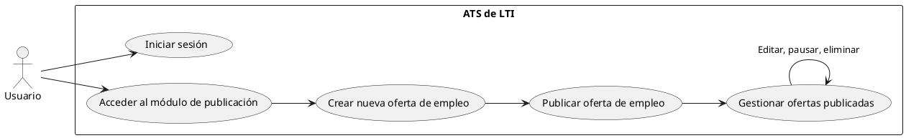
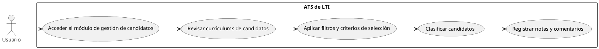
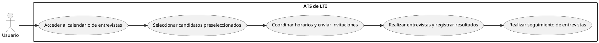
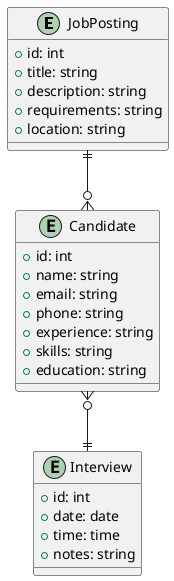
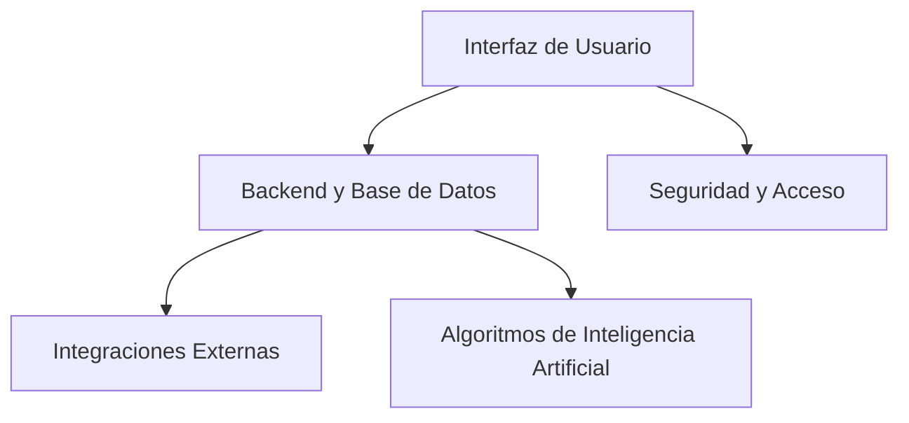
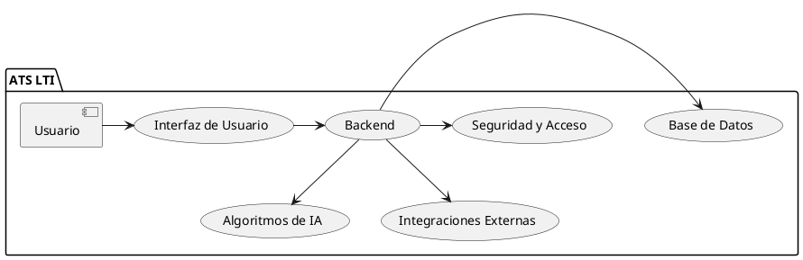
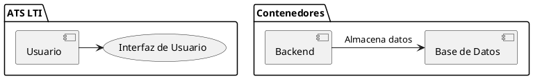
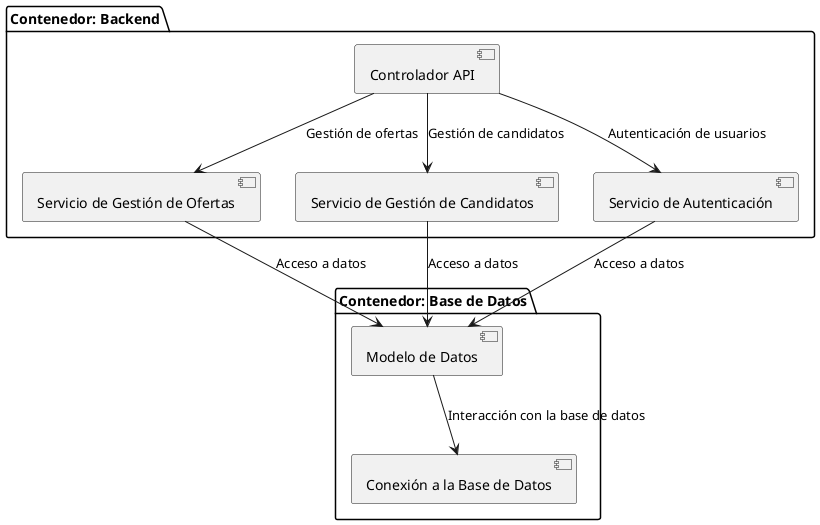
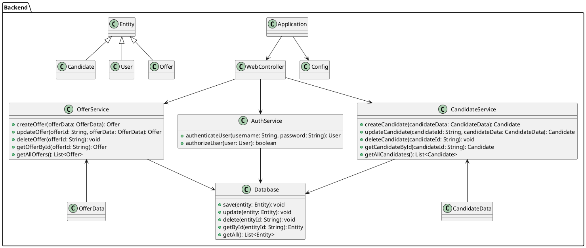

Documentación: https://chat.openai.com/share/837c8e2f-8db5-406f-ac3f-f4dd3ab4e7d3
Lean Canvas: https://chat.openai.com/c/83f70bb7-8dd9-4a45-b8b2-323a5ebb8446
Casos de uso: https://chat.openai.com/c/4ee96065-18d1-4334-9efb-5b9a38b674a6

* Prompt Documentación
User
Eres un experto en producto, con experiencia en Applicant-Tracking System. Tienes que diseñar la primera versión del sistema de ATS que será lanzado como producto de una start-up.

El entregable es un documento markdown con los artefactos generados en el proceso de diseño.
Inicia añadiendo una descripción breve del software LTI, valor añadido y ventajas competitivas. 

User
Ahora hay que añadir un diagrama Lean Canvas para entender el modelo de negocio. 
Para esto primero selecciona una herramienta de Diagrams as Code (DoC) con la que se pueda generar un Lean Canvas. Genera el código del Lean Canvas del modelo de negocio del ATS.

* Prompt Lean Canvas
User
Genera un template de Lean Canvas en xml para draw.io
ChatGPT
Claro, puedo ayudarte con eso. Aquí tienes un ejemplo de un template de Lean Canvas en XML para utilizar en Draw.io:

xml
Copy code
<?xml version="1.0" encoding="UTF-8"?>
<mxfile userAgent="Mozilla/5.0 (Windows NT 10.0; Win64; x64) AppleWebKit/537.36 (KHTML, like Gecko) Chrome/58.0.3029.110 Safari/537.36" version="13.7.2">
  <diagram id="KsK0L2idwev-dV4BAee5" name="Lean Canvas">
    <mxGraphModel dx="1090" dy="663" grid="1" gridSize="10" guides="1" tooltips="1" connect="1" arrows="1" fold="1" page="0" pageScale="1" pageWidth="827" pageHeight="1169">
      <root>
        <mxCell id="0" />
        <mxCell id="1" parent="0" />
        <mxCell id="2" value="" style="shape=partialRectangle;top=0;right=0;bottom=0;fillColor=#ffffff;" vertex="1" connectable="0" parent="1">
          <mxGeometry x="60" y="60" width="800" height="500" as="geometry" />
        </mxCell>
        <mxCell id="3" value="Problem" style="text;html=1;strokeColor=none;fillColor=#e84747;align=center;verticalAlign=middle;fontSize=20;fontFamily=Arial;rounded=0;" vertex="1" parent="2">
          <mxGeometry x="20" y="20" width="200" height="80" as="geometry" />
        </mxCell>
        <mxCell id="4" value="Solution" style="text;html=1;strokeColor=none;fillColor=#f6ab44;align=center;verticalAlign=middle;fontSize=20;fontFamily=Arial;rounded=0;" vertex="1" parent="2">
          <mxGeometry x="260" y="20" width="200" height="80" as="geometry" />
        </mxCell>
        <mxCell id="5" value="Key Metrics" style="text;html=1;strokeColor=none;fillColor=#f6e849;align=center;verticalAlign=middle;fontSize=20;fontFamily=Arial;rounded=0;" vertex="1" parent="2">
          <mxGeometry x="500" y="20" width="200" height="80" as="geometry" />
        </mxCell>
        <mxCell id="6" value="Unique Value Proposition" style="text;html=1;strokeColor=none;fillColor=#70e864;align=center;verticalAlign=middle;fontSize=20;fontFamily=Arial;rounded=0;" vertex="1" parent="2">
          <mxGeometry x="740" y="20" width="200" height="80" as="geometry" />
        </mxCell>
        <mxCell id="7" value="Unfair Advantage" style="text;html=1;strokeColor=none;fillColor=#56b1f7;align=center;verticalAlign=middle;fontSize=20;fontFamily=Arial;rounded=0;" vertex="1" parent="2">
          <mxGeometry x="20" y="140" width="200" height="80" as="geometry" />
        </mxCell>
        <mxCell id="8" value="Channels" style="text;html=1;strokeColor=none;fillColor=#ff73fa;align=center;verticalAlign=middle;fontSize=20;fontFamily=Arial;rounded=0;" vertex="1" parent="2">
          <mxGeometry x="260" y="140" width="200" height="80" as="geometry" />
        </mxCell>
        <mxCell id="9" value="Customer Segments" style="text;html=1;strokeColor=none;fillColor=#9bcaff;align=center;verticalAlign=middle;fontSize=20;fontFamily=Arial;rounded=0;" vertex="1" parent="2">
          <mxGeometry x="500" y="140" width="200" height="80" as="geometry" />
        </mxCell>
        <mxCell id="10" value="Cost Structure" style="text;html=1;strokeColor=none;fillColor=#b5b5b5;align=center;verticalAlign=middle;fontSize=20;fontFamily=Arial;rounded=0;" vertex="1" parent="2">
          <mxGeometry x="740" y="140" width="200" height="80" as="geometry" />
        </mxCell>
        <mxCell id="11" value="Revenue Streams" style="text;html=1;strokeColor=none;fillColor=#c09eff;align=center;verticalAlign=middle;fontSize=20;fontFamily=Arial;rounded=0;" vertex="1" parent="2">
          <mxGeometry x="260" y="260" width="200" height="80" as="geometry" />
        </mxCell>
        <mxCell id="12" value="Team" style="text;html=1;strokeColor=none;fillColor=#ff0000;align=center;verticalAlign=middle;fontSize=20;fontFamily=Arial;rounded=0;" vertex="1" parent="2">
          <mxGeometry x="500" y="260" width="200" height="80" as="geometry" />
        </mxCell>
        <mxCell id="13" value="&#xa;&#xa;" style="text;html=1;strokeColor=none;fillColor=#ffffff;" vertex="1" parent="2">
          <mxGeometry x="260" y="380" width="200" height="80" as="geometry" />
        </mxCell>
        <mxCell id="14" value="&#xa;&#xa;" style="text;html=1;strokeColor=none;fillColor=#ffffff;" vertex="1" parent="2">
          <mxGeometry x="20" y="380" width="200" height="80" as="geometry" />
        </mxCell>
        <mxCell id="15" value="&#xa;&#xa;" style="text;html=1;strokeColor=none;fillColor=#ffffff;" vertex="1" parent="2">
          <mxGeometry x="740" y="380" width="200" height="80" as="geometry" />
        </mxCell>
      </root>
    </mxGraphModel>
  </diagram>
</mxfile>
Para utilizar este código en Draw.io, sigue estos pasos:

Abre Draw.io en tu navegador.
Haz clic en "File" > "Import From" > "Device".
Selecciona la opción "Text" y pega el código XML proporcionado.
Haz clic en "Import".
Esto creará un diagrama Lean Canvas en tu espacio de trabajo de Draw.io. Puedes personalizar los valores y estilos de cada sección según sea necesario.

* Prompt Documentación
User
Definimos realizar el Lean Canvas en draw.io.
Para esto tienes un template de Lean Canvas en xml para draw.io, es el siguiente:
``` xml
<?xml version="1.0" encoding="UTF-8"?>
<mxfile userAgent="Mozilla/5.0 (Windows NT 10.0; Win64; x64) AppleWebKit/537.36 (KHTML, like Gecko) Chrome/58.0.3029.110 Safari/537.36" version="13.7.2">
  <diagram id="KsK0L2idwev-dV4BAee5" name="Lean Canvas">
    <mxGraphModel dx="1090" dy="663" grid="1" gridSize="10" guides="1" tooltips="1" connect="1" arrows="1" fold="1" page="0" pageScale="1" pageWidth="827" pageHeight="1169">
      <root>
        <mxCell id="0" />
        <mxCell id="1" parent="0" />
        <mxCell id="2" value="" style="shape=partialRectangle;top=0;right=0;bottom=0;fillColor=#ffffff;" vertex="1" connectable="0" parent="1">
          <mxGeometry x="60" y="60" width="800" height="500" as="geometry" />
        </mxCell>
        <mxCell id="3" value="Problem" style="text;html=1;strokeColor=none;fillColor=#e84747;align=center;verticalAlign=middle;fontSize=20;fontFamily=Arial;rounded=0;" vertex="1" parent="2">
          <mxGeometry x="20" y="20" width="200" height="80" as="geometry" />
        </mxCell>
        <mxCell id="4" value="Solution" style="text;html=1;strokeColor=none;fillColor=#f6ab44;align=center;verticalAlign=middle;fontSize=20;fontFamily=Arial;rounded=0;" vertex="1" parent="2">
          <mxGeometry x="260" y="20" width="200" height="80" as="geometry" />
        </mxCell>
        <mxCell id="5" value="Key Metrics" style="text;html=1;strokeColor=none;fillColor=#f6e849;align=center;verticalAlign=middle;fontSize=20;fontFamily=Arial;rounded=0;" vertex="1" parent="2">
          <mxGeometry x="500" y="20" width="200" height="80" as="geometry" />
        </mxCell>
        <mxCell id="6" value="Unique Value Proposition" style="text;html=1;strokeColor=none;fillColor=#70e864;align=center;verticalAlign=middle;fontSize=20;fontFamily=Arial;rounded=0;" vertex="1" parent="2">
          <mxGeometry x="740" y="20" width="200" height="80" as="geometry" />
        </mxCell>
        <mxCell id="7" value="Unfair Advantage" style="text;html=1;strokeColor=none;fillColor=#56b1f7;align=center;verticalAlign=middle;fontSize=20;fontFamily=Arial;rounded=0;" vertex="1" parent="2">
          <mxGeometry x="20" y="140" width="200" height="80" as="geometry" />
        </mxCell>
        <mxCell id="8" value="Channels" style="text;html=1;strokeColor=none;fillColor=#ff73fa;align=center;verticalAlign=middle;fontSize=20;fontFamily=Arial;rounded=0;" vertex="1" parent="2">
          <mxGeometry x="260" y="140" width="200" height="80" as="geometry" />
        </mxCell>
        <mxCell id="9" value="Customer Segments" style="text;html=1;strokeColor=none;fillColor=#9bcaff;align=center;verticalAlign=middle;fontSize=20;fontFamily=Arial;rounded=0;" vertex="1" parent="2">
          <mxGeometry x="500" y="140" width="200" height="80" as="geometry" />
        </mxCell>
        <mxCell id="10" value="Cost Structure" style="text;html=1;strokeColor=none;fillColor=#b5b5b5;align=center;verticalAlign=middle;fontSize=20;fontFamily=Arial;rounded=0;" vertex="1" parent="2">
          <mxGeometry x="740" y="140" width="200" height="80" as="geometry" />
        </mxCell>
        <mxCell id="11" value="Revenue Streams" style="text;html=1;strokeColor=none;fillColor=#c09eff;align=center;verticalAlign=middle;fontSize=20;fontFamily=Arial;rounded=0;" vertex="1" parent="2">
          <mxGeometry x="260" y="260" width="200" height="80" as="geometry" />
        </mxCell>
        <mxCell id="12" value="Team" style="text;html=1;strokeColor=none;fillColor=#ff0000;align=center;verticalAlign=middle;fontSize=20;fontFamily=Arial;rounded=0;" vertex="1" parent="2">
          <mxGeometry x="500" y="260" width="200" height="80" as="geometry" />
        </mxCell>
        <mxCell id="13" value="&#xa;&#xa;" style="text;html=1;strokeColor=none;fillColor=#ffffff;" vertex="1" parent="2">
          <mxGeometry x="260" y="380" width="200" height="80" as="geometry" />
        </mxCell>
        <mxCell id="14" value="&#xa;&#xa;" style="text;html=1;strokeColor=none;fillColor=#ffffff;" vertex="1" parent="2">
          <mxGeometry x="20" y="380" width="200" height="80" as="geometry" />
        </mxCell>
        <mxCell id="15" value="&#xa;&#xa;" style="text;html=1;strokeColor=none;fillColor=#ffffff;" vertex="1" parent="2">
          <mxGeometry x="740" y="380" width="200" height="80" as="geometry" />
        </mxCell>
      </root>
    </mxGraphModel>
  </diagram>
</mxfile>
```

Actualiza el template con la información de las secciones del Lean Canvas generadas. 

User
Bien, ahora realiza la Descripción de los 3 casos de uso principales del ATS.

User
Bien, ahora realiza el Modelo de datos que cubra entidades, atributos (nombre y tipo) y relaciones.
Esto generando un diagrama de plantuml.


* Prompt Casos de uso
User
Genera el diagrama de caso de uso en plantuml para el siguiente caso de uso:

Caso de Uso 1: Publicación y Gestión de Ofertas de Empleo
Descripción:
En este caso de uso, el usuario (reclutador o gerente de contratación) puede crear y publicar ofertas de empleo en el ATS de LTI. El proceso incluye la definición de detalles como el título del puesto, descripción del trabajo, requisitos y ubicación. Una vez publicada, el usuario puede gestionar las ofertas de empleo, incluyendo la edición, pausa o eliminación de las mismas según sea necesario.

Pasos:

Iniciar sesión en el ATS de LTI.
Acceder al módulo de publicación de ofertas de empleo.
Crear una nueva oferta de empleo proporcionando los detalles requeridos.
Publicar la oferta de empleo en los canales seleccionados.
Gestionar las ofertas publicadas, permitiendo la edición, pausa o eliminación de las mismas.
Resultado:
El usuario logra publicar y gestionar eficientemente las ofertas de empleo de la empresa, aumentando la visibilidad de las oportunidades laborales y atrayendo a candidatos cualificados.

User
Ahora, genera el diagrama de caso de uso en plantuml para el siguiente caso de uso:

Caso de Uso 2: Criba Curricular y Evaluación de Candidatos
Descripción:
En este caso de uso, el usuario utiliza el ATS de LTI para realizar la criba curricular y evaluar a los candidatos que han aplicado a las ofertas de empleo publicadas. El sistema automatiza la revisión de currículums y permite al usuario filtrar y clasificar a los candidatos según criterios predefinidos como experiencia, habilidades y nivel educativo. Además, el usuario puede registrar notas y comentarios sobre cada candidato para facilitar la toma de decisiones.

Pasos:

Acceder al módulo de gestión de candidatos en el ATS de LTI.
Revisar los currículums de los candidatos que han aplicado a las ofertas de empleo.
Aplicar filtros y criterios de selección para realizar la criba curricular.
Clasificar a los candidatos según su idoneidad para el puesto.
Registrar notas y comentarios sobre cada candidato para la evaluación.
Resultado:
El usuario logra identificar y evaluar de manera eficiente a los candidatos más adecuados para avanzar en el proceso de contratación, optimizando el tiempo y los recursos del equipo de reclutamiento.

User
Ahora, genera el diagrama de caso de uso en plantuml para el siguiente caso de uso:

Caso de Uso 3: Programación y Seguimiento de Entrevistas
Descripción:
En este caso de uso, el usuario utiliza el ATS de LTI para programar y realizar seguimiento de entrevistas con los candidatos preseleccionados. El sistema facilita la coordinación de horarios entre el usuario y los candidatos, envía recordatorios automáticos y permite registrar los resultados de las entrevistas. Además, el usuario puede gestionar múltiples entrevistas simultáneamente y mantener un historial organizado de todas las interacciones con los candidatos.

Pasos:

Acceder al calendario de entrevistas en el ATS de LTI.
Seleccionar candidatos preseleccionados para programar entrevistas.
Coordinar horarios y enviar invitaciones de entrevista a los candidatos.
Realizar las entrevistas y registrar los resultados y comentarios.
Realizar seguimiento de las entrevistas programadas y gestionar los próximos pasos.
Resultado:
El usuario logra gestionar eficientemente el proceso de programación y seguimiento de entrevistas, asegurando una comunicación fluida con los candidatos y avanzando en el proceso de contratación de manera efectiva.

Estos casos de uso representan las principales funcionalidades y beneficios del ATS de LTI, ayudando a los usuarios a mejorar sus procesos de reclutamiento y contratación de talento.

* Prompt Documentación
User
Como experto en el desarrollo de software tienes que realizar el Diagrama C4 que llegue en profundidad a uno de los componentes del sistema.
El componente del sistema elegido para hace la descripcion en C4 será el backend.
Realiza inicialmente la descripción del diagrama de contexto(context) en plantuml.

User
Bien, ahora realiza la descripción del diagrama de contenedores del backend y base de datos con el que se hará el diagrama c4.

User
Bien, ahora realiza la descripción del diagrama de componentes del backend y base de datos, los cuales son los componentes internos del contenedor, con el que se hará el diagrama c4.

User
Bien, como eres experto en desarrollo entiendes que en cuanto a código lo mejor es utilizar arquitectura hexagonal. Con esto en cuenta, ahora realiza la descripción del diagrama de código del backend, puede ser un diagrama de clases con el que se hará el diagrama c4.

Resultados de documentation as code:

```xml
<?xml version="1.0" encoding="UTF-8"?>
<mxfile host="app.diagrams.net" modified="2024-04-29T05:05:53.507Z" agent="Mozilla/5.0 (Macintosh; Intel Mac OS X 10_15_7) AppleWebKit/537.36 (KHTML, like Gecko) Chrome/124.0.0.0 Safari/537.36" version="24.3.1" etag="73NnlYZAqjXLWijjnk7b" type="device">
  <diagram id="KsK0L2idwev-dV4BAee5" name="Lean Canvas">
    <mxGraphModel dx="1593" dy="808" grid="1" gridSize="10" guides="1" tooltips="1" connect="1" arrows="1" fold="1" page="0" pageScale="1" pageWidth="827" pageHeight="1169" math="0" shadow="0">
      <root>
        <mxCell id="0" />
        <mxCell id="1" parent="0" />
        <mxCell id="2" value="" style="shape=partialRectangle;top=0;right=0;bottom=0;fillColor=#ffffff;" parent="1" vertex="1" connectable="0">
          <mxGeometry x="-90" y="130" width="940" height="500" as="geometry" />
        </mxCell>
        <mxCell id="3" value="Problem&lt;br&gt;&lt;span style=&quot;color: rgb(236, 236, 236); font-family: Söhne, ui-sans-serif, system-ui, -apple-system, &amp;quot;Segoe UI&amp;quot;, Roboto, Ubuntu, Cantarell, &amp;quot;Noto Sans&amp;quot;, sans-serif, &amp;quot;Helvetica Neue&amp;quot;, Arial, &amp;quot;Apple Color Emoji&amp;quot;, &amp;quot;Segoe UI Emoji&amp;quot;, &amp;quot;Segoe UI Symbol&amp;quot;, &amp;quot;Noto Color Emoji&amp;quot;; font-size: 16px; text-align: left; white-space: pre-wrap; background-color: rgb(33, 33, 33);&quot;&gt; la dificultad en la gestión de candidatos y la falta de eficiencia en el proceso de contratación&lt;/span&gt;" style="text;html=1;strokeColor=none;fillColor=#e84747;align=center;verticalAlign=middle;fontSize=20;fontFamily=Arial;rounded=0;spacing=0;" parent="2" vertex="1">
          <mxGeometry x="20" y="20" width="200" height="250" as="geometry" />
        </mxCell>
        <mxCell id="4" value="Solution&lt;br&gt;&lt;span style=&quot;color: rgb(236, 236, 236); font-family: Söhne, ui-sans-serif, system-ui, -apple-system, &amp;quot;Segoe UI&amp;quot;, Roboto, Ubuntu, Cantarell, &amp;quot;Noto Sans&amp;quot;, sans-serif, &amp;quot;Helvetica Neue&amp;quot;, Arial, &amp;quot;Apple Color Emoji&amp;quot;, &amp;quot;Segoe UI Emoji&amp;quot;, &amp;quot;Segoe UI Symbol&amp;quot;, &amp;quot;Noto Color Emoji&amp;quot;; font-size: 16px; text-align: left; white-space: pre-wrap; background-color: rgb(33, 33, 33);&quot;&gt;La automatización de tareas de reclutamiento y la generación de informes de análisis de datos.&lt;/span&gt;" style="text;html=1;strokeColor=none;fillColor=#f6ab44;align=center;verticalAlign=middle;fontSize=20;fontFamily=Arial;rounded=0;" parent="2" vertex="1">
          <mxGeometry x="260" y="20" width="200" height="220" as="geometry" />
        </mxCell>
        <mxCell id="5" value="Key Metrics&lt;br&gt;&lt;span style=&quot;color: rgb(236, 236, 236); font-family: Söhne, ui-sans-serif, system-ui, -apple-system, &amp;quot;Segoe UI&amp;quot;, Roboto, Ubuntu, Cantarell, &amp;quot;Noto Sans&amp;quot;, sans-serif, &amp;quot;Helvetica Neue&amp;quot;, Arial, &amp;quot;Apple Color Emoji&amp;quot;, &amp;quot;Segoe UI Emoji&amp;quot;, &amp;quot;Segoe UI Symbol&amp;quot;, &amp;quot;Noto Color Emoji&amp;quot;; font-size: 16px; text-align: left; white-space: pre-wrap; background-color: rgb(33, 33, 33);&quot;&gt;El número de clientes, la tasa de retención y la satisfacción del cliente.&lt;/span&gt;" style="text;html=1;strokeColor=none;fillColor=#f6e849;align=center;verticalAlign=middle;fontSize=20;fontFamily=Arial;rounded=0;" parent="2" vertex="1">
          <mxGeometry x="500" y="20" width="200" height="170" as="geometry" />
        </mxCell>
        <mxCell id="6" value="Unique Value Proposition&lt;br&gt;&lt;span style=&quot;color: rgb(236, 236, 236); font-family: Söhne, ui-sans-serif, system-ui, -apple-system, &amp;quot;Segoe UI&amp;quot;, Roboto, Ubuntu, Cantarell, &amp;quot;Noto Sans&amp;quot;, sans-serif, &amp;quot;Helvetica Neue&amp;quot;, Arial, &amp;quot;Apple Color Emoji&amp;quot;, &amp;quot;Segoe UI Emoji&amp;quot;, &amp;quot;Segoe UI Symbol&amp;quot;, &amp;quot;Noto Color Emoji&amp;quot;; font-size: 16px; text-align: left; white-space: pre-wrap; background-color: rgb(33, 33, 33);&quot;&gt;Interfaz intuitiva, automatización inteligente y herramientas de análisis avanzadas.&lt;/span&gt;&lt;span style=&quot;color: rgb(236, 236, 236); font-family: Söhne, ui-sans-serif, system-ui, -apple-system, &amp;quot;Segoe UI&amp;quot;, Roboto, Ubuntu, Cantarell, &amp;quot;Noto Sans&amp;quot;, sans-serif, &amp;quot;Helvetica Neue&amp;quot;, Arial, &amp;quot;Apple Color Emoji&amp;quot;, &amp;quot;Segoe UI Emoji&amp;quot;, &amp;quot;Segoe UI Symbol&amp;quot;, &amp;quot;Noto Color Emoji&amp;quot;; font-size: 16px; text-align: left; white-space: pre-wrap; background-color: rgb(33, 33, 33);&quot;&gt; &lt;/span&gt;" style="text;html=1;strokeColor=none;fillColor=#70e864;align=center;verticalAlign=middle;fontSize=20;fontFamily=Arial;rounded=0;" parent="2" vertex="1">
          <mxGeometry x="740" y="20" width="200" height="120" as="geometry" />
        </mxCell>
        <mxCell id="7" value="Unfair Advantage&lt;br&gt;&lt;span style=&quot;color: rgb(236, 236, 236); font-family: Söhne, ui-sans-serif, system-ui, -apple-system, &amp;quot;Segoe UI&amp;quot;, Roboto, Ubuntu, Cantarell, &amp;quot;Noto Sans&amp;quot;, sans-serif, &amp;quot;Helvetica Neue&amp;quot;, Arial, &amp;quot;Apple Color Emoji&amp;quot;, &amp;quot;Segoe UI Emoji&amp;quot;, &amp;quot;Segoe UI Symbol&amp;quot;, &amp;quot;Noto Color Emoji&amp;quot;; font-size: 16px; text-align: left; white-space: pre-wrap; background-color: rgb(33, 33, 33);&quot;&gt;Enfoque en la personalización y escalabilidad.&lt;/span&gt;" style="text;html=1;strokeColor=none;fillColor=#56b1f7;align=center;verticalAlign=middle;fontSize=20;fontFamily=Arial;rounded=0;" parent="2" vertex="1">
          <mxGeometry x="20" y="280" width="200" height="110" as="geometry" />
        </mxCell>
        <mxCell id="8" value="Channels&lt;br&gt;&lt;span style=&quot;color: rgb(236, 236, 236); font-family: Söhne, ui-sans-serif, system-ui, -apple-system, &amp;quot;Segoe UI&amp;quot;, Roboto, Ubuntu, Cantarell, &amp;quot;Noto Sans&amp;quot;, sans-serif, &amp;quot;Helvetica Neue&amp;quot;, Arial, &amp;quot;Apple Color Emoji&amp;quot;, &amp;quot;Segoe UI Emoji&amp;quot;, &amp;quot;Segoe UI Symbol&amp;quot;, &amp;quot;Noto Color Emoji&amp;quot;; font-size: 16px; text-align: left; white-space: pre-wrap; background-color: rgb(33, 33, 33);&quot;&gt;M&lt;/span&gt;&lt;span style=&quot;background-color: rgb(33, 33, 33); color: rgb(236, 236, 236); font-family: Söhne, ui-sans-serif, system-ui, -apple-system, &amp;quot;Segoe UI&amp;quot;, Roboto, Ubuntu, Cantarell, &amp;quot;Noto Sans&amp;quot;, sans-serif, &amp;quot;Helvetica Neue&amp;quot;, Arial, &amp;quot;Apple Color Emoji&amp;quot;, &amp;quot;Segoe UI Emoji&amp;quot;, &amp;quot;Segoe UI Symbol&amp;quot;, &amp;quot;Noto Color Emoji&amp;quot;; font-size: 16px; text-align: left; white-space: pre-wrap;&quot;&gt;arketing digital, asociaciones estratégicas y ventas directas.&lt;/span&gt;" style="text;html=1;strokeColor=none;fillColor=#ff73fa;align=center;verticalAlign=middle;fontSize=20;fontFamily=Arial;rounded=0;" parent="2" vertex="1">
          <mxGeometry x="260" y="250" width="200" height="170" as="geometry" />
        </mxCell>
        <mxCell id="9" value="Customer Segments&lt;br&gt;&lt;span style=&quot;color: rgb(236, 236, 236); font-family: Söhne, ui-sans-serif, system-ui, -apple-system, &amp;quot;Segoe UI&amp;quot;, Roboto, Ubuntu, Cantarell, &amp;quot;Noto Sans&amp;quot;, sans-serif, &amp;quot;Helvetica Neue&amp;quot;, Arial, &amp;quot;Apple Color Emoji&amp;quot;, &amp;quot;Segoe UI Emoji&amp;quot;, &amp;quot;Segoe UI Symbol&amp;quot;, &amp;quot;Noto Color Emoji&amp;quot;; font-size: 16px; text-align: left; white-space: pre-wrap; background-color: rgb(33, 33, 33);&quot;&gt;E&lt;/span&gt;&lt;span style=&quot;background-color: rgb(33, 33, 33); color: rgb(236, 236, 236); font-family: Söhne, ui-sans-serif, system-ui, -apple-system, &amp;quot;Segoe UI&amp;quot;, Roboto, Ubuntu, Cantarell, &amp;quot;Noto Sans&amp;quot;, sans-serif, &amp;quot;Helvetica Neue&amp;quot;, Arial, &amp;quot;Apple Color Emoji&amp;quot;, &amp;quot;Segoe UI Emoji&amp;quot;, &amp;quot;Segoe UI Symbol&amp;quot;, &amp;quot;Noto Color Emoji&amp;quot;; font-size: 16px; text-align: left; white-space: pre-wrap;&quot;&gt;mpresas de diferentes tamaños y sectores.&lt;/span&gt;" style="text;html=1;strokeColor=none;fillColor=#9bcaff;align=center;verticalAlign=middle;fontSize=20;fontFamily=Arial;rounded=0;" parent="2" vertex="1">
          <mxGeometry x="500" y="200" width="200" height="80" as="geometry" />
        </mxCell>
        <mxCell id="10" value="Cost Structure&lt;br&gt;&lt;span style=&quot;color: rgb(236, 236, 236); font-family: Söhne, ui-sans-serif, system-ui, -apple-system, &amp;quot;Segoe UI&amp;quot;, Roboto, Ubuntu, Cantarell, &amp;quot;Noto Sans&amp;quot;, sans-serif, &amp;quot;Helvetica Neue&amp;quot;, Arial, &amp;quot;Apple Color Emoji&amp;quot;, &amp;quot;Segoe UI Emoji&amp;quot;, &amp;quot;Segoe UI Symbol&amp;quot;, &amp;quot;Noto Color Emoji&amp;quot;; font-size: 16px; text-align: left; white-space: pre-wrap; background-color: rgb(33, 33, 33);&quot;&gt;Desarrollo de software, soporte técnico y marketing.&lt;/span&gt;" style="text;html=1;strokeColor=none;fillColor=#b5b5b5;align=center;verticalAlign=middle;fontSize=20;fontFamily=Arial;rounded=0;" parent="2" vertex="1">
          <mxGeometry x="740" y="150" width="200" height="130" as="geometry" />
        </mxCell>
        <mxCell id="11" value="Revenue Streams&lt;br&gt;&lt;span style=&quot;color: rgb(236, 236, 236); font-family: Söhne, ui-sans-serif, system-ui, -apple-system, &amp;quot;Segoe UI&amp;quot;, Roboto, Ubuntu, Cantarell, &amp;quot;Noto Sans&amp;quot;, sans-serif, &amp;quot;Helvetica Neue&amp;quot;, Arial, &amp;quot;Apple Color Emoji&amp;quot;, &amp;quot;Segoe UI Emoji&amp;quot;, &amp;quot;Segoe UI Symbol&amp;quot;, &amp;quot;Noto Color Emoji&amp;quot;; font-size: 16px; text-align: left; white-space: pre-wrap; background-color: rgb(33, 33, 33);&quot;&gt;Suscripciones mensuales o anuales, tarifas por uso y servicios adicionales.&lt;/span&gt;" style="text;html=1;strokeColor=none;fillColor=#c09eff;align=center;verticalAlign=middle;fontSize=20;fontFamily=Arial;rounded=0;" parent="2" vertex="1">
          <mxGeometry x="260" y="430" width="200" height="130" as="geometry" />
        </mxCell>
        <mxCell id="12" value="Team" style="text;html=1;strokeColor=none;fillColor=#ff0000;align=center;verticalAlign=middle;fontSize=20;fontFamily=Arial;rounded=0;" parent="2" vertex="1">
          <mxGeometry x="500" y="290" width="200" height="80" as="geometry" />
        </mxCell>
        <mxCell id="15" value="&#xa;&#xa;" style="text;html=1;strokeColor=none;fillColor=#ffffff;" parent="2" vertex="1">
          <mxGeometry x="740" y="380" width="200" height="80" as="geometry" />
        </mxCell>
      </root>
    </mxGraphModel>
  </diagram>
</mxfile>
```



















