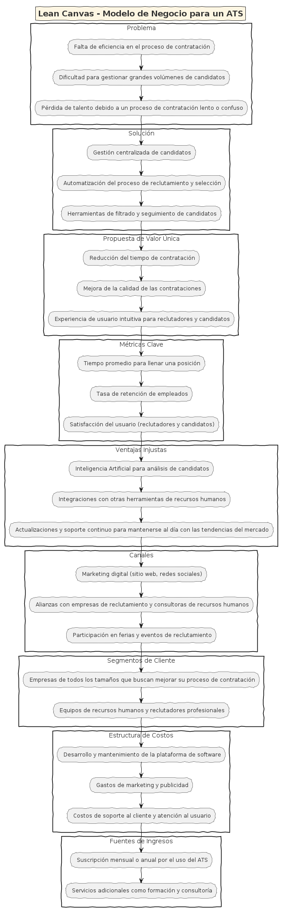
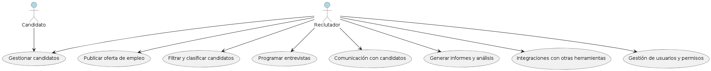
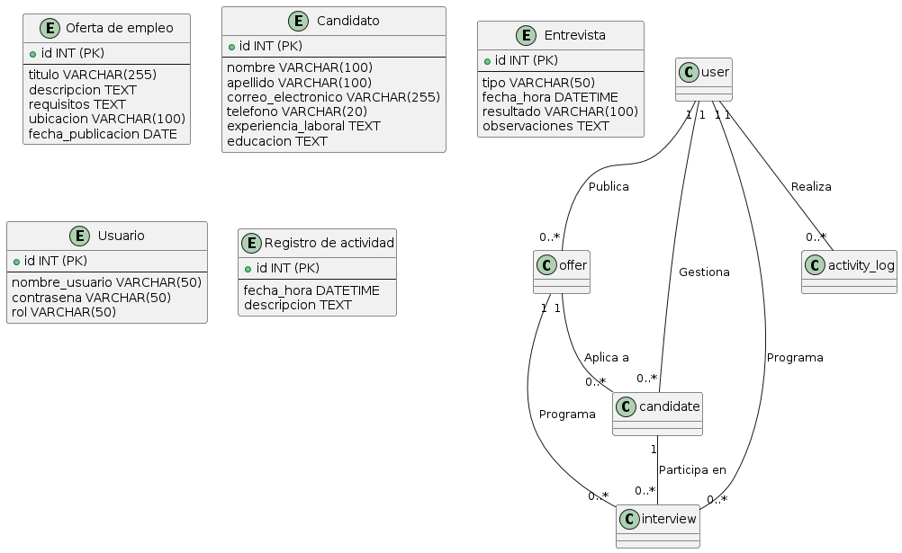
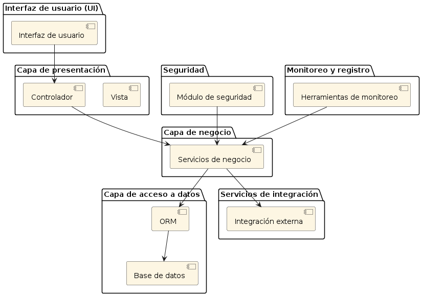
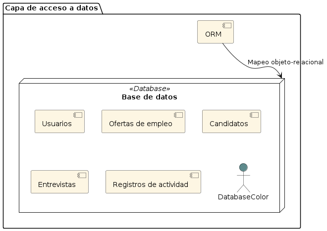

Un ATS (Applicant Tracking System) es un software utilizado por las empresas para gestionar y automatizar el proceso de reclutamiento y selección de personal. Estos sistemas ayudan a los reclutadores y gerentes de contratación a organizar, rastrear y administrar candidatos durante todo el ciclo de contratación, desde la publicación de ofertas de empleo hasta la incorporación de nuevos empleados.

Los ATS permiten a los reclutadores:

Publicar ofertas de trabajo en múltiples plataformas y sitios de empleo.
Recibir y almacenar currículums y otra documentación de los candidatos.
Filtrar automáticamente candidatos según criterios específicos, como habilidades, experiencia o ubicación.
Gestionar la comunicación con los candidatos a través de correos electrónicos automáticos y programados.
Programar entrevistas y realizar un seguimiento del proceso de contratación.
En resumen, los ATS ayudan a agilizar el proceso de contratación y a gestionar grandes volúmenes de candidatos de manera eficiente.

Funcionalidades Básicas de un ATS

Gestión de candidatos: Capacidades para recibir, almacenar y organizar currículums y otra documentación relacionada con los candidatos, así como para buscar candidatos por palabras clave y categorizarlos según el estado del proceso de contratación.
Publicación de empleos: Herramientas para crear y publicar ofertas de empleo en múltiples plataformas y sitios de trabajo con facilidad, incluyendo la capacidad de compartir automáticamente en redes sociales y portales de empleo relevantes.
Filtrado y seguimiento de candidatos: Funciones que permiten filtrar automáticamente candidatos según criterios predefinidos y hacer un seguimiento del progreso de cada candidato en el proceso de contratación.
Colaboración y comunicación: Capacidades para facilitar la comunicación entre reclutadores y otros miembros del equipo de contratación, así como para programar entrevistas y enviar recordatorios automáticos.
Análisis y reporting: Posibilidad de generar informes y análisis sobre el rendimiento del proceso de contratación, incluyendo métricas como tiempo promedio para llenar una posición y fuentes de reclutamiento más efectivas.
Integraciones: Capacidad para integrarse con otras herramientas y sistemas utilizados por la empresa, como sistemas de gestión de recursos humanos (HRMS) y plataformas de evaluación de habilidades.
Beneficios de un ATS para el Cliente

Eficiencia: Automatiza tareas repetitivas y tediosas, permitiendo a los reclutadores centrarse en actividades más estratégicas.
Mejor experiencia del candidato: Facilita una comunicación más rápida y transparente con los candidatos, mejorando su percepción de la empresa.
Mejor toma de decisiones: Proporciona datos y análisis sobre el proceso de contratación, permitiendo decisiones más informadas.
Reducción de costos: Simplifica y reduce los costos asociados con el proceso de contratación.
Alternativas a un ATS

Gestión manual: Uso de hojas de cálculo y correos electrónicos para rastrear candidatos, adecuado para empresas pequeñas con bajos volúmenes de contratación.
Plataformas de reclutamiento independientes: Ofrecen funcionalidades similares a un ATS, pero pueden estar enfocadas en áreas específicas del reclutamiento.
Customer Journey de un Usuario de ATS

Identificación de necesidades
Investigación de opciones
Selección y compra
Implementación
Uso diario
Evaluación continua
Conclusión

Los Applicant Tracking Systems (ATS) son herramientas esenciales para las empresas que desean gestionar de manera eficiente su proceso de contratación, mejorando la experiencia tanto para los reclutadores como para los candidatos y permitiendo una toma de decisiones más informada.

Casos de Uso

1. Publicar oferta de empleo: Permite a los reclutadores crear y publicar nuevas ofertas de trabajo en la plataforma del ATS. Incluye la capacidad de agregar detalles como el título del trabajo, descripción, requisitos y ubicación.
2. Gestionar candidatos: Permite a los reclutadores ver, buscar, editar y gestionar la información de los candidatos que se han postulado para las ofertas de empleo. Esto incluye la capacidad de ver currículums, notas de entrevistas, calificaciones y estado del candidato en el proceso de contratación.
3. Filtrar y clasificar candidatos: Permite a los reclutadores filtrar automáticamente los candidatos según criterios específicos, como habilidades, experiencia, ubicación, etc. También pueden clasificarlos en diferentes etapas del proceso de contratación para facilitar su seguimiento.
4. Programar entrevistas: Permite a los reclutadores programar y gestionar entrevistas con los candidatos directamente desde el sistema ATS. Pueden enviar invitaciones, gestionar calendarios y recibir confirmaciones de los candidatos.
5. Comunicación con candidatos: Facilita la comunicación con los candidatos a lo largo del proceso de contratación. Esto incluye el envío de correos electrónicos automáticos para notificar el estado de la aplicación, solicitar información adicional o programar entrevistas.
6. Generar informes y análisis: Permite a los administradores y gerentes de contratación generar informes y análisis sobre el rendimiento del proceso de contratación. Esto incluye métricas como el tiempo promedio para llenar una posición, fuentes de reclutamiento más efectivas, etc.
7. Integraciones con otras herramientas: Permite integrar el sistema ATS con otras herramientas utilizadas por la empresa, como sistemas de gestión de recursos humanos (HRMS), plataformas de evaluación de habilidades, calendarios de reuniones, etc.
8. Gestión de usuarios y permisos: Permite a los administradores del sistema gestionar usuarios y asignar diferentes niveles de acceso y permisos según el rol del usuario. Esto garantiza la seguridad y la privacidad de los datos del proceso de contratación.

Estos casos de uso proporcionan una funcionalidad básica pero fundamental para un sistema de Applicant Tracking System (ATS). Dependiendo de las necesidades específicas de la empresa, pueden agregarse más casos de uso o funcionalidades adicionales.

En un sistema de Applicant Tracking System (ATS), hay varias entidades de modelo de datos esenciales que son fundamentales para gestionar el proceso de reclutamiento y selección de personal. Aquí tienes algunas de las entidades principales y sus campos esenciales, así como cómo se relacionan entre sí:

Oferta de empleo:
Campos esenciales:
Título del trabajo
Descripción del trabajo
Requisitos
Ubicación
Fecha de publicación
Relaciones:
Tiene una relación de uno a muchos con la entidad de candidatos, ya que una oferta de empleo puede tener múltiples candidatos aplicando.
Puede tener una relación de uno a muchos con la entidad de entrevistas, ya que puede haber múltiples entrevistas programadas para una oferta de empleo.
Candidato:
Campos esenciales:
Nombre
Apellido
Dirección de correo electrónico
Teléfono
Experiencia laboral
Educación
Relaciones:
Tiene una relación de muchos a uno con la entidad de oferta de empleo, ya que un candidato puede aplicar a múltiples ofertas de empleo.
Puede tener una relación de uno a muchos con la entidad de entrevistas, ya que un candidato puede participar en múltiples entrevistas.
Entrevista:
Campos esenciales:
Tipo de entrevista (por ejemplo, telefónica, presencial, virtual)
Fecha y hora
Resultado de la entrevista
Observaciones
Relaciones:
Pertenece a una oferta de empleo específica y está relacionada con un candidato particular.
Usuario (reclutador):
Campos esenciales:
Nombre de usuario
Contraseña
Rol (por ejemplo, reclutador, administrador)
Relaciones:
Tiene una relación de uno a muchos con las entidades de oferta de empleo, candidatos y entrevistas, ya que un reclutador puede estar involucrado en múltiples procesos de reclutamiento.
Registro de actividad:
Campos esenciales:
Fecha y hora
Descripción de la actividad realizada (por ejemplo, publicación de oferta de empleo, programación de entrevista)
Relaciones:
Puede estar relacionado con otras entidades para registrar actividades específicas realizadas por los usuarios, como la publicación de ofertas de empleo o la actualización de información de candidatos.
Estas son algunas de las entidades esenciales en un sistema de ATS y cómo se relacionan entre sí. Las relaciones entre estas entidades son clave para garantizar un seguimiento efectivo del proceso de reclutamiento y selección de personal. Dependiendo de los requisitos específicos del sistema y del proceso de reclutamiento de la empresa, pueden agregarse más entidades y campos adicionales.

Arquitectura

Para diseñar la mejor arquitectura para un sistema de Applicant Tracking System (ATS), es importante considerar la escalabilidad, la modularidad, la seguridad y el rendimiento. Aquí te propongo una arquitectura a alto nivel que cumple con estos requisitos:

Interfaz de usuario (UI):
Componente encargado de proporcionar la interfaz gráfica para que los usuarios interactúen con el sistema ATS.
Incluye páginas web o aplicaciones móviles para reclutadores y candidatos.
Utiliza tecnologías modernas de frontend como React.js o Angular para una experiencia de usuario fluida.
Capa de presentación:
Componente que gestiona la lógica de presentación y la comunicación con la capa de negocio.
Se encarga de procesar las solicitudes del usuario y mostrar la información de manera adecuada en la interfaz de usuario.
Puede implementarse utilizando un patrón MVC (Modelo-Vista-Controlador) o un patrón similar.
Capa de negocio:
Componente que contiene la lógica empresarial del sistema ATS.
Gestiona las reglas de negocio, la validación de datos y la lógica de flujo de trabajo.
Se asegura de que las operaciones de reclutamiento se realicen de manera eficiente y coherente.
Puede implementarse utilizando un patrón de diseño como el patrón de diseño de servicios o el patrón de diseño de repositorio.
Capa de acceso a datos:
Componente encargado de interactuar con la base de datos y gestionar la persistencia de los datos.
Utiliza un ORM (Object-Relational Mapping) para mapear objetos de dominio a estructuras de datos en la base de datos.
Proporciona una capa de abstracción sobre la base de datos subyacente para facilitar el mantenimiento y la escalabilidad.
Servicios de integración:
Componente que facilita la integración con otros sistemas y servicios externos.
Permite la comunicación con plataformas de terceros, como portales de empleo o redes sociales, para publicar ofertas de trabajo y obtener información sobre candidatos.
Utiliza APIs y protocolos estándar para la integración, como RESTful APIs o webhooks.
Seguridad:
Componente transversal que se encarga de garantizar la seguridad del sistema ATS.
Incluye la autenticación de usuarios, la autorización de acceso a recursos y la gestión de sesiones.
Utiliza prácticas de seguridad como el cifrado de datos, la protección contra ataques de inyección y la gestión de tokens de acceso.
Monitoreo y registro:
Componente encargado de recopilar métricas de rendimiento y registrar eventos del sistema ATS.
Proporciona visibilidad sobre el estado y la salud del sistema.
Utiliza herramientas de monitoreo y registro como Prometheus, Grafana y ELK Stack.

C4 es una forma de modelar la arquitectura de software a diferentes niveles de abstracción, desde un nivel muy alto hasta un nivel muy detallado. Proporciona un conjunto de herramientas y convenciones para describir la arquitectura de manera clara y concisa, lo que facilita la comunicación entre los miembros del equipo y otras partes interesadas.

El término "C4" proviene de "Context, Containers, Components, and Code" (Contexto, Contenedores, Componentes y Código), que son los cuatro niveles de abstracción en los que se centra este enfoque de modelado.

Contexto (Context): Este es el nivel más alto de abstracción y se centra en capturar la visión general del sistema y su entorno. Se utiliza para describir las relaciones y dependencias entre los sistemas y los actores externos.
Contenedores (Containers): En este nivel, se describen los contenedores de software que componen el sistema, como aplicaciones, servicios o bases de datos. Se identifican los límites físicos y lógicos del sistema, así como las interacciones entre los contenedores.
Componentes (Components): En este nivel, se detallan los componentes internos de cada contenedor, como clases, módulos o servicios. Se describen las responsabilidades y las interacciones entre los componentes.
Código (Code): Este es el nivel más detallado, donde se proporciona una vista del código fuente de los componentes del sistema. Se utiliza para analizar la implementación técnica y realizar revisiones de código.
El diagrama C4 se compone de una serie de diagramas que representan cada uno de estos niveles de abstracción, comenzando desde el nivel más alto y descendiendo hasta el nivel más bajo. Cada nivel proporciona una perspectiva diferente de la arquitectura del sistema y ayuda a entender cómo se estructura y funciona el software en su conjunto.

