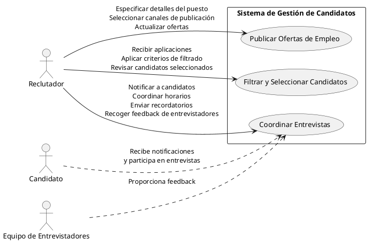
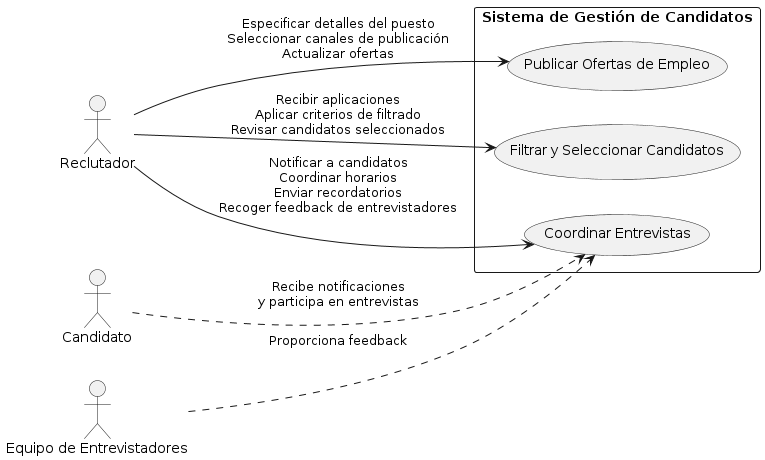
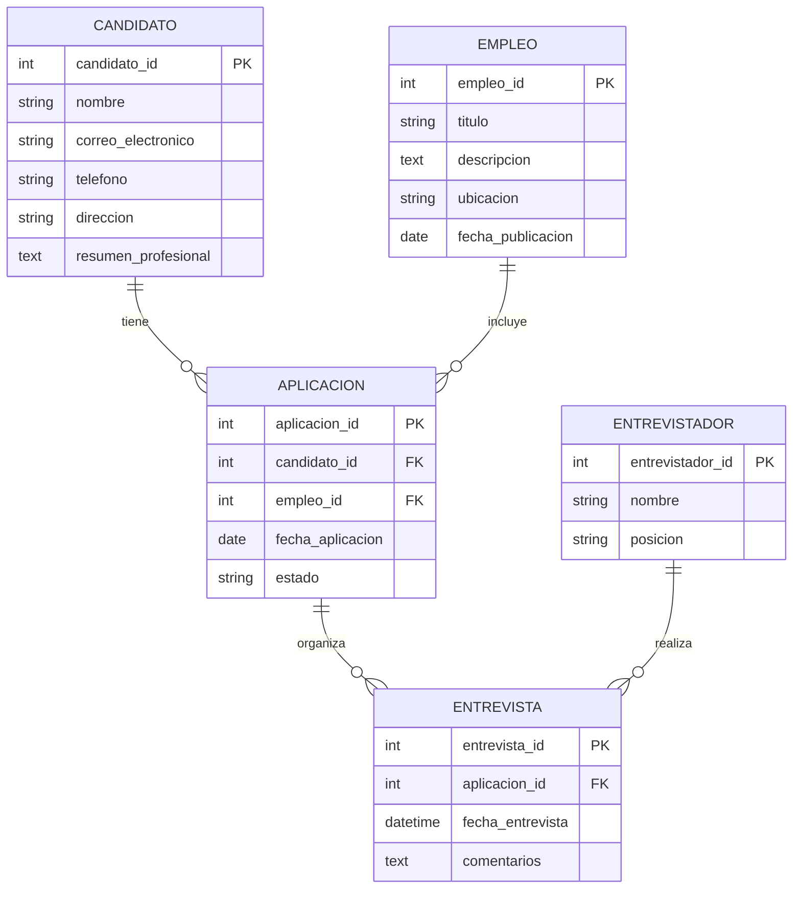
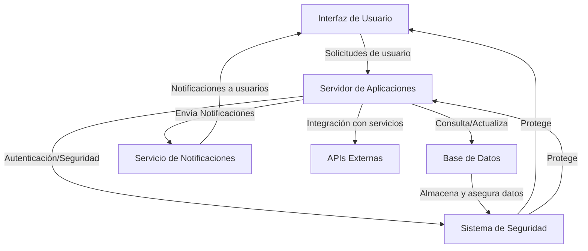
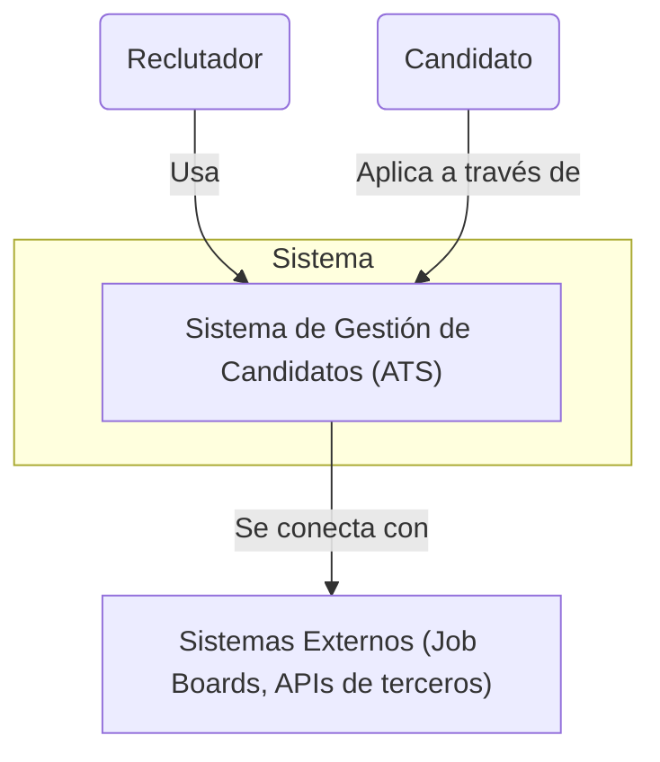
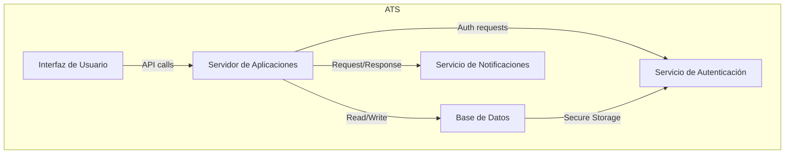
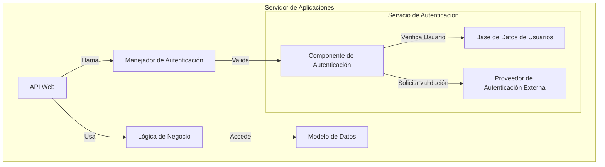

# Documentación del Sistema de Gestión de Candidatos (ATS)

## Introducción

Este documento proporciona una visión detallada del diseño y arquitectura de un sistema de gestión de candidatos (ATS). Se cubren los principales casos de uso, el diseño del modelo de datos, y la arquitectura del sistema, ofreciendo así una comprensión integral de la implementación y operación del sistema.

### Descripción Breve del Sistema de Gestión de Candidatos (ATS)

Un sistema de gestión de candidatos (ATS) es un software diseñado para optimizar el proceso de reclutamiento. Facilita la organización y seguimiento de los candidatos desde el inicio hasta el final del proceso de selección. Utilizado principalmente por equipos de recursos humanos, este sistema automatiza la recolección y análisis de currículos, mejora la comunicación con los candidatos, y ayuda a gestionar entrevistas y evaluaciones, todo en una plataforma centralizada.

## Valor Añadido y Ventajas Competitivas

### Valor Añadido:

- Eficiencia Operativa: Automatización de tareas repetitivas, permitiendo que los reclutadores se enfoquen en decisiones más estratégicas.
- Mejora en la Calidad de las Contrataciones: Filtrado avanzado para seleccionar candidatos que mejor se adapten a las necesidades de la empresa.
- Análisis de Datos: Ofrece insights a través de datos que ayudan a optimizar continuamente el proceso de reclutamiento.

### Ventajas Competitivas:

Integración con Plataformas de Redes Sociales y Job Boards: Maximiza la visibilidad de las ofertas de empleo y amplía el alcance a candidatos potenciales.
Experiencia del Usuario Mejorada: Interfaces intuitivas y accesibles que mejoran tanto la experiencia del reclutador como la del candidato.
Cumplimiento Normativo: Asegura que el proceso de reclutamiento cumpla con regulaciones legales y de privacidad, reduciendo el riesgo para la empresa.
Funciones Principales
Publicación de Ofertas de Empleo: Facilidad para publicar ofertas en múltiples plataformas desde un solo lugar.
Recolección y Filtrado de Candidaturas: Automatización del proceso de recepción y filtrado de candidaturas basado en criterios preestablecidos.
Gestión de Candidatos: Base de datos centralizada que permite el seguimiento y gestión eficiente de los candidatos a lo largo de todo el proceso de selección.
Comunicación Automatizada: Envío de correos electrónicos automáticos para actualizaciones de estado y coordinación de entrevistas.
Reportes y Análisis de Datos: Herramientas de reporte que permiten analizar la efectividad de las campañas de reclutamiento y tomar decisiones basadas en datos.

## Diagrama Lean Canvas

El diagrama Lean Canvas es una herramienta para esquematizar modelos de negocio de manera rápida y eficiente, centrando en problemas, soluciones, métricas clave, y ventajas competitivas. Aquí tienes un ejemplo de cómo podría estructurarse el Lean Canvas para un ATS:

- **Problema**: Dificultades en gestionar y filtrar un alto volumen de candidaturas; comunicación ineficaz con candidatos; cumplimiento de regulaciones de privacidad y empleo.
- **Solución**: Automatización de la recolección y filtrado de currículos, comunicación centralizada, y garantía de cumplimiento normativo.
- **Propuesta de Valor Única**: "Optimiza tu proceso de reclutamiento con automatización avanzada y cumple con las normativas legales sin esfuerzo".
- **Ventaja Competitiva**: Integración superior con plataformas externas y una interfaz de usuario excepcionalmente intuitiva.
- **Segmento de Clientes**: Empresas medianas a grandes que requieren gestión eficiente de un gran volumen de candidatos.
- **Canales**: Sitio web del producto, redes sociales, ferias de recursos humanos, demostraciones en línea.
- **Estructura de Costos**: Desarrollo y mantenimiento del software, atención al cliente, marketing y ventas.
- **Fuentes de Ingresos**: Suscripciones mensuales o anuales, pagos por uso, servicios adicionales como soporte y capacitación personalizada.
- **Métricas Clave**: Número de usuarios activos, satisfacción del cliente, reducción del tiempo medio de contratación, tasa de conversión de candidatos.
- **Problemas No Resueltos**: Integración con sistemas internos existentes en algunas empresas, adaptación a mercados globales con diferentes normativas.

Este modelo Lean Canvas te proporciona una visión clara del posicionamiento del sistema de gestión de candidatos en el mercado, ayudándote a entender cómo se alinea con las necesidades de los clientes y qué ofrece en términos de ventajas competitivas y valor añadido.

## Casos de Uso

### Caso de Uso 1: Publicación y Gestión de Ofertas de Empleo

- **Actores**: Reclutadores.
- **Descripción**: Los reclutadores crean y gestionan ofertas de empleo, las publican en diversos canales y actualizan según sea necesario.

### Objetivos:

- Centralizar la creación y gestión de ofertas de empleo.
- Asegurar que las ofertas sean visibles en los canales adecuados para maximizar el alcance.

### Caso de Uso 2: Filtrado y Selección de Candidatos

- **Actores**: Reclutadores.
- **Descripción**: Los reclutadores utilizan el sistema para filtrar y seleccionar candidatos basándose en criterios específicos predefinidos.

### Objetivos:

- Minimizar el tiempo y esfuerzo requerido para filtrar aplicaciones manualmente.
- Mejorar la calidad de las contrataciones al identificar los candidatos más prometedores de manera eficiente.

### Caso de Uso 3: Comunicación y Coordinación de Entrevistas

- **Actores**: Reclutadores, Candidatos, Equipo de Entrevistadores.
- **Descripción**: Coordinación de entrevistas, envío de notificaciones y recogida de feedback sobre los candidatos.

### Objetivos:

- Facilitar una comunicación efectiva y puntual con los candidatos.
- Centralizar la recopilación de feedback para apoyar decisiones informadas en las etapas finales del proceso de selección.

### Diagrama de Casos de Uso

## Modelo de Datos

El modelo de datos se compone de las siguientes entidades principales:

### Entidades y Atributos

1. **Candidato**

   - `candidato_id`: INT
   - `nombre`: VARCHAR
   - `correo_electronico`: VARCHAR
   - `telefono`: VARCHAR
   - `direccion`: VARCHAR
   - `resumen_profesional`: TEXT

2. **Empleo**

   - `empleo_id`: INT
   - `titulo`: VARCHAR
   - `descripcion`: TEXT
   - `ubicacion`: VARCHAR
   - `fecha_publicacion`: DATE

3. **Aplicacion**

   - `aplicacion_id`: INT
   - `candidato_id`: INT
   - `empleo_id`: INT
   - `fecha_aplicacion`: DATE
   - `estado`: VARCHAR

4. **Entrevista**

   - `entrevista_id`: INT
   - `aplicacion_id`: INT
   - `fecha_entrevista`: DATETIME
   - `comentarios`: TEXT

5. **Entrevistador**
   - `entrevistador_id`: INT
   - `nombre`: VARCHAR
   - `posicion`: VARCHAR

### Diagrama del Modelo de Datos

### Relaciones

- Candidato a Aplicacion: Un candidato puede tener múltiples aplicaciones, pero cada aplicación pertenece a un único candidato.
- Empleo a Aplicacion: Un empleo puede tener múltiples aplicaciones, pero cada aplicación pertenece a un único empleo.
- Aplicacion a Entrevista: Una aplicación puede tener múltiples entrevistas asociadas.
- Entrevistador a Entrevista: Un entrevistador puede realizar múltiples entrevistas.

## Diseño del Sistema a Alto Nivel

### Componentes del Sistema

- Interfaz de Usuario (UI):
  - Descripción: Proporciona la interfaz gráfica para que los reclutadores y candidatos interactúen con el sistema.
  - Tecnologías: HTML5, CSS3, JavaScript, frameworks de frontend como React o Angular.
- Servidor de Aplicaciones:
  - Descripción: Gestiona la lógica de negocio y procesa las solicitudes de la interfaz de usuario, ejecutando operaciones como la creación de ofertas de empleo, gestión de candidaturas, y coordinación de entrevistas.
  - Tecnologías: Servidores de aplicaciones como Node.js, Python con Django o Java con Spring Boot.
- Base de Datos:
  - Descripción: Almacena todos los datos relevantes, incluyendo información de candidatos, ofertas de empleo, aplicaciones y entrevistas.
  - Tecnologías: Bases de datos relacionales como PostgreSQL, MySQL, o sistemas de bases de datos NoSQL como MongoDB.
- Servicio de Notificaciones:
  - Descripción: Responsable de enviar notificaciones automáticas a los candidatos y reclutadores, como recordatorios de entrevistas o actualizaciones de estado de las aplicaciones.
  - Tecnologías: Servicios de correo electrónico y notificaciones como SendGrid, MailChimp o servicios de mensajería instantánea integrados.
- APIs Externas:
  - Descripción: Integración con plataformas de terceros para publicación de empleos, verificación de antecedentes, y otros servicios relacionados con el reclutamiento.
  - Tecnologías: REST APIs, SOAP APIs dependiendo de los servicios externos utilizados.
- Sistema de Seguridad:
  - Descripción: Asegura que todas las interacciones y datos sean seguros, gestionando la autenticación, autorización y cifrado de datos.
  - Tecnologías: OAuth, JWT para manejo de sesiones y autenticación, HTTPS para comunicaciones seguras.

### Arquitectura del Sistema

## Diagrama de Contenedores C4

- Nivel 1: Diagrama de Contexto

- Nivel 2: Diagrama de Contenedores

- Nivel 3: Diagrama de Componentes (foco en el Servicio de Autenticación)

