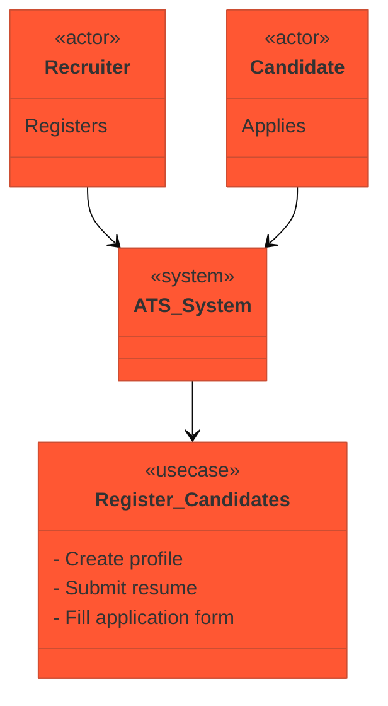
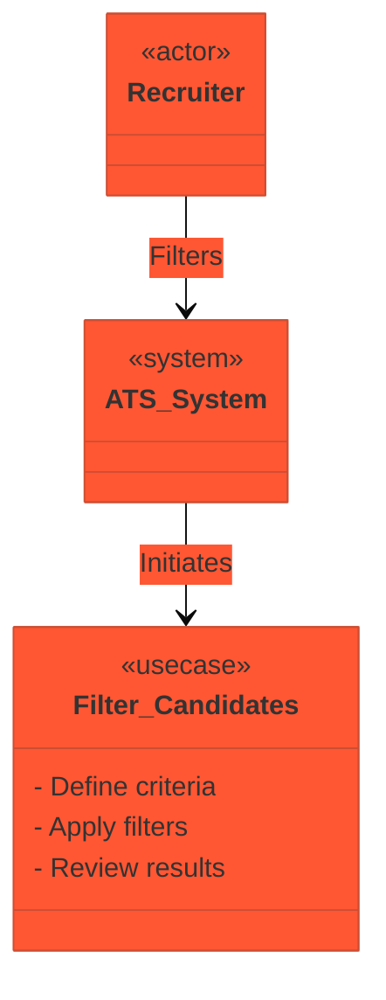
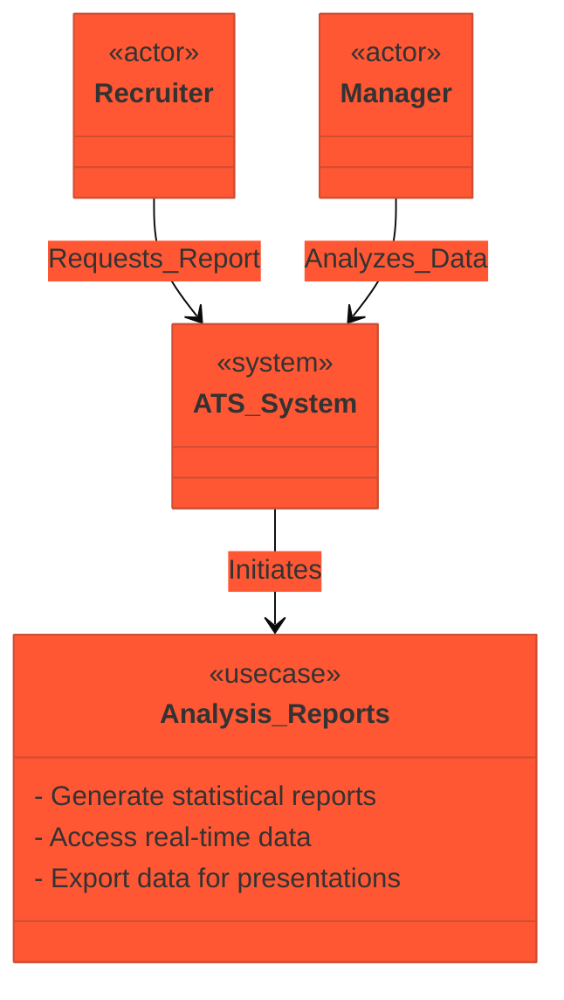
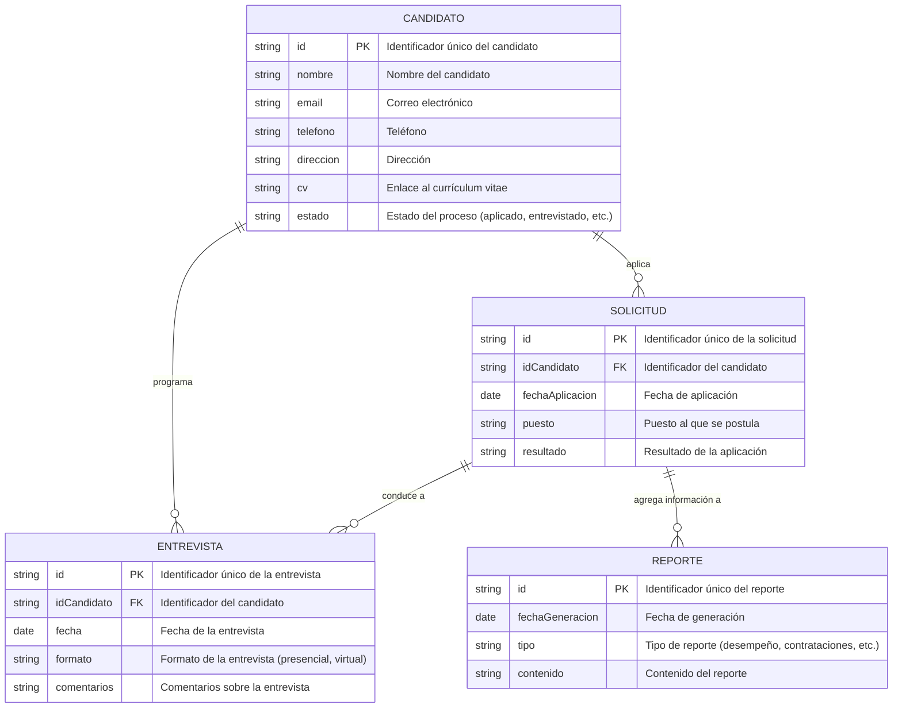
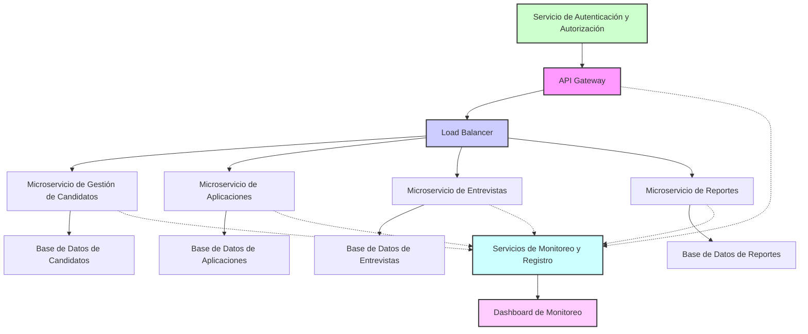
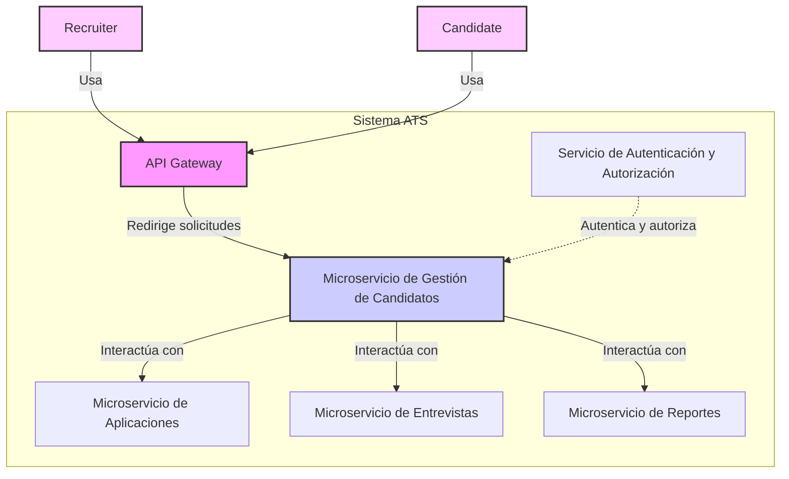
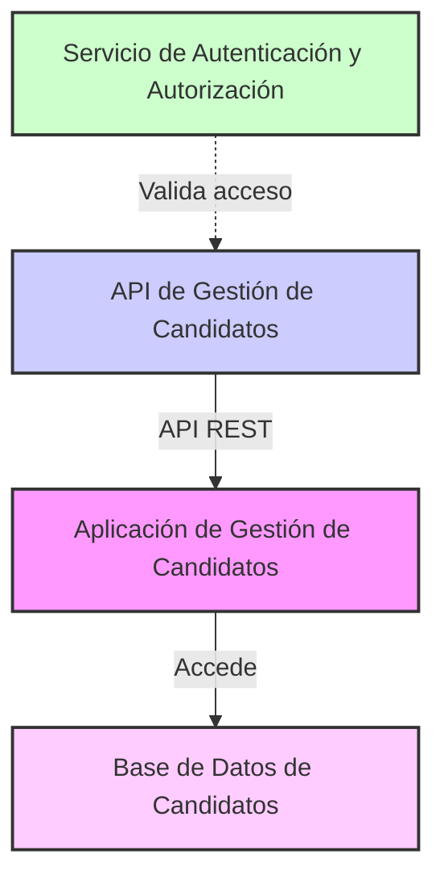
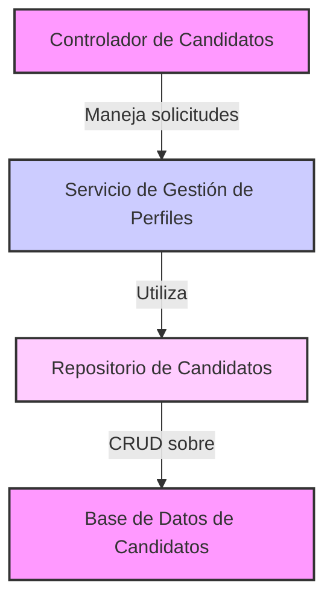

# Sistema de Seguimiento de Candidatos

## Breve descripción

Un Sistema de Seguimiento de Candidatos (ATS por sus siglas en inglés, Applicant Tracking System) es un software utilizado en reclutamiento y selección de personal que ayuda a las organizaciones a administrar su proceso de contratación. Su funcionalidad puede variar dependiendo del producto, pero típicamente un ATS permite a los empleadores:

**Publicar Empleos:** Las empresas pueden usar un ATS para publicar vacantes en diversas plataformas, incluyendo tableros de empleo, redes sociales y su propio sitio web de carreras.

**Recibir Solicitudes:** Los ATS recogen y organizan las aplicaciones que llegan de diferentes fuentes en una única base de datos centralizada.

**Filtrar Candidatos:** Mediante el uso de palabras clave, filtros y otros criterios, un ATS puede ayudar a identificar los candidatos más prometedores y organizarlos según la idoneidad para la posición.

**Gestionar el Proceso de Entrevistas:** Los ATS pueden programar entrevistas y ayudar a coordinar las comunicaciones entre los candidatos y los entrevistadores.

**Evaluación de Candidatos:** Algunos ATS integran pruebas en línea o evaluaciones que los candidatos pueden completar como parte de su solicitud.

**Selección y Contratación:** Una vez que se ha seleccionado a los candidatos, un ATS puede gestionar las etapas finales del proceso de contratación, incluyendo la generación de ofertas y la integración de los nuevos empleados en los sistemas de recursos humanos de la empresa.

**Análisis y Reportes:** Un ATS puede generar informes sobre el proceso de contratación, proporcionando información sobre métricas como el tiempo para contratar o la eficacia de las fuentes de reclutamiento.

En resumen, un ATS simplifica, organiza y optimiza el proceso de reclutamiento, desde la publicación de empleos hasta la contratación, ayudando a las organizaciones a ahorrar tiempo y mejorar la calidad de sus contrataciones.

# Nuestro Valor Agregado

La propuesta valor de LTI que nos diferencia de manera contundente de nuestra compatencia es agregar inovación en cada una de las funcionalidades del ATS de la siguiente manera:

## Publicar Empleos:

**Distribución Inteligente de Empleos:** Utilizar algoritmos de aprendizaje automático para identificar las mejores plataformas donde publicar las ofertas de empleo basándose en datos históricos y tendencias del mercado laboral.

**Optimización SEO de Anuncios:** Integrar herramientas para optimizar los anuncios de trabajo para los motores de búsqueda y aumentar su visibilidad.

## Recibir Solicitudes:

**Interfaz de Candidato Mejorada:** Ofrecer una experiencia de usuario excepcional para los candidatos con aplicaciones móviles intuitivas y procesos simplificados de carga de CV.

**Chatbots para Preguntas Frecuentes:** Implementar asistentes virtuales que guíen a los candidatos a través del proceso de solicitud y respondan preguntas en tiempo real.

## Filtrar Candidatos:

**Matching Avanzado de Candidatos:** Desarrollar algoritmos avanzados de correspondencia que no solo se basen en palabras clave, sino también en la experiencia laboral, educación, competencias y ajuste cultural.

**Detección de Potencial:** Utilizar la inteligencia artificial para identificar candidatos con gran potencial basándose en patrones de éxito de empleados actuales.

## Gestionar el Proceso de Entrevistas:

**Programación Autónoma:** Incorporar sistemas de programación que coordinen automáticamente las entrevistas basándose en la disponibilidad de los entrevistadores y candidatos.

**Entrevistas en Video Integradas:** Ofrecer una plataforma de entrevistas en video integrada para facilitar las entrevistas remotas.

## Evaluación de Candidatos:

**Pruebas Personalizables:** Permitir a los empleadores crear y administrar evaluaciones personalizadas dentro del ATS para medir habilidades específicas relacionadas con el trabajo.

**Análisis Predictivo:** Aplicar análisis predictivo para evaluar cómo los resultados de las pruebas de los candidatos podrían traducirse en desempeño laboral.

## Selección y Contratación:

**Integración con Herramientas de Onboarding:** Asegurarse de que la transición de candidato seleccionado a empleado sea fluida mediante la integración con plataformas de onboarding.

**Gestión de Ofertas Dinámicas:** Crear sistemas de gestión de ofertas que permitan la personalización y automatización de paquetes de ofertas para los candidatos.

## Análisis y Reportes:

**Paneles Analíticos Avanzados:** Implementar dashboards interactivos con análisis avanzados para ofrecer insights en tiempo real sobre la eficiencia del proceso de contratación.

**Benchmarking Sectorial:** Comparar métricas de rendimiento con las tendencias del sector para que las empresas puedan ver cómo se comparan con sus competidores.

Además de las funcionalidades avanzadas, para diferenciarnos aún más de la compatencia, nuestro ATS debe enfocarse en una alta personalización, excelente soporte al cliente, y una interfaz muy intuitiva y visualmente atractiva. También debe ofrecer integraciones con otras herramientas HR y sistemas de gestión de la información empresarial, así como cumplir con las regulaciones globales de privacidad de datos para atraer a clientes internacionales.

## Diagrama Lean Canvas

El siguiente Diagrama Lean Canvas nos entrega un entendimiento gráfico del modelo de negocio.

```mermaid
graph TB
    subgraph A [Problema]
        AA[Dificultad en encontrar candidatos calificados]
        AB[Proceso de contratación largo y costoso]
        AC[Baja tasa de conversión de candidatos a empleados]
    end

    subgraph B [Soluciones]
        BA[Algoritmos avanzados de correspondencia de candidatos]
        BB[Herramientas de optimización SEO y distribución]
        BC[Integración de pruebas personalizables]
    end

    subgraph C [Propuesta de Valor]
        CA[Mejora en la calidad de las contrataciones]
        CB[Reducción de tiempo y costos en contratación]
        CC[Experiencia de usuario sobresaliente para empleadores y candidatos]
    end

    subgraph D [Ventaja Competitiva]
        DA[Tecnología de IA para el matching y detección de potencial]
        DB[Integración completa desde la atracción hasta incorporación]
        DC[Cumplimiento con regulaciones internacionales de privacidad]
    end

    subgraph E [Segmentos de Cliente]
        EA[Empresas medianas y grandes]
        EB[Industria tecnológica y creativa]
        EC[Departamentos de HR y reclutadores]
    end

    subgraph F [Canales]
        FA[Plataformas de empleo en línea]
        FB[Redes sociales y marketing digital]
        FC[Ferias de empleo y eventos de networking]
    end

    subgraph G [Estructura de Costos]
        GA[Desarrollo y mantenimiento de software]
        GB[Marketing y adquisición de clientes]
        GC[Soporte al cliente y operaciones]
    end

    subgraph H [Ingresos]
        HA[Suscripciones mensuales o anuales]
        HB[Tarifas por publicación de empleo]
        HC[Servicios de consultoría de reclutamiento]
    end

    subgraph I [Métricas Clave]
        IA[Número de contrataciones exitosas]
        IB[Tiempo medio para contratar]
        IC[Retención de clientes y tasa de renovación de suscripciones]
    end

    subgraph J [Problemas Existentes]
        JA[Integración con sistemas de HR preexistentes]
        JB[Adaptación a diferentes tamaños de empresas y sectores]
        JC[Cumplimiento de las cambiantes normativas laborales y de privacidad de datos]
    end

    A --> B
    B --> C
    C --> D
    D --> E
    E --> F
    F --> G
    G --> H
    H --> I
    I --> J
```

# Principales Casos de Uso

La siguiente es una descripción de alto nivel de los tres casos de uso principales para el software ATS propuesto:

## 1. Publicar Empleos:

**Descripción:** Este caso de uso abarca la capacidad del sistema para permitir a los empleadores publicar ofertas de trabajo en múltiples plataformas. Utilizando algoritmos de aprendizaje automático, el sistema identifica las mejores plataformas para cada oferta basándose en datos históricos y tendencias del mercado laboral, optimizando así la visibilidad de los anuncios mediante técnicas de SEO.

**Proceso principal:** El usuario (reclutador) crea una nueva oferta de trabajo, especifica los detalles del puesto y selecciona opciones para la publicación. El sistema procesa esta información, optimiza el anuncio para motores de búsqueda y distribuye el anuncio en las plataformas seleccionadas automáticamente por los algoritmos de inteligencia artificial.

**Valor agregado:** Mejora significativa en la eficiencia y efectividad de la publicación de empleos, asegurando que las ofertas lleguen a la audiencia más relevante y aumentando las posibilidades de atraer candidatos de calidad.

## 2.Filtrar Candidatos:

**Descripción:** Este caso de uso involucra la recopilación y organización de aplicaciones de candidatos, utilizando tecnologías avanzadas para filtrar y clasificar a los candidatos según su idoneidad para el puesto. El ATS utiliza no solo palabras clave, sino también algoritmos avanzados que consideran la experiencia, educación, competencias y el ajuste cultural.

**Proceso principal:** Una vez que los candidatos aplican, el sistema analiza automáticamente los currículos y las respuestas de las aplicaciones, utilizando IA para detectar patrones y comparar con perfiles de éxito. Los candidatos se clasifican y priorizan en la base de datos para revisiones y entrevistas adicionales.

**Valor agregado:** Reducción de tiempo en el proceso de selección y aumento en la calidad de los candidatos seleccionados, con un enfoque en la detección de alto potencial y ajuste cultural.

## 3. Análisis y Reportes:

**Descripción:** Este caso de uso facilita el análisis exhaustivo del proceso de reclutamiento mediante dashboards interactivos y herramientas analíticas avanzadas. Proporciona insights en tiempo real y permite benchmarking sectorial para evaluar el rendimiento del proceso de reclutamiento en comparación con las tendencias del sector.

**Proceso principal:** El sistema recopila datos de todas las etapas del proceso de reclutamiento y los procesa para generar informes y paneles analíticos. Los usuarios pueden acceder a estos informes para obtener análisis detallados sobre diversos aspectos como la eficacia de las fuentes de reclutamiento, el tiempo para contratar y la calidad de las contrataciones.

**Valor agregado:** Mejora en la toma de decisiones basada en datos, permitiendo a las organizaciones optimizar continuamente sus estrategias de reclutamiento y alinearse mejor con las prácticas líderes de la industria.

Estos casos de uso no solo reflejan las funcionalidades básicas de un ATS, sino que también destacan las innovaciones específicas que diferencian a este producto en el mercado, enfocándose en la optimización mediante el uso de tecnologías avanzadas y la personalización del proceso de reclutamiento. 

# Modelo de Datos

Para abordar los tres casos de uso que hemos discutido — "Registro de Candidatos", "Filtrar Candidatos" y "Análisis y Reportes" — se requiere diseñar un modelo de datos que cubra las entidades relevantes, sus atributos y las relaciones entre ellas. A continuación, se presenta un modelo de datos básico para visualizar las entidades y relaciones.

## Descripción del Modelo:

**Candidato:** Esta entidad representa a los individuos que aplican a las vacantes. Incluye datos personales básicos y el estado en el cual se encuentra dentro del proceso de selección.

**Solicitud:** Representa cada aplicación hecha por un candidato a un puesto específico. Relaciona al candidato con el puesto y el resultado de esta aplicación.

**Entrevista:** Detalla las entrevistas realizadas, vinculadas a los candidatos y sus respectivas aplicaciones.

**Reporte:** Esta entidad maneja los datos generados por los reportes de análisis, que pueden abarcar desde desempeño hasta resultados de las contrataciones.

Este modelo permite gestionar el registro de candidatos, filtrarlos según criterios específicos y generar reportes basados en datos acumulados. 

# Diseño del sistema a alto nivel

Para implementar un sistema de seguimiento de candidatos (ATS) que cubra los casos de uso de "Registro de Candidatos", "Filtrar Candidatos" y "Análisis y Reportes", es fundamental elegir un patrón de arquitectura que facilite la escalabilidad, la mantenibilidad y la eficiencia. Dados estos requerimientos y la naturaleza del sistema, se recomienda utilizar una arquitectura basada en **microservicios**. Este patrón es particularmente adecuado debido a su flexibilidad para adaptarse a cambios y escalar partes específicas del sistema de manera independiente.

## Descripción del Diseño de Arquitectura de Alto Nivel:

**1. Microservicios:** 

Cada funcionalidad principal del ATS se desarrollará como un microservicio separado, permitiendo que cada uno se despliegue, escale y actualice de manera independiente. Esto es ideal para un sistema como un ATS, donde diferentes funciones pueden tener diferentes requisitos de carga y cambios frecuentes.

**2. Entidades de Microservicios:**

*-Microservicio de Gestión de Candidatos:* Maneja todo el registro y la información personal de los candidatos.

*-Microservicio de Aplicaciones:* Procesa las solicitudes de empleo y las asociaciones a diferentes puestos.

*-Microservicio de Entrevistas:* Administra la programación y los resultados de las entrevistas.

*-Microservicio de Reportes:* Genera análisis y reportes basados en datos recopilados de otros microservicios.

**3. Base de Datos:**

Cada microservicio podría tener su propia base de datos, optimizada para su carga de trabajo específica, lo cual es una práctica común en la arquitectura de microservicios para asegurar la independencia y la eficiencia.

**4. API Gateway:**

Un API Gateway actuará como la única puerta de entrada al sistema de microservicios, encaminando las solicitudes a los servicios apropiados y manejando preocupaciones comunes como la autenticación, el monitoreo y el rate limiting.

**5. Balanceadores de Carga:**

Se usarán balanceadores de carga para distribuir las solicitudes entrantes a instancias de microservicios, asegurando una distribución equitativa de la carga y mejorando la disponibilidad.

**6. Servicios de Autenticación y Autorización:**

Servicios dedicados para manejar la autenticación y la autorización asegurando que solo los usuarios autorizados puedan acceder a funciones específicas basadas en sus roles.

**7. Monitoreo y Registro:**

Incorporación de herramientas de monitoreo y registro para supervisar el estado y el rendimiento de los microservicios, facilitando la detección y corrección de problemas rápidamente.

## Ventajas de esta Arquitectura:

**Flexibilidad:** Fácil adaptación a los cambios y adición de nuevas funcionalidades.
Escalabilidad: Cada microservicio se puede escalar de forma independiente en respuesta a la demanda.

**Resiliencia:** Los fallos en un microservicio no afectan el sistema entero.
Despliegue Independiente: Los microservicios pueden ser actualizados sin afectar a otros servicios.

Este diseño de arquitectura proporcionará una base sólida para desarrollar un sistema ATS robusto y flexible, capaz de adaptarse a las necesidades cambiantes de la gestión de recursos humanos.

## Diagrama de Arquitectura

Para visualizar la arquitectura de microservicios propuesta para el sistema de seguimiento de candidatos (ATS), a continuación se presenta un diagrama de arquitectura de alto nivel

## Descripción del Diagrama:

**API Gateway:** Actúa como la puerta de entrada para todas las solicitudes entrantes, dirigiéndolas al balanceador de carga.

**Load Balancer:** Distribuye las solicitudes entrantes a diferentes instancias de microservicios basadas en la carga y disponibilidad.

**Microservicios:** Cada uno maneja una funcionalidad específica del ATS. Incluyen gestión de candidatos, manejo de aplicaciones, organización de entrevistas y generación de reportes.

**Bases de Datos:** Cada microservicio tiene su propia base de datos, permitiendo un acceso de datos optimizado y autónomo.

**Servicio de Autenticación y Autorización:** Asegura que solo los usuarios autorizados puedan acceder a funciones específicas dentro del sistema.

**Servicios de Monitoreo y Registro:** Recopila y analiza datos de funcionamiento de los microservicios para facilitar la supervisión y resolución de problemas.

Este diagrama ofrece una vista simplificada pero clara de cómo se podría estructurar el sistema ATS usando una arquitectura de microservicios, facilitando tanto el desarrollo escalable como el mantenimiento eficiente del sistema.

# Diagrama C4 - Microservicio de Gestión de Candidatos

Para profundizar en uno de los componentes del sistema de seguimiento de candidatos (ATS) descrito anteriormente, vamos a elegir el Microservicio de Gestión de Candidatos y desarrollar un diagrama C4 para este componente. Este microservicio es fundamental ya que maneja toda la información y operaciones relacionadas con los candidatos.

Cada uno de estos diagramas proporciona una perspectiva más detallada sobre cómo el Microservicio de Gestión de Candidatos interactúa dentro del sistema ATS, detallando desde el nivel de contexto hasta los componentes internos. Este enfoque facilita la comprensión de la arquitectura y el flujo de datos a través del sistema, asegurando que los desarrolladores y los stakeholders comprendan cada parte y cómo se relaciona con el todo.

## Nivel 1: Diagrama de Contexto
El primer nivel del diagrama C4 muestra cómo el microservicio de Gestión de Candidatos se integra con el resto del sistema y con los usuarios externos.

## Nivel 2: Diagrama de Contenedores
El segundo nivel detalla los contenedores dentro del microservicio de Gestión de Candidatos, incluyendo la aplicación y la base de datos asociada.

## Nivel 3: Diagrama de Componentes
En el tercer nivel, se desglosan los componentes internos de la aplicación de Gestión de Candidatos.

