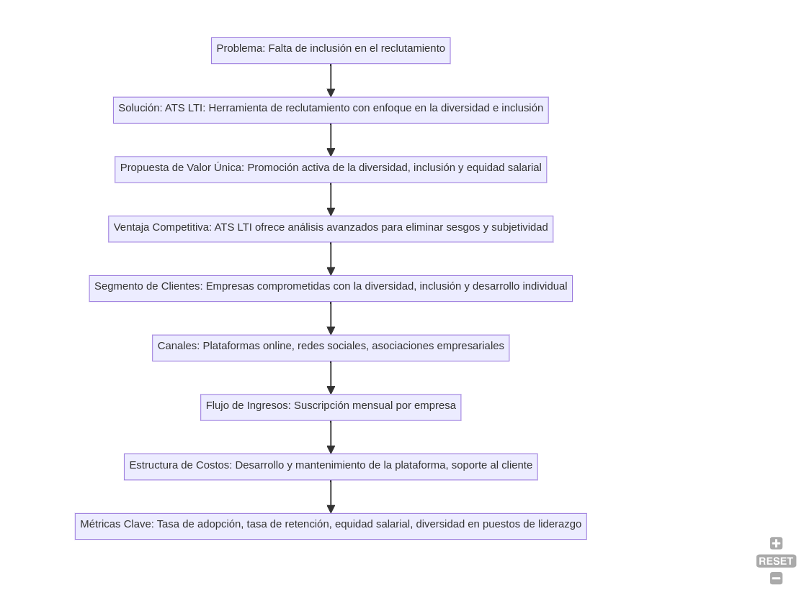
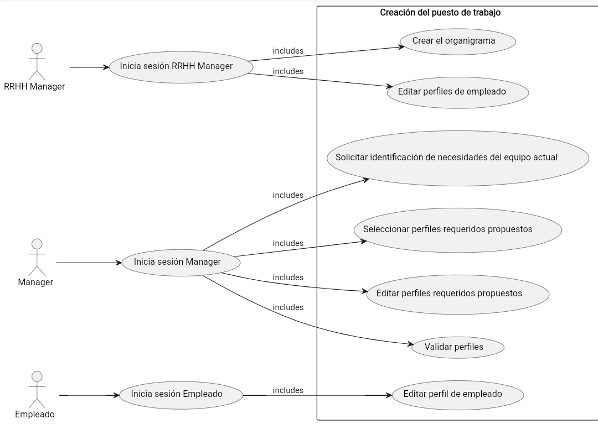
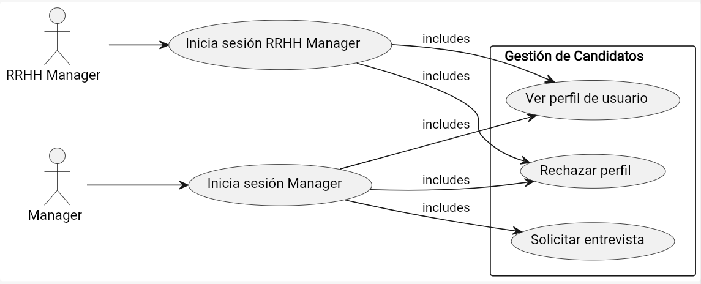
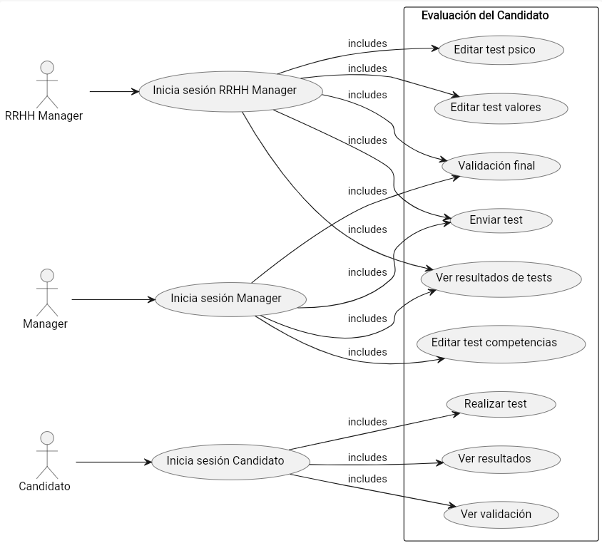
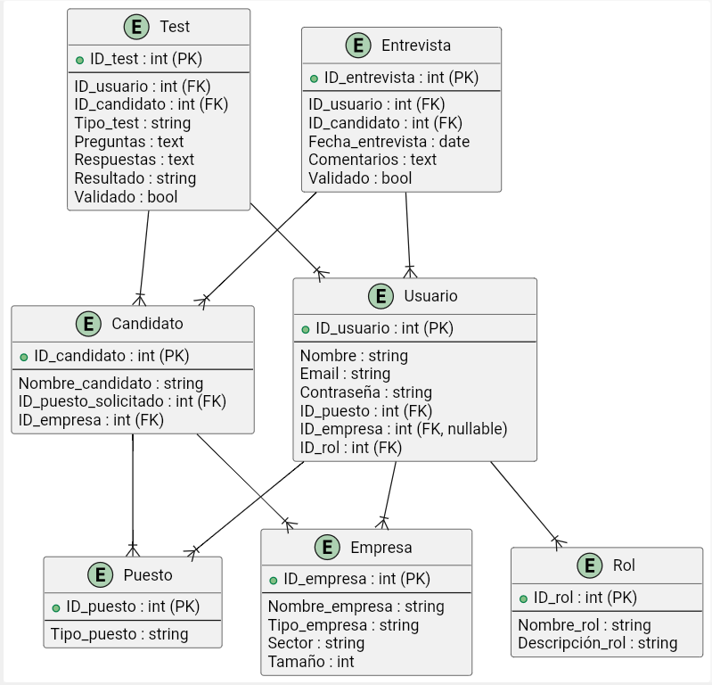
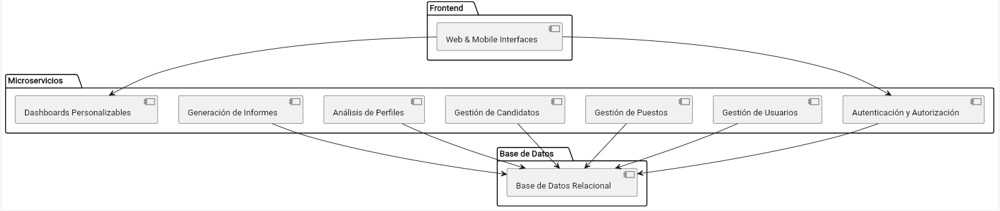

# Descripción de LTI

## LTI (Liderazgo y Transformación Inclusiva) - ATS para el futuro

LTI es una plataforma revolucionaria de seguimiento de candidatos diseñada para empresas comprometidas con la diversidad, la inclusión y el desarrollo individual de sus empleados. Con un enfoque people-first y una cultura empresarial centrada en el bienestar y el descanso de los trabajadores, LTI va más allá de las funcionalidades básicas de un ATS para ofrecer una experiencia de reclutamiento verdaderamente inclusiva y transformadora.

### Funcionalidades Principales:

1. **Evaluación de cultura organizacional:** LTI incorpora herramientas avanzadas de evaluación de la cultura empresarial para garantizar un ajuste perfecto entre los candidatos y los valores de la empresa.

2. **Eliminación de sesgos y subjetividad:** Utilizando análisis de datos y algoritmos de IA avanzados, LTI ayuda a eliminar los sesgos y la subjetividad en todas las fases del proceso de reclutamiento, desde la selección de candidatos hasta la toma de decisiones finales.

3. **Eliminación de la brecha salarial de género:** LTI se compromete a cerrar la brecha salarial de género proporcionando herramientas y métricas para garantizar la equidad salarial en toda la organización.

4. **Promoción de la diversidad e inclusión:** LTI facilita la creación de equipos multidisciplinarios y diversos mediante la evaluación de la plantilla de la empresa y la identificación de perfiles que ayuden a modelar una sociedad inclusiva.

5. **Fomento del liderazgo femenino:** LTI ayuda a aumentar el número de mujeres en puestos de liderazgo mediante programas de desarrollo profesional específicos y la identificación proactiva de candidatas con potencial de liderazgo.

Con LTI, las empresas pueden no solo optimizar su proceso de reclutamiento, sino también contribuir activamente a la construcción de una sociedad más inclusiva y equitativa.

### Lean Canvas

```plaintext
graph TD;
    Problema["Problema: Falta de inclusión en el reclutamiento"] --> Solucion["Solución: ATS LTI: Herramienta de reclutamiento con enfoque en la diversidad e inclusión"];
    Solucion --> Propuesta_de_Valor["Propuesta de Valor Única: Promoción activa de la diversidad, inclusión y equidad salarial"];
    Propuesta_de_Valor --> Ventaja_Competitiva["Ventaja Competitiva: ATS LTI ofrece análisis avanzados para eliminar sesgos y subjetividad"];
    Ventaja_Competitiva --> Segmento_de_Clientes["Segmento de Clientes: Empresas comprometidas con la diversidad, inclusión y desarrollo individual"];
    Segmento_de_Clientes --> Canales["Canales: Plataformas online, redes sociales, asociaciones empresariales"];
    Canales --> Flujo_de_Ingresos["Flujo de Ingresos: Suscripción mensual por empresa"];
    Flujo_de_Ingresos --> Estructura_de_Costos["Estructura de Costos: Desarrollo y mantenimiento de la plataforma, soporte al cliente"];
    Estructura_de_Costos --> Metricas_Clave["Métricas Clave: Tasa de adopción, tasa de retención, equidad salarial, diversidad en puestos de liderazgo"];
```


# Casos de uso
## 1. Creación del puesto
El sistema de LTI con ayuda de la Inteligencia Artificial y herramientas de análisis de datos, hará un análisis de los perfiles que actualmente ya dispone en la empresa y basándose en modelos de equipos de otras empresas en el mismo sector, y teniendo en cuenta medidas de inclusión y equidad, generará el perfil ideal requerido para el puesto. Se le hará una propuesta al reclutador quien finalmente deberá seleccionar, modificar y validar las propuestas que finalmente serán publicadas.   

```plaintext
@startuml
left to right direction

actor "RRHH Manager" as RRHH_Manager
actor "Manager" as Manager
actor "Empleado" as Empleado


RRHH_Manager --> (Inicia sesión RRHH Manager)
Manager --> (Inicia sesión Manager)
Empleado --> (Inicia sesión Empleado)

rectangle "Creación del puesto de trabajo" as Creacion_Puesto {
    (Inicia sesión RRHH Manager) --> (Crear el organigrama):includes
    (Inicia sesión RRHH Manager) --> (Editar perfiles de empleado):includes
    (Inicia sesión Manager)  --> (Solicitar identificación de necesidades del equipo actual):includes
    (Inicia sesión Manager) --> (Seleccionar perfiles requeridos propuestos):includes
    (Inicia sesión Manager) --> (Editar perfiles requeridos propuestos):includes
    (Inicia sesión Manager) --> (Validar perfiles):includes
    (Inicia sesión Empleado) --> (Editar perfil de empleado):includes
}

@enduml
```



## 2. Gestión de Candidatos
El sistema de LTI con ayuda de la Inteligencia Artificial y herramientas de análisis de datos, hará una preselección de los candidatos en base la construcción de un equipo equitativo y diverso. Los perfiles serán presentados a los reclutadores eliminando toda clase de sesgos para que la elección del candidato sea totalmente basada en la objetividad. El manager de RRHH y el manager pueden ver el perfil de candidato, descartar, solicitar entrevista. 


```plaintext
@startuml
left to right direction

actor "RRHH Manager" as RRHH_Manager
actor "Manager" as Manager

RRHH_Manager --> (Inicia sesión RRHH Manager)
Manager --> (Inicia sesión Manager)

rectangle "Gestión de Candidatos" as Gestion_Candidatos {
    (Inicia sesión RRHH Manager) --> (Ver perfil de usuario):includes
    (Inicia sesión RRHH Manager) --> (Rechazar perfil):includes
    (Inicia sesión Manager)  --> (Ver perfil de usuario):includes
    (Inicia sesión Manager) --> (Rechazar perfil):includes
    (Inicia sesión Manager) --> (Solicitar entrevista):includes
}
@enduml
```



## 3. Evaluación de candidatos
El sistema LTI con ayuda de la Inteligencia Artificial, creará una batería de tests personalizada en función del perfil del usuario y de las necesidades de puesto. Se pondrá enfasis en la cultura de empresa. El RRHH manager tendrá acceso a los tests relacionados más con la personalidad, cultura de empres


```plaintext
@startuml
left to right direction

actor "RRHH Manager" as RRHH_Manager
actor "Manager" as Manager
actor "Candidato" as Candidato

RRHH_Manager --> (Inicia sesión RRHH Manager)
Manager --> (Inicia sesión Manager)
Candidato --> (Inicia sesión Candidato)

rectangle "Evaluación del Candidato" as Evaluacion_Candidato {
    (Inicia sesión RRHH Manager) --> (Editar test psico):includes
    (Inicia sesión RRHH Manager) --> (Editar test valores):includes
    (Inicia sesión RRHH Manager) --> (Enviar test):includes
    (Inicia sesión RRHH Manager) --> (Ver resultados de tests):includes
    (Inicia sesión RRHH Manager) --> (Validación final):includes

    (Inicia sesión Manager) --> (Editar test competencias):includes
    (Inicia sesión Manager) --> (Enviar test):includes
    (Inicia sesión Manager) --> (Ver resultados de tests):includes
    (Inicia sesión Manager) --> (Validación final):includes

    (Inicia sesión Candidato) --> (Realizar test):includes
    (Inicia sesión Candidato) --> (Ver resultados):includes
    (Inicia sesión Candidato) --> (Ver validación):includes
}
@enduml
```



## Modelo de datos
### Entidades y atributos

#### Usuario:
- ID_usuario (int, PK)
- Nombre (string)
- Email (string)
- Contraseña (string)
- ID_puesto (int, FK)
- ID_empresa (int, FK, nullable)
- ID_rol (int, FK)

#### Empresa:
- ID_empresa (int, PK)
- Nombre_empresa (string)
- Tipo_empresa (string)
- Sector (string)
- Tamaño (int)

#### Puesto:
- ID_puesto (int, PK)
- Tipo_puesto (string)

#### Rol:
- ID_rol (int, PK)
- Nombre_rol (string)
- Descripción_rol (string)

#### Candidato:
- ID_candidato (int, PK)
- Nombre_candidato (string)
- ID_puesto_solicitado (int, FK)
- ID_empresa (int, FK)

#### Test:
- ID_test (int, PK)
- ID_usuario (int, FK)
- ID_candidato (int, FK)
- Tipo_test (string)
- Preguntas (text)
- Respuestas (text)
- Resultado (string)
- Validado (bool)

#### Entrevista:
- ID_entrevista (int, PK)
- ID_usuario (int, FK)
- ID_candidato (int, FK)
- Fecha_entrevista (date)
- Comentarios (text)
- Validado (bool)

### Relaciones

- Usuario - Puesto: muchos a uno
- Usuario - Empresa: muchos a uno
- Usuario - Rol: muchos a uno
- Candidato - Empresa: muchos a uno
- Candidato - Puesto: muchos a uno
- Test - Usuario: uno a muchos
- Test - Candidato: uno a muchos
- Entrevista - Usuario: uno a muchos
- Entrevista - Candidato: uno a muchos


```plaintext
@startuml

entity "Usuario" {
  + ID_usuario : int (PK)
  --
  Nombre : string
  Email : string
  Contraseña : string
  ID_puesto : int (FK)
  ID_empresa : int (FK, nullable)
  ID_rol : int (FK)
}

entity "Empresa" {
  + ID_empresa : int (PK)
  --
  Nombre_empresa : string
  Tipo_empresa : string
  Sector : string
  Tamaño : int
}

entity "Puesto" {
  + ID_puesto : int (PK)
  --
  Tipo_puesto : string
}

entity "Rol" {
  + ID_rol : int (PK)
  --
  Nombre_rol : string
  Descripción_rol : string
}

entity "Candidato" {
  + ID_candidato : int (PK)
  --
  Nombre_candidato : string
  ID_puesto_solicitado : int (FK)
  ID_empresa : int (FK)
}

entity "Test" {
  + ID_test : int (PK)
  --
  ID_usuario : int (FK)
  ID_candidato : int (FK)
  Tipo_test : string
  Preguntas : text
  Respuestas : text
  Resultado : string
  Validado : bool
}

entity "Entrevista" {
  + ID_entrevista : int (PK)
  --
  ID_usuario : int (FK)
  ID_candidato : int (FK)
  Fecha_entrevista : date
  Comentarios : text
  Validado : bool
}

Usuario --|{ Puesto
Usuario --|{ Empresa
Usuario --|{ Rol
Candidato --|{ Puesto
Candidato --|{ Empresa
Test --|{ Usuario
Test --|{ Candidato
Entrevista --|{ Usuario
Entrevista --|{ Candidato

@enduml

```




## Arquitectura Software para LTI

## Microservicios Propuestos:

### Autenticación y Autorización:
Gestiona la autenticación de usuarios y la autorización de acceso a los recursos del sistema.

### Gestión de Usuarios:
Encargado de la gestión de usuarios, incluyendo la creación, actualización y eliminación de cuentas.

### Gestión de Puestos:
Maneja la creación, edición y eliminación de puestos de trabajo, así como la asignación de perfiles requeridos.

### Gestión de Candidatos:
Se encarga del registro de candidatos, la gestión de sus perfiles y la realización de pruebas y evaluaciones.

### Análisis de Perfiles:
Realiza análisis de perfiles de candidatos utilizando técnicas de inteligencia artificial y machine learning.

### Generación de Informes:
Genera informes y métricas relacionadas con el rendimiento del sistema y la diversidad e inclusión en el proceso de reclutamiento.

### Dashboards Personalizables:
Proporciona interfaces personalizables para que los managers y usuarios puedan visualizar y analizar datos relevantes.

## Relaciones entre Microservicios:

- **Autenticación y Autorización:** Se comunica con todos los microservicios para garantizar el acceso seguro a los recursos del sistema.
- **Gestión de Usuarios:** Utilizado por todos los microservicios que requieren información de usuarios.
- **Gestión de Puestos y Candidatos:** Intercambia información sobre puestos de trabajo y perfiles de candidatos.
- **Análisis de Perfiles:** Recibe datos de candidatos de la gestión de candidatos y devuelve resultados de análisis.
- **Generación de Informes y Dashboards Personalizables:** Accede a datos de todos los microservicios para generar informes y crear interfaces personalizadas.

## Consideraciones Adicionales:

- Cada microservicio se desarrollaría, desplegaría y escalaría de manera independiente, lo que facilitaría el mantenimiento y la escalabilidad del sistema.
- Se utilizarían protocolos de comunicación como HTTP/REST o gRPC para permitir la comunicación entre microservicios.
- Cada microservicio tendría su propia base de datos, preferiblemente optimizada para los tipos de datos y operaciones que maneja.
- Este diseño de arquitectura basada en microservicios proporcionaría flexibilidad, escalabilidad y mantenibilidad al sistema LTI, permitiendo agregar, actualizar o eliminar funcionalidades de manera independiente según sea necesario.

### Infraestructura:

- **Cloud Computing:** Utilizar servicios de nube como AWS, Azure o Google Cloud para alojar la infraestructura del sistema y aprovechar su escalabilidad y disponibilidad.
- **Contenedores y Orquestación:** Utilizar contenedores Docker para empaquetar las aplicaciones y Kubernetes para orquestar y gestionar los contenedores en entornos de producc


```plaintext
@startuml

package "Frontend" {
    [Web & Mobile Interfaces]
}

package "Microservicios" {
    [Autenticación y Autorización]
    [Gestión de Usuarios]
    [Gestión de Puestos]
    [Gestión de Candidatos]
    [Análisis de Perfiles]
    [Generación de Informes]
    [Dashboards Personalizables]
}

package "Base de Datos" {
    [Base de Datos Relacional]
}

[Web & Mobile Interfaces] --> [Autenticación y Autorización]
[Web & Mobile Interfaces] --> [Dashboards Personalizables]
[Autenticación y Autorización] --> [Base de Datos Relacional]
[Gestión de Usuarios] --> [Base de Datos Relacional]
[Gestión de Puestos] --> [Base de Datos Relacional]
[Gestión de Candidatos] --> [Base de Datos Relacional]
[Análisis de Perfiles] --> [Base de Datos Relacional]
[Generación de Informes] --> [Base de Datos Relacional]

@enduml


```



