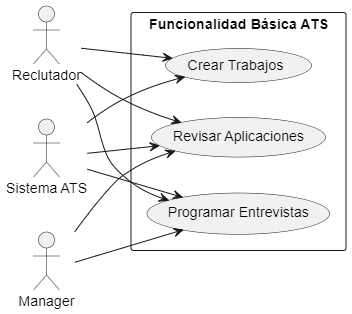
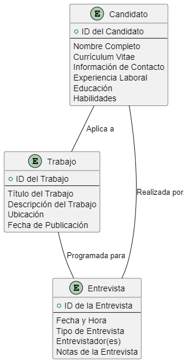
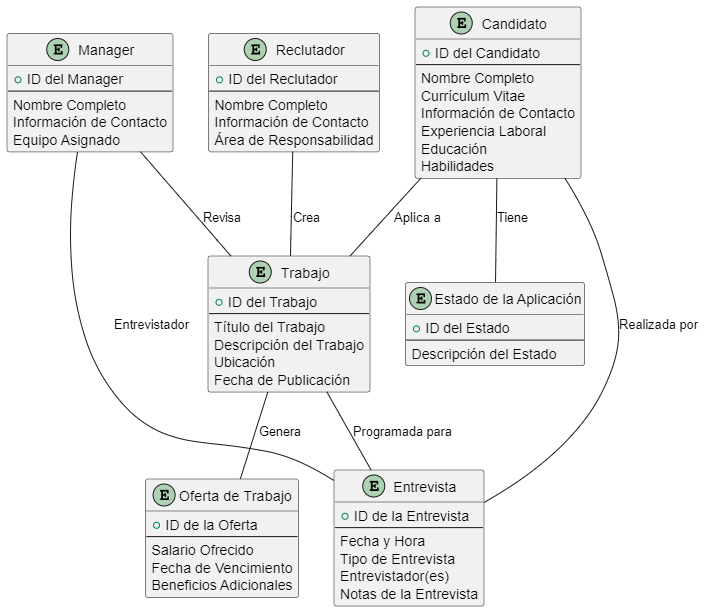
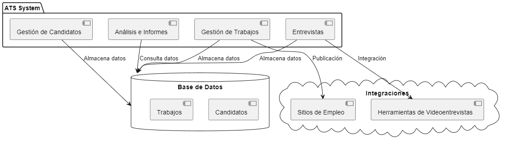
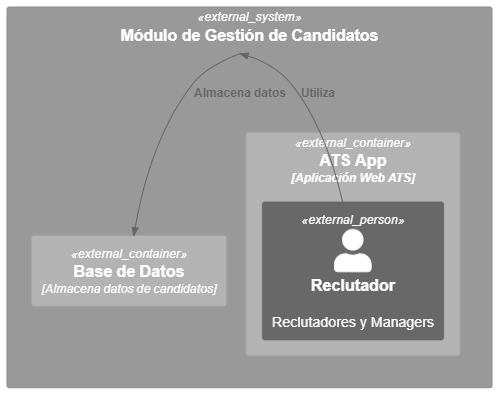
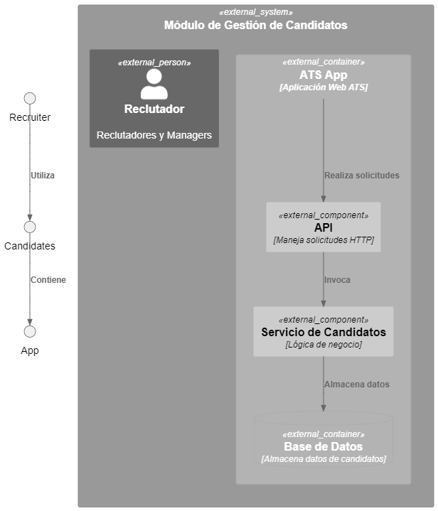
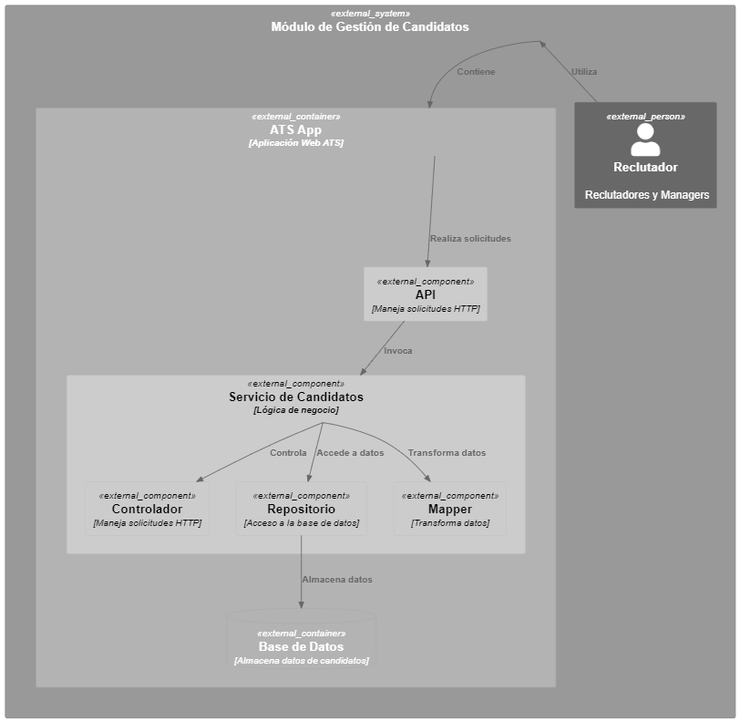

**Descripción breve del software LTI**

**LTI ATS** es un sistema de seguimiento de candidatos (ATS) del futuro que está diseñado para aumentar la eficiencia para los departamentos de RR.HH., mejorar la colaboración en tiempo real entre reclutadores y gerentes, automatizar tareas y brindar asistencia de IA en diversas tareas.

**Valor añadido y ventajas competitivas**

**LTI ATS** ofrece una serie de ventajas competitivas que lo convierten en la solución ideal para las empresas que buscan mejorar su proceso de contratación. Estas ventajas incluyen:

* **Mayor eficiencia:** LTI ATS automatiza muchas de las tareas manuales que consumen mucho tiempo asociadas con el proceso de contratación, como la clasificación de currículums vitae, la programación de entrevistas y la verificación de antecedentes. Esto libera a los reclutadores para que se centren en las tareas más estratégicas, como la identificación y el contacto con los mejores candidatos.
* **Mejor colaboración:** LTI ATS proporciona una plataforma centralizada donde reclutadores, gerentes y otros miembros del equipo de contratación pueden colaborar en tiempo real. Esto ayuda a garantizar que todos estén en la misma página y que las decisiones de contratación se tomen rápidamente y de manera eficiente.
* **Automatización inteligente:** LTI ATS utiliza IA para automatizar una variedad de tareas, como la clasificación de currículums vitae, la identificación de candidatos calificados y la programación de entrevistas. Esto ayuda a reducir el tiempo y el esfuerzo que se requieren para completar el proceso de contratación.
* **Asistencia de IA:** LTI ATS proporciona asistencia de IA para una variedad de tareas, como la redacción de descripciones de puestos de trabajo, la creación de anuncios de trabajo y la realización de entrevistas. Esto ayuda a los reclutadores a ser más eficientes y productivos.

**Funciones principales**

**LTI ATS** ofrece una amplia gama de funciones que lo convierten en una solución completa para el seguimiento de candidatos. Estas funciones incluyen:

* **Publicación de trabajos:** LTI ATS permite a las empresas publicar trabajos en una variedad de plataformas, incluyendo tableros de trabajos, su propio sitio web y redes sociales.
* **Clasificación de currículums vitae:** LTI ATS utiliza IA para clasificar currículums vitae y candidatos en función de su relevancia para el puesto de trabajo. Esto ayuda a los reclutadores a identificar rápidamente a los mejores candidatos.
* **Gestión de candidatos:** LTI ATS proporciona una plataforma centralizada para gestionar a todos los candidatos en el proceso de contratación. Esto incluye la capacidad de almacenar información de candidatos, realizar un seguimiento del progreso de los candidatos y comunicarse con los candidatos.
* **Programación de entrevistas:** LTI ATS facilita la programación de entrevistas con los candidatos. Esto incluye la capacidad de encontrar automáticamente horarios de reuniones disponibles, enviar invitaciones a entrevistas y programar entrevistas en video.
* **Verificación de antecedentes:** LTI ATS se integra con una variedad de proveedores de verificación de antecedentes para ayudar a las empresas a verificar rápidamente los antecedentes de los candidatos.
* **Análisis de datos:** LTI ATS proporciona análisis de datos para ayudar a las empresas a comprender mejor su proceso de contratación. Estos datos se pueden utilizar para identificar áreas de mejora y tomar decisiones más informadas sobre el proceso de contratación.

**Diagrama Lean Canvas**

**Problema**

* El proceso de contratación es manual y consume mucho tiempo.
* La falta de colaboración entre reclutadores y gerentes.
* Las decisiones de contratación se toman lentamente e ineficientemente.

**Solución**

* LTI ATS es un sistema de seguimiento de candidatos (ATS) automatizado y basado en IA que ayuda a las empresas a mejorar la eficiencia, la colaboración y la toma de decisiones en el proceso de contratación.

**Propuesta de valor**

* LTI ATS ayuda a las empresas a ahorrar tiempo y dinero al automatizar tareas manuales y proporcionar asistencia de IA.
* LTI ATS ayuda a las empresas a mejorar la calidad de sus contrataciones al identificar y seleccionar a los mejores candidatos.
* LTI ATS ayuda a las empresas a tomar decisiones de contratación más rápidas e informadas.

**Clientes**

* Empresas de todos los tamaños.
* Empresas que buscan mejorar su proceso de contratación.
* Empresas que buscan utilizar IA para mejorar su eficiencia.

**Canales**

* Sitio web de LTI.
* Marketing de contenidos.
* Ventas directas.
* Socios de canal.

**Relaciones con los clientes**

* Soporte al cliente.
* Capacitación.
* Comunidad en línea.

**Flujos de ingresos**

* Suscripciones.
* Tarifas por uso.
* Servicios profesionales.

**Estructura de costos**

* Desarrollo de software.
* Marketing y ventas.
* Soporte al cliente.

**Métricas clave**

* Número de clientes.
* Ingresos recurrentes mensuales (MRR).

## Casos de Uso Principales para un Sistema ATS Básico

1. **Crear Trabajos (Jobs)**:
   - **Descripción**: Los reclutadores y managers pueden crear nuevas ofertas de trabajo en el sistema ATS.
   - **Pasos**:
     1. Iniciar sesión en el sistema.
     2. Navegar a la sección de creación de trabajos.
     3. Ingresar detalles del trabajo (título, descripción, requisitos, etc.).
     4. Guardar el trabajo creado.
   - **Actores**: Reclutadores, Managers.

2. **Revisar Aplicaciones**:
   - **Descripción**: Los reclutadores deben revisar las aplicaciones recibidas para los trabajos publicados.
   - **Pasos**:
     1. Acceder a la lista de aplicaciones pendientes.
     2. Ver detalles de cada aplicación (currículum, carta de presentación, respuestas a preguntas, etc.).
     3. Evaluar y clasificar las aplicaciones.
     4. Tomar decisiones sobre los candidatos (avanzar, rechazar, programar entrevista, etc.).
   - **Actores**: Reclutadores.

3. **Programar Entrevistas**:
   - **Descripción**: Los reclutadores y managers deben coordinar y programar entrevistas con los candidatos seleccionados.
   - **Pasos**:
     1. Seleccionar candidatos para entrevistas.
     2. Consultar disponibilidad de candidatos y entrevistadores.
     3. Programar fechas y horarios para las entrevistas.
     4. Notificar a los candidatos y entrevistadores sobre los detalles de la entrevista.
   - **Actores**: Reclutadores, Managers.

A continuación, el diagrama de casos de uso utilizando **PlantUML**:

Este diagrama representa las interacciones entre los actores y el sistema ATS para los tres casos de uso principales. Los actores pueden crear trabajos, revisar aplicaciones y programar entrevistas según sus roles y responsabilidades.

## Modelo de datos
1. **Candidato (Applicant)**:
   - **Campos Esenciales**:
     - **ID del Candidato**: Identificador único para cada candidato.
     - **Nombre Completo**: Nombre y apellidos del candidato.
     - **Currículum Vitae (CV)**: Documento que resume la experiencia laboral, habilidades y educación del candidato.
     - **Información de Contacto**: Dirección de correo electrónico, número de teléfono, etc.
     - **Experiencia Laboral**: Detalles sobre empleos anteriores, fechas de empleo, títulos, responsabilidades, etc.
     - **Educación**: Historial académico, instituciones, títulos obtenidos.
     - **Habilidades**: Conjunto de habilidades relevantes para el trabajo.
   - **Relaciones**:
     - Un candidato puede estar asociado con múltiples trabajos (aplicaciones).
     - Un candidato puede tener múltiples entrevistas programadas.

2. **Trabajo (Job)**:
   - **Campos Esenciales**:
     - **ID del Trabajo**: Identificador único para cada oferta de trabajo.
     - **Título del Trabajo**: Descripción breve del puesto.
     - **Descripción del Trabajo**: Detalles sobre las responsabilidades, requisitos y expectativas del puesto.
     - **Ubicación**: Lugar donde se encuentra el trabajo.
     - **Fecha de Publicación**: Cuándo se creó la oferta de trabajo.
   - **Relaciones**:
     - Un trabajo puede tener múltiples candidatos (aplicantes).
     - Un trabajo puede estar asociado con múltiples entrevistas.

3. **Entrevista (Interview)**:
   - **Campos Esenciales**:
     - **ID de la Entrevista**: Identificador único para cada entrevista.
     - **Fecha y Hora**: Cuándo está programada la entrevista.
     - **Tipo de Entrevista**: Entrevista inicial, técnica, final, etc.
     - **Entrevistador(es)**: Nombre y detalles de los entrevistadores.
     - **Notas de la Entrevista**: Observaciones y comentarios sobre la entrevista.
   - **Relaciones**:
     - Una entrevista está asociada a un candidato específico.
     - Una entrevista está relacionada con un trabajo en particular.

El siguiente diagrama de entidad-relación (ER) ilustra estas relaciones:

Este diagrama muestra cómo las entidades se relacionan entre sí en el sistema ATS. Los candidatos aplican a trabajos, los trabajos tienen entrevistas programadas y las entrevistas están asociadas a candidatos específicos.

En el sistema **ATS (Applicant-Tracking System)**, además de las entidades previamente mencionadas (Candidato, Trabajo y Entrevista), hay otras entidades importantes que contribuyen al funcionamiento integral del sistema. A continuación, se describen estas entidades adicionales y sus campos clave, junto con sus relaciones:

1. **Reclutador (Recruiter)**:
   - **Campos Esenciales**:
     - **ID del Reclutador**: Identificador único para cada reclutador.
     - **Nombre Completo**: Nombre y apellidos del reclutador.
     - **Información de Contacto**: Dirección de correo electrónico, número de teléfono, etc.
     - **Área de Responsabilidad**: Departamento o área específica a la que está asignado.
   - **Relaciones**:
     - Un reclutador puede estar asociado con múltiples trabajos (creación, revisión, programación de entrevistas).
     - Un reclutador puede realizar múltiples entrevistas.

2. **Manager (Manager)**:
   - **Campos Esenciales**:
     - **ID del Manager**: Identificador único para cada manager.
     - **Nombre Completo**: Nombre y apellidos del manager.
     - **Información de Contacto**: Dirección de correo electrónico, número de teléfono, etc.
     - **Equipo Asignado**: Departamento o equipo bajo su supervisión.
   - **Relaciones**:
     - Un manager puede estar asociado con múltiples trabajos (revisión, programación de entrevistas).
     - Un manager puede ser el entrevistador en múltiples entrevistas.

3. **Oferta de Trabajo (Job Offer)**:
   - **Campos Esenciales**:
     - **ID de la Oferta**: Identificador único para cada oferta de trabajo específica.
     - **Salario Ofrecido**: Monto salarial propuesto para el puesto.
     - **Fecha de Vencimiento**: Fecha límite para que los candidatos acepten la oferta.
     - **Beneficios Adicionales**: Detalles sobre beneficios, bonificaciones, etc.
   - **Relaciones**:
     - Una oferta de trabajo está asociada a un trabajo específico.
     - Una oferta de trabajo puede ser aceptada por un candidato.

4. **Estado de la Aplicación (Application Status)**:
   - **Campos Esenciales**:
     - **ID del Estado**: Identificador único para cada estado de aplicación.
     - **Descripción del Estado**: Etapas del proceso de selección (pendiente, revisado, entrevista programada, etc.).
   - **Relaciones**:
     - El estado de la aplicación se relaciona con una aplicación específica de un candidato.

El siguiente diagrama de entidad-relación (ER) amplía las relaciones entre estas entidades:

Este diagrama muestra cómo estas entidades se relacionan entre sí, permitiendo un seguimiento completo del proceso de selección de candidatos en

## Diseño de Alto Nivel del Sistema ATS

### 1. **Arquitectura General**:
   - El sistema ATS estará basado en una arquitectura de microservicios para modularidad y escalabilidad.
   - Utilizaremos una base de datos relacional para almacenar datos de candidatos, trabajos, entrevistas y más.

### 2. **Componentes Principales**:

#### a. **Módulo de Gestión de Candidatos**:
   - Permite a los reclutadores y managers:
     - Crear perfiles de candidatos.
     - Almacenar currículums, detalles de contacto y habilidades.
     - Realizar búsquedas y filtrar candidatos según criterios específicos.

#### b. **Módulo de Gestión de Trabajos**:
   - Permite a los reclutadores y managers:
     - Crear ofertas de trabajo con detalles como título, descripción y ubicación.
     - Publicar trabajos en múltiples plataformas (sitios web, redes sociales, etc.).
     - Rastrear el estado de las aplicaciones para cada trabajo.

#### c. **Módulo de Entrevistas**:
   - Facilita la programación y seguimiento de entrevistas:
     - Programación de entrevistas con candidatos.
     - Notificación de entrevistadores y candidatos.
     - Registro de notas y evaluaciones de entrevistas.

#### d. **Módulo de Análisis e Informes**:
   - Proporciona análisis en tiempo real:
     - Métricas de eficiencia (tiempo de contratación, tasa de éxito, etc.).
     - Informes sobre el rendimiento de los reclutadores y managers.

### 3. **Integraciones**:
   - Integración con servicios de terceros:
     - Publicación automática de trabajos en sitios de empleo.
     - Integración con herramientas de videoentrevistas.

### 4. **Seguridad y Acceso**:
   - Autenticación y autorización para usuarios (reclutadores, managers, candidatos).
   - Control de acceso basado en roles.

### 5. **Diagrama de Componentes**:

Este diseño proporciona una visión general de cómo se estructurará el sistema ATS y cómo interactuarán sus componentes principales. Cada módulo se enfoca en una tarea específica para mejorar la eficiencia en el proceso de selección de candidatos.

## Diagrama C4 - Módulo de Gestión de Candidatos

### Nivel 1: Contexto

### Nivel 2: Contenedor

### Nivel 3: Componente

En este diagrama C4, he profundizado en el **Módulo de Gestión de Candidatos** dentro del sistema ATS. El módulo incluye componentes como la API, el servicio de candidatos y la base de datos. Los reclutadores y managers utilizan la aplicación web ATS para gestionar candidatos y acceder a la información almacenada en la base de datos.