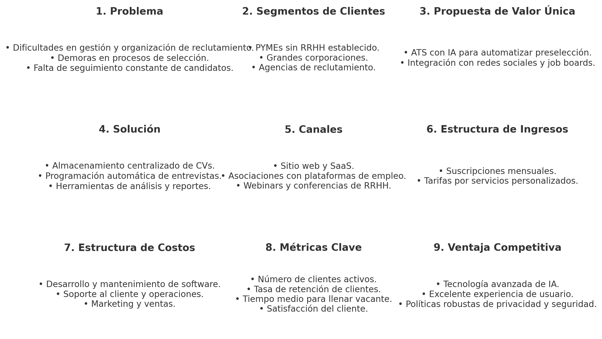
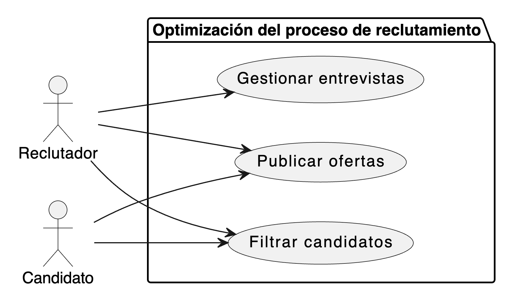
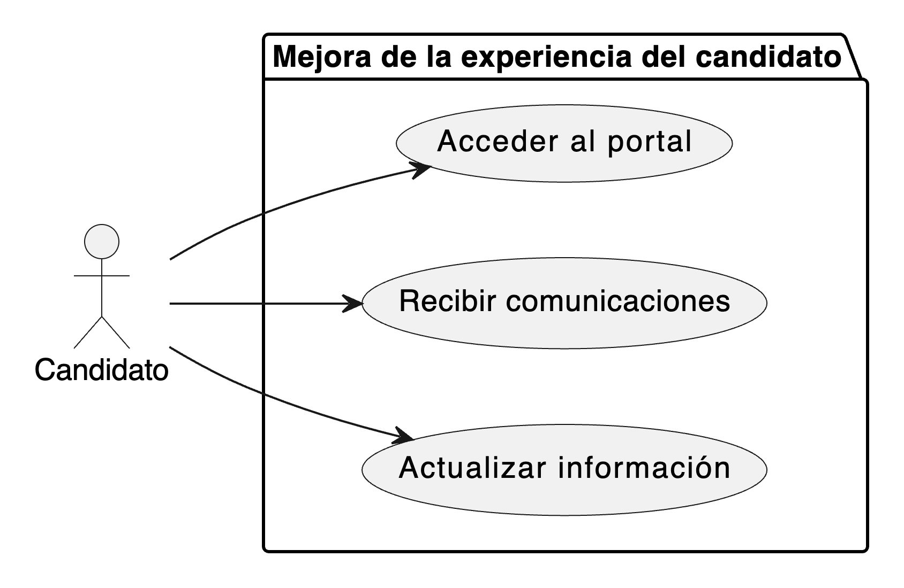
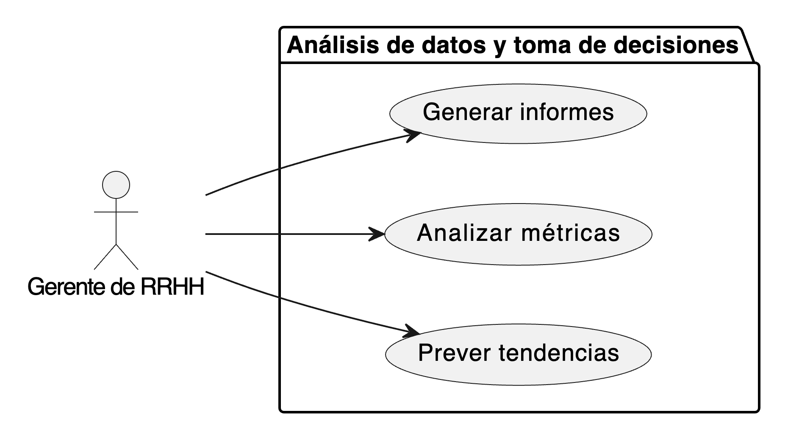
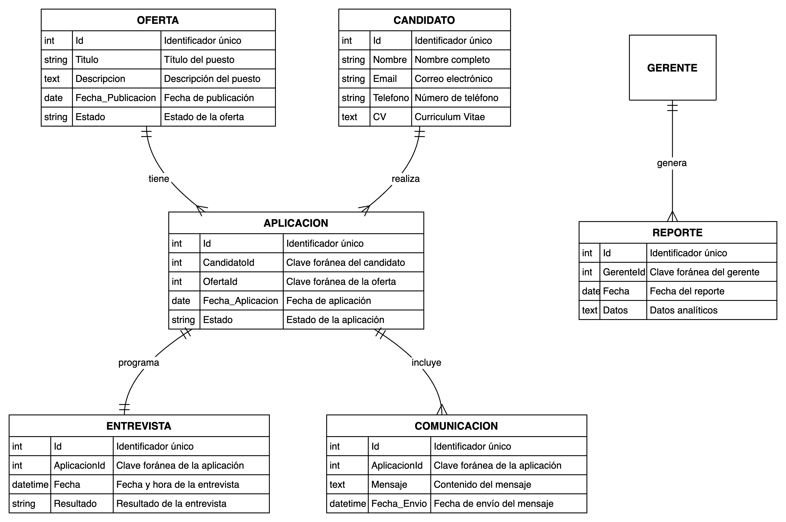

# Sistema de Gestión de Solicitantes (ATS) - Documento de Diseño
## Descripción del Software
Un sistema de seguimiento de candidatos (ATS, por sus siglas en inglés) es una herramienta esencial en el proceso de reclutamiento que ayuda a las organizaciones a gestionar y automatizar muchas de las tareas asociadas con la adquisición de talento. Aquí están las funcionalidades básicas de un ATS, ordenadas de mayor a menor prioridad:

Gestión de candidaturas y almacenamiento de CVs: La función principal de un ATS es organizar y almacenar currículums y aplicaciones en una base de datos centralizada. Permite a los reclutadores buscar, filtrar y gestionar candidatos eficientemente.
Publicación de ofertas de trabajo y distribución: Un ATS permite a los usuarios crear ofertas de trabajo y publicarlas en múltiples plataformas de empleo y redes sociales desde un solo lugar, facilitando el alcance a un mayor número de candidatos.
Filtrado y preselección de candidatos: Los ATS generalmente incluyen herramientas de filtrado que automatizan la preselección de candidatos basándose en palabras clave, habilidades, experiencia previa o educación, ayudando a reducir el volumen de CVs a revisar manualmente.
Seguimiento de candidatos a través del proceso de selección: Estos sistemas permiten a los reclutadores seguir el progreso de cada candidato a través de las diversas etapas del proceso de reclutamiento, desde la aplicación inicial hasta la contratación.
Comunicación con candidatos: Los ATS pueden automatizar la comunicación con los candidatos, enviando correos electrónicos automáticos que notifican sobre el estado de su aplicación o programan entrevistas.
Gestión de entrevistas y programación: Algunos ATS proporcionan herramientas para programar entrevistas y sincronizar agendas entre los candidatos y los entrevistadores.
Análisis y generación de informes: Ofrecen la capacidad de generar informes sobre el proceso de reclutamiento, como el tiempo medio para contratar, la eficacia de las fuentes de reclutamiento y otros indicadores de rendimiento clave.
Integración con otras plataformas: Un ATS eficaz debe integrarse con otras herramientas de recursos humanos (HRIS), plataformas de evaluación de candidatos y, en algunos casos, con software de gestión del rendimiento.
Cumplimiento normativo: Asegura que el proceso de contratación cumpla con las leyes laborales y de privacidad pertinentes, lo que puede incluir la gestión de la igualdad de oportunidades de empleo y otras regulaciones locales.
Estas funcionalidades representan las capacidades básicas que cualquier buen sistema de seguimiento de candidatos debería ofrecer, ayudando a optimizar y mejorar el proceso de reclutamiento.

## customer journey
1. Reconocimiento de la necesidad
Interacción: El cliente identifica desafíos en su proceso de reclutamiento actual, como ineficiencias, errores humanos, o dificultades para escalar el proceso.
Resultado esperado: Conciencia de la necesidad de una solución automatizada para mejorar la gestión del reclutamiento.
2. Investigación y evaluación de opciones
Interacción: El cliente investiga diferentes sistemas de ATS, comparando características, precios, y evaluaciones de otros usuarios.
Resultado esperado: El cliente adquiere una comprensión clara de qué solución de ATS se ajusta mejor a sus necesidades y presupuesto.
3. Selección y compra
Interacción: Después de seleccionar el ATS que mejor se adapta a sus necesidades, el cliente procede a la compra o subscripción del servicio.
Resultado esperado: Transacción completada y preparación para la implementación del sistema.
4. Implementación y configuración
Interacción: Instalación del software y configuración inicial con la ayuda de soporte técnico del proveedor, que puede incluir la integración con otras herramientas de HR.
Resultado esperado: El ATS está operativo y personalizado para las necesidades específicas del cliente.
5. Formación y adopción
Interacción: El cliente y su equipo reciben formación sobre cómo utilizar el sistema eficazmente, lo que puede incluir seminarios web, tutoriales en línea, o sesiones de capacitación en persona.
Resultado esperado: El equipo de reclutamiento está competente en el uso del sistema y comienza a integrarlo en sus procesos diarios.
6. Uso operativo
Interacción: El equipo de reclutamiento usa el ATS diariamente para publicar trabajos, filtrar candidatos, comunicarse con ellos y gestionar el proceso de entrevistas y selección.
Resultado esperado: Mejoras en la eficiencia del proceso de reclutamiento y en la calidad de las contrataciones.
7. Soporte y mantenimiento
Interacción: El cliente accede a soporte continuo y mantenimiento por parte del proveedor para resolver problemas técnicos y actualizar el sistema.
Resultado esperado: El ATS funciona sin problemas y se actualiza regularmente para adaptarse a las nuevas necesidades y tecnologías.
8. Evaluación y feedback
Interacción: El cliente evalúa la efectividad del ATS y proporciona retroalimentación al proveedor.
Resultado esperado: Mejoras y personalizaciones basadas en la experiencia específica del cliente.
9. Expansión y renovación
Interacción: Basándose en la satisfacción con el sistema, el cliente puede decidir expandir su uso del ATS a más departamentos o renovar su suscripción.
Resultado esperado: Compromiso a largo plazo con el proveedor del ATS y expansión del uso dentro de la organización.

## Productos mercado 
¿Qué ATS comerciales son más conocidos? Compáralos en función de "seguimiento de las fases del candidato, sencillo para que el candidato pueda añadir fácilmente su información, fácil de usar tanto recruiter como candidato." y valora cuál sería mejor opción

Los sistemas de seguimiento de candidatos (ATS) comerciales son herramientas fundamentales en la gestión moderna del reclutamiento. Varios productos destacan en el mercado por su eficiencia y facilidades de uso tanto para reclutadores como para candidatos. Aquí se comparan algunos de los ATS comerciales más conocidos: Taleo, Greenhouse, Lever, y SmartRecruiters, enfocándonos en las características de seguimiento de las fases del candidato, la facilidad para que el candidato añada su información y la usabilidad general.

1. Taleo (Oracle)
Seguimiento de fases del candidato: Taleo ofrece un seguimiento detallado y personalizable de cada fase del proceso de reclutamiento, lo que permite a los reclutadores mantener un control riguroso sobre el estado de cada candidatura.
Sencillez para el candidato: Puede ser un poco complejo para los candidatos debido a su interfaz menos intuitiva, lo que a veces resulta en una experiencia de usuario menos favorable.
Facilidad de uso: Es conocido por ser robusto pero también por tener una curva de aprendizaje más pronunciada para los reclutadores.
2. Greenhouse
Seguimiento de fases del candidato: Excelente en el seguimiento detallado de candidatos con informes y dashboards intuitivos que ayudan a visualizar el progreso de los candidatos a lo largo del proceso de selección.
Sencillez para el candidato: Altamente optimizado para que los candidatos puedan añadir su información fácilmente, incluyendo una interfaz amigable y un proceso de aplicación simplificado.
Facilidad de uso: Tanto los reclutadores como los candidatos encuentran a Greenhouse fácil de usar, con una interfaz limpia y una experiencia de usuario agradable.
3. Lever
Seguimiento de fases del candidato: Ofrece un buen seguimiento de candidatos con una interfaz visual que permite a los reclutadores ver rápidamente en qué etapa se encuentra cada candidato.
Sencillez para el candidato: Facilita que los candidatos suban sus datos y apliquen a ofertas de manera intuitiva, apoyándose en una interfaz moderna y accesible.
Facilidad de uso: Tanto reclutadores como candidatos se benefician de la interfaz intuitiva y de las funcionalidades diseñadas para mejorar la eficiencia y la experiencia del usuario.
4. SmartRecruiters
Seguimiento de fases del candidato: Proporciona un seguimiento competente de las fases del proceso de reclutamiento con herramientas que facilitan la gestión y visualización del progreso del candidato.
Sencillez para el candidato: Diseñado para ser accesible y fácil para los candidatos, permitiendo una carga sencilla de CVs y datos personales a través de un sistema amigable.
Facilidad de uso: SmartRecruiters se destaca por ser fácil de usar para los reclutadores, ofreciendo una plataforma intuitiva y flexible.
Valoración y Recomendación
Greenhouse y Lever sobresalen particularmente en proporcionar una experiencia de usuario excelente tanto para reclutadores como para candidatos, y ambos sistemas ofrecen un excelente seguimiento de las etapas del proceso de reclutamiento. Greenhouse, en particular, podría ser la mejor opción para aquellos que valoran tanto una interfaz intuitiva como capacidades avanzadas de seguimiento y análisis. Está muy enfocado en mejorar continuamente la experiencia del usuario y en ofrecer funcionalidades innovadoras que simplifican el proceso de reclutamiento.

Por tanto, si el objetivo es equilibrar una interfaz amigable para el usuario con potentes capacidades de seguimiento, Greenhouse sería una opción ideal. Sin embargo, cada organización tiene necesidades específicas, por lo que se recomienda evaluar estos sistemas en un entorno de prueba o solicitar demostraciones para ver cuál se ajusta mejor a los requisitos y preferencias específicos de tu equipo y candidatos.

## Lean Canvas

## Añadimos 3 casos de uso principales:

### Optimización del proceso de reclutamiento

### Mejora de la experiencia del candidato

### Análisis de datos y toma de decisiones

## Modelo de datos

## Disseño del sistema

# Sistema ATS Innovador - Documentación de Arquitectura

## Descripción General

El Sistema ATS Innovador está diseñado para optimizar el proceso de reclutamiento mediante una arquitectura de microservicios. Este sistema facilita el desarrollo, despliegue y mantenimiento de sus componentes, asegurando la escalabilidad y la flexibilidad para adaptarse a diferentes entornos y necesidades.

## Arquitectura del Sistema

### Paso 1: Diagrama de Contexto (Nivel 1)

El diagrama de contexto muestra cómo el sistema ATS interactúa con usuarios y sistemas externos:

- **Usuarios**: Candidatos, Reclutadores, Gerentes de RRHH.
- **Sistemas Externos**: Plataformas de Redes Sociales, Portales de Empleo, Sistemas de Verificación de Antecedentes, Plataformas de Evaluación de Habilidades, Sistemas de Gestión de Recursos Humanos (HRMS).

### Paso 2: Diagrama de Contenedores (Nivel 2)

El sistema se descompone en varios contenedores que incluyen:

- **Frontend Web**
- **API Gateway**
- **Servicios de Gestión de Candidaturas, Ofertas de Empleo, Comunicaciones y Reportes**
- **Bases de Datos de Candidatos y Ofertas de Empleo**

### Paso 3: Diagrama de Componentes (Nivel 3)

Focalización en el **Servicio de Gestión de Candidaturas** que se descompone en:

- **Controlador de Aplicaciones**
- **Gestor de Candidaturas**
- **Validador de Candidaturas**
- **Repositorio de Candidaturas**
- **Servicio de Notificaciones**
- **Integración con HRMS**

### Paso 4: Diagrama de Código (Nivel 4)

Ejemplo del **Validador de Candidaturas** y del **Repositorio de Candidaturas**, mostrando las clases y métodos que forman parte de estos componentes.

## Diagramas Mermaid

### Diagrama de Contexto

