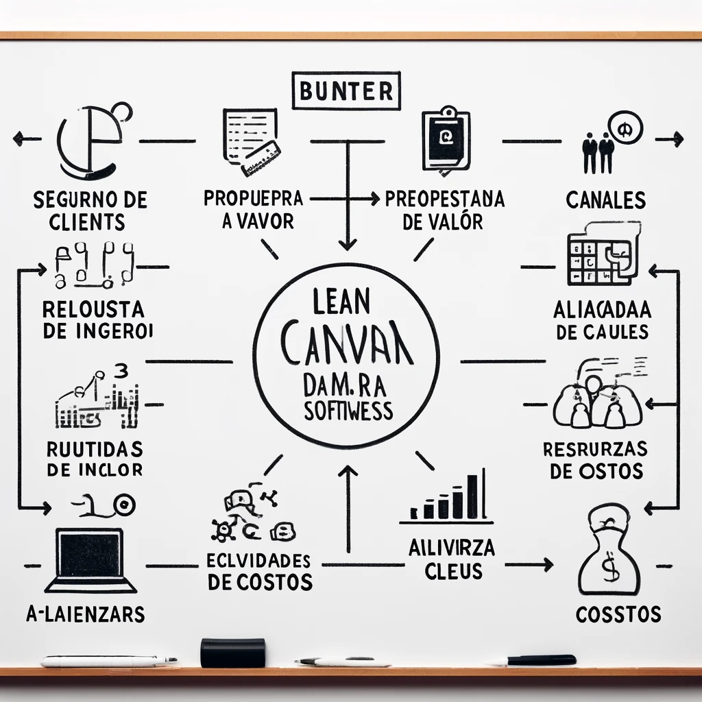
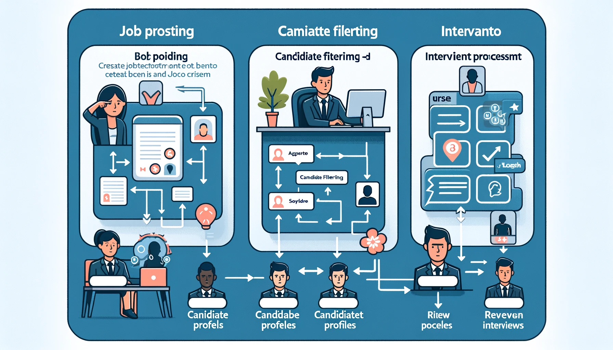
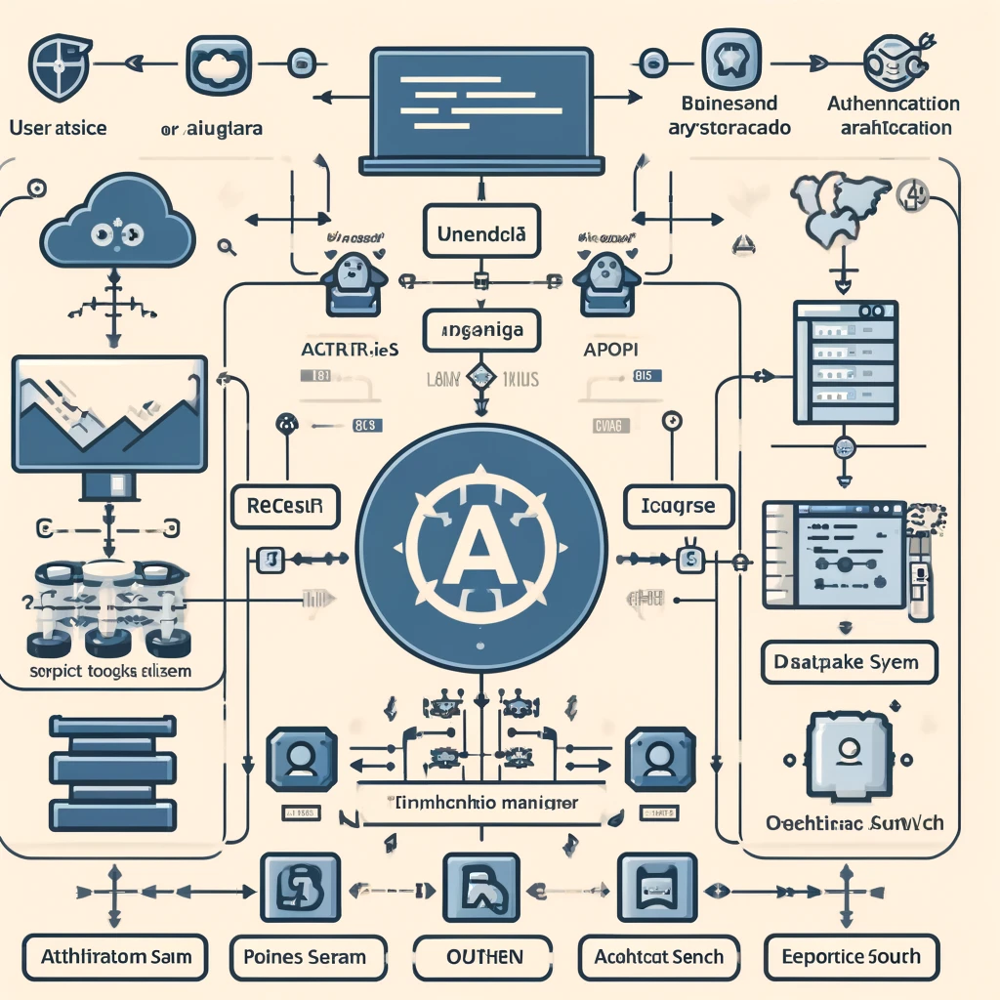
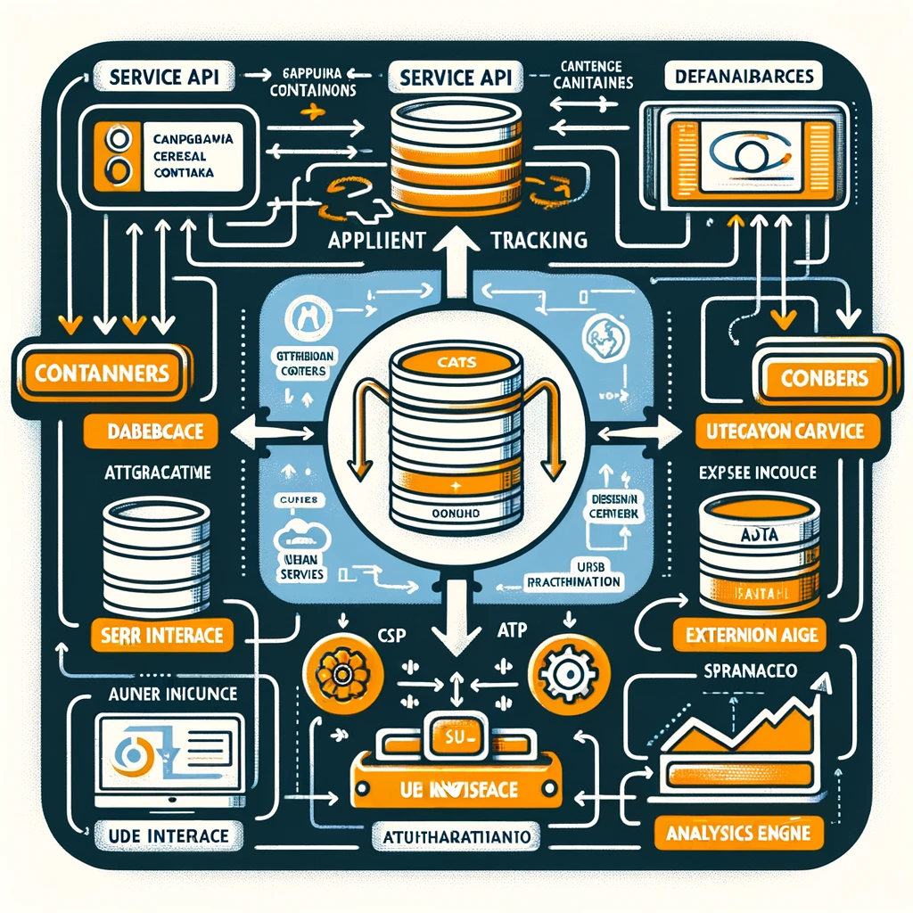

Descripción del Sistema:

Nuestro sistema ATS es una solución de software diseñada para modernizar el proceso de reclutamiento. Facilita la automatización de la gestión de candidaturas, desde la publicación de ofertas de trabajo hasta la selección final del candidato. El sistema permite a los reclutadores publicar vacantes, recibir y clasificar solicitudes, y realizar un seguimiento del progreso de cada candidato a través de las diversas etapas del proceso de selección.

Características clave incluyen:

Publicación de empleos: Integración con múltiples plataformas de empleo para una publicación simultánea de ofertas.
Filtrado de candidatos: Uso de algoritmos avanzados para filtrar automáticamente los currículums basados en palabras clave, habilidades, experiencia y más.
Gestión de entrevistas: Herramientas para programar y seguir entrevistas, incluyendo recordatorios automáticos para candidatos y entrevistadores.
Portal de candidatos: Un espacio dedicado para que los candidatos puedan seguir el estado de sus aplicaciones, subir documentos y recibir actualizaciones.
Análisis e informes: Generación de reportes detallados para evaluar la efectividad del proceso de reclutamiento y tomar decisiones basadas en datos.
Este sistema está diseñado para ser intuitivo y fácil de usar, asegurando que tanto los equipos de recursos humanos como los candidatos tengan una experiencia positiva y productiva durante el proceso de reclutamiento.

Ventajas competitivas:
1. Experiencia del Usuario (UX)
Un ATS con una interfaz intuitiva y fácil de usar puede marcar una gran diferencia, especialmente para los reclutadores que no son técnicamente expertos. Invertir en una UX que minimice la curva de aprendizaje y optimice el flujo de trabajo diario puede ser un gran punto de venta.

2. Integración y Compatibilidad
La capacidad para integrarse sin problemas con otras plataformas (como LinkedIn, Indeed, sistemas de recursos humanos, plataformas de gestión de empleados, software de entrevistas en video, etc.) puede ofrecer una ventaja competitiva importante. Estas integraciones permiten un proceso de reclutamiento más holístico y conectado.

3. Automatización y Personalización
La automatización de tareas repetitivas es fundamental, pero la verdadera ventaja puede venir de la capacidad para personalizar estos procesos. Por ejemplo, algoritmos que se adaptan al estilo y necesidades específicas de reclutamiento de la empresa pueden mejorar significativamente la eficiencia y la satisfacción del usuario.

4. Análisis Avanzados e Inteligencia Artificial
Utilizar la inteligencia artificial para mejorar la calidad del filtrado de candidatos y proporcionar análisis predictivos sobre el éxito del candidato dentro de la empresa podría ser un diferenciador. Además, herramientas de análisis robustas que ofrecen insights en tiempo real sobre la eficacia de las estrategias de reclutamiento podrían ser muy atractivas.

5. Soporte Multilingüe y Localización
Un sistema ATS que soporte múltiples idiomas y que esté localizado para diferentes mercados puede expandir tu alcance y hacer que tu sistema sea atractivo para empresas multinacionales.

6. Cumplimiento y Seguridad de Datos
Asegurar que el software cumpla con las regulaciones locales e internacionales de protección de datos (como GDPR en Europa) puede ser un punto de venta crucial, especialmente para clientes en regiones con regulaciones estrictas.

7. Módulo de Colaboración
Facilitar una colaboración efectiva entre los reclutadores y los gerentes de contratación con herramientas como comentarios en tiempo real, valoraciones compartidas de candidatos, y foros de discusión puede mejorar la toma de decisiones y acelerar el proceso de reclutamiento.

8. Adaptabilidad y Escalabilidad
Un ATS que se adapte fácilmente a las necesidades cambiantes de una empresa, ya sea que esté en fase de crecimiento acelerado o en reestructuración, puede ofrecer una ventaja competitiva sostenible.

Lean Canvas

Casos de uso:
1. Publicación de Ofertas de Trabajo
Actores Principales:
Reclutador
Descripción:
El reclutador utiliza el sistema ATS para crear y publicar ofertas de trabajo en múltiples plataformas de empleo integradas. Este proceso incluye la redacción de la descripción del puesto, la determinación de los requisitos necesarios y la selección de los canales de publicación.

Flujo de eventos:
El reclutador inicia sesión en el ATS.
El reclutador crea una nueva oferta de trabajo.
El reclutador ingresa detalles del puesto (título, descripción, habilidades necesarias, etc.).
El reclutador selecciona las plataformas en las que desea publicar la oferta.
El sistema publica la oferta en los canales seleccionados.

2. Filtrado y Selección de Candidatos
Actores Principales:
Reclutador
Sistema ATS (automatización)
Descripción:
Una vez que los candidatos aplican, el sistema ATS automáticamente filtra las solicitudes basándose en criterios predefinidos como palabras clave, experiencia y habilidades. Los reclutadores luego revisan los candidatos preseleccionados y avanzan con los más adecuados.

Flujo de eventos:
El sistema recibe aplicaciones de candidatos.
El ATS filtra las aplicaciones usando algoritmos de IA basados en los criterios definidos por el reclutador.
El reclutador revisa los perfiles filtrados y selecciona candidatos para entrevistas.
El reclutador programa entrevistas a través del sistema.

3. Gestión de Procesos de Entrevista
Actores Principales:
Reclutador
Candidato
Gerente de contratación
Descripción:
El sistema permite a los reclutadores gestionar todo el proceso de entrevista, desde la programación hasta la recolección de feedback de los entrevistadores. Los candidatos reciben notificaciones y actualizaciones sobre sus entrevistas a través del portal de candidatos.

Flujo de eventos:
El reclutador programa una entrevista con un candidato seleccionado.
El candidato recibe una notificación y detalles de la entrevista.
La entrevista se lleva a cabo.
Los entrevistadores ingresan sus comentarios en el sistema.
El reclutador recopila y revisa el feedback para tomar una decisión de contratación.

Modelo de datos:
Entidades y Atributos
* Empleo
    IdEmpleo (integer): Identificador único para cada empleo.
    Titulo (string): Título del empleo.
    Descripcion (string): Descripción detallada del empleo.
    Ubicacion (string): Ubicación del puesto.
    TipoContrato (string): Tipo de contrato ofrecido.
    FechaPublicacion (date): Fecha en que el empleo fue publicado.
    Estado (string): Estado del proceso de reclutamiento para este empleo.
* Candidato
    IdCandidato (integer): Identificador único para cada candidato.
    Nombre (string): Nombre del candidato.
    CorreoElectronico (string): Correo electrónico del candidato.
    Telefono (string): Número de teléfono del candidato.
    Curriculum (string): URL al currículum o archivo adjunto.
    Estado (string): Estado actual del candidato en el proceso de selección.
* Aplicacion
    IdAplicacion (integer): Identificador único para cada aplicación.
    IdCandidato (integer): Identificador del candidato que aplica.
    IdEmpleo (integer): Identificador del empleo al que aplica.
    FechaAplicacion (date): Fecha en que el candidato aplicó.
    Comentarios (string): Comentarios o notas sobre la aplicación.
* Entrevista
    IdEntrevista (integer): Identificador único para cada entrevista.
    IdAplicacion (integer): Identificador de la aplicación asociada.
    FechaHora (datetime): Fecha y hora programadas para la entrevista.
    Formato (string): Indica si la entrevista es presencial, telefónica, o por videoconferencia.
    Resultado (string): Resultado de la entrevista.
* Reclutador
    IdReclutador (integer): Identificador único para cada reclutador.
    Nombre (string): Nombre del reclutador.
    CorreoElectronico (string): Correo electrónico del reclutador.

* Relaciones
    Empleo a Aplicacion: Un empleo puede tener múltiples aplicaciones. Relación 1 a muchos.
    Candidato a Aplicacion: Un candidato puede tener múltiples aplicaciones. Relación 1 a muchos.
    Aplicacion a Entrevista: Una aplicación puede tener múltiples entrevistas. Relación 1 a muchos.
    Reclutador a Empleo: Un reclutador puede publicar múltiples empleos. Relación 1 a muchos.

Componentes del sistema:
1. Interfaz de Usuario (UI)
    Descripción: Proporciona la interfaz gráfica a través de la cual los usuarios interactúan con el sistema. Está diseñada para ser intuitiva y accesible para facilitar todas las operaciones relacionadas con la gestión de candidatos y empleos.
    Tecnologías Sugeridas: React o Angular para una aplicación web dinámica y responsiva.

2. API de Servicios
    Descripción: Actúa como un intermediario entre la interfaz de usuario y la base de datos, gestionando las solicitudes y respuestas dentro del sistema. Provee endpoints para operaciones como crear, recuperar, actualizar y eliminar (CRUD) información de candidatos, empleos, aplicaciones y entrevistas.
    Tecnologías Sugeridas: Node.js con Express para la creación de una API RESTful.
3. Lógica de Negocio
    Descripción: Contiene las reglas de negocio del sistema ATS, como la validación de datos, la lógica de filtrado de candidatos, y la programación de entrevistas. Este módulo asegura que las operaciones cumplen con los requisitos del negocio.
    Tecnologías Sugeridas: Python o Java, dependiendo de la complejidad y los requerimientos de rendimiento.
4. Gestor de Base de Datos
    Descripción: Responsable de la gestión de todas las transacciones de datos. Incluye la ejecución de consultas, la actualización de registros y la garantía de la integridad y seguridad de los datos.
    Tecnologías Sugeridas: PostgreSQL o MySQL para manejar relaciones complejas de datos.
5. Sistema de Autenticación y Autorización
    Descripción: Asegura que solo los usuarios autorizados puedan acceder a las funciones específicas del sistema. Maneja la autenticación de usuarios y la asignación de roles y permisos.
    Tecnologías Sugeridas: OAuth y JWT (JSON Web Tokens) para una gestión segura de las sesiones y autenticación de usuarios.
6. Motor de Análisis y Reportes
    Descripción: Procesa los datos recopilados para proporcionar análisis y generar reportes que ayuden a los reclutadores y gerentes a tomar decisiones informadas.
    Tecnologías Sugeridas: Elasticsearch para análisis en tiempo real y Tableau para visualización de reportes.

Diagrama C4 API de Servicios
1. Contexto
    Describe cómo el sistema ATS en general interactúa con los usuarios finales (reclutadores, candidatos, gerentes de contratación) y otros sistemas externos (plataformas de empleo, herramientas de comunicación).
2. Contenedores (foco en la API de Servicios)
    API de Servicios: Este contenedor gestiona las solicitudes HTTP entrantes, ejecuta la lógica de negocios adecuada y comunica los resultados a los clientes o a otros contenedores. Se comunica con la Base de Datos y posiblemente con servicios externos para autenticación o integraciones.
3. Componentes (dentro de la API de Servicios)
    Detalla los componentes individuales dentro de la API de Servicios, como los controladores para manejar diferentes tipos de solicitudes (empleos, candidatos, aplicaciones, entrevistas), middleware de autenticación, y módulos de lógica de negocio específicos.
4. Código
    Este nivel profundiza en la implementación real, mostrando clases, funciones, y métodos específicos dentro de cada componente.

