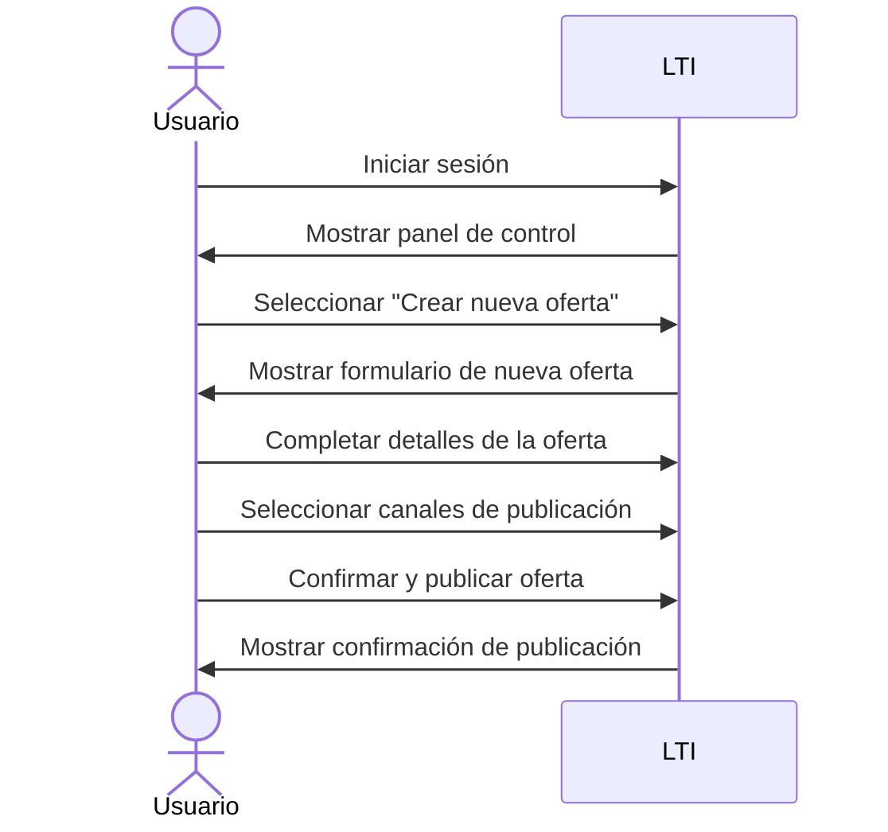
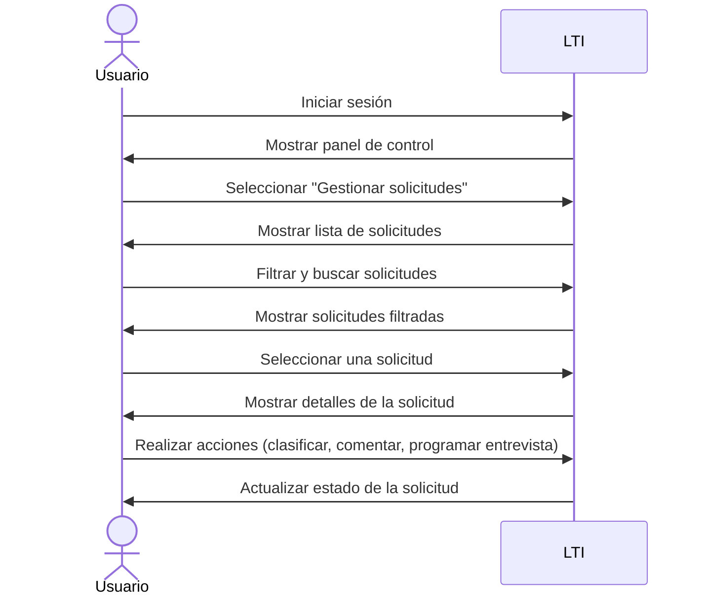
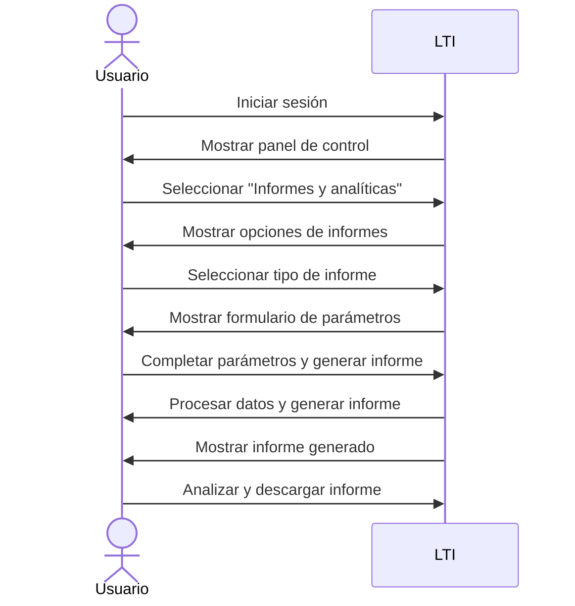
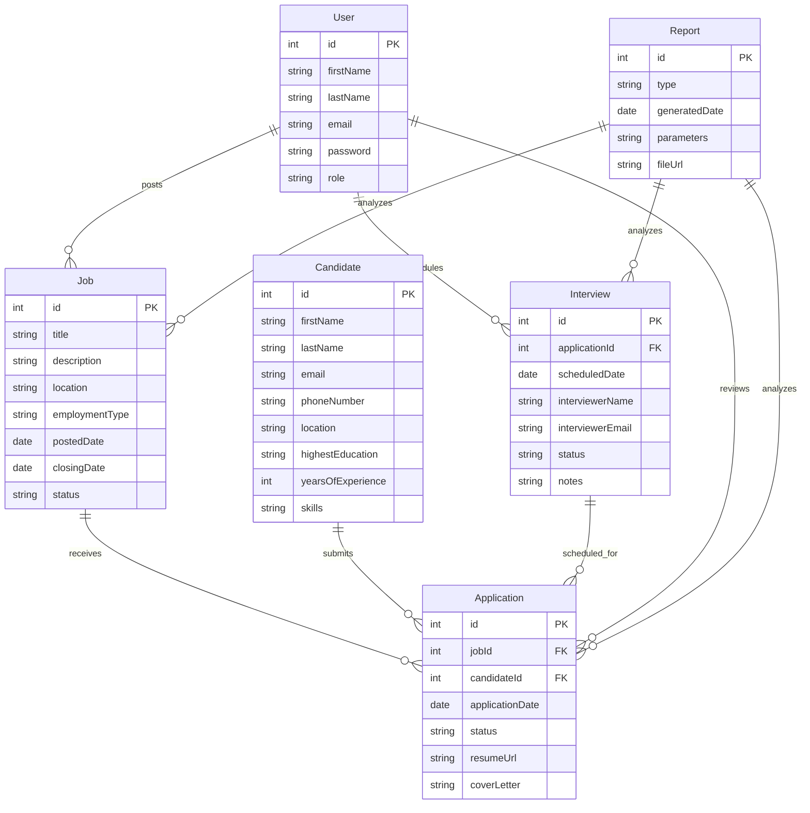

# Descripción de LTI:
LTI es un Sistema de Seguimiento de Candidatos (ATS) innovador y completo, diseñado para optimizar y agilizar el proceso de contratación de las empresas. Con una interfaz intuitiva y funcionalidades avanzadas, LTI permite a los equipos de reclutamiento gestionar de manera eficiente todas las etapas del ciclo de contratación, desde la publicación de ofertas hasta la selección final de candidatos.

# Valor añadido y ventajas competitivas:
- Automatización inteligente: LTI utiliza tecnologías de inteligencia artificial y aprendizaje automático para automatizar tareas repetitivas, realizar recomendaciones de candidatos y optimizar la búsqueda y el filtrado de perfiles, lo que ahorra tiempo y mejora la calidad de las contrataciones.
- Personalización y adaptabilidad: LTI ofrece un alto grado de personalización, permitiendo a las empresas adaptar la plataforma a sus procesos y necesidades específicas. Además, su arquitectura modular y escalable facilita la integración con otras herramientas y sistemas utilizados por la empresa.
- Experiencia excepcional para candidatos: LTI proporciona una interfaz atractiva y fácil de usar para los candidatos, con funcionalidades como la postulación con un solo clic, el seguimiento en tiempo real del estado de la solicitud y la comunicación directa con el equipo de reclutamiento, lo que mejora significativamente la experiencia del candidato.
- Analíticas avanzadas y reporting: LTI genera informes y análisis detallados sobre el rendimiento del proceso de contratación, permitiendo a las empresas identificar áreas de mejora, optimizar sus estrategias de reclutamiento y tomar decisiones basadas en datos.

# Funciones principales:
1. Publicación de ofertas de empleo: LTI permite crear y publicar ofertas de trabajo en múltiples canales, incluyendo el sitio web de la empresa, tableros de empleo, redes sociales y plataformas especializadas, ampliando el alcance y atrayendo a un mayor número de candidatos cualificados.
2. Gestión de solicitudes: LTI recopila y organiza automáticamente todas las solicitudes recibidas, permitiendo al equipo de reclutamiento revisar, filtrar y clasificar los perfiles de manera eficiente. Además, ofrece herramientas de colaboración para que varios miembros del equipo puedan acceder y aportar comentarios sobre los candidatos.
3. Búsqueda y filtrado avanzado: LTI utiliza algoritmos de búsqueda y filtrado avanzados para identificar rápidamente a los candidatos más adecuados según criterios específicos, como habilidades, experiencia, ubicación y otros requisitos del puesto.
4. Comunicación y seguimiento: LTI facilita la comunicación continua con los candidatos a través de correos electrónicos automatizados, mensajes personalizados y programación de entrevistas. Además, permite realizar un seguimiento detallado de cada etapa del proceso de contratación, asegurando que ningún candidato pase desapercibido.
5. Pruebas y evaluaciones en línea: LTI se integra con herramientas de evaluación y pruebas en línea, permitiendo a las empresas aplicar cuestionarios, pruebas de habilidades y evaluaciones psicométricas directamente desde la plataforma, lo que agiliza el proceso de selección y proporciona información valiosa sobre los candidatos.
6. Onboarding y gestión de contrataciones: Una vez seleccionado el candidato final, LTI facilita el proceso de onboarding, permitiendo la recopilación de documentos necesarios, la firma electrónica de contratos y la integración con el sistema de gestión del capital humano de la empresa.

# Diagrama Lean Canvas:

| Problema                                                    | Solución                                                      | Proposición de valor única                                                                                                                                                                                    |
|-------------------------------------------------------------|---------------------------------------------------------------|---------------------------------------------------------------------------------------------------------------------------------------------------------------------------------------------------------------|
| 1. Procesos de contratación ineficientes y manuales         | 1. Automatización inteligente con IA y aprendizaje automático | LTI es un ATS innovador y completo que optimiza y agiliza el proceso de contratación, ofreciendo automatización inteligente, personalización, experiencia excepcional para candidatos y analíticas avanzadas. |
| 2. Dificultad para atraer y seleccionar talento cualificado | 2. Alta personalización y adaptabilidad                       |                                                                                                                                                                                                               |
| 3. Falta de automatización y analíticas                     | 3. Experiencia excepcional para candidatos                    |                                                                                                                                                                                                               |
|                                                             | 4. Analíticas avanzadas y reporting                           |                                                                                                                                                                                                               |

| Métricas clave                              | Canales                              | Segmento de clientes                                                    |
|---------------------------------------------|--------------------------------------|-------------------------------------------------------------------------|
| 1. Tiempo de contratación                   | 1. Sitio web propio                  | 1. Empresas medianas y grandes con procesos de contratación complejos   |
| 2. Tasa de conversión de candidatos         | 2. Redes sociales                    | 2. Sectores con alta rotación y necesidades de contratación recurrentes |
| 3. Satisfacción de candidatos y empleadores | 3. Eventos y conferencias del sector |                                                                         |
| 4. Adopción y uso de la plataforma          | 4. Asociaciones y partnerships       |                                                                         |

| Estructura de costes                           | Flujo de ingresos                            |
|------------------------------------------------|----------------------------------------------|
| 1. Desarrollo y mantenimiento de la plataforma | 1. Suscripciones mensuales o anuales         |
| 2. Infraestructura y hosting                   | 2. Fees por implementación y onboarding      |
| 3. Equipo de ventas y soporte                  | 3. Servicios adicionales y personalizaciones |
| 4. Marketing y adquisición de clientes         |                                              |

# 3 Casos de uso principales:

1. Publicación de una oferta de empleo:

En este caso de uso, el usuario inicia sesión en LTI, selecciona la opción para crear una nueva oferta de empleo, completa los detalles de la oferta, elige los canales de publicación y confirma la publicación. LTI procesa la solicitud y muestra una confirmación de que la oferta se ha publicado correctamente.

2. Gestión de solicitudes de candidatos:

En este caso de uso, el usuario inicia sesión en LTI, selecciona la opción para gestionar solicitudes de candidatos, filtra y busca solicitudes, selecciona una solicitud para ver sus detalles y realiza acciones como clasificar, comentar o programar una entrevista. LTI actualiza el estado de la solicitud en consecuencia.

3. Generación de informes y analíticas:

En este caso de uso, el usuario inicia sesión en LTI, selecciona la opción para acceder a informes y analíticas, elige el tipo de informe que desea generar, completa los parámetros necesarios y genera el informe. LTI procesa los datos y genera el informe, que el usuario puede analizar y descargar.

# Modelo de datos:

En este modelo de datos, tenemos las siguientes entidades principales:

1. `Job`: Representa una oferta de empleo, con atributos como título, descripción, ubicación, tipo de empleo, fecha de publicación, fecha de cierre y estado.

2. `Application`: Representa una solicitud de empleo, con atributos como fecha de solicitud, estado, URL del currículum y carta de presentación. Está relacionada con `Job` y `Candidate`.

3. `Candidate`: Representa a un candidato, con atributos como nombre, apellido, correo electrónico, número de teléfono, ubicación, educación más alta, años de experiencia y habilidades.

4. `Interview`: Representa una entrevista programada, con atributos como fecha programada, nombre y correo electrónico del entrevistador, estado y notas. Está relacionada con `Application`.

5. `User`: Representa a un usuario del sistema LTI, con atributos como nombre, apellido, correo electrónico, contraseña y rol. Está relacionado con `Job`, `Application` y `Interview`.

6. `Report`: Representa un informe generado, con atributos como tipo, fecha de generación, parámetros y URL del archivo. Está relacionado con `Job`, `Application` y `Interview`.

# Diseño del sistema a alto nivel:

1. El frontend de la aplicación se desarrollará utilizando React y se alojará en Amazon S3, aprovechando su capacidad para alojar sitios web estáticos de forma escalable y rentable.

2. El backend de la aplicación se implementará utilizando AWS Lambda, que permite ejecutar código sin aprovisionar ni administrar servidores. Las funciones Lambda se encargarán de procesar las solicitudes del frontend y interactuar con otros servicios de AWS.

3. La base de datos principal será Amazon RDS (Relational Database Service) con PostgreSQL como motor de base de datos. RDS proporciona una solución de base de datos administrada, escalable y de alta disponibilidad.

4. Amazon Cognito se utilizará para la autenticación y autorización de usuarios. Cognito permite el registro, inicio de sesión y gestión de usuarios de forma segura y escalable.

5. Amazon S3 se utilizará también para almacenar los archivos adjuntos, como los currículums de los candidatos. S3 proporciona un almacenamiento escalable y duradero para los archivos.

6. Amazon CloudFront se utilizará como una red de entrega de contenido (CDN) para distribuir el contenido estático del frontend de manera eficiente y reducir la latencia para los usuarios finales.

7. Amazon SES (Simple Email Service) se utilizará para enviar correos electrónicos transaccionales, como confirmaciones de registro o notificaciones a los candidatos.

8. AWS Step Functions se utilizará para orquestar y automatizar los flujos de trabajo de contratación, como la programación de entrevistas y el seguimiento de los candidatos.

9. Amazon CloudWatch se utilizará para la monitorización y el registro de la aplicación, lo que permitirá el seguimiento del rendimiento, la detección de errores y la generación de alertas.

# Diagrama C4 - Componente "lambda Functions":

En este diagrama C4, nos enfocamos en el componente de Lambda Functions del backend. Dentro de este componente, tenemos cinco servicios principales:

1. Job Service: Este servicio se encarga de manejar las operaciones relacionadas con las ofertas de trabajo, como crear, actualizar y eliminar ofertas. Interactúa con la base de datos PostgreSQL y el almacenamiento S3 para persistir los datos y almacenar archivos relacionados con las ofertas.

2. Application Service: Este servicio maneja las operaciones relacionadas con las solicitudes de empleo, como la creación, actualización y eliminación de solicitudes. Interactúa con la base de datos PostgreSQL, el almacenamiento S3 para almacenar archivos adjuntos y el servicio de correo electrónico SES para enviar notificaciones a los candidatos.

3. Candidate Service: Este servicio se encarga de las operaciones relacionadas con los candidatos, como la creación, actualización y eliminación de perfiles de candidatos. Interactúa con la base de datos PostgreSQL, el almacenamiento S3 para almacenar archivos relacionados con los candidatos y el servicio de correo electrónico SES para la comunicación con los candidatos.

4. Interview Service: Este servicio maneja las operaciones relacionadas con las entrevistas, como la programación, actualización y cancelación de entrevistas. Interactúa con la base de datos PostgreSQL y el servicio de correo electrónico SES para enviar notificaciones a los entrevistadores y candidatos.

5. Reporting Service: Este servicio se encarga de generar informes y análisis basados en los datos almacenados en la base de datos PostgreSQL y los archivos almacenados en S3. Interactúa con la base de datos y el almacenamiento para recuperar los datos necesarios para los informes.

