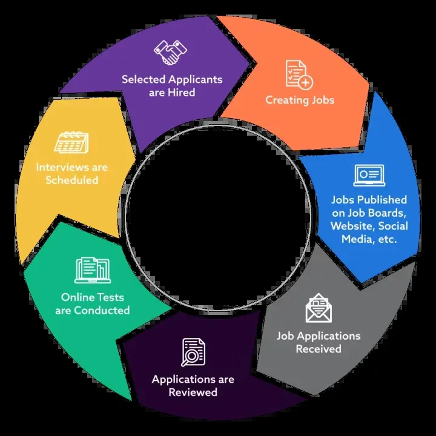

1. Qué puedes leer de la siguiente imagen?  
   
2. Eres un experto en producto, con experiencia en ATS. ¿Qué funcionalidades básicas tiene un ATS? Descríbemelas en un listado, ordenado de mayor a menor prioridad.
3. ¿Qué beneficios obtiene el cliente de un ATS para considerar su uso?
4. ¿Qué alternativas tiene a usar un ATS y cuando pueden ser relevantes?
5. ¿Cómo es el customer journey normal de un cliente que usa un ATS? Descríbeme paso a paso todas las interacciones.
6. ¿Qué ATS open source son más conocidos?
7. Quiero realizar un software ATS desde 0, el software se llamará LTI. A partir de toda la información que me diste y el diagrama inicial, podrías darme una descripción breve del software LTI, valor añadido y ventajas competitivas, además de la explicación de las funciones principales.
8. Podrías generar a partir de todo esto un lean canvas? ojalá, pudieras usar un diagrama hecho con código.
9. Podrías dármelo en formato markdown?
10. Me refiero, a que me lo des en código markdown.
11. Podrías darme una descripción de los 3 casos de uso principales, con el diagrama asociado a cada uno en formato mermaid?
12. Ahora, podrías generar el modelo de datos que cubra entidades, atributos (nombre y tipo) y relaciones en formato mermaid?
13. Ahora, eres un experto arquitecto de software, podrías darme un diseño del sistema a alto nivel, tanto explicado como con un diagrama para AWS y hecho en Diagrams con el lenguaje python.
14. Podrías darme un diagrama C4 que llegue en profundidad a uno de los componentes del sistema, el que prefieras?
15. Podrías darme una lista de todos los prompts que te he hecho, numerados, en código MarkDown?
