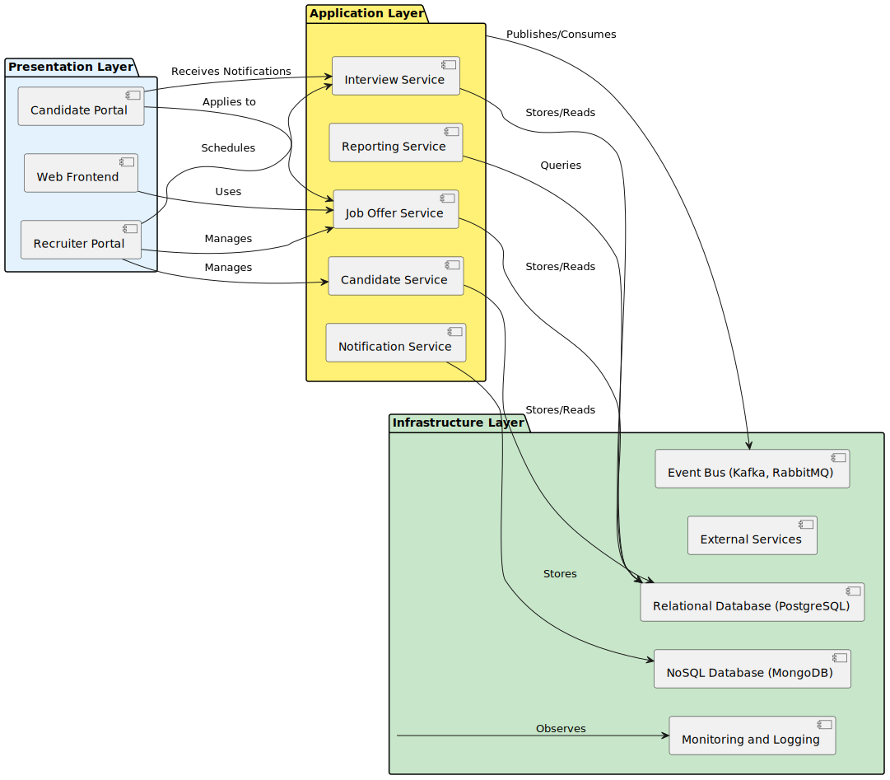
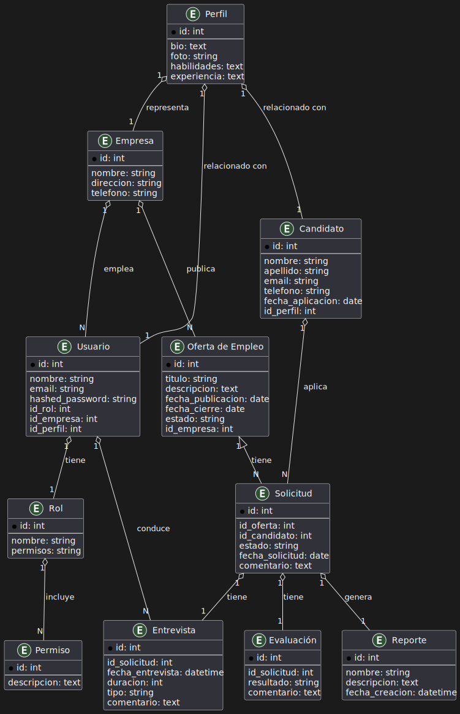
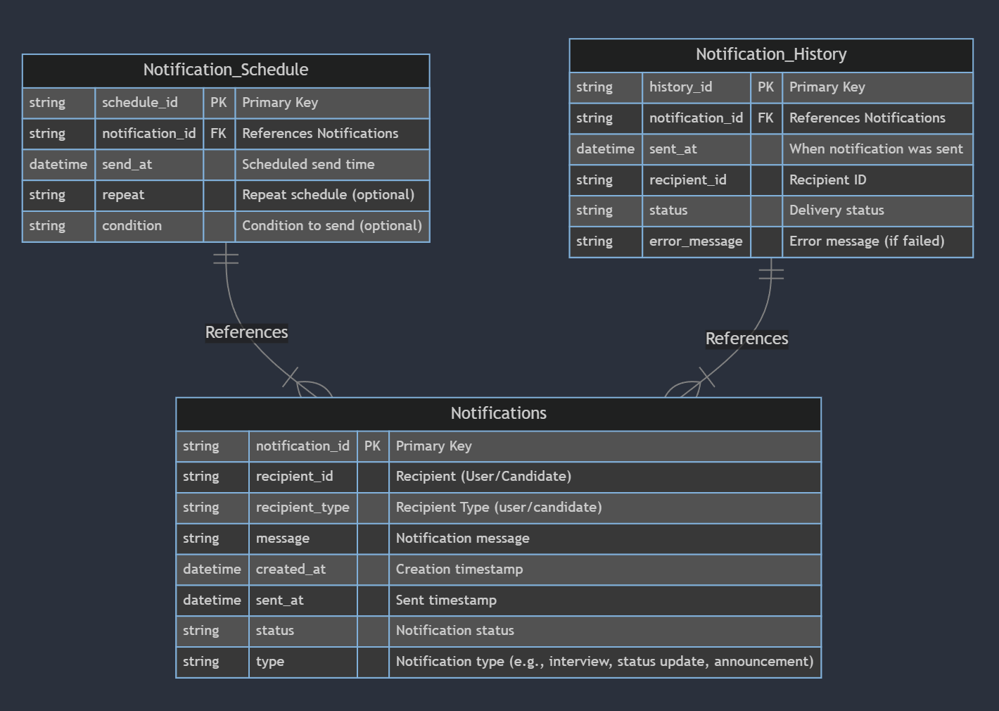

# Outline para la Arquitectura de la Plataforma ATS de LTI

## 1. Arquitectura de Infraestructura
### 1.1. Arquitectura de Nube
- **Proveedor de Nube**: Identificar el proveedor de nube (AWS, Azure, GCP) que soportará la infraestructura.
- **Modelos de Despliegue**: Despliegue basado en contenedores para flexibilidad y escalabilidad.
- **Regiones y Zonas de Disponibilidad**: Considerar el despliegue en múltiples regiones para redundancia y alta disponibilidad.
- **Escalabilidad Automática**: Implementar escalabilidad automática para manejar fluctuaciones en la carga.

### 1.2. Microservicios
- **Separación de Servicios**: Dividir la funcionalidad del ATS en microservicios independientes (por ejemplo, gestión de ofertas, procesamiento de candidaturas, programación de entrevistas, generación de informes).
- **Comunicación entre Microservicios**: Utilizar herramientas de mensajería o APIs REST para la comunicación entre microservicios.
- **Tolerancia a Fallos**: Implementar mecanismos de resiliencia y tolerancia a fallos (como Circuit Breakers, Retries, Timeouts).

### 1.3. Seguridad y Cumplimiento
- **Autenticación y Autorización**: Utilizar OAuth2.0 y JWT para autenticación segura.
- **Protección de Datos**: Cifrado de datos en tránsito y en reposo, con gestión segura de claves.
- **Cumplimiento Normativo**: Asegurar el cumplimiento de regulaciones como GDPR y CCPA.

## 2. Bases de Datos
### 2.1. Elección del Tipo de Base de Datos
- **Base de Datos Relacional**: Para datos estructurados y requerimientos ACID (como PostgreSQL o MySQL).
- **Base de Datos NoSQL**: Para datos no estructurados o grandes volúmenes (como MongoDB o Cassandra).

### 2.2. Arquitectura de Base de Datos
- **Sharding y Particionamiento**: Para escalabilidad y rendimiento.
- **Replicación y Redundancia**: Para alta disponibilidad y recuperación ante desastres.
- **Índices y Optimización**: Optimización para consultas rápidas, especialmente para informes y análisis.

### 2.3. Almacenamiento de Datos Sensibles
- **Separación de Datos Sensibles**: Mantener datos sensibles separados para mayor seguridad.
- **Cifrado y Acceso Restringido**: Implementar mecanismos para proteger datos sensibles, con control de acceso granular.

## 3. Diseño del Sistema a Alto Nivel
### 3.1. Capas de la Aplicación
- **Capa de Presentación**: Front-end basado en frameworks modernos (como React, Angular, o Vue).
- **Capa de Lógica de Negocio**: Gestión de procesos y reglas de negocio, basada en microservicios.
- **Capa de Datos**: Interacción con bases de datos y gestión de almacenamiento.

### 3.2. Interfaces y APIs
- **APIs RESTful**: Para comunicación entre front-end y back-end.
- **APIs para Integraciones Externas**: Facilitar integraciones con otros sistemas (como plataformas de videoconferencia y pruebas).

### 3.3. Herramientas de DevOps
- **Automatización de Despliegue**: Uso de CI/CD para automatizar el proceso de despliegue.
- **Monitoreo y Logging**: Herramientas de monitoreo (como Prometheus, Grafana) para seguimiento y diagnóstico.
- **Gestión de Configuración**: Utilizar herramientas como Ansible o Terraform para gestionar la infraestructura.

### 3.4. Experiencia del Usuario
- **Diseño Intuitivo**: Interfaz amigable para usuarios y candidatos.
- **Accesibilidad**: Cumplimiento con estándares de accesibilidad (como WCAG).
- **Compatibilidad Móvil**: Diseño responsivo para soporte en dispositivos móviles.

---

# Arquitectura

- Presentation Layer: Representa la capa de interacción con el usuario, incluidos el "Web Frontend", el "Recruiter Portal", y el "Candidate Portal".
- Application Layer: Consiste en los microservicios que representan las funcionalidades de negocio. Estos incluyen "Job Offer Service", "Candidate Service", "Interview Service", "Reporting Service", y "Notification Service".
- Infrastructure Layer: Incluye la infraestructura subyacente que soporta la aplicación, como el "Relational Database (PostgreSQL)", "NoSQL Database (MongoDB)", "Event Bus (Kafka, RabbitMQ)", y "External Services".
- Interaction Between Layers: Muestra cómo interactúan las capas entre sí. La presentación interactúa con los microservicios, y estos a su vez interactúan con la infraestructura para almacenar datos, enviar eventos, y utilizar servicios externos.

# Base de datos

## PostgreSQL

## MongoDB

