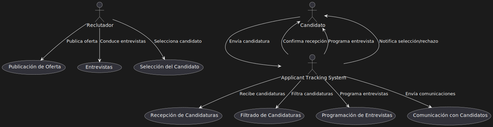
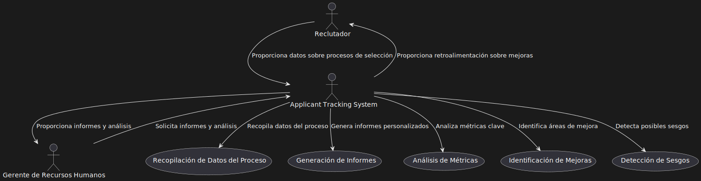

# Casos de Uso Principales para el ATS de LTI

## 1. Proceso de Selección Eficiente y Automatizado
### Descripción:
La empresa utiliza el ATS para gestionar de manera eficiente el proceso de selección, desde la publicación de ofertas hasta la contratación del candidato. El sistema permite automatizar tareas repetitivas, como el filtrado de currículums y la programación de entrevistas, lo que reduce el tiempo y el esfuerzo requeridos por el equipo de recursos humanos.

### Beneficios:
- Ahorro de tiempo y recursos humanos al eliminar tareas manuales y optimizar el proceso de selección.
- Mayor precisión y coherencia en el filtrado y la evaluación de candidatos.
- Reducción del tiempo para cubrir vacantes críticas.

### Ejemplo de Flujo:
1. La empresa publica una oferta de empleo a través del ATS en múltiples canales.
2. El ATS recibe las solicitudes y utiliza filtros automáticos para identificar a los candidatos más adecuados.
3. El sistema programa entrevistas automáticamente según la disponibilidad de los reclutadores y candidatos.
4. Los reclutadores utilizan el ATS para llevar a cabo las entrevistas y tomar notas.
5. El sistema ayuda a seleccionar y comunicar la decisión final al candidato exitoso.

### Diagrama de Flujo:

Los actores principales son la empresa (o el reclutador), el candidato y el ATS (Applicant Tracking System)

- El "Reclutador" (R) representa a la empresa o el equipo de recursos humanos que gestiona el proceso de selección.
- El "Candidato" (C) es el candidato que aplica para la posición.
- El "Applicant Tracking System" (ATS) es el sistema de seguimiento de candidatos.

El diagrama muestra cómo el reclutador publica una oferta, el ATS recibe las candidaturas, las filtra y programa entrevistas, mientras el reclutador lleva a cabo las entrevistas y selecciona al candidato final. El ATS también gestiona la comunicación con los candidatos, confirmando la recepción de solicitudes, programando entrevistas y notificando la selección o el rechazo.

## 2. Mejora de la Experiencia del Candidato
### Descripción:
El ATS está diseñado para ofrecer una experiencia del candidato fluida y positiva. La plataforma permite a los candidatos seguir su progreso, recibir actualizaciones y obtener retroalimentación en cada etapa del proceso de selección. Esto mejora la percepción de la empresa como empleador y reduce la frustración del candidato.

### Beneficios:
- Mayor satisfacción del candidato y mejora de la reputación de la empresa como empleador.
- Reducción de la tasa de abandono de candidatos debido a procesos de selección confusos o largos.
- Facilita la comunicación transparente y oportuna con los candidatos.

### Ejemplo de Flujo:
1. El candidato presenta su solicitud a través del ATS y recibe confirmación inmediata.
2. El ATS permite al candidato seguir su progreso y recibir actualizaciones automáticas.
3. Si se programa una entrevista, el candidato puede elegir horarios disponibles y obtener recordatorios.
4. En caso de ser rechazado, el candidato recibe una notificación con retroalimentación sobre el motivo.
5. Si el candidato es seleccionado, el sistema proporciona información clara sobre el proceso de contratación y onboarding.

### Diagrama de Flujo:

- El "Reclutador" (R) representa a la empresa o al equipo de recursos humanos.
- El "Candidato" (C) es el actor central que busca tener una experiencia positiva.
- El "Applicant Tracking System" (ATS) es el sistema que facilita las interacciones entre el reclutador y el candidato.

El diagrama muestra cómo el ATS confirma la recepción de la candidatura, permite al candidato seguir el proceso, programa entrevistas y proporciona información sobre el estado de la solicitud. También incluye la capacidad de dar retroalimentación a los candidatos y de comunicarse en cada etapa del proceso. El reclutador actualiza el estado del proceso, permitiendo al ATS compartir esa información con el candidato.

Este enfoque mejora la experiencia del candidato, brindando transparencia y manteniendo al candidato informado durante todo el proceso de selección.

## 3. Análisis y Mejora del Proceso de Selección
### Descripción:
La empresa utiliza el ATS para obtener análisis y métricas detalladas sobre el proceso de selección, permitiendo identificar áreas de mejora y optimizar la contratación futura. El sistema puede generar informes personalizados y proporcionar herramientas para medir indicadores clave, como tiempo para cubrir vacantes y diversidad de candidatos.

### Beneficios:
- Mejora continua del proceso de selección mediante análisis de datos y métricas personalizadas.
- Capacidad para identificar y eliminar sesgos en el proceso de selección.
- Permite a la empresa tomar decisiones informadas y fundamentadas en datos.

### Ejemplo de Flujo:
1. El ATS registra datos detallados sobre el proceso de selección, incluidos tiempos, etapas y evaluaciones.
2. El sistema genera informes para medir la eficacia del proceso de selección y otras métricas clave.
3. Los gerentes de contratación y reclutadores utilizan el ATS para identificar áreas de mejora.
4. El ATS proporciona herramientas para identificar posibles sesgos y mejorar la diversidad e inclusión.
5. La empresa utiliza la información obtenida para ajustar sus estrategias de selección y contratación.

### Diagrama de Flujo:

- El "Reclutador" (R) es quien utiliza el ATS para gestionar el proceso de selección y proporciona datos al sistema.
- El "Gerente de Recursos Humanos" (HRM) es el responsable de analizar el proceso y tomar decisiones estratégicas.
- El "Applicant Tracking System" (ATS) recopila datos, genera informes y ayuda a identificar áreas de mejora.

El diagrama muestra cómo el ATS recopila datos del proceso de selección, genera informes personalizados y analiza métricas clave, como el tiempo para cubrir vacantes y la diversidad de candidatos. El ATS también puede detectar sesgos y ayudar a identificar áreas de mejora en el proceso.

El reclutador proporciona datos al ATS, mientras que el gerente de recursos humanos solicita informes y análisis para mejorar la eficiencia y la equidad del proceso de selección. El ATS ayuda a detectar posibles sesgos y ofrece recomendaciones para mejorar el proceso de selección.

Con estas funcionalidades, el ATS puede ser una herramienta poderosa para las empresas que buscan mejorar la calidad y eficiencia de sus procesos de selección, además de promover la diversidad e inclusión.