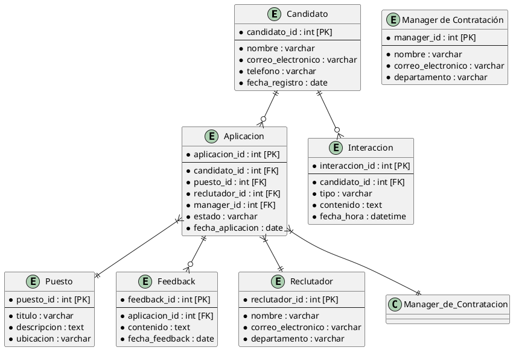

# Índice

- [Descripción del Sistema ATS Innovador](#descripción-del-sistema-ats-innovador)
  - [Visión General](#visión-general)
  - [Características Principales](#características-principales)
    - [Accesibilidad y Personalización](#accesibilidad-y-personalización)
    - [Automatizaciones Avanzadas](#automatizaciones-avanzadas)
    - [Inteligencia Artificial](#inteligencia-artificial)
    - [Seguridad y Conformidad](#seguridad-y-conformidad)
  - [Beneficios Clave](#beneficios-clave)
  - [Valor Añadido del Sistema ATS](#valor-añadido-del-sistema-ats)
  - [Ventajas Competitivas](#ventajas-competitivas)
- [Casos de Uso Principales del Sistema ATS](#casos-de-uso-principales-del-sistema-ats)
  - [Roles de Usuarios en el Sistema ATS](#roles-de-usuarios-en-el-sistema-ats)
    - [Reclutador](#reclutador)
    - [Manager de Contratación (Hiring Manager)](#manager-de-contratación-hiring-manager)
    - [Candidato](#candidato)
  - [Casos de Uso](#casos-de-uso)
    - [Caso de Uso 1: Filtrado y Selección Automatizada de Candidatos](#caso-de-uso-1-filtrado-y-selección-automatizada-de-candidatos)
    - [Caso de Uso 2: Colaboración en Tiempo Real para la Toma de Decisiones](#caso-de-uso-2-colaboración-en-tiempo-real-para-la-toma-de-decisiones)
    - [Caso de Uso 3: Mejora de la Experiencia del Candidato a través de Asistentes Virtuales](#caso-de-uso-3-mejora-de-la-experiencia-del-candidato-a-través-de-asistentes-virtuales)
- [Modelo de datos](#modelo-de-datos)
- [Diseño del sistema](#diseño-del-sistema)
  - [Arquitectura de Software](#arquitectura-de-software)
  - [Distribución de Componentes](#distribución-de-componentes)
  - [Integración de Sistemas Externos](#integración-de-sistemas-externos)
  - [Patrones de Comunicación](#patrones-de-comunicación)
  - [Escalabilidad, Seguridad y Mantenimiento](#escalabilidad-seguridad-y-mantenimiento)
- [Diagrama C4](#diagrama-c4)
  - [Contexto](#contexto)
  - [Diagrama de Contenedores](#diagrama-de-contenedores)
  - [Diagrama de Componentes](#diagrama-de-componentes)
  - [Código](#código)


# Descripción del Sistema ATS Innovador

## Visión General
Nuestro nuevo sistema de Applicant Tracking System (ATS) está diseñado para transformar radicalmente la forma en que los departamentos de recursos humanos gestionan el proceso de reclutamiento y selección. Este software no solo aumenta la eficiencia operativa, sino que también mejora la colaboración en tiempo real entre reclutadores y managers, ofreciendo una plataforma intuitiva y altamente personalizable que se adapta a las necesidades específicas de cada usuario.

## Características Principales

### Accesibilidad y Personalización
- **Interfaz de Usuario Optimizada**: Acceso desde cualquier dispositivo, adaptando la experiencia de usuario a las necesidades individuales de cada rol dentro del equipo de HR.
- **Integraciones de Comunicación**: Incorpora herramientas como Slack y Microsoft Teams para facilitar la colaboración directa y eficiente.

### Automatizaciones Avanzadas
- **Automatización de Tareas Rutinarias**: Elimina tareas repetitivas y optimiza los flujos de trabajo para un proceso de contratación más ágil.
- **Programación Automatizada de Entrevistas**: Garantiza un proceso sin fricciones, desde la recepción de CVs hasta la selección final.

### Inteligencia Artificial
- **Análisis Predictivo y Matching Inteligente**: Evalúa competencias técnicas y adaptación cultural, optimizando la selección de candidatos.
- **Asistentes Virtuales**: Mejora la experiencia del candidato proporcionando asistencia continua y recopilación de información automatizada.

### Seguridad y Conformidad
- **Cumplimiento con GDPR**: Asegura la protección y privacidad de los datos.
- **API Abierta**: Permite integraciones sin problemas con otras herramientas y plataformas de HR.

## Beneficios Clave
Este ATS redefine la interacción entre los equipos de HR y los candidatos, creando un proceso de contratación más inteligente, colaborativo y centrado en el humano, simplificando la gestión de la contratación y mejorando la experiencia global.

## Valor Añadido del Sistema ATS

Nuestro sistema ATS innovador ofrece un enfoque revolucionario para la gestión de talento, combinando inteligencia artificial, automatización avanzada, y colaboración en tiempo real. Este enfoque no solo acelera y optimiza el proceso de reclutamiento, sino que también mejora significativamente la experiencia de los candidatos y los reclutadores.

## Ventajas Competitivas

1. **Colaboración Mejorada**:
   - Integración con herramientas de comunicación en tiempo real facilita una colaboración fluida entre reclutadores y managers, acelerando el proceso de toma de decisiones.
2. **Automatizaciones Inteligentes**:
   - Desde el filtrado de CVs hasta la programación de entrevistas, nuestras automatizaciones liberan tiempo valioso para que los reclutadores se concentren en interacciones de mayor valor.
3. **Uso Estratégico de IA**:
   - La inteligencia artificial no solo ayuda en la selección de candidatos a través del análisis predictivo, sino que también personaliza la experiencia del candidato, elevando las tasas de éxito en las contrataciones.
4. **Adaptabilidad y Seguridad**:
   - Una plataforma segura y conforme con las regulaciones de protección de datos, combinada con una API abierta, asegura flexibilidad y escalabilidad para adaptarse a cualquier entorno empresarial.

Este sistema ATS no solo se posiciona como una herramienta eficiente para el reclutamiento, sino que redefine la manera en que las organizaciones atraen, evalúan y contratan talento, ofreciendo una ventaja competitiva sostenible en el mercado laboral actual.


[Ver diagrama Lean Canvas con más detalle](https://www.canva.com/design/DAGDmlhSKJw/O8r1UcfpOhW2iVfaJqjh3w/view?utm_content=DAGDmlhSKJw&utm_campaign=designshare&utm_medium=link&utm_source=editor)


# Casos de Uso Principales del Sistema ATS

## Roles de Usuarios en el Sistema ATS

### Reclutador
- **Funciones Principales**:

  - **Creación y gestión de anuncios de empleo**: Publica oportunidades de trabajo y gestiona las listas de empleo dentro del sistema.

  - **Filtrado inicial de CVs y selección de candidatos para entrevistas**: Utiliza herramientas de inteligencia artificial para filtrar y seleccionar los mejores candidatos basados en criterios predefinidos.

  - **Programación de entrevistas y seguimiento de los procesos de evaluación**: Organiza entrevistas y mantiene un seguimiento detallado del progreso de cada candidato.

  - **Comunicación directa con candidatos y coordinación con managers de contratación**: Utiliza el sistema para comunicarse con candidatos y coordinar con los managers sobre el proceso de selección.

- **Interacción con el Sistema**:
  - El reclutador interactúa con múltiples módulos del sistema, incluyendo la gestión de empleos, la base de datos de CVs, herramientas de programación de entrevistas y comunicaciones integradas.

### Manager de Contratación (Hiring Manager)

- **Funciones Principales**:
  - **Revisión de los candidatos preseleccionados por los reclutadores**: Evalúa los perfiles de los candidatos seleccionados y proporciona retroalimentación.
  
  - **Participación en entrevistas y evaluaciones finales**: Participa en el proceso de entrevista y ayuda a evaluar las competencias y el ajuste cultural de los candidatos.
  - **Toma de decisiones de contratación**: Autoriza las decisiones finales sobre las contrataciones basándose en las recomendaciones y datos proporcionados por el sistema y el equipo de reclutamiento.
  - **Colaboración y comunicación con el equipo de reclutadores**: Trabaja estrechamente con los reclutadores para asegurar que las selecciones de talento se alinean con las necesidades del equipo.

- **Interacción con el Sistema**:
  - El manager utiliza principalmente las herramientas de revisión de candidatos y de comunicación del sistema para tomar decisiones informadas y colaborar con el equipo de reclutamiento.


### Candidato

- **Funciones Principales**:

  - **Aplica a ofertas de trabajo**: Utiliza el sistema para encontrar y aplicar a oportunidades de empleo relevantes.

  - **Interactúa con el sistema para completar pruebas**: Completa pruebas de habilidades o personalidad requeridas durante el proceso de selección.
  - **Proporciona información adicional**: Envía información adicional requerida por los reclutadores para complementar su aplicación.
  - **Recibe actualizaciones**: Obtiene notificaciones sobre el estado de su aplicación y otros detalles relevantes a través del sistema.

- **Interacción con el Sistema**:
  - **Utiliza interfaces del sistema diseñadas para mejorar la experiencia del usuario**: Interactúa con el sistema a través de la aplicación móvil o el portal web, que están optimizados para proporcionar una experiencia de usuario fluida y accesible.

## Casos de Uso

### Caso de Uso 1: Filtrado y Selección Automatizada de Candidatos

#### Descripción
Este caso de uso describe cómo el sistema ATS utiliza herramientas de inteligencia artificial para filtrar y seleccionar automáticamente candidatos basados en criterios predefinidos. Esto incluye la evaluación de habilidades técnicas, experiencia relevante y ajuste cultural.

#### Proceso
1. **Reclutadores configuran criterios de filtrado**: Definen los parámetros específicos que el sistema debe considerar al evaluar los CVs.

2. **Sistema analiza y filtra candidatos**: Utiliza algoritmos de IA para procesar la información de los CVs y seleccionar los candidatos que mejor se ajusten a los criterios.
3. **Candidatos preseleccionados son notificados para pasos siguientes**: El sistema automatiza la notificación a los candidatos seleccionados sobre las próximas etapas del proceso de reclutamiento.

#### Interacciones
- **Reclutadores** utilizan la interfaz del sistema para ingresar y ajustar los criterios de selección.
- **El sistema** procesa los CVs y proporciona una lista corta de candidatos.
- **Candidatos** reciben notificaciones automáticas si han sido preseleccionados.

#### Beneficios por Rol

##### Reclutador
- **Ahorro de tiempo**: La automatización del filtrado de CVs libera tiempo para que los reclutadores se concentren en tareas más estratégicas y de mayor valor.

- **Consistencia en la selección**: La aplicación sistemática de criterios garantiza un proceso de selección justo y uniforme, reduciendo el sesgo humano.

##### Manager de Contratación
- **Selecciones de alta calidad**: Recibe candidatos preseleccionados que ya han sido evaluados como altamente compatibles con los requisitos del puesto, mejorando la eficacia del proceso de selección.

- **Rapidez en el proceso**: La disponibilidad más rápida de candidatos aptos acelera el proceso de toma de decisiones para llenar vacantes.

##### Candidato
- **Proceso de aplicación transparente y justo**: Los candidatos se benefician de un sistema que evalúa objetivamente basado en méritos y habilidades, ofreciendo igualdad de oportunidades.

- **Comunicación eficaz**: Reciben actualizaciones rápidas y claras sobre su estatus, lo que mejora su experiencia general con el proceso de aplicación.

Este caso de uso demuestra cómo la tecnología de inteligencia artificial integrada en el sistema ATS puede optimizar el proceso de reclutamiento, beneficiando a todos los usuarios involucrados mediante la mejora de la eficiencia y la equidad.


<!-- ```plantuml
@startuml

left to right direction
skinparam packageStyle rectangle
actor Reclutador
actor Manager_de_Contratacion as "Manager de Contratación"
actor Candidato

rectangle "Sistema ATS" {
  usecase "Configurar criterios de filtrado" as UC1
  usecase "Analizar y filtrar candidatos" as UC2
  usecase "Notificar candidatos preseleccionados" as UC3
  usecase "Recibir lista de candidatos aptos" as UC4
  usecase "Recibir notificaciones" as UC5
}

Reclutador - -> UC1 : Configura
Reclutador - -> UC2 : Inicia
Manager_de_Contratacion - -> UC4 : Recibe
Candidato - -> UC5 : Recibe

UC2 .> UC3 : Sigue
UC2 .> UC4 : Sigue

@enduml
``` -->

### Caso de Uso 2: Colaboración en Tiempo Real para la Toma de Decisiones

#### Descripción
Este caso de uso describe cómo el sistema ATS facilita la colaboración efectiva entre reclutadores y managers de contratación, permitiendo la comunicación en tiempo real y el intercambio de información clave para evaluar y decidir sobre los candidatos de manera conjunta y eficiente. Utiliza herramientas de comunicación integradas para discutir perfiles de candidatos, compartir observaciones y tomar decisiones de contratación rápidamente.

#### Proceso
1. **Inicio de la Discusión**: El reclutador comparte los perfiles de los candidatos preseleccionados con el manager de contratación a través del sistema.

2. **Revisión de Perfiles**: El manager revisa los perfiles y prepara preguntas o comentarios.
3. **Comunicación en Tiempo Real**: Utilizando herramientas integradas en el sistema como chat en vivo o videoconferencia, reclutador y manager discuten cada perfil.
4. **Decisión Conjunta**: Basados en la discusión, toman decisiones conjuntas sobre qué candidatos avanzarán a la siguiente etapa o serán contratados.

#### Interacciones
- **Reclutador**:
  - Inicia la discusión compartiendo información.
  - Participa activamente en la comunicación en tiempo real.
- **Manager de Contratación**:
  - Recibe y revisa los perfiles de candidatos.
  - Participa en la discusión y toma decisiones de contratación.

#### Beneficios por Rol

##### Reclutador
- **Eficiencia Mejorada**: Reduce el tiempo de espera para obtener retroalimentación de los managers, permitiendo tomar decisiones más rápidas.

- **Comunicación Mejorada**: Facilita una comunicación directa y clara con los managers, asegurando que ambos estén alineados con respecto a las expectativas y requisitos del candidato ideal.

##### Manager de Contratación
- **Decisiones Informadas**: Acceso a información detallada y discusiones en tiempo real permite tomar decisiones de contratación más informadas.

- **Ahorro de Tiempo**: Agiliza el proceso de revisión y decisión al tener todas las comunicaciones y decisiones en una única plataforma.

##### Candidato
- **Proceso Transparente**: Beneficiados indirectamente por un proceso de selección más rápido y eficaz, aumentando las probabilidades de una experiencia de contratación positiva y reduciendo el tiempo de espera en recibir respuesta.

Este caso de uso demuestra la capacidad del sistema ATS para mejorar significativamente la colaboración y la toma de decisiones en el proceso de reclutamiento, beneficiando a todos los involucrados mediante la optimización de la comunicación y la eficiencia operativa.


<!--
```plantuml
@startuml

left to right direction
skinparam packageStyle rectangle
actor Reclutador
actor Manager_de_Contratacion as "Manager de Contratación"

rectangle "Sistema ATS" {
  usecase "Iniciar Discusión de Candidatos" as UC1
  usecase "Revisar Perfiles de Candidatos" as UC2
  usecase "Discutir Candidatos en Tiempo Real" as UC3
  usecase "Tomar Decisiones Conjuntas" as UC4
}

'Relaciones de uso
Reclutador - -> UC1 : inicia
Reclutador - -> UC3 : participa
Manager_de_Contratacion - -> UC2 : revisa
Manager_de_Contratacion - -> UC3 : participa
Manager_de_Contratacion - -> UC4 : decide

'Extend relationships if necessary
UC1 .> UC2 : siguiente paso
UC2 .> UC3 : siguiente paso
UC3 .> UC4 : siguiente paso

@enduml

```
-->

### Caso de Uso 3: Mejora de la Experiencia del Candidato a través de Asistentes Virtuales

#### Descripción
Este caso de uso detalla cómo el sistema ATS utiliza asistentes virtuales para optimizar la interacción con los candidatos, proporcionándoles asistencia continua, respuestas a preguntas frecuentes, y actualizaciones en tiempo real sobre el estado de su aplicación. Los asistentes virtuales están diseñados para hacer el proceso de reclutamiento más accesible y menos estresante para los candidatos.

#### Proceso
1. **Registro e Interacción Inicial**: El candidato se registra en el sistema y comienza su interacción con un asistente virtual.

2. **Automatización de Respuestas**: El asistente virtual responde automáticamente a consultas comunes, proporciona información sobre el proceso de reclutamiento y ayuda con la preparación para entrevistas.
3. **Notificaciones de Estado**: El asistente envía actualizaciones automáticas sobre el progreso de las aplicaciones y notifica a los candidatos sobre cualquier cambio o requerimiento adicional.
4. **Recopilación de Feedback**: Después de las entrevistas, el asistente virtual recoge feedback del candidato para mejorar futuras interacciones y procesos.

#### Interacciones
- **Candidato**:
  - Interactúa con el asistente virtual para obtener información y realizar consultas.
  - Recibe notificaciones y consejos útiles a través del asistente.
- **Sistema ATS**:
  - Provee la plataforma y las herramientas para que el asistente virtual funcione correctamente.
  - Gestiona y almacena las respuestas y el feedback recogido por el asistente virtual.

#### Beneficios por Rol

##### Candidato
- **Mejor Accesibilidad y Comunicación**: Los asistentes virtuales ofrecen una forma accesible y eficiente de obtener información sobre el proceso de reclutamiento, lo que reduce la incertidumbre y el estrés.

- **Feedback Continuo**: El candidato puede dar y recibir feedback de manera instantánea, lo que mejora su experiencia y le permite ajustar sus expectativas y preparaciones.

##### Sistema ATS (Beneficios para la organización)
- **Mejora de la Imagen de Marca Empleadora**: Al proporcionar una experiencia de usuario mejorada, el sistema ayuda a mejorar la percepción de la empresa entre los candidatos.

- **Eficiencia Operativa**: La automatización de las interacciones reduce la carga sobre el personal de recursos humanos, permitiendo que se concentren en tareas más estratégicas.

Este caso de uso resalta cómo la tecnología de asistentes virtuales puede transformar la experiencia de reclutamiento para los candidatos, haciéndola más interactiva, informativa y menos estresante.


<!--
```plantuml
@startuml

left to right direction
skinparam packageStyle rectangle
actor Candidato

rectangle "Sistema ATS con Asistente Virtual" {
  usecase "Registrarse y Interactuar" as UC1
  usecase "Recibir Respuestas Automáticas" as UC2
  usecase "Obtener Notificaciones de Estado" as UC3
  usecase "Dar y Recibir Feedback" as UC4
}

Candidato - -> UC1 : Inicia interacción
Candidato - -> UC2 : Realiza preguntas
Candidato - -> UC3 : Recibe actualizaciones
Candidato - -> UC4 : Interactúa post-entrevista

@enduml

```
-->

# Modelo de datos


<!--

-->

### Relaciones:

- Un **Candidato** puede tener múltiples **Aplicaciones**.
- Una **Aplicación** puede recibir múltiples **Feedbacks**.
- Un **Candidato** puede tener múltiples **Interacciones**.
- Una **Aplicación** está relacionada con un **Puesto**.


# Diseño del sistema

### Arquitectura de Software:
El Sistema ATS Innovador se basa en una arquitectura de microservicios. Este enfoque permite descomponer la aplicación en componentes independientes y escalables, facilitando el desarrollo, despliegue y mantenimiento del sistema.

### Distribución de Componentes:
Los microservicios se distribuyen en diferentes contenedores, utilizando tecnologías como Docker para garantizar la portabilidad y consistencia del entorno de ejecución. Pueden desplegarse en un entorno de nube pública o privada para garantizar la escalabilidad y disponibilidad del sistema.

### Integración de Sistemas Externos:
El sistema se integra con varios sistemas externos, como servicios de verificación de antecedentes, pruebas de habilidades, plataformas de redes sociales y sistemas de gestión de aprendizaje (LMS), para ofrecer una solución completa de reclutamiento y selección de personal.

### Patrones de Comunicación:
Se utiliza un enfoque basado en API RESTful para facilitar la comunicación entre los diferentes microservicios. Además, se emplean patrones de mensajería asincrónica, como RabbitMQ o Kafka, para la comunicación entre microservicios cuando se requiere una mayor escalabilidad o tolerancia a fallos.

### Escalabilidad, Seguridad y Mantenimiento:
- **Escalabilidad:** La arquitectura de microservicios permite escalar cada componente de forma independiente según la carga de trabajo.
  
- **Seguridad:** Se implementan medidas de seguridad en todos los niveles del sistema, incluyendo autenticación y autorización basadas en roles, cifrado de datos en reposo y en tránsito, y monitoreo continuo de la seguridad de la aplicación.

- **Mantenimiento:** La descomposición del sistema en microservicios facilita la identificación y corrección de errores, así como la implementación de nuevas funcionalidades de forma modular y sin afectar al resto del sistema. Se emplean prácticas de desarrollo ágil y DevOps para garantizar una entrega continua y una rápida respuesta a los cambios y actualizaciones del sistema.


<!--```plantuml
@startuml

skinparam rectangle {
  BackgroundColor Wheat
  BorderColor Black
  BorderThickness 1
}

' Define components
rectangle "Microservices" {
  [Authentication Service] as Auth
  [User Management Service] as UM
  [Candidate Processing Service] as CP
  [Interview Scheduling Service] as IS
  [Communication Integration Service] as CI
  [Data Analytics Service] as DA
}

rectangle "External Systems" {
  [Background Check Service] as BCS
  [Skill Assessment Platform] as SAP
  [Learning Management System] as LMS
}

rectangle "Messaging and APIs" {
  [REST API Gateway] as API
  [Message Broker (RabbitMQ/Kafka)] as MQ
}

' Connections
API -> Auth
API -> UM
API -> CP
API -> IS
API -> CI
API -> DA

MQ -> CP
MQ -> IS
MQ -> DA

UM -> BCS
CP -> SAP
CP -> LMS

' Legends and notes
note right of API : REST API Gateway\nRoutes requests to services
note right of MQ : Supports asynchronous\ncommunication between services

@enduml
```
-->

# Diagrama C4

Se muestra el diagrama C4 para el componente **Servicio de Procesamiento de Candidatos** dentro del Sistema ATS. Este servicio es crucial, ya que se encarga de gestionar todo el procesamiento de candidatos, desde la recepción de solicitudes hasta la evaluación y selección final. 

## 1. Contexto

Mostramos cómo el sistema ATS interactúa con los usuarios y sistemas externos.


<!--
```plantuml
@startuml
!include https://raw.githubusercontent.com/plantuml-stdlib/C4-PlantUML/master/C4_Context.puml

LAYOUT_WITH_LEGEND()

title Sistema ATS - Diagrama de Contexto

Person(reclutador, "Reclutador", "Gestiona y supervisa el proceso de reclutamiento.")
Person(manager, "Manager de Contratación", "Define requisitos del puesto y toma decisiones finales.")
Person(candidato, "Candidato", "Aplica a ofertas de trabajo y gestiona su información.")

System_Boundary(ats, "Sistema ATS Innovador") {
    System(candidateProcessing, "Candidate Processing Service", "Procesa y evalúa las aplicaciones de los candidatos.")
}

System_Ext(lms, "LMS", "Sistema de Gestión de Aprendizaje.")
System_Ext(sap, "Plataforma de Evaluación de Habilidades", "Evalúa habilidades técnicas de los candidatos.")

Rel(reclutador, candidateProcessing, "Usa")
Rel(manager, candidateProcessing, "Recibe informes")
Rel(candidato, candidateProcessing, "Aplica y recibe feedback")
Rel(candidateProcessing, lms, "Consulta cursos realizados")
Rel(candidateProcessing, sap, "Envía pruebas de habilidades")

@enduml
```
-->

## 2. Diagrama de Contenedores

Ahora nos enfocaremos en cómo el servicio de procesamiento de candidatos está organizado dentro del sistema y cómo interactúa con otros contenedores.


<!--
```plantuml
@startuml
!include https://raw.githubusercontent.com/plantuml-stdlib/C4-PlantUML/master/C4_Container.puml

LAYOUT_WITH_LEGEND()

title Sistema ATS - Diagrama de Contenedores

Person(reclutador, "Reclutador", "Gestiona y supervisa el proceso de reclutamiento.")
Person(manager, "Manager de Contratación", "Define requisitos del puesto y toma decisiones finales.")

System_Boundary(ats, "Sistema ATS Innovador") {
    Container(candidateProcessing, "Candidate Processing Service", "Spring Boot Application", "Procesa y evalúa las aplicaciones de los candidatos usando IA.")
    Container(db, "Base de Datos", "MySQL", "Almacena datos de candidatos, evaluaciones y resultados.")
    Container(apiGateway, "API Gateway", "Spring Cloud Gateway", "Maneja y rutea las solicitudes entrantes a los servicios apropiados.")
    Container(messagingService, "Messaging Service", "RabbitMQ", "Maneja la comunicación asíncrona entre servicios.")
}

Rel(reclutador, apiGateway, "Envía solicitudes", "HTTPS")
Rel(apiGateway, candidateProcessing, "Rutea solicitudes")
Rel(candidateProcessing, db, "Consulta y almacena datos")
Rel(candidateProcessing, messagingService, "Publica y consume mensajes")
Rel(messagingService, candidateProcessing, "Mensajería asincrónica")

@enduml
```
-->

## 3. Diagrama de Componentes

El diagrama siguiente detalla los componentes internos del Servicio de Procesamiento de Candidatos dentro del sistema ATS, mostrando cómo cada componente interactúa dentro del servicio y con otros servicios externos.


<!-- 
```plantuml
@startuml
!include https://raw.githubusercontent.com/plantuml-stdlib/C4-PlantUML/master/C4_Component.puml

LAYOUT_WITH_LEGEND()

title Sistema ATS - Diagrama de Componentes para el Servicio de Procesamiento de Candidatos

Container_Boundary(cps, "Servicio de Procesamiento de Candidatos") {
    Component(cvParser, "Analizador de CVs", "Python & ML", "Analiza y extrae información relevante de los CVs.")
    Component(matchingEngine, "Motor de Emparejamiento", "Java & AI", "Empareja candidatos con puestos basados en habilidades y requisitos.")
    Component(candidateDB, "Base de Datos de Candidatos", "MySQL", "Almacena información de los candidatos, historial de aplicaciones y resultados de emparejamiento.")
    Component(notificationSystem, "Sistema de Notificaciones", "Node.js", "Envía notificaciones a candidatos y reclutadores sobre el estatus de las aplicaciones.")
}

Container(apiGateway, "API Gateway", "Spring Cloud Gateway", "Maneja y rutea las solicitudes entrantes a los servicios apropiados.")
Container(messagingService, "Servicio de Mensajería", "RabbitMQ", "Maneja la comunicación asíncrona entre servicios.")

Rel(apiGateway, cvParser, "Rutea solicitudes de análisis de CV", "HTTP")
Rel(apiGateway, matchingEngine, "Rutea solicitudes de emparejamiento", "HTTP")
Rel(matchingEngine, candidateDB, "Consulta y actualiza resultados de emparejamiento")
Rel(cvParser, candidateDB, "Almacena CVs procesados")
Rel(notificationSystem, candidateDB, "Consulta estatus para enviar notificaciones")
Rel(notificationSystem, messagingService, "Envía notificaciones asincrónicas")

@enduml
```
-->

### Descripción de los Componentes:

- **Analizador de CVs**: Utiliza técnicas de Python y aprendizaje automático para extraer información relevante de los currículums vitae de los candidatos.

- **Motor de Emparejamiento**: Implementado en Java con tecnologías de inteligencia artificial, este componente se encarga de emparejar a los candidatos con los puestos disponibles basándose en las habilidades detectadas y los requisitos del puesto.
- **Base de Datos de Candidatos**: Almacena todos los datos relacionados con los candidatos, incluidos los CVs procesados, el historial de aplicaciones y los resultados del proceso de emparejamiento.
- **Sistema de Notificaciones**: Desarrollado en Node.js, gestiona el envío de notificaciones a los candidatos y reclutadores acerca del estado de las aplicaciones, utilizando para ello el servicio de mensajería.


## 4. Código

Describiré con más detalle cómo uno de los componentes está implementado en términos de código. Vamos a centrarnos en el componente Analizador de CVs. Este componente usa Python y técnicas de aprendizaje automático para analizar y extraer información relevante de los currículos vitae.


<!-- 
```plantuml
@startuml

title Diagrama de Clases para el Analizador de CVs

class CVParser {
    - nlp : spacy.Language
    + parse_cv(text : string) : dict
    + __init__(model_path : string)
}

class SkillExtractor {
    - skill_patterns : list
    + extract_skills(doc : spacy.tokens.Doc) : list
}

class ExperienceExtractor {
    + extract_experience(doc : spacy.tokens.Doc) : list
}

class EducationExtractor {
    + extract_education(doc : spacy.tokens.Doc) : list
}

class DocumentPreprocessor {
    + preprocess_text(text : string) : spacy.tokens.Doc
}

CVParser "1" - -> "1" DocumentPreprocessor : uses
CVParser "1" - -> "*" SkillExtractor : uses
CVParser "1" - -> "*" ExperienceExtractor : uses
CVParser "1" - -> "*" EducationExtractor : uses

note right of CVParser : Inicializa con modelo de spaCy y maneja el proceso de análisis del CV
note bottom of SkillExtractor : Implementa extracción de habilidades usando patrones y NER
note bottom of ExperienceExtractor : Extrae bloques de texto relacionados con experiencias laborales
note bottom of EducationExtractor : Identifica y extrae detalles educativos
note bottom of DocumentPreprocessor : Preprocesa el texto para normalización y mejora del análisis

@enduml
```
-->

### Descripción de las Clases y Funciones:

- **CVParser**: Es la clase central que coordina el análisis de los currículums. Inicializa la biblioteca de procesamiento de lenguaje natural y delega tareas específicas a otras clases. La función `parse_cv` es el método principal que toma texto de CV y devuelve un diccionario con habilidades, experiencia y educación extraídas.

- **DocumentPreprocessor**: Se encarga de la normalización del texto del CV, como eliminar caracteres extraños, corregir errores de ortografía comunes y ajustar el formato para mejorar el análisis de texto. Esto facilita una mayor precisión en la extracción de datos.

- **SkillExtractor**: Utiliza patrones definidos y el reconocimiento de entidades nombradas para identificar y extraer habilidades del texto procesado.

- **ExperienceExtractor**: Analiza los segmentos de texto para extraer información detallada sobre experiencias laborales previas, incluyendo roles y duraciones.

- **EducationExtractor**: Se enfoca en extraer información educativa, identificando nombres de instituciones, grados obtenidos, y otros detalles relevantes.


