# Índice

- [Descripción del Sistema ATS Innovador](#descripción-del-sistema-ats-innovador)
  - [Visión General](#visión-general)
  - [Características Principales](#características-principales)
    - [Accesibilidad y Personalización](#accesibilidad-y-personalización)
    - [Automatizaciones Avanzadas](#automatizaciones-avanzadas)
    - [Inteligencia Artificial](#inteligencia-artificial)
    - [Seguridad y Conformidad](#seguridad-y-conformidad)
  - [Beneficios Clave](#beneficios-clave)
  - [Valor Añadido del Sistema ATS](#valor-añadido-del-sistema-ats)
  - [Ventajas Competitivas](#ventajas-competitivas)
- [Casos de Uso Principales del Sistema ATS](#casos-de-uso-principales-del-sistema-ats)
  - [Roles de Usuarios en el Sistema ATS](#roles-de-usuarios-en-el-sistema-ats)
    - [Reclutador](#reclutador)
      - [Funciones](#funciones)
      - [Interacciones](#interacciones)
    - [Manager de Contratación (Hiring Manager)](#manager-de-contratación-hiring-manager)
      - [Funciones](#funciones-1)
      - [Interacciones](#interacciones-1)
    - [Candidato](#candidato)
      - [Funciones](#funciones-2)
      - [Interacciones](#interacciones-2)
  - [Casos de Uso](#casos-de-uso)
    - [Caso de Uso 1: Automatización de la Filtración de Candidatos](#caso-de-uso-1-automatización-de-la-filtración-de-candidatos)
      - [Descripción](#descripción)
      - [Beneficios para Reclutadores](#beneficios-para-reclutadores)
      - [Beneficios para Managers de Contratación](#beneficios-para-managers-de-contratación)
    - [Caso de Uso 2: Colaboración en Tiempo Real](#caso-de-uso-2-colaboración-en-tiempo-real)
      - [Descripción](#descripción-1)
      - [Beneficios para Reclutadores y Managers de Contratación](#beneficios-para-reclutadores-y-managers-de-contratación)
    - [Caso de Uso 3: Acceso y Seguimiento de Candidatos](#caso-de-uso-3-acceso-y-seguimiento-de-candidatos)
      - [Descripción](#descripción-2)
      - [Beneficios para Candidatos](#beneficios-para-candidatos)
  - [Modelo de datos](#modelo-de-datos)
- [Diseño del sistema](#diseño-del-sistema)
  - [Arquitectura de Software](#arquitectura-de-software)
  - [Distribución de Componentes](#distribución-de-componentes)
  - [Integración de Sistemas Externos](#integración-de-sistemas-externos)
  - [Patrones de Comunicación](#patrones-de-comunicación)
  - [Escalabilidad, Seguridad y Mantenimiento](#escalabilidad-seguridad-y-mantenimiento)
- [Diagrama C4](#diagrama-c4)
  - [Contexto](#contexto)
  - [Diagrama de Contenedores](#diagrama-de-contenedores)
  - [Diagrama de Componentes](#diagrama-de-componentes)
  - [Código](#código)


# Descripción del Sistema ATS Innovador

## Visión General
Nuestro nuevo sistema de Applicant Tracking System (ATS) está diseñado para transformar radicalmente la forma en que los departamentos de recursos humanos gestionan el proceso de reclutamiento y selección. Este software no solo aumenta la eficiencia operativa, sino que también mejora la colaboración en tiempo real entre reclutadores y managers, ofreciendo una plataforma intuitiva y altamente personalizable que se adapta a las necesidades específicas de cada usuario.

## Características Principales

### Accesibilidad y Personalización
- **Interfaz de Usuario Optimizada**: Acceso desde cualquier dispositivo, adaptando la experiencia de usuario a las necesidades individuales de cada rol dentro del equipo de HR.
- **Integraciones de Comunicación**: Incorpora herramientas como Slack y Microsoft Teams para facilitar la colaboración directa y eficiente.

### Automatizaciones Avanzadas
- **Automatización de Tareas Rutinarias**: Elimina tareas repetitivas y optimiza los flujos de trabajo para un proceso de contratación más ágil.
- **Programación Automatizada de Entrevistas**: Garantiza un proceso sin fricciones, desde la recepción de CVs hasta la selección final.

### Inteligencia Artificial
- **Análisis Predictivo y Matching Inteligente**: Evalúa competencias técnicas y adaptación cultural, optimizando la selección de candidatos.
- **Asistentes Virtuales**: Mejora la experiencia del candidato proporcionando asistencia continua y recopilación de información automatizada.

### Seguridad y Conformidad
- **Cumplimiento con GDPR**: Asegura la protección y privacidad de los datos.
- **API Abierta**: Permite integraciones sin problemas con otras herramientas y plataformas de HR.

## Beneficios Clave
Este ATS redefine la interacción entre los equipos de HR y los candidatos, creando un proceso de contratación más inteligente, colaborativo y centrado en el humano, simplificando la gestión de la contratación y mejorando la experiencia global.

## Valor Añadido del Sistema ATS

Nuestro sistema ATS innovador ofrece un enfoque revolucionario para la gestión de talento, combinando inteligencia artificial, automatización avanzada, y colaboración en tiempo real. Este enfoque no solo acelera y optimiza el proceso de reclutamiento, sino que también mejora significativamente la experiencia de los candidatos y los reclutadores.

## Ventajas Competitivas

1. **Colaboración Mejorada**:
   - Integración con herramientas de comunicación en tiempo real facilita una colaboración fluida entre reclutadores y managers, acelerando el proceso de toma de decisiones.
2. **Automatizaciones Inteligentes**:
   - Desde el filtrado de CVs hasta la programación de entrevistas, nuestras automatizaciones liberan tiempo valioso para que los reclutadores se concentren en interacciones de mayor valor.
3. **Uso Estratégico de IA**:
   - La inteligencia artificial no solo ayuda en la selección de candidatos a través del análisis predictivo, sino que también personaliza la experiencia del candidato, elevando las tasas de éxito en las contrataciones.
4. **Adaptabilidad y Seguridad**:
   - Una plataforma segura y conforme con las regulaciones de protección de datos, combinada con una API abierta, asegura flexibilidad y escalabilidad para adaptarse a cualquier entorno empresarial.

Este sistema ATS no solo se posiciona como una herramienta eficiente para el reclutamiento, sino que redefine la manera en que las organizaciones atraen, evalúan y contratan talento, ofreciendo una ventaja competitiva sostenible en el mercado laboral actual.


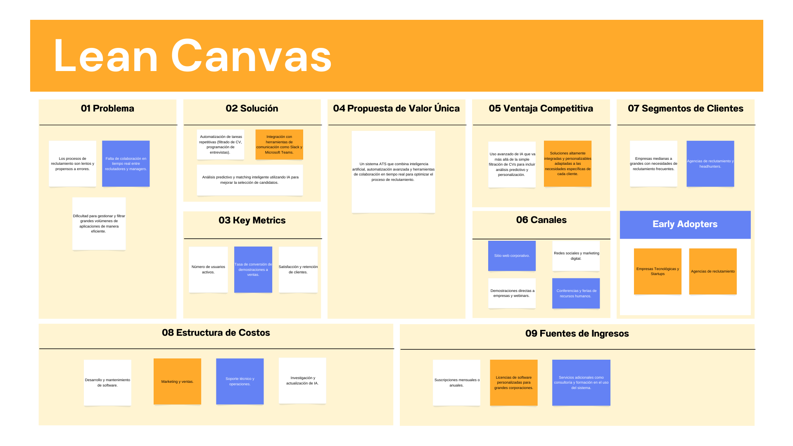


[Ver diagrama Lean Canvas con más detalle](https://www.canva.com/design/DAGDmlhSKJw/O8r1UcfpOhW2iVfaJqjh3w/view?utm_content=DAGDmlhSKJw&utm_campaign=designshare&utm_medium=link&utm_source=editor)


# Casos de Uso Principales del Sistema ATS

## Roles de Usuarios en el Sistema ATS

### Reclutador
#### Funciones
- Gestionar el proceso de reclutamiento desde la publicación de empleos hasta la selección de candidatos.
- Utiliza herramientas de filtrado automático, realiza seguimientos y coordina entrevistas.
#### Interacciones
- Usa ampliamente las funcionalidades de automatización, comunicación y análisis de datos del sistema.

### Manager de Contratación (Hiring Manager)
#### Funciones
- Define los requisitos de los puestos, colabora en la evaluación de candidatos y toma decisiones finales de contratación.
#### Interacciones
- Participa en la revisión de candidatos filtrados, usa herramientas de colaboración para comunicarse con reclutadores y toma decisiones basadas en informes y análisis predictivo.

### Candidato
#### Funciones
- Aplica a ofertas de trabajo, interactúa con el sistema para completar pruebas, proporcionar información adicional y recibir actualizaciones.
#### Interacciones
- Utiliza interfaces del sistema diseñadas para mejorar la experiencia del usuario, como la aplicación móvil o el portal web.

## Casos de Uso

### Caso de Uso 1: Automatización de la Filtración de Candidatos
#### Descripción
- El sistema automáticamente filtra las aplicaciones basadas en los criterios especificados por el manager de contratación, utilizando tecnologías de IA para analizar currículos y cartas de presentación.
#### Beneficios para Reclutadores
- Reduce la carga de trabajo manual, permitiendo que se centren en candidatos más prometedores.
#### Beneficios para Managers de Contratación
- Reciben una lista prefiltrada de candidatos, acelerando el proceso de selección.


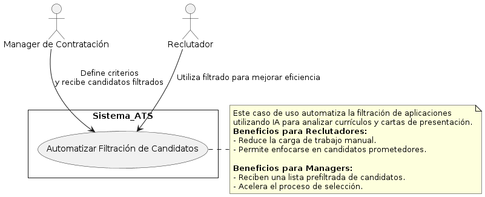

<!-- ```plantuml
@startuml
' Definición de estilo
skinparam style strictuml
skinparam shadowing false
skinparam rectangle {
  RoundCorner<<>> 20
  BackgroundColor<<main>> LightYellow
}

' Actores
actor "Manager de Contratación" as Manager
actor Reclutador

' Caso de Uso
rectangle Sistema_ATS {
  usecase "Automatizar Filtración de Candidatos" as UC1
}

' Relaciones
Manager -> UC1 : Define criterios\ny recibe candidatos filtrados
Reclutador -> UC1 : Utiliza filtrado para mejorar eficiencia

' Notas
note right of UC1
  Este caso de uso automatiza la filtración de aplicaciones
  utilizando IA para analizar currículos y cartas de presentación.
  <b>Beneficios para Reclutadores:</b>
  - Reduce la carga de trabajo manual.
  - Permite enfocarse en candidatos prometedores.
  
  <b>Beneficios para Managers:</b>
  - Reciben una lista prefiltrada de candidatos.
  - Acelera el proceso de selección.
end note

@enduml
``` -->

### Caso de Uso 2: Colaboración en Tiempo Real
#### Descripción
- Reclutadores y managers de contratación utilizan una plataforma integrada para comunicarse y tomar decisiones en tiempo real sobre los candidatos.
#### Beneficios para Reclutadores y Managers de Contratación
- Facilita la toma de decisiones más rápida y basada en consenso, mejorando la eficiencia del proceso de reclutamiento.


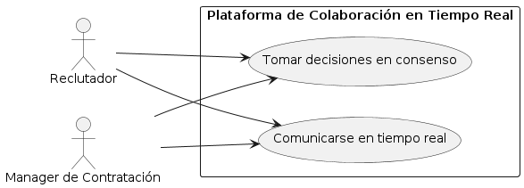

<!--
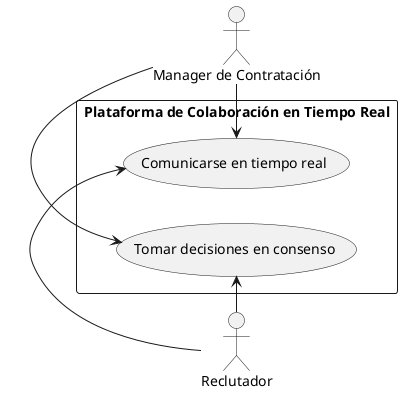
-->

### Caso de Uso 3: Acceso y Seguimiento de Candidatos
#### Descripción
- Los candidatos pueden acceder al sistema para actualizar su información, responder a comunicaciones y seguir el estado de sus aplicaciones.
#### Beneficios para Candidatos
- Mejora la transparencia y la experiencia del candidato, haciendo el proceso más amigable y accesible.

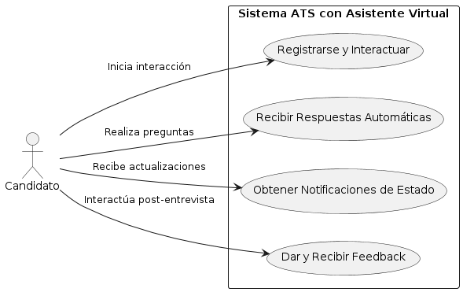

<!--
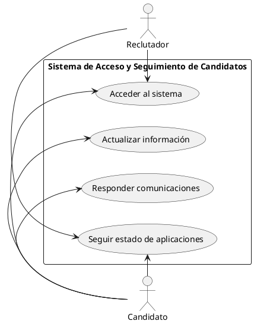
-->

## Modelo de datos

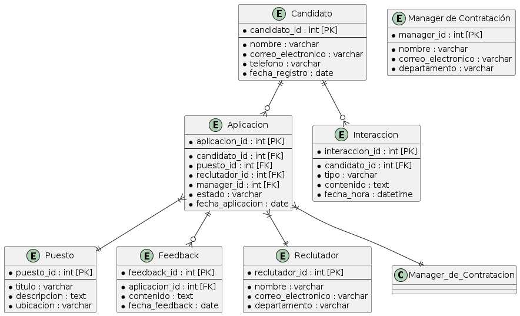

<!--
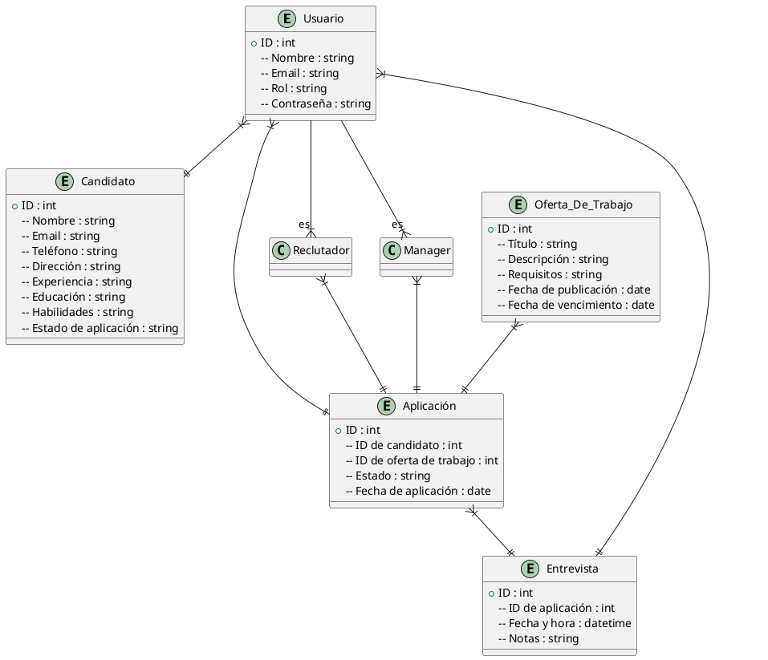
-->

#### Relaciones:

- Un usuario puede ser un reclutador o un manager de contratación.
- Un usuario puede tener muchas aplicaciones (si es un candidato) y puede revisar muchas aplicaciones (si es un reclutador o un manager).
- Una oferta de trabajo puede tener muchas aplicaciones.
- Una aplicación puede tener muchas entrevistas.


# Diseño del sistema

### Arquitectura de Software:
El Sistema ATS Innovador se basa en una arquitectura de microservicios. Este enfoque permite descomponer la aplicación en componentes independientes y escalables, facilitando el desarrollo, despliegue y mantenimiento del sistema.

### Distribución de Componentes:
Los microservicios se distribuyen en diferentes contenedores, utilizando tecnologías como Docker para garantizar la portabilidad y consistencia del entorno de ejecución. Pueden desplegarse en un entorno de nube pública o privada para garantizar la escalabilidad y disponibilidad del sistema.

### Integración de Sistemas Externos:
El sistema se integra con varios sistemas externos, como servicios de verificación de antecedentes, pruebas de habilidades, plataformas de redes sociales y sistemas de gestión de aprendizaje (LMS), para ofrecer una solución completa de reclutamiento y selección de personal.

### Patrones de Comunicación:
Se utiliza un enfoque basado en API RESTful para facilitar la comunicación entre los diferentes microservicios. Además, se emplean patrones de mensajería asincrónica, como RabbitMQ o Kafka, para la comunicación entre microservicios cuando se requiere una mayor escalabilidad o tolerancia a fallos.

### Escalabilidad, Seguridad y Mantenimiento:
- **Escalabilidad:** La arquitectura de microservicios permite escalar cada componente de forma independiente según la carga de trabajo.
  
- **Seguridad:** Se implementan medidas de seguridad en todos los niveles del sistema, incluyendo autenticación y autorización basadas en roles, cifrado de datos en reposo y en tránsito, y monitoreo continuo de la seguridad de la aplicación.

- **Mantenimiento:** La descomposición del sistema en microservicios facilita la identificación y corrección de errores, así como la implementación de nuevas funcionalidades de forma modular y sin afectar al resto del sistema. Se emplean prácticas de desarrollo ágil y DevOps para garantizar una entrega continua y una rápida respuesta a los cambios y actualizaciones del sistema.


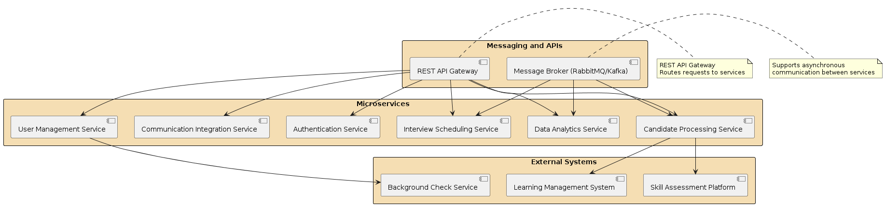

<!--```plantuml
@startuml

skinparam rectangle {
  BackgroundColor Wheat
  BorderColor Black
  BorderThickness 1
}

' Define components
rectangle "Microservices" {
  [Authentication Service] as Auth
  [User Management Service] as UM
  [Candidate Processing Service] as CP
  [Interview Scheduling Service] as IS
  [Communication Integration Service] as CI
  [Data Analytics Service] as DA
}

rectangle "External Systems" {
  [Background Check Service] as BCS
  [Skill Assessment Platform] as SAP
  [Learning Management System] as LMS
}

rectangle "Messaging and APIs" {
  [REST API Gateway] as API
  [Message Broker (RabbitMQ/Kafka)] as MQ
}

' Connections
API -> Auth
API -> UM
API -> CP
API -> IS
API -> CI
API -> DA

MQ -> CP
MQ -> IS
MQ -> DA

UM -> BCS
CP -> SAP
CP -> LMS

' Legends and notes
note right of API : REST API Gateway\nRoutes requests to services
note right of MQ : Supports asynchronous\ncommunication between services

@enduml
```
-->

# Diagrama C4

Se muestra el diagrama C4 para el componente **Servicio de Procesamiento de Candidatos** dentro del Sistema ATS. Este servicio es crucial, ya que se encarga de gestionar todo el procesamiento de candidatos, desde la recepción de solicitudes hasta la evaluación y selección final. 

## 1. Contexto

Mostramos cómo el sistema ATS interactúa con los usuarios y sistemas externos.

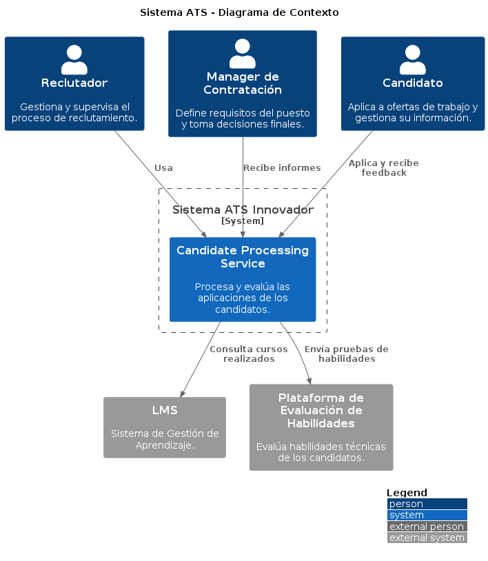


<!--
```plantuml
@startuml
!include https://raw.githubusercontent.com/plantuml-stdlib/C4-PlantUML/master/C4_Context.puml

LAYOUT_WITH_LEGEND()

title Sistema ATS - Diagrama de Contexto

Person(reclutador, "Reclutador", "Gestiona y supervisa el proceso de reclutamiento.")
Person(manager, "Manager de Contratación", "Define requisitos del puesto y toma decisiones finales.")
Person(candidato, "Candidato", "Aplica a ofertas de trabajo y gestiona su información.")

System_Boundary(ats, "Sistema ATS Innovador") {
    System(candidateProcessing, "Candidate Processing Service", "Procesa y evalúa las aplicaciones de los candidatos.")
}

System_Ext(lms, "LMS", "Sistema de Gestión de Aprendizaje.")
System_Ext(sap, "Plataforma de Evaluación de Habilidades", "Evalúa habilidades técnicas de los candidatos.")

Rel(reclutador, candidateProcessing, "Usa")
Rel(manager, candidateProcessing, "Recibe informes")
Rel(candidato, candidateProcessing, "Aplica y recibe feedback")
Rel(candidateProcessing, lms, "Consulta cursos realizados")
Rel(candidateProcessing, sap, "Envía pruebas de habilidades")

@enduml
```
-->

## 2. Diagrama de Contenedores

Ahora nos enfocaremos en cómo el servicio de procesamiento de candidatos está organizado dentro del sistema y cómo interactúa con otros contenedores.


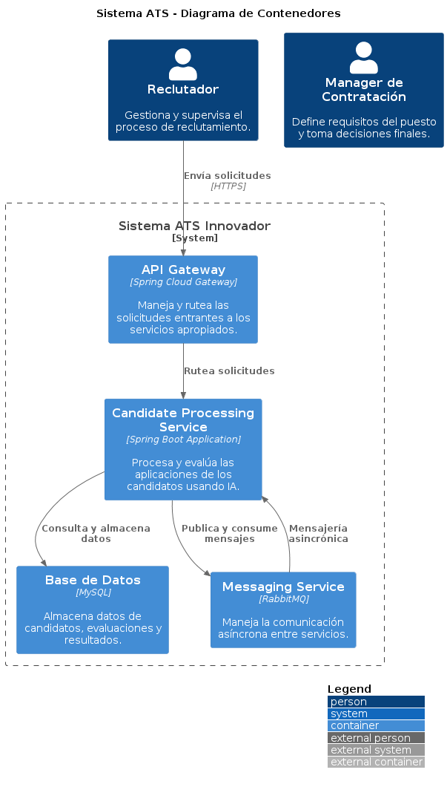


<!--
```plantuml
@startuml
!include https://raw.githubusercontent.com/plantuml-stdlib/C4-PlantUML/master/C4_Container.puml

LAYOUT_WITH_LEGEND()

title Sistema ATS - Diagrama de Contenedores

Person(reclutador, "Reclutador", "Gestiona y supervisa el proceso de reclutamiento.")
Person(manager, "Manager de Contratación", "Define requisitos del puesto y toma decisiones finales.")

System_Boundary(ats, "Sistema ATS Innovador") {
    Container(candidateProcessing, "Candidate Processing Service", "Spring Boot Application", "Procesa y evalúa las aplicaciones de los candidatos usando IA.")
    Container(db, "Base de Datos", "MySQL", "Almacena datos de candidatos, evaluaciones y resultados.")
    Container(apiGateway, "API Gateway", "Spring Cloud Gateway", "Maneja y rutea las solicitudes entrantes a los servicios apropiados.")
    Container(messagingService, "Messaging Service", "RabbitMQ", "Maneja la comunicación asíncrona entre servicios.")
}

Rel(reclutador, apiGateway, "Envía solicitudes", "HTTPS")
Rel(apiGateway, candidateProcessing, "Rutea solicitudes")
Rel(candidateProcessing, db, "Consulta y almacena datos")
Rel(candidateProcessing, messagingService, "Publica y consume mensajes")
Rel(messagingService, candidateProcessing, "Mensajería asincrónica")

@enduml
```
-->

## 3. Diagrama de Componentes

El diagrama siguiente detalla los componentes internos del Servicio de Procesamiento de Candidatos dentro del sistema ATS, mostrando cómo cada componente interactúa dentro del servicio y con otros servicios externos.


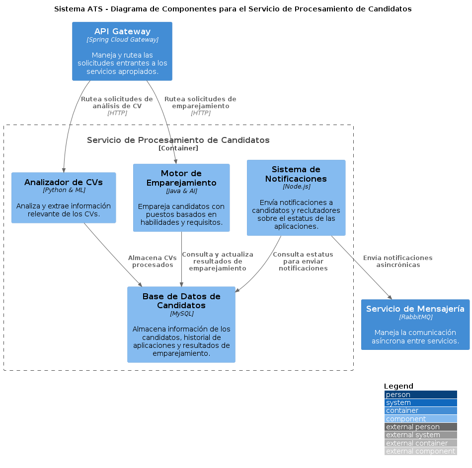

<!-- 
```plantuml
@startuml
!include https://raw.githubusercontent.com/plantuml-stdlib/C4-PlantUML/master/C4_Component.puml

LAYOUT_WITH_LEGEND()

title Sistema ATS - Diagrama de Componentes para el Servicio de Procesamiento de Candidatos

Container_Boundary(cps, "Servicio de Procesamiento de Candidatos") {
    Component(cvParser, "Analizador de CVs", "Python & ML", "Analiza y extrae información relevante de los CVs.")
    Component(matchingEngine, "Motor de Emparejamiento", "Java & AI", "Empareja candidatos con puestos basados en habilidades y requisitos.")
    Component(candidateDB, "Base de Datos de Candidatos", "MySQL", "Almacena información de los candidatos, historial de aplicaciones y resultados de emparejamiento.")
    Component(notificationSystem, "Sistema de Notificaciones", "Node.js", "Envía notificaciones a candidatos y reclutadores sobre el estatus de las aplicaciones.")
}

Container(apiGateway, "API Gateway", "Spring Cloud Gateway", "Maneja y rutea las solicitudes entrantes a los servicios apropiados.")
Container(messagingService, "Servicio de Mensajería", "RabbitMQ", "Maneja la comunicación asíncrona entre servicios.")

Rel(apiGateway, cvParser, "Rutea solicitudes de análisis de CV", "HTTP")
Rel(apiGateway, matchingEngine, "Rutea solicitudes de emparejamiento", "HTTP")
Rel(matchingEngine, candidateDB, "Consulta y actualiza resultados de emparejamiento")
Rel(cvParser, candidateDB, "Almacena CVs procesados")
Rel(notificationSystem, candidateDB, "Consulta estatus para enviar notificaciones")
Rel(notificationSystem, messagingService, "Envía notificaciones asincrónicas")

@enduml
```
-->

### Descripción de los Componentes:

- **Analizador de CVs**: Utiliza técnicas de Python y aprendizaje automático para extraer información relevante de los currículums vitae de los candidatos.
- **Motor de Emparejamiento**: Implementado en Java con tecnologías de inteligencia artificial, este componente se encarga de emparejar a los candidatos con los puestos disponibles basándose en las habilidades detectadas y los requisitos del puesto.
- **Base de Datos de Candidatos**: Almacena todos los datos relacionados con los candidatos, incluidos los CVs procesados, el historial de aplicaciones y los resultados del proceso de emparejamiento.
- **Sistema de Notificaciones**: Desarrollado en Node.js, gestiona el envío de notificaciones a los candidatos y reclutadores acerca del estado de las aplicaciones, utilizando para ello el servicio de mensajería.


## 4. Código

Describiré con más detalle cómo uno de los componentes está implementado en términos de código. Vamos a centrarnos en el componente Analizador de CVs. Este componente usa Python y técnicas de aprendizaje automático para analizar y extraer información relevante de los currículos vitae.


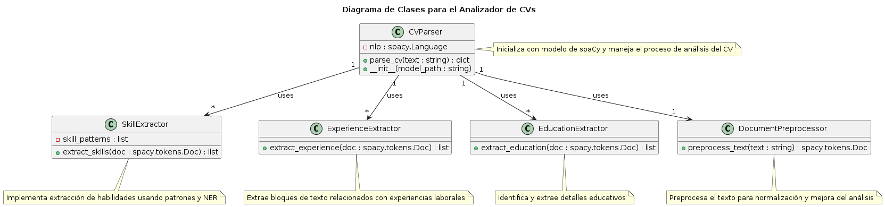

<!-- 
```plantuml
@startuml

title Diagrama de Clases para el Analizador de CVs

class CVParser {
    - nlp : spacy.Language
    + parse_cv(text : string) : dict
    + __init__(model_path : string)
}

class SkillExtractor {
    - skill_patterns : list
    + extract_skills(doc : spacy.tokens.Doc) : list
}

class ExperienceExtractor {
    + extract_experience(doc : spacy.tokens.Doc) : list
}

class EducationExtractor {
    + extract_education(doc : spacy.tokens.Doc) : list
}

class DocumentPreprocessor {
    + preprocess_text(text : string) : spacy.tokens.Doc
}

CVParser "1" - -> "1" DocumentPreprocessor : uses
CVParser "1" - -> "*" SkillExtractor : uses
CVParser "1" - -> "*" ExperienceExtractor : uses
CVParser "1" - -> "*" EducationExtractor : uses

note right of CVParser : Inicializa con modelo de spaCy y maneja el proceso de análisis del CV
note bottom of SkillExtractor : Implementa extracción de habilidades usando patrones y NER
note bottom of ExperienceExtractor : Extrae bloques de texto relacionados con experiencias laborales
note bottom of EducationExtractor : Identifica y extrae detalles educativos
note bottom of DocumentPreprocessor : Preprocesa el texto para normalización y mejora del análisis

@enduml
```
-->

### Descripción de las Clases y Funciones:

- **CVParser**: Es la clase central que coordina el análisis de los currículums. Inicializa la biblioteca de procesamiento de lenguaje natural y delega tareas específicas a otras clases. La función `parse_cv` es el método principal que toma texto de CV y devuelve un diccionario con habilidades, experiencia y educación extraídas.

- **DocumentPreprocessor**: Se encarga de la normalización del texto del CV, como eliminar caracteres extraños, corregir errores de ortografía comunes y ajustar el formato para mejorar el análisis de texto. Esto facilita una mayor precisión en la extracción de datos.

- **SkillExtractor**: Utiliza patrones definidos y el reconocimiento de entidades nombradas para identificar y extraer habilidades del texto procesado.

- **ExperienceExtractor**: Analiza los segmentos de texto para extraer información detallada sobre experiencias laborales previas, incluyendo roles y duraciones.

- **EducationExtractor**: Se enfoca en extraer información educativa, identificando nombres de instituciones, grados obtenidos, y otros detalles relevantes.


