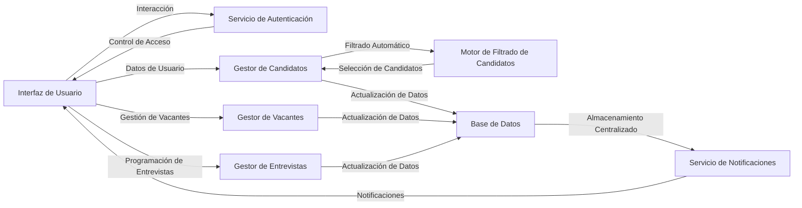
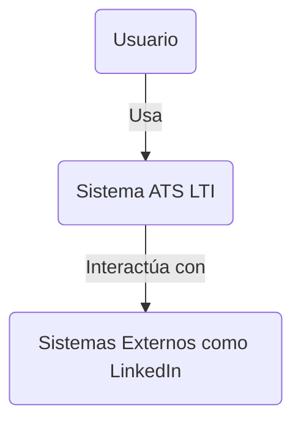
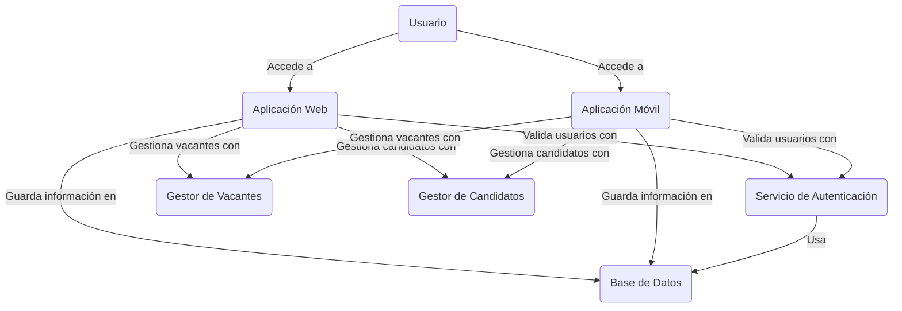
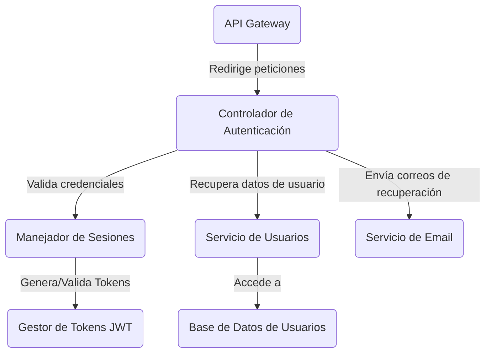

# Diseño del Sistema ATS para LTI

## Descripción del Software LTI

LTI es un sistema de seguimiento de candidatos diseñado específicamente para startups y pequeñas empresas. Facilita la gestión del proceso de reclutamiento mediante una interfaz intuitiva y escalable.

## Valor Añadido y Ventajas Competitivas

1. **Personalización Avanzada**: Adaptabilidad a las culturas y procesos de cada startup.
2. **Integración con Herramientas**: Integraciones nativas con herramientas populares en el entorno startup.
3. **Precio Competitivo**: Modelo de precios flexible adaptado al tamaño del equipo.
4. **Soporte Localizado**: Soporte técnico y asesoramiento en estrategias de reclutamiento.

## Funciones Principales

- **Publicación Multicanal de Ofertas**: Distribución automática de ofertas de trabajo en diversas plataformas.
- **Filtrado Inteligente de Candidatos**: Algoritmos que evalúan habilidades y compatibilidad cultural.
- **Gestión de Candidatos**: Seguimiento del estado de cada candidato en el proceso.
- **Comunicación Automatizada**: Notificaciones y actualizaciones automáticas a los candidatos.
- **Análisis y Reportes**: Informes detallados sobre la efectividad del proceso de reclutamiento.

## Lean Canvas

1. **Problema**: Necesidad de un proceso de reclutamiento ágil y económico.
2. **Soluciones**: LTI ofrece personalización, integración y un modelo de precios accesible.
3. **Propuestas de Valor Únicas**: Personalización y integración nativa con herramientas de startups.
4. **Ventaja Competitiva**: Precio flexible y personalización superior.
5. **Canales**: Redes sociales, eventos de startups, colaboraciones con incubadoras.
6. **Segmentos de Clientes**: Startups y pequeñas empresas en sectores tecnológicos y creativos.
7. **Estructura de Costos**: Desarrollo y mantenimiento del software, marketing, soporte al cliente.
8. **Flujos de Ingresos**: Suscripciones basadas en el tamaño del equipo y características premium.
9. **Métricas Clave**: Número de usuarios activos, tasa de satisfacción del cliente, costo de adquisición del cliente.

## Modelo de Datos

### Entidades y Atributos

- **Candidato**: ID, Nombre, Apellido, Email, Teléfono, LinkedIn URL, CV URL, Fecha de Postulación.
- **Vacante**: ID, Título, Descripción, Ubicación, Fecha de Creación, Estado.
- **Postulación**: ID, ID Candidato, ID Vacante, Estado, Fecha.
- **Entrevista**: ID, ID Postulación, Fecha Hora, Formato, Resultado.

### Relaciones

- **Candidato a Postulación**: Un candidato puede tener múltiples postulaciones.
- **Vacante a Postulación**: Una vacante puede tener múltiples postulaciones.
- **Postulación a Entrevista**: Una postulación puede incluir múltiples entrevistas.

## Diseño del Sistema a Alto Nivel

### Componentes Principales

1. **Interfaz de Usuario**: Front-end para interacción de usuarios.
2. **Servicio de Autenticación**: Gestión de acceso y seguridad.
3. **Gestor de Vacantes**: Administración de ofertas de trabajo.
4. **Gestor de Candidatos**: Manejo de datos de candidatos.
5. **Motor de Filtrado de Candidatos**: Algoritmos de selección de candidatos.
6. **Gestor de Entrevistas**: Coordinación de entrevistas.
7. **Base de Datos**: Almacenamiento centralizado de datos.
8. **Servicio de Notificaciones**: Envío de comunicaciones automáticas.

### Diagrama del Sistema

### Diagramas C4 para el Sistema ATS LTI

#### Nivel 1: Diagrama de Contexto

#### Nivel 2: Diagrama de Contenedores

#### Nivel 3: Diagrama de Componentes (Servicio de Autenticación)

