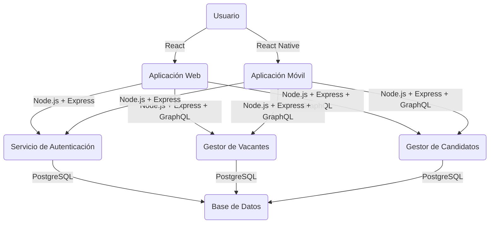
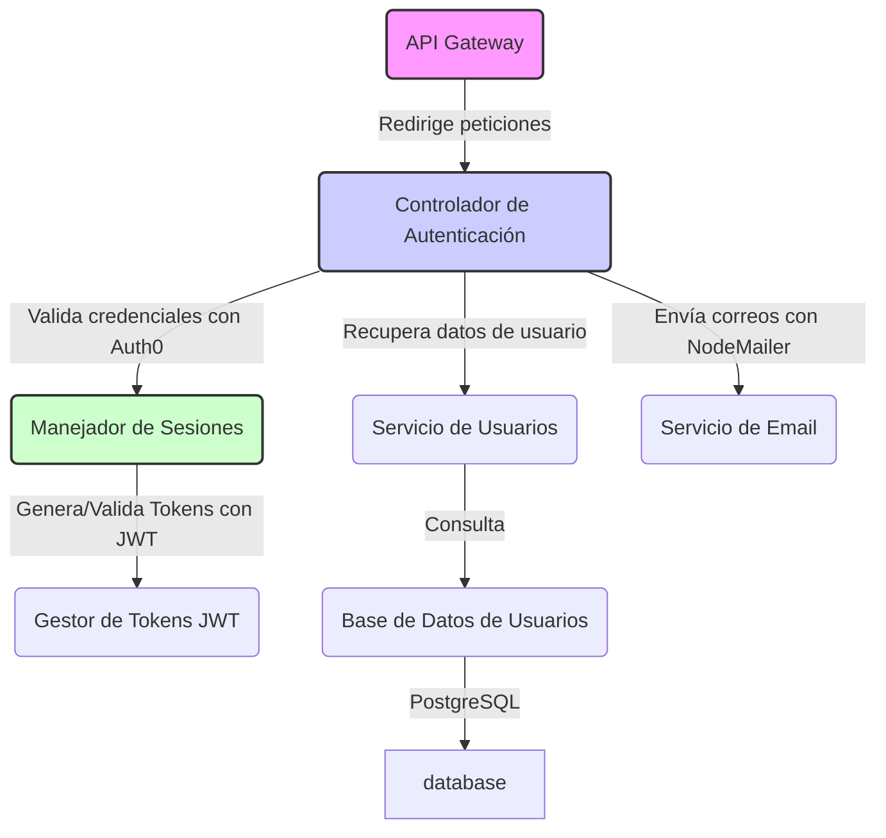

# Diseño del Sistema ATS para LTI

## Descripción del Software LTI

LTI es un sistema de seguimiento de candidatos diseñado específicamente para startups y pequeñas empresas. Facilita la gestión del proceso de reclutamiento mediante una interfaz intuitiva y escalable.

## Valor Añadido y Ventajas Competitivas

### 1. Personalización Avanzada

LTI permite una adaptación completa a las culturas y procesos de cada startup mediante:

- **Interfaz Configurable**: Los usuarios pueden personalizar la interfaz de usuario para ajustarse a sus preferencias personales y requisitos específicos de flujo de trabajo.
- **Procesos de Reclutamiento Configurables**: Permite a los reclutadores modificar etapas, criterios de evaluación y automatizaciones en función del tipo de vacante.
- **Reportes Personalizados**: Facilita la creación de reportes personalizados, permitiendo a los usuarios elegir y visualizar las métricas que más les interesen.

### 2. Integración con Herramientas

LTI se integra perfectamente con herramientas externas ampliamente utilizadas en el entorno de startups:

- **APIs de Conectividad**: Desarrollo y exposición de APIs robustas para una integración fluida con plataformas de comunicación, herramientas de gestión de proyectos, y otros sistemas HRIS.
- **Plugins y Extensiones**: Ofrece plugins que se integran directamente en otras plataformas, permitiendo el acceso y la gestión de las funcionalidades de LTI desde otras aplicaciones.
- **Sincronización de Datos en Tiempo Real**: Asegura una sincronización continua de datos entre LTI y las herramientas integradas, manteniendo la coherencia de la información.

### 3. Precio Competitivo

LTI ofrece un modelo de precios accesible y adaptado al crecimiento de las startups:

- **Modelo de Precios Escalonado**: Basado en el uso, permite a las startups comenzar con un plan básico y escalar según sus necesidades.
- **Pruebas Gratuitas y Demostraciones**: Periodos de prueba y demostraciones completas sin compromiso, permitiendo a los usuarios experimentar el valor del sistema antes de la compra.
- **Descuentos por Volumen y Compromiso a Largo Plazo**: Beneficios y descuentos para usuarios que se comprometen a largo plazo o contratan múltiples servicios.

### 4. Soporte Localizado

LTI proporciona un soporte técnico y de estrategia de reclutamiento adaptado a cada región:

- **Diseño Modular del Sistema**: Incluye un módulo específico para manejar las variaciones regionales en idioma, regulaciones laborales y mejores prácticas de reclutamiento.
- **Integración de Chatbots Multilingües**: Chatbots dentro de la plataforma que interactúan con usuarios en su idioma local.
- **Recursos y Guías Regionalizados**: Una biblioteca de recursos que incluye guías y consejos de reclutamiento específicos para diferentes mercados.
- **Capacitación y Webinars Localizados**: Sesiones de capacitación y webinars diseñados para diferentes regiones.
- **Soporte al Cliente Dedicado por Región**: Equipos de soporte que no solo hablan el idioma local, sino que entienden las particularidades culturales y de mercado de cada región.

## Funciones Principales

- **Publicación Multicanal de Ofertas**: Distribución automática de ofertas de trabajo en diversas plataformas.

- **Filtrado Inteligente de Candidatos**: Algoritmos que evalúan habilidades y compatibilidad cultural.

- **Gestión de Candidatos**: Seguimiento del estado de cada candidato en el proceso.

- **Comunicación Automatizada**: Notificaciones y actualizaciones automáticas a los candidatos.

- **Análisis y Reportes**: Informes detallados sobre la efectividad del proceso de reclutamiento.

## Lean Canvas

1.  **Problema**: Necesidad de un proceso de reclutamiento ágil y económico.

2.  **Soluciones**: LTI ofrece personalización, integración y un modelo de precios accesible.

3.  **Propuestas de Valor Únicas**: Personalización y integración nativa con herramientas de startups.

4.  **Ventaja Competitiva**: Precio flexible y personalización superior.

5.  **Canales**: Redes sociales, eventos de startups, colaboraciones con incubadoras.

6.  **Segmentos de Clientes**: Startups y pequeñas empresas en sectores tecnológicos y creativos.

7.  **Estructura de Costos**: Desarrollo y mantenimiento del software, marketing, soporte al cliente.

8.  **Flujos de Ingresos**: Suscripciones basadas en el tamaño del equipo y características premium.

9.  **Métricas Clave**: Número de usuarios activos, tasa de satisfacción del cliente, costo de adquisición del cliente.

## Modelo de Datos

### Entidades y Atributos

- **Candidato**: ID (int), Nombre (varchar), Apellido (varchar), Email (varchar), Teléfono (varchar), LinkedIn URL (varchar, opcional), CV URL (varchar), Fecha de Postulación (date).
- **Vacante**: ID (int), Título (varchar), Descripción (text), Ubicación (varchar), Fecha de Creación (date), Estado (varchar).
- **Postulación**: ID (int), ID Candidato (int), ID Vacante (int), Estado (varchar), Fecha (date).
- **Entrevista**: ID (int), ID Postulación (int), Fecha Hora (datetime), Formato (varchar), Resultado (varchar).
- **Entrevistador**: ID (int), Nombre (varchar), Apellido (varchar), Email (varchar), Departamento (varchar).

### Relaciones

- **Candidato a Postulación**: Un candidato puede tener múltiples postulaciones.
- **Vacante a Postulación**: Una vacante puede tener múltiples postulaciones.
- **Postulación a Entrevista**: Una postulación puede incluir múltiples entrevistas.
- **Entrevista a Entrevistador**: Una entrevista puede ser realizada por uno o más entrevistadores.

### Diagrama del Modelo de Datos

````mermaid
erDiagram
    Candidato ||--o{ Postulacion : "aplica"
    Postulacion ||--|| Vacante : "pertenece a"
    Postulacion ||--o{ Entrevista : "programa"
    Entrevista ||--o{ Entrevistador : "realiza"
    Vacante ||--o{ Entrevista : "necesita"
    Vacante {
        int ID_Vacante
        string Titulo
        string Descripcion
        string Ubicacion
        date Fecha_Creacion
        string Estado
    }
    Candidato {
        int ID_Candidato
        string Nombre
        string Apellido
        string Email
        string Telefono
        string LinkedIn_URL
        string CV_URL
        date Fecha_Postulacion
    }
    Postulacion {
        int ID_Postulacion
        int ID_Candidato
        int ID_Vacante
        string Estado
        date Fecha_Postulacion
    }
    Entrevista {
        int ID_Entrevista
        int ID_Postulacion
        datetime Fecha_Hora
        string Formato
        string Resultado
    }
    Entrevistador {
        int ID_Entrevistador
        string Nombre
        string Apellido
        string Email
        string Departamento
    }

  ## Casos de Uso Principales

### Publicación Multicanal de Ofertas de Trabajo
- **Descripción**: Permite la publicación simultánea de ofertas en múltiples plataformas.
- **Proceso**: Preparar descripción -> Seleccionar plataformas -> Distribuir oferta -> Recopilar solicitudes.
- **Diagrama**:
    ```mermaid
    graph TB
        Start((Inicio)) --> Prepare[Preparar Descripción del Puesto]
        Prepare --> Select[Seleccionar Plataformas]
        Select --> Distribute[Distribuir Oferta]
        Distribute --> Collect[Recopilar Solicitudes]
        Collect --> End((Fin))
    ```

### Filtrado Inteligente de Candidatos
- **Descripción**: Filtra automáticamente los currículos usando IA para identificar candidatos que cumplen con los criterios específicos.
- **Proceso**: Recopilar currículos -> Analizar -> Filtrar -> Revisión humana.
- **Diagrama**:
    ```mermaid
    graph TB
        Start((Inicio)) --> Collect[Recopilar Currículos]
        Collect --> Analyze[Analizar Currículos]
        Analyze --> Filter[Filtrar Candidatos]
        Filter --> Review[Revisión Humana]
        Review --> End((Fin))
    ```

### Comunicación Automatizada con Candidatos
- **Descripción**: Automatiza la comunicación con candidatos a lo largo del proceso de reclutamiento.
- **Proceso**: Aplicación del candidato -> Enviar confirmación -> Enviar actualizaciones -> Post-entrevista.
- **Diagrama**:
    ```mermaid
    graph TB
        Start((Inicio)) --> Application[Aplicación del Candidato]
        Application --> Confirm[Enviar Confirmación]
        Confirm --> Updates[Enviar Actualizaciones]
        Updates --> Interview[Post-Entrevista]
        Interview --> End((Fin))
    ```
## Diseño del Sistema a Alto Nivel


### Componentes Principales


1.  **Interfaz de Usuario**: Front-end para interacción de usuarios.

2.  **Servicio de Autenticación**: Gestión de acceso y seguridad.

3.  **Gestor de Vacantes**: Administración de ofertas de trabajo.

4.  **Gestor de Candidatos**: Manejo de datos de candidatos.

5.  **Motor de Filtrado de Candidatos**: Algoritmos de selección de candidatos.

6.  **Gestor de Entrevistas**: Coordinación de entrevistas.

7.  **Base de Datos**: Almacenamiento centralizado de datos.

8.  **Servicio de Notificaciones**: Envío de comunicaciones automáticas.

  ### Diagrama del Sistema

```mermaid
graph LR
    UI[Interfaz de Usuario] -->|Personalización| ConfigUI[Configurador de UI]
    UI -->|Definición de Procesos| CustProc[Gestor de Procesos Personalizados]
    UI -->|Creación de Reportes| RepBuilder[Constructor de Reportes]
    UI -->|Integración| APIG[API Gateway]
    APIG -->|Conecta con| ExtTools[Herramientas Externas]
    ExtTools -->|Plugins| ExtPlugs[Slack, Trello, JIRA]
    ExtTools -->|Sincronización| HRIS[Sistema HRIS]
    UI -->|Consulta de Precios| LicMan[Gestor de Licencias]
    LicMan -->|Modelo Escalonado| PriceCalc[Calculadora de Precios]
    LicMan -->|Pruebas/Demos| DemoPortal[Portal de Demos]
    LicMan -->|Descuentos por Volumen| CustServ[Servicio de Clientes]
    UI -->|Soporte Localizado| LocSup[Soporte Localizado]
    LocSup -->|Asistencia Regional| LocUI[Interfaz de Usuario]
    LocSup -->|Capacitación Local| LocTrain[Plataforma de Capacitación]
    LocSup -->|Chatbot Multilingüe| LocChat[Chatbot]
    LocSup -->|Recursos Regionalizados| LocRes[Biblioteca de Recursos]

    style UI fill:#f9f,stroke:#333,stroke-width:2px
    style APIG fill:#ccf,stroke:#333,stroke-width:2px
    style LicMan fill:#ccf,stroke:#333,stroke-width:2px
    style LocSup fill:#f9f,stroke:#333,stroke-width:2px
    style ExtTools fill:#cfc,stroke:#333,stroke-width:2px

````

### Tecnologías, Frameworks y Librerías Recomendadas

#### Frontend

- **React**: Un framework de JavaScript para construir interfaces de usuario. Es ampliamente utilizado, tiene una gran comunidad, y es conocido por su rendimiento y flexibilidad. React facilita la creación de SPA (Single Page Applications) que pueden mejorar la experiencia del usuario y reducir las cargas de servidor.
- **Material-UI**: Una biblioteca de componentes de React para un desarrollo rápido y consistente de interfaces. Ofrece una amplia gama de componentes que siguen los principios de diseño de Material Design de Google.

#### Backend

- **Node.js**: Plataforma de ejecución para JavaScript del lado del servidor. Es ideal para construir aplicaciones en red rápidas y escalables. Node.js es ligero, eficiente y excelente para aplicaciones en tiempo real con una gran cantidad de operaciones de entrada/salida.
- **Express**: Un framework web minimalista y flexible para Node.js, que proporciona un robusto conjunto de características para aplicaciones web y móviles.

#### Base de Datos

- **PostgreSQL**: Un sistema de gestión de base de datos relacional objeto que destaca por su robustez, desempeño y cumplimiento de estándares SQL. Es una excelente opción para aplicaciones que requieren transacciones complejas y una alta integridad de datos.

#### Autenticación y Seguridad

- **Auth0**: Una plataforma para la autenticación y autorización que simplifica la implementación de logins seguros y modernos. Auth0 es compatible con Node.js y puede integrarse fácilmente con React para gestionar la autenticación en el frontend.

#### API y Integración

- **GraphQL**: Un lenguaje de consulta para APIs que permite a los clientes solicitar exactamente los datos que necesitan. Es una buena alternativa a REST para desarrollar APIs que puedan evolucionar sin mucho esfuerzo y reducir el sobrepeso de datos.
- **Apollo Server**: Un servidor GraphQL comunitariamente enfocado y de fácil implementación para Node.js, que funciona bien con cualquier fuente de datos, incluyendo SQL, NoSQL y API REST.

#### Comunicaciones en Tiempo Real

- **Socket.IO**: Librería de JavaScript para aplicaciones web en tiempo real. Permite comunicaciones bidireccionales en tiempo real entre clientes y servidores. Es útil para características como las notificaciones en tiempo real y chatbots.

#### Herramientas de Desarrollo y DevOps

- **Docker**: Plataforma de contenedores que permite empaquetar una aplicación y sus dependencias en un contenedor virtual que puede correr en cualquier sistema Linux. Facilita la implementación y escalabilidad.
- **Kubernetes**: Sistema de orquestación de contenedores para la automatización del despliegue, escalado y manejo de aplicaciones en contenedores, ideal para manejar la infraestructura a gran escala.

### Diagramas C4 para el Sistema ATS LTI

#### Nivel 1: Diagrama de Contexto

```mermaid

graph TB

user(Usuario)

system(Sistema ATS LTI)

external(Sistemas Externos como LinkedIn)

user -->|Usa| system

system -->|Interactúa con| external

```

#### Nivel 2: Diagrama de Contenedores



#### Nivel 3: Diagrama de Componentes (Servicio de Autenticación)


