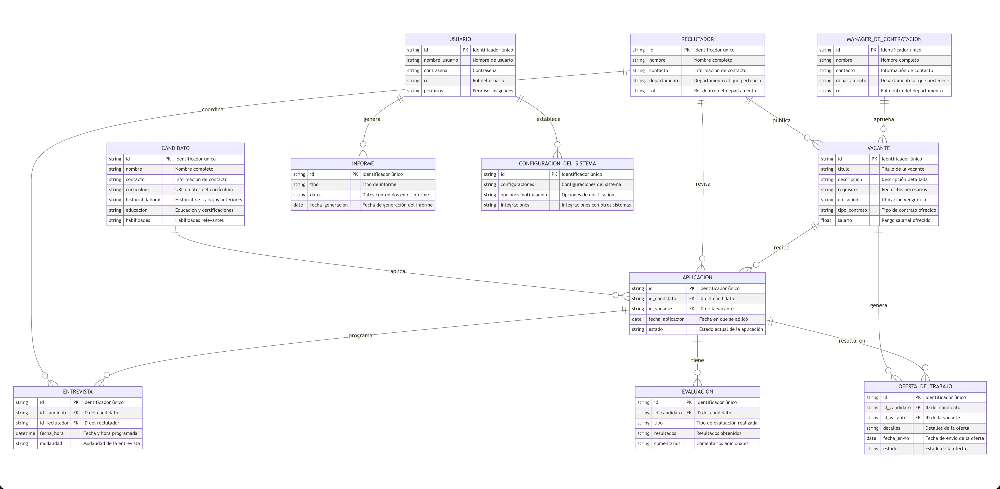

# Sistema ATS (Applicant Tracking System)
## Índice

* [Descripción Breve](#descripción-breve)
* [Valor Añadido y Ventajas Competitivas](#valor-añadido-y-ventajas-competitivas)
* [Funciones Principales](#funciones-principales)
* [Diagrama Lean Canvas](#diagrama-lean-canvas)
* [Casos de uso principales](#casos-de-uso-principales)
  * [Caso de Uso 1: Publicación de Vacantes](#caso-de-uso-1-publicación-de-vacantes)
  * [Caso de Uso 2: Proceso de Selección de Candidatos](#caso-de-uso-2-proceso-de-selección-de-candidatos)
  * [Caso de Uso 3: Integración con Herramientas de RRHH](#caso-de-uso-3-integración-con-herramientas-de-rrhh)

## Descripción Breve
El Sistema ATS (Applicant Tracking System) es un software innovador diseñado para revolucionar el proceso de reclutamiento y contratación de personal en las empresas. Aprovecha las últimas tecnologías de automatización e inteligencia artificial para optimizar y agilizar todas las etapas, desde la publicación de vacantes hasta la selección final de candidatos.

## Valor Añadido y Ventajas Competitivas

1. **Aumento de la eficiencia para los departamentos de Recursos Humanos**: Automatiza tareas rutinarias y agiliza el flujo de trabajo, liberando tiempo valioso para que los reclutadores se enfoquen en actividades de mayor valor.
2. **Colaboración en tiempo real entre reclutadores y managers**: Promueve una comunicación fluida y transparente, permitiendo una toma de decisiones más informada y ágil.
3. **Asistencia de Inteligencia Artificial**: Aprovecha la IA para tareas como clasificación de currículums, programación de entrevistas, redacción de descripciones de puestos y preguntas de entrevista, entre otras.
4. **Experiencia de usuario mejorada**: Interfaz intuitiva y atractiva tanto para reclutadores como para candidatos, mejorando su engagement y satisfacción.
5. **Integración con otras herramientas de RRHH**: Compatibilidad con diversas plataformas y sistemas de gestión de recursos humanos.
6. **Análisis de datos avanzados**: Capacidades de generación de informes personalizados y análisis en profundidad de métricas de reclutamiento.
7. **Personalización y configuración**: Opciones para adaptar el sistema a las necesidades específicas de cada empresa.
8. **Seguridad y cumplimiento normativo**: Garantiza la protección de datos y el cumplimiento de regulaciones de privacidad.
9. **Escalabilidad**: Capacidad para manejar grandes volúmenes de candidatos sin comprometer el rendimiento.
10. **Soporte multilingüe y adaptabilidad regional**: Accesible a empresas y candidatos de diferentes regiones y culturas.
11. **Funciones multimedia**: Video-entrevistas, evaluaciones en línea y capacidades de reclutamiento en redes sociales.
12. **Acceso móvil optimizado**: Interfaz adaptada para dispositivos móviles, brindando flexibilidad a reclutadores y candidatos.
13. **Gamificación y engagement de candidatos**: Elementos lúdicos y atractivos que mejoran la experiencia de los candidatos.
14. **Modelo de precios flexible**: Opciones de planes adaptados al tamaño y necesidades de cada empresa.

## Funciones Principales

1. **Gestión integral del proceso de reclutamiento**: Desde la publicación de vacantes hasta la contratación final, pasando por la recopilación y clasificación de candidatos, programación de entrevistas, evaluaciones, ofertas de trabajo y seguimiento.
2. **Inteligencia Artificial aplicada**: Utilización de IA para tareas como matching de currículums, programación inteligente de entrevistas, redacción asistida de descripciones de puestos y preguntas de entrevista, entre otras.
3. **Colaboración y comunicación en tiempo real**: Plataforma centralizada que facilita la comunicación entre reclutadores, managers y candidatos, promoviendo una toma de decisiones más informada y ágil.
4. **Automatización de tareas**: Capacidades de automatización de procesos repetitivos, como el filtrado inicial de candidatos, envío de comunicaciones estandarizadas, programación de entrevistas, etc.
5. **Análisis de datos y generación de informes**: Herramientas avanzadas de análisis de datos y generación de informes personalizados sobre métricas clave de reclutamiento, tendencias y áreas de mejora.
6. **Gestión de marca empleadora**: Funcionalidades para promocionar la marca empleadora de la empresa, atrayendo a los mejores talentos.
7. **Integración con otras plataformas**: Capacidad de integrarse sin problemas con otros sistemas de gestión de recursos humanos, plataformas de redes sociales y profesionales, herramientas de evaluación, etc.
8. **Configuración y personalización**: Opciones para personalizar el sistema según las necesidades y preferencias de cada empresa, adaptándose a sus flujos de trabajo y procesos únicos.
9. **Seguridad y cumplimiento normativo**: Medidas de seguridad robustas y cumplimiento de regulaciones de protección de datos y privacidad.
10. **Soporte multilingüe y adaptabilidad regional**: Capacidad de operar en múltiples idiomas y adaptarse a diferentes regiones y culturas.
11. **Acceso móvil optimizado**: Interfaz móvil intuitiva y funcional para reclutadores y candidatos, permitiendo una experiencia fluida en cualquier momento y lugar.
12. **Gamificación y engagement de candidatos**: Elementos de gamificación y estrategias de engagement para mantener a los candidatos motivados e interesados durante todo el proceso.
13. **Modelo de precios flexible**: Diferentes opciones de planes y precios adaptados al tamaño y necesidades de cada empresa, desde pequeñas empresas hasta grandes corporaciones.

## Diagrama Lean Canvas
A continuación se muestra un diagrama tipo **Lean Canvas** con los siguientes elementos:

1. Problema
2. Segmento de clientes
3. Solución
4. Métricas clave
5. Ventaja especial
6. Canales
7. Estructura de costos
8. Fuentes de ingresos
9. Alternativas existentes
10. Primeros adoptantes

## Casos de uso principales
### Caso de Uso 1: Publicación de Vacantes
1. **Roles de Usuario**:

  * **Reclutador**: Publica nuevas ofertas de trabajo.
  * **Manager de Contratación**: Aprueba las vacantes antes de su publicación.

2. **Acciones**:
* El Reclutador crea una nueva oferta de trabajo en el sistema.
* El Manager de Contratación revisa y aprueba la oferta de trabajo.
* Una vez aprobada, la vacante se publica automáticamente en los canales seleccionados.

3. **Dependencias**:
* La aprobación de la vacante por parte del Manager de Contratación es necesaria antes de la publicación.
* El Reclutador debe estar autenticado en el sistema para crear y enviar la oferta de trabajo.

**Diagrama de uso**:

### Caso de Uso 2: Proceso de Selección de Candidatos

1. **Roles de Usuario**:
* **Candidato**: Aplica a las ofertas de trabajo y completa las evaluaciones requeridas.
* **Reclutador**: Revisa las aplicaciones y selecciona candidatos para entrevistas.

2. **Acciones**:
* El Candidato se registra en el sistema, completa su perfil y aplica a las vacantes.
* El Reclutador utiliza la IA para filtrar y clasificar las aplicaciones.
* Los candidatos seleccionados son notificados y programados para entrevistas.

3. **Dependencias**:
* Los Candidatos deben registrarse y completar su perfil para aplicar a las vacantes.
* El Reclutador necesita autenticarse para acceder a las aplicaciones y gestionar el proceso de selección.

**Diagrama de uso**:

### Caso de Uso 3: Integración con Herramientas de RRHH

1. **Roles de Usuario**:
* **Administrador de Sistemas**: Configura y mantiene la integración con otras herramientas de RRHH.
* **Reclutador**: Utiliza las herramientas integradas para mejorar el proceso de reclutamiento.

2. **Acciones**:
* El Administrador de Sistemas establece conexiones con plataformas de RRHH externas.
* El Reclutador accede a las herramientas integradas para realizar tareas como la evaluación de competencias o la verificación de antecedentes.

3. **Dependencias**:
* La configuración por parte del Administrador de Sistemas es necesaria para la integración funcional.
* El Reclutador debe tener permisos adecuados para utilizar las herramientas integradas.

**Diagrama de uso**:

## Modelo de datos
El siguiente diagrama muestra las entidades principales y sus relaciones en el contexto del sistema ATS que se está diseñando:

## Diseño del sistema a alto nivel
A continuación se describe la arquitectura de alto nivel del sistema de ATS haciendo uso exclusivo de servicios en la nube de AWS:

### Frontend:
* **Amazon CloudFront**: Como CDN, distribuirá el contenido estático y dinámico del frontend, mejorando la velocidad de carga y reduciendo la latencia.
* **Amazon S3 Bucket**: Almacenará los archivos estáticos del frontend como HTML, CSS y JavaScript.

### Backend:
* **Elastic Load Balancing (ELB)**: Distribuirá el tráfico entrante entre las instancias EC2 para mejorar la disponibilidad y la tolerancia a fallos.
* **Auto Scaling Group**: Asegurará que el número de instancias EC2 se ajuste automáticamente según la demanda para manejar la carga y mantener la escalabilidad.
* **Amazon EC2**: Instancias para alojar la lógica de negocio del backend.
* **Amazon RDS / Aurora**: Base de datos relacional gestionada que almacenará el modelo de datos del ATS y proporcionará alta disponibilidad y escalabilidad.
* **Amazon ElastiCache**: Para caché en memoria, reducirá la carga en la base de datos y mejorará el rendimiento de las consultas frecuentes.

### Integración y Comunicación:
* **AWS Lambda**: Para ejecutar código en respuesta a eventos, como procesamiento de aplicaciones o tareas de automatización.
* **Amazon SNS y SQS**: Para la mensajería y la comunicación asíncrona entre servicios, asegurando la entrega de mensajes y la desacoplamiento de componentes.

### Seguridad:
* **AWS Identity and Access Management (IAM)**: Para controlar el acceso a los recursos de AWS de manera segura.
* **Amazon Cognito**: Para la gestión de usuarios y el control de acceso al frontend.
* **AWS WAF y Shield**: Para proteger la aplicación de ataques web comunes y DDoS.

### Almacenamiento y Procesamiento de Datos:
* **Amazon S3**: Para almacenar datos no estructurados como currículums y otros documentos de los candidatos.
* **AWS Glue**: Para transformación y carga de datos, permitiendo la integración con otras fuentes de datos.
* **Amazon Redshift**: Para análisis de datos y generación de informes, escalable y optimizado para consultas SQL.

### Escalabilidad y Disponibilidad:
* La combinación de Auto Scaling, ELB y múltiples instancias EC2 garantizará la escalabilidad horizontal y la alta disponibilidad.
* La replicación y la configuración de Aurora proporcionarán redundancia y recuperación ante fallos.

### Mantenibilidad:
* Utilización de servicios gestionados como RDS y Aurora reducirá la carga operativa en el mantenimiento de la base de datos.
* Implementación de infraestructura como código (IaC) con AWS CloudFormation para facilitar la gestión y actualización de recursos.
