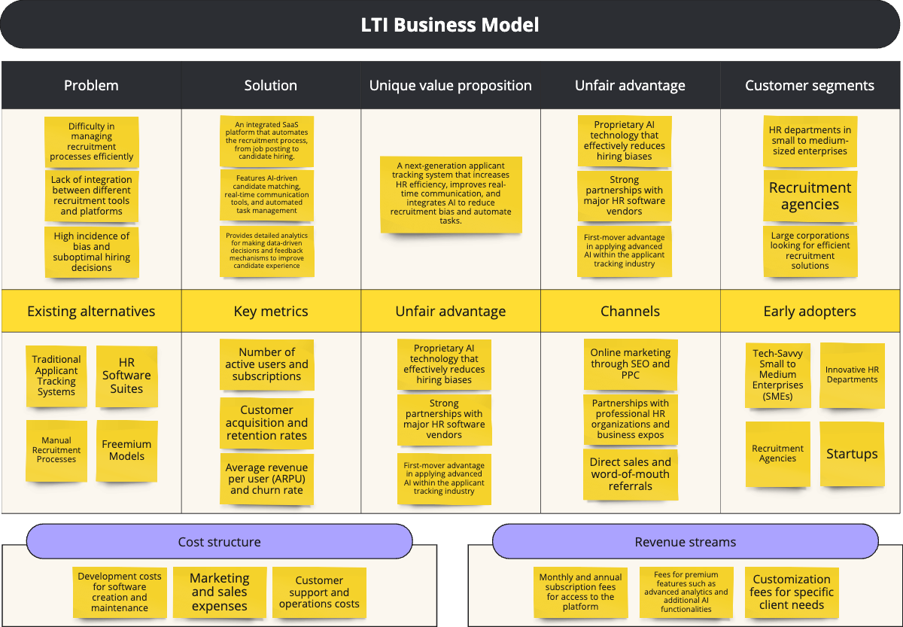
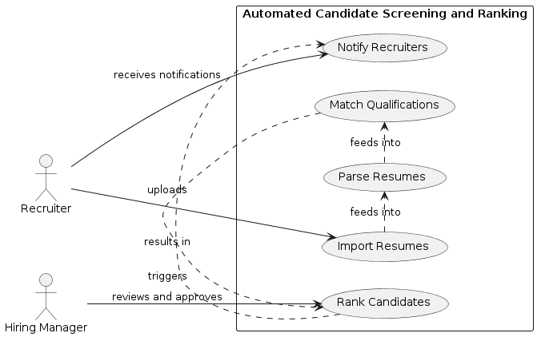
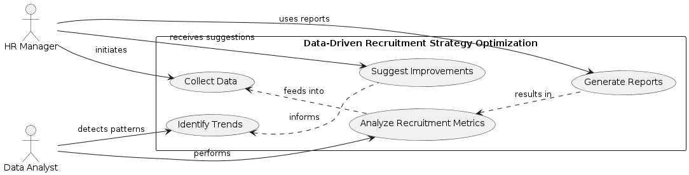
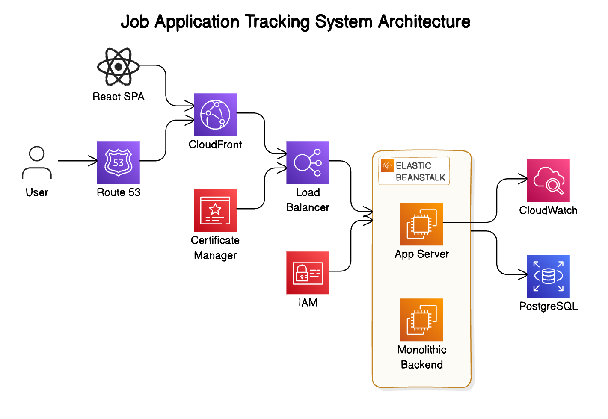
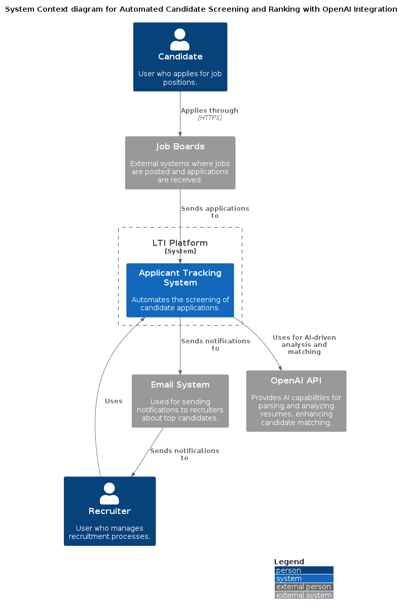
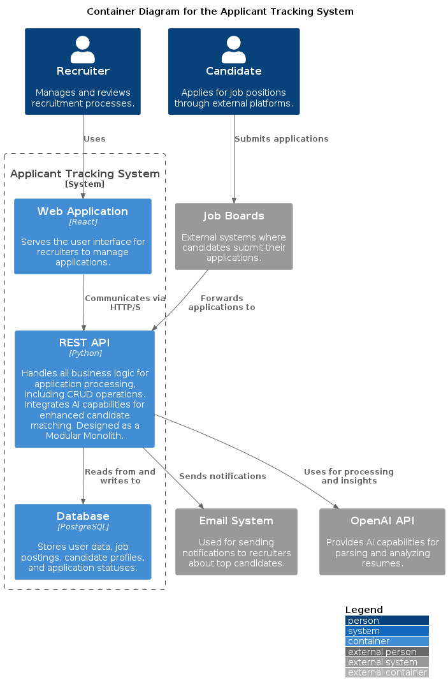
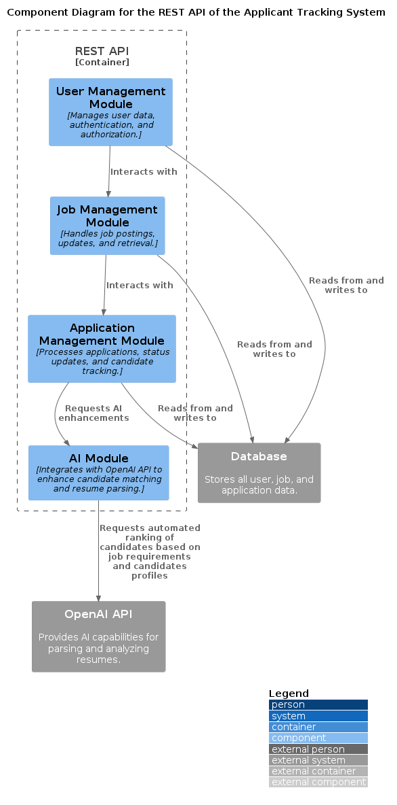

# LTI
> Revolutionize Recruitment with Bias-Free Candidate Matching and Efficient Applicant Tracking

## Brief Description of LTI Platform

LTI’s SaaS platform is designed to transform the recruitment process by providing a next-generation applicant tracking system. It aims to increase the efficiency of HR departments, improve real-time communication between recruiters and hiring managers, and integrate advanced AI to automate tasks and reduce biases in hiring. The platform supports a variety of tasks related to recruiting candidates for any position, making it a versatile tool for any organization looking to optimize their hiring process.

## Value Added by the Platform

1. **Enhanced Recruitment Efficiency**: Automation of routine tasks such as candidate screening and communications significantly reduces the workload on HR, allowing them to focus on strategic aspects of recruitment.
1. **Improved Quality of Hires**: By leveraging advanced AI algorithms, the platform ensures a higher accuracy in matching candidates to job requirements, which enhances the quality of hires and reduces biases.
1. **Cost Reduction**: Automating various aspects of the recruitment process helps companies save on operational costs, with reduced reliance on external recruitment agencies and fewer resources spent on lengthy recruitment processes.

## Competitive Advantages of Using the Platform

1. **Advanced AI Integration**: LTI's platform uses sophisticated AI to enhance the accuracy of candidate matching and to actively reduce biases, offering a smarter and fairer hiring process compared to traditional systems.
1. **Real-Time Collaboration Tools**: Unique features that enable immediate communication and decision-making among HR teams and hiring managers, improving the speed and effectiveness of the recruitment process.
1. **Seamless Integration**: The platform’s ability to integrate effortlessly with existing HR systems and tools ensures easy adoption and enhances its value by working within established workflows.

## LTI Business Model

### Main use cases 

#### Automated Candidate Screening and Ranking

**Use Case Description**: HR departments receive hundreds of applications for open positions. LTI’s platform automates the screening process by parsing resumes and matching qualifications against job requirements. It ranks candidates based on fit, ensuring that recruiters focus their attention on the most promising applicants.

**Key Activities**: Import resumes, parse data, match skills and qualifications, rank candidates, and notify recruiters of top candidates.

**Benefits**: Saves time, reduces human error, ensures fair screening, and improves the quality of shortlisted candidates.

#### Real-Time Communication and Collaboration

**Use Case Description**: Coordinating between recruiters and hiring managers can often be cumbersome and slow, especially when decisions need swift communication. LTI’s platform provides tools for real-time messaging and updates, allowing seamless communication and collaboration directly on the platform.

**Key Activities**: Send instant messages, share candidate profiles and feedback, schedule interviews, and make collaborative hiring decisions.

**Benefits**: Speeds up the recruitment process, improves decision-making accuracy, and enhances collaboration efficiency.

#### Data-Driven Recruitment Strategy Optimization

**Use Case Description**: Understanding the effectiveness of different recruitment strategies is crucial for continuous improvement. LTI’s platform offers comprehensive analytics and reporting features that track key metrics such as time-to-hire, cost-per-hire, and source effectiveness.

**Key Activities**: Collect data, analyze recruitment metrics, generate reports, identify trends, and suggest improvements.

**Benefits**: Provides insights into recruitment performance, helps in strategic planning, reduces recruitment costs, and optimizes resource allocation.

### Database model

### High level architecture

**1. Frontend Architecture: React Application**

- **Single Page Application (SPA)**: Develop the frontend as a React SPA, which interacts with the backend via RESTful APIs. This approach provides a dynamic user experience with fast, interactive web pages.
- **State Management**: Use state management libraries (like Redux or Context API) to manage state across the React application, ensuring that the UI is responsive and efficient.
- **Integration with Google Analytics**:
    - **User Tracking**: Implement tracking codes to monitor user interactions, page views, and specific actions within the application. This data will help understand user behavior and improve UX/UI based on real user data.
    - **Event Tracking**: Use event tracking to gather data on crucial interactions like form submissions, button clicks, and other user engagements.

**2. Backend Architecture: Modular Monolith Approach**

- **Why a Modular Monolith?**
    - **Simplicity**: In the early stages of a startup, it is often more efficient to build a monolithic application that is modular in its internal structure. This approach keeps the complexity low while allowing for rapid development and easier debugging.
    - **Cost-Effective**: This approach minimizes the operational complexity and cost, which is crucial for a startup with limited resources.
    - **Refactoring Ease**: As the product evolves, having a modular architecture within a monolith makes it easier to refactor and, if needed, split into microservices later on as the specific needs for scalability and decoupling become clearer.

- **Architecture Details**:
    - **Core Modules**: Divide the application into core modules based on business capabilities (e.g., User Management, Job Posting Management, Candidate Management, Analytics).
    - **Shared Libraries**: Use shared libraries for common functions such as database access, messaging, and authentication.
    - **Internal APIs**: Each module exposes an internal API that other modules can use, promoting loose coupling within the monolith.

**API Integration Management**: Develop a robust integration layer to manage communication between the backend services and external APIs (like OpenAI). This includes handling API keys, managing rate limits, and ensuring data security.

**OpenAI Integration**:
- **Data Analytics and Insights**: Utilize the OpenAI API to process and analyze large datasets for generating insights, which can support decision-making processes within the platform.
- **AI-Driven Candidate Matching**: Implement functionality to utilize AI for improving the matching of candidates to job postings by analyzing resumes and job descriptions. This will also include mechanisms to reduce biases in the recruitment process.

**3. Data Handling and Security**
**Security Enhancements**:
- **Data Encryption**: Implement encryption for sensitive data both at rest and in transit, particularly for data being sent to and from external APIs like OpenAI.
- **API Security**: Secure the RESTful APIs using best practices such as HTTPS, token-based authentication (JWT), and OAuth for user authentication.

**4. Scalability and Performance**
**Optimization and Scalability:**
- **Microservices Readiness**: Prepare for possible future decomposition into microservices by keeping the backend services loosely coupled and well-documented.
- **Load Balancing**: Use load balancers to distribute traffic across servers as the user base grows, ensuring high availability and reliability.

**5. Deployment and Operations**
**Cloud Services and CI/CD:**
- **Containerization:** Use Docker to containerize the frontend and backend, facilitating easy deployment and scaling.
Continuous Integration/Continuous Deployment (CI/CD): Implement CI/CD pipelines using tools like Jenkins, GitLab, or GitHub Actions for automated testing and deployment.
- **Cloud-Based Hosting:** Utilize a cloud platform that supports automatic scaling and management of containerized applications (e.g., AWS Elastic Kubernetes Service, Google Kubernetes Engine).

6. Monitoring and Analytics
**Advanced Monitoring:**
- **Performance Monitoring:** Use tools like New Relic or Datadog to monitor the performance of both the frontend and backend, identifying and resolving potential bottlenecks.
- **Logging and Alerting:** Implement centralized logging (e.g., using ELK Stack or Splunk) and set up alerting for system anomalies and operational issues.
This expanded architectural design incorporates modern web development practices, advanced AI capabilities, and robust analytics to create a scalable, secure, and user-focused platform. By integrating these technologies, LTI will be well-positioned to adapt and scale as the company grows and as the market evolves.

### Cloud deployment

The architecture is designed to ensure scalability, reliability, and performance, utilizing a range of services provided by Amazon Web Services (AWS).

**Compute and Hosting**
- **AWS Elastic Beanstalk:** Used to deploy and manage the web applications that comprise the LTI platform. Elastic Beanstalk automates the deployment of applications, from application scaling to load balancing. It provides an environment where you can quickly deploy and manage applications in the AWS Cloud without worrying about the infrastructure that runs those applications.

**Database**
- **Amazon RDS for PostgreSQL:** Serves as the primary data store for the LTI platform, hosting relational data including user profiles, job postings, applications, and more. RDS is chosen for its scalability, ease of management, and built-in backup capabilities.

**Networking and Content Delivery**
- **Amazon Route 53:** Manages the DNS records of the LTI platform, ensuring that user requests are routed to the correct server efficiently.
- **Amazon CloudFront:** Provides a content delivery network (CDN) to serve static assets of the LTI platform such as JavaScript, CSS, and images. CloudFront enhances user experience by reducing latency and speeding up content delivery.
- **AWS Elastic Load Balancer:** Distributes incoming application traffic across multiple targets in multiple Availability Zones, which increases the fault tolerance of the application. This ensures that the application can handle the load as the number of users grows.

**Security and Identity**
- **AWS Identity and Access Management (IAM):** Manages user access to AWS services and resources securely. IAM roles and policies are used to ensure that only authorized and authenticated users can access the resources.
- **AWS Certificate Manager:** Provides SSL/TLS certificates necessary for HTTPS communications on the LTI platform, ensuring secure data transmission.

**Monitoring and Management**
- **Amazon CloudWatch:** Monitors the application, providing operational insights through data visualization, logging, and automated actions. CloudWatch is used to monitor the health of the application, observe application performance, and ensure operational health.

### Architectural diagram (with cloud deployment information)

### C4 diagrams

#### System Context view - Applicant Tracking System

#### Container view - Applicant Tracking System

#### Component view - REST API

#### Code view - AI Module

